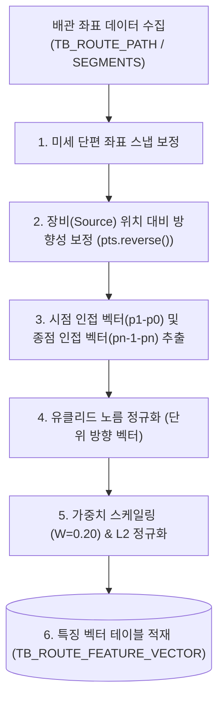

# [설계 개발 문서] 배관 시점 및 종점 진입 방향(Start/End Direction) 특징 벡터 생성 상세 규격서

* **문서명**: 배관 시점 및 종점 진입 방향(Start/End Direction) 특징 벡터 생성 상세 규격서
* **생성일자**: 2026년 6월 19일
* **작성주체**: AI 자동 라우팅 엔진 개발팀

---

## 1. 개요 및 분석 목적

배관의 시점(시작점)과 종점(끝점)은 장비 노즐(Nozzle) 혹은 다른 목적지 배관과의 접속을 형성하는 가장 핵심적인 영역입니다. 
자동 라우터가 기존 설계 데이터를 모방할 때, 장비 연결 단말 부근에서 배관이 어느 평면 방향(예: 수직 위 방향, 수평 X 방향 등)으로 진입/진출했는지 파악하여 유사한 도킹 각도의 설계 경로를 필터링하는 데 목적이 있습니다.

본 문서는 30차원 특징 벡터(30D Feature Vector) 중 **0 ~ 2번 차원(Start Direction)** 및 **3 ~ 5번 차원(End Direction)**의 인코딩 상세 매핑과 연산 알고리즘을 정의합니다.

---

## 2. 전체 흐름도 (Overall Workflow)



---

## 3. 원본 데이터 (Source Data Definition)

* **원천 테이블**: 
  - `TB_ROUTE_PATH` (배관 경로 기본 메타 정보)
  - `TB_ROUTE_SEGMENTS` / `TB_ROUTE_SEGMENT_DETAIL` (경로상 모든 단위 세그먼트 좌표 정보)
* **주요 참조 필드**:
  - `ROUTE_PATH_GUID` (text): 배관 식별자
  - `SOURCE_POSX/Y/Z` (double precision): 배관 시작부 장비/접속점 기준 위치
  - `FROM_POSX/Y/Z` 및 `TO_POSX/Y/Z` (double precision): 개별 세그먼트들의 시/종점 좌표

---

## 4. 핵심 알고리즘 (Core Algorithms)

### ① 배관 방향성(Directionality) 교정 알고리즘
배관 설계 데이터 수집 시, 모델러나 추출 쿼리에 따라 시작점과 끝점이 장비의 실제 흐름 방향과 역방향으로 엉켜 적재되는 경우가 많습니다. 이를 일관되게 학습하기 위해 Source 장비 포트 좌표(`SOURCE_POS`)와 배관 양 끝점의 거리를 계산하여 시작점을 재정렬합니다.

```python
src_pos = (meta['SOURCE_POSX'], meta['SOURCE_POSY'], meta['SOURCE_POSZ'])
dist_to_start = dist_3d(src_pos, pts[0])
dist_to_end = dist_3d(src_pos, pts[-1])

# 배관 끝점이 장비 포트에 더 가까우면 역방향으로 추출된 것이므로 정점 순서를 뒤집음
if dist_to_end < dist_to_start:
    pts.reverse()
```

### ② 시/종점 단위 방향 벡터 연산 공식
* **Start Direction (Index 0~2)**: 시작점 $p_0$에서 첫 꺾임점(또는 첫 세그먼트 종점) $p_1$으로 향하는 3차원 차이 벡터를 구하고, 이를 크기 1의 단위 벡터로 변환합니다.
  $$\vec{v}_{start} = \frac{p_1 - p_0}{\|p_1 - p_0\|}$$
* **End Direction (Index 3~5)**: 최종 종점 $p_n$에서 직전 꺾임점 $p_{n-1}$로 향하는 역진입 3차원 차이 벡터를 구하고, 크기 1의 단위 벡터로 변환합니다.
  $$\vec{v}_{end} = \frac{p_{n-1} - p_n}{\|p_{n-1} - p_n\|}$$

---

## 5. 생성 데이터 및 저장 사양 (Target Spec)

### ① 30D 특징 벡터 매핑 영역
* **Index 0 ~ 2**: Start Direction $[v_{sx}, v_{sy}, v_{sz}]$
* **Index 3 ~ 5**: End Direction $[v_{ex}, v_{ey}, v_{ez}]$

### ② 가중치 적용 및 L2 정규화 (Final Normalization)
1. **가중치 스케일링**: Start/End 방향은 30차원 피처 공간에서 각각 **20%**의 높은 가중치($W=0.20$)를 가집니다.
   $$S_{topo} = \sqrt{\frac{0.20 \times 30.0}{3}} \approx 1.4142$$
   - 계산된 단위 방향 벡터에 스케일 팩터인 $1.4142$를 각각 곱해 줍니다.
2. **L2 정규화**: 전체 30차원 특징 벡터의 유클리디안 크기가 `1.0`이 되도록 나눈 후 최종 DB의 `FEATURE_VECTOR` 컬럼에 적재합니다.
