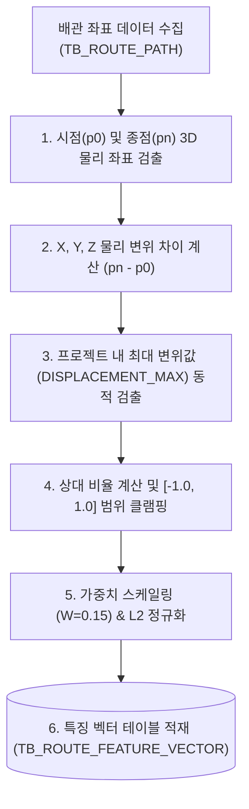

# [설계 개발 문서] 배관 시작-종료점 총 변위(Displacement) 특징 벡터 생성 상세 규격서

* **문서명**: 배관 시작-종료점 총 변위(Displacement) 특징 벡터 생성 상세 규격서
* **생성일자**: 2026년 6월 19일
* **작성주체**: AI 자동 라우팅 엔진 개발팀

---

## 1. 개요 및 분석 목적

배관의 총 변위(Displacement)는 배관의 기하학적 미세 궤적과 무관하게, **배관이 공간 상에서 시작하여 최종적으로 도달한 끝점의 상대적인 위치 관계**를 거시적으로 요약하는 정보입니다. 
시점 대비 종점이 동쪽(+X)으로 많이 치우쳤는지, 서쪽(-X) 또는 상단(+Z)으로 올라갔는지를 수치화하여 공간 주행 스케일이 유사한 설계를 1차적으로 탐색 및 필터링하는 데 목적이 있습니다.

본 문서는 30차원 특징 벡터(30D Feature Vector) 중 **6 ~ 8번 차원(Displacement)**의 인코딩 상세 매핑과 연산 알고리즘을 정의합니다.

---

## 2. 전체 흐름도 (Overall Workflow)

---

## 3. 원본 데이터 (Source Data Definition)

* **원천 테이블**:
  - `TB_ROUTE_PATH` (시작/끝점 좌표 및 프로젝트 메타데이터)
* **주요 참조 필드**:
  - `ROUTE_PATH_GUID` (text): 배관 식별자
  - `START_POSX/Y/Z` (double precision): 배관 시점 물리 좌표
  - `END_POSX/Y/Z` (double precision): 배관 종점 물리 좌표

---

## 4. 핵심 알고리즘 (Core Algorithms)

### ① X, Y, Z축 물리 변위 산출
시점 좌표 $p_0(x_0, y_0, z_0)$와 종점 좌표 $p_n(x_n, y_n, z_n)$ 간의 축별 이동 변화량을 계산합니다.
$$\Delta x = x_n - x_0, \quad \Delta y = y_n - y_0, \quad \Delta z = z_n - z_0$$

### ② 프로젝트 단위 동적 최대 변위(`DISPLACEMENT_MAX`) 산출
정량적인 물리 수치(mm)를 $[-1.0, 1.0]$ 범위의 신경망 학습용 스케일로 변환하기 위해, 현재 프로젝트 내 전체 배관 경로들 중 시-종점 유클리드 거리가 가장 먼 최댓값을 분모인 정규화 상한으로 실시간 스캔합니다.
$$\text{DISPLACEMENT\_MAX} = \max_{R \in \text{Project}} \left( \sqrt{(\Delta x_R)^2 + (\Delta y_R)^2 + (\Delta z_R)^2} \right)$$

### ③ 스케일 정규화 및 클램핑 공식
각 축별 변위를 최대 변위값으로 나누어 정규화하고 계산 오류 예방을 위해 $[-1.0, 1.0]$ 범위로 클램핑 처리합니다.
$$e_{dx} = \max\left(-1.0, \min\left(1.0, \frac{\Delta x}{\text{DISPLACEMENT\_MAX}}\right)\right)$$
$$e_{dy} = \max\left(-1.0, \min\left(1.0, \frac{\Delta y}{\text{DISPLACEMENT\_MAX}}\right)\right)$$
$$e_{dz} = \max\left(-1.0, \min\left(1.0, \frac{\Delta z}{\text{DISPLACEMENT\_MAX}}\right)\right)$$

---

## 5. 생성 데이터 및 저장 사양 (Target Spec)

### ① 30D 특징 벡터 매핑 영역
* **Index 6 ~ 8**: Displacement $[e_{dx}, e_{dy}, e_{dz}]$

### ② 가중치 적용 및 L2 정규화 (Final Normalization)
1. **가중치 스케일링**: Displacement 피처 그룹은 전체 30차원 피처 공간에서 **15%**의 가중치($W=0.15$)를 가집니다.
   $$S_{disp} = \sqrt{\frac{0.15 \times 30.0}{3}} \approx 1.2247$$
   - 계산된 변위 비율에 스케일 팩터인 $1.2247$을 각각 곱해 줍니다.
2. **L2 정규화**: 전체 30차원 특징 벡터의 유클리디안 크기가 `1.0`이 되도록 나눈 후 최종 DB의 `FEATURE_VECTOR` 컬럼에 적재합니다.
