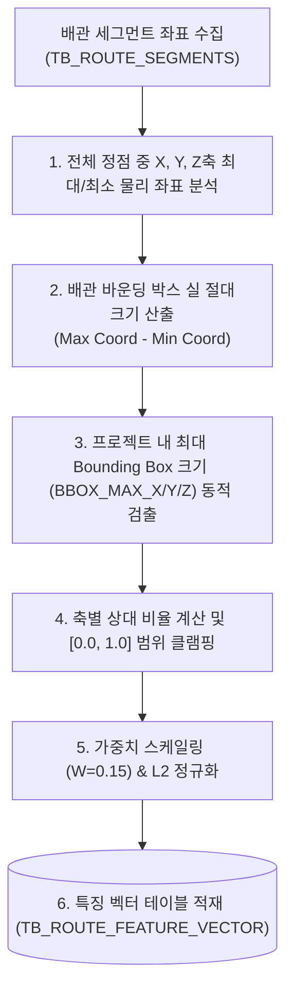

# [설계 개발 문서] 배관 경로 바운딩 박스(Bounding Box) 특징 벡터 생성 상세 규격서

* **문서명**: 배관 경로 바운딩 박스(Bounding Box) 특징 벡터 생성 상세 규격서
* **생성일자**: 2026년 6월 19일
* **작성주체**: AI 자동 라우팅 엔진 개발팀

---

## 1. 개요 및 분석 목적

배관의 바운딩 박스(Bounding Box) 정보는 배관 경로의 단순 시-종점 거리 편차(Displacement) 뿐만 아니라, **배관이 실제로 공간을 점유하고 선회하며 주행한 3차원 입체적 영역 크기**를 평가하는 피처입니다.
경로가 도중에 크게 선회하거나 돌아서 갈수록 Bounding Box의 크기가 커지므로, 평면 지오메트리 점유 영역이 유사한 배관 형상 패턴을 식별 및 필터링하는 데 목적이 있습니다.

본 문서는 30차원 특징 벡터(30D Feature Vector) 중 **9 ~ 11번 차원(Bounding Box)**의 인코딩 상세 매핑과 연산 알고리즘을 정의합니다.

---

## 2. 전체 흐름도 (Overall Workflow)

---

## 3. 원본 데이터 (Source Data Definition)

* **원천 테이블**:
  - `TB_ROUTE_SEGMENTS` (세그먼트들의 3D 상세 좌표 정보)
* **주요 참조 필드**:
  - `ROUTE_PATH_GUID` (text): 배관 식별자
  - `FROM_POSX/Y/Z` 및 `TO_POSX/Y/Z` (double precision): 세그먼트 좌표

---

## 4. 핵심 알고리즘 (Core Algorithms)

### ① 배관 개별 바운딩 박스 절대 크기 연산
배관 경로를 구성하는 모든 3D 정점(Points) 리스트를 스캔하여 각 축(X, Y, Z)별 최댓값과 최솟값의 차이를 구합니다. 이 값은 방향 부호가 없는 절대 크기(AABB Size)를 나타냅니다.
$$B_x = \max(x) - \min(x)$$
$$B_y = \max(y) - \min(y)$$
$$B_z = \max(z) - \min(z)$$

### ② 프로젝트 단위 동적 최대 BBox 크기 (`BBOX_MAX_X/Y/Z`) 검출
프로젝트 내부에서 가장 넓은 면적을 점유하는 배관의 박스 스펙을 분모로 잡기 위해 현재 프로젝트 내 전체 배관의 $B_x, B_y, B_z$ 값 중 최대 한계치를 동적으로 검출합니다.
$$\text{BBOX\_MAX\_X} = \max_{R} (B_{x,R}), \quad \text{BBOX\_MAX\_Y} = \max_{R} (B_{y,R}), \quad \text{BBOX\_MAX\_Z} = \max_{R} (B_{z,R})$$

### ③ 스케일 정규화 및 클램핑 공식
각 배관의 AABB 크기를 정규화 상한 대비 비율로 나누어 산출하며, $[0.0, 1.0]$ 범위로 클램핑 처리합니다.
$$e_{bx} = \max\left(0.0, \min\left(1.0, \frac{B_x}{\text{BBOX\_MAX\_X}}\right)\right)$$
$$e_{by} = \max\left(0.0, \min\left(1.0, \frac{B_y}{\text{BBOX\_MAX\_Y}}\right)\right)$$
$$e_{bz} = \max\left(0.0, \min\left(1.0, \frac{B_z}{\text{BBOX\_MAX\_Z}}\right)\right)$$

---

## 5. 생성 데이터 및 저장 사양 (Target Spec)

### ① 30D 특징 벡터 매핑 영역
* **Index 9 ~ 11**: Bounding Box $[e_{bx}, e_{by}, e_{bz}]$

### ② 가중치 적용 및 L2 정규화 (Final Normalization)
1. **가중치 스케일링**: Bounding Box 피처 그룹은 전체 30차원 피처 공간에서 **15%**의 가중치($W=0.15$)를 가집니다.
   $$S_{bbox} = \sqrt{\frac{0.15 \times 30.0}{3}} \approx 1.2247$$
   - 계산된 박스 크기 비율에 스케일 팩터인 $1.2247$을 각각 곱해 줍니다.
2. **L2 정규화**: 전체 30차원 특징 벡터의 유클리디안 크기가 `1.0`이 되도록 나눈 후 최종 DB의 `FEATURE_VECTOR` 컬럼에 적재합니다.
