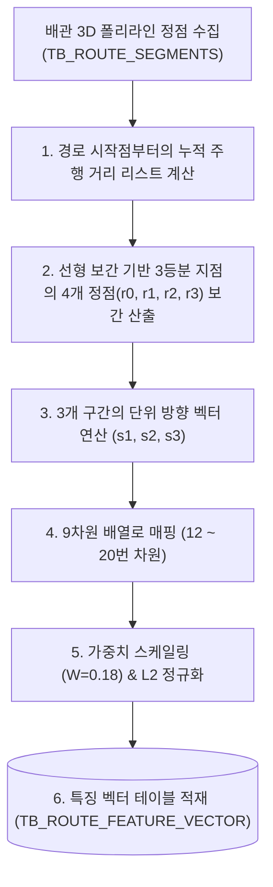

# [설계 개발 문서] 배관 경로 3분할 리샘플링 방향(Resampled Segments) 특징 벡터 생성 상세 규격서

* **문서명**: 배관 경로 3분할 리샘플링 방향(Resampled Segments) 특징 벡터 생성 상세 규격서
* **생성일자**: 2026년 6월 19일
* **작성주체**: AI 자동 라우팅 엔진 개발팀

---

## 1. 개요 및 분석 목적

배관의 전체 선형 궤적은 설계 형태에 따라 복잡한 꺾임 횟수(Bend Count)와 다양한 구간 길이를 가집니다. 
배관 경로의 세그먼트 수가 각기 다르기 때문에 고정된 특징 공간(30D)으로 비교하기가 어렵습니다. 이를 보완하기 위해 **전체 주행 경로를 누적 거리 기준 등간격으로 정확히 3분할하고 각 분할 구간의 진행 방향을 분석**함으로써, 배관의 대략적인 S자, ㄷ자, L자 형태의 기하학적 유사도를 정규화 비교하는 데 목적이 있습니다.

본 문서는 30차원 특징 벡터(30D Feature Vector) 중 **12 ~ 20번 차원(Resampled Segments)**의 인코딩 상세 매핑과 연산 알고리즘을 정의합니다.

---

## 2. 전체 흐름도 (Overall Workflow)



---

## 3. 원본 데이터 (Source Data Definition)

* **원천 테이블**:
  - `TB_ROUTE_SEGMENTS` (세그먼트들의 3D 상세 좌표 정보)
* **주요 참조 필드**:
  - `ROUTE_PATH_GUID` (text): 배관 식별자
  - `FROM_POSX/Y/Z` 및 `TO_POSX/Y/Z` (double precision): 세그먼트 좌표

---

## 4. 핵심 알고리즘 (Core Algorithms)

### ① 선형 보간 기반 등간격 리샘플링 (`resample_polyline_points`)
배관 경로를 구성하는 전체 정점들 사이의 누적거리를 기반으로, 배관 시작 지점($0.0$)부터 최종 지점($1.0$)까지 전체 길이를 정확히 3등분($0\%, 33.3\%, 66.7\%, 100\%$)하는 시점의 3D 좌표 $r_0, r_1, r_2, r_3$를 선형 보간 기법을 적용하여 도출합니다.

```python
def resample_polyline_points(points, num_segments=3):
    # points: [(x0,y0,z0), (x1,y1,z1), ...]
    # 1. 누적 거리 리스트 산출
    dists = [0.0]
    for i in range(1, len(points)):
        dists.append(dists[-1] + dist_3d(points[i-1], points[i]))
    total_len = dists[-1]
    if total_len < 1e-6:
        return [points[0]] * (num_segments + 1)
        
    # 2. 등간격 지점 분할 매칭
    resampled = []
    target_dists = [total_len * i / num_segments for i in range(num_segments + 1)]
    
    curr_idx = 0
    for td in target_dists:
        while curr_idx < len(points) - 1 and dists[curr_idx + 1] < td:
            curr_idx += 1
        # 선형 보간 비율 t 계산
        seg_len = dists[curr_idx + 1] - dists[curr_idx]
        if seg_len < 1e-6:
            t = 0.0
        else:
            t = (td - dists[curr_idx]) / seg_len
            
        p1 = points[curr_idx]
        p2 = points[curr_idx + 1]
        rx = p1[0] + (p2[0] - p1[0]) * t
        ry = p1[1] + (p2[1] - p1[1]) * t
        rz = p1[2] + (p2[2] - p1[2]) * t
        resampled.append((rx, ry, rz))
        
    return resampled
```

### ② 3개 분할 구간별 3D 단위 방향 벡터 연산
리샘플링이 완료된 4개의 정점 간의 차이 벡터를 각각 크기 1의 단위 벡터로 변환합니다.
* **Segment 1**: $\vec{s}_1 = \frac{r_1 - r_0}{\|r_1 - r_0\|}$ (Index 12 ~ 14)
* **Segment 2**: $\vec{s}_2 = \frac{r_2 - r_1}{\|r_2 - r_1\|}$ (Index 15 ~ 17)
* **Segment 3**: $\vec{s}_3 = \frac{r_3 - r_2}{\|r_3 - r_2\|}$ (Index 18 ~ 20)

---

## 5. 생성 데이터 및 저장 사양 (Target Spec)

### ① 30D 특징 벡터 매핑 영역
* **Index 12 ~ 14**: Segment 1 단위 방향 벡터 $[s_{1x}, s_{1y}, s_{1z}]$
* **Index 15 ~ 17**: Segment 2 단위 방향 벡터 $[s_{2x}, s_{2y}, s_{2z}]$
* **Index 18 ~ 20**: Segment 3 단위 방향 벡터 $[s_{3x}, s_{3y}, s_{3z}]$

### ② 가중치 적용 및 L2 정규화 (Final Normalization)
1. **가중치 스케일링**: 3구간 리샘플링 방향 정보는 총 **18%** (각 구간당 6%, $W=0.06$)의 가중치를 가집니다.
   $$S_{seg} = \sqrt{\frac{0.06 \times 30.0}{3}} \approx 0.7746$$
   - 각 성분 벡터 값들에 스케일 팩터인 $0.7746$을 곱합니다.
2. **L2 정규화**: 전체 30차원 특징 벡터의 유클리디안 크기가 `1.0`이 되도록 나눈 후 최종 DB의 `FEATURE_VECTOR` 컬럼에 적재합니다.
