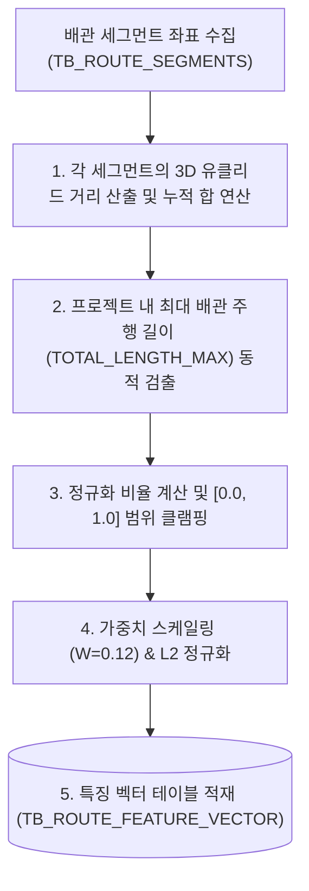

# [설계 개발 문서] 배관 총 주행 길이(Total Length) 특징 벡터 생성 상세 규격서

* **문서명**: 배관 총 주행 길이(Total Length) 특징 벡터 생성 상세 규격서
* **생성일자**: 2026년 6월 19일
* **작성주체**: AI 자동 라우팅 엔진 개발팀

---

## 1. 개요 및 분석 목적

배관의 총 주행 길이는 기하학적인 경로 형태와 무관하게, **배관을 구성하기 위해 투입된 총 자재량(배관의 크기 스케일)**을 대표하는 중요 정보입니다.
시-종점 간의 최단 유클리드 거리가 비슷하더라도 도중에 길게 선회하거나 다른 유틸리티 랙을 타고 돌아서 갈 경우 실제 배관의 총 길이는 매우 다르게 나타납니다. 
유사한 자재 소요 및 주행 규모를 가지는 배관 설계를 식별하고 비교하기 위해 1차 여과 데이터로 활용하는 데 목적이 있습니다.

본 문서는 30차원 특징 벡터(30D Feature Vector) 중 **21번 차원(Total Length)**의 인코딩 상세 매핑과 연산 알고리즘을 정의합니다.

---

## 2. 전체 흐름도 (Overall Workflow)

---

## 3. 원본 데이터 (Source Data Definition)

* **원천 테이블**:
  - `TB_ROUTE_SEGMENTS` (배관 경로 세그먼트 상세 3D 좌표 테이블)
* **주요 참조 필드**:
  - `ROUTE_PATH_GUID` (text): 배관 식별자
  - `FROM_POSX/Y/Z` 및 `TO_POSX/Y/Z` (double precision): 세그먼트의 양끝 물리 좌표 (mm)

---

## 4. 핵심 알고리즘 (Core Algorithms)

### ① 배관 실주행 총 길이 연산
배관 경로를 이루는 모든 인접 정점 쌍 $(p_{i-1}, p_i)$ 간의 3D 공간 거리 합계를 연산합니다.
$$L_{total} = \sum_{i=1}^{n} \sqrt{(x_i - x_{i-1})^2 + (y_i - y_{i-1})^2 + (z_i - z_{i-1})^2}$$

### ② 프로젝트 단위 동적 최대 배관 주행 길이(`TOTAL_LENGTH_MAX`) 검출
다양한 설계 척도(mm)를 공정한 상대적 비교율로 다루기 위해, 현재 스캔 대상 프로젝트 내의 모든 배관 중 주행 총길이가 가장 길게 설계된 배관의 $L_{total}$ 값을 정규화 기준 분모로 선출합니다.
$$\text{TOTAL\_LENGTH\_MAX} = \max_{R \in \text{Project}} (L_{total, R})$$

### ③ 스케일 정규화 및 클램핑 공식
실주행 총길이를 최대 길이로 나누어 백분율 스케일로 정규화하고, $[0.0, 1.0]$ 범위로 범위를 보정(Clamping)합니다.
$$e_{len} = \max\left(0.0, \min\left(1.0, \frac{L_{total}}{\text{TOTAL\_LENGTH\_MAX}}\right)\right)$$

---

## 5. 생성 데이터 및 저장 사양 (Target Spec)

### ① 30D 특징 벡터 매핑 영역
* **Index 21**: Total Length $[e_{len}]$

### ② 가중치 적용 및 L2 정규화 (Final Normalization)
1. **가중치 스케일링**: 총 길이 정보는 특징 공간에서 **12%**의 가중치($W=0.12$)를 배분받았으며 단일 차원($D=1$)을 사용합니다.
   $$S_{len} = \sqrt{\frac{0.12 \times 30.0}{1}} \approx 1.8974$$
   - 연산된 정규화 길이 값에 $1.8974$ 스케일 상수를 곱해 줍니다.
2. **L2 정규화**: 전체 30차원 특징 벡터의 유클리디안 크기가 `1.0`이 되도록 나눈 후 최종 DB의 `FEATURE_VECTOR` 컬럼에 적재합니다.
