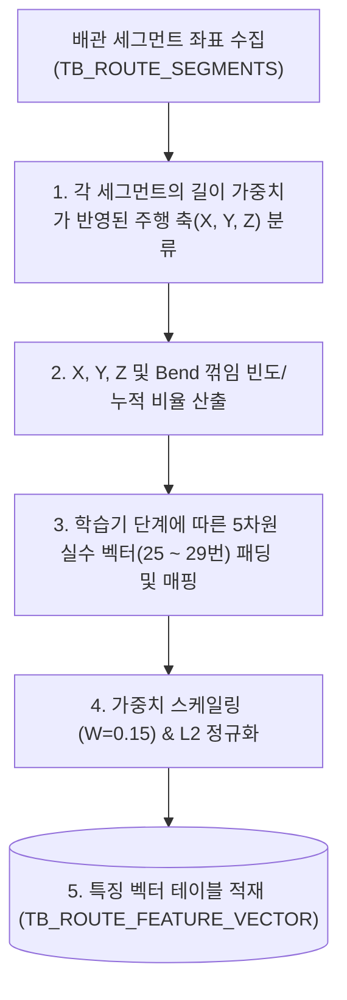

# [설계 개발 문서] 배관 주행 방향 패턴(Arrow Pattern) 특징 벡터 생성 상세 규격서

* **문서명**: 배관 주행 방향 패턴(Arrow Pattern) 특징 벡터 생성 상세 규격서
* **생성일자**: 2026년 6월 19일
* **작성주체**: AI 자동 라우팅 엔진 개발팀

---

## 1. 개요 및 분석 목적

배관 경로의 주행 특성은 단순히 공간의 시작-종료점이나 Bounding Box뿐만 아니라, **배관이 직진 주행하다가 어떠한 순서와 빈도로 코너를 꺾으며 목적지로 향했는지에 대한 통계 정보**를 가집니다.
예를 들어, X축 주행 비중이 높고 Z축 변화는 없는 배관인지, 혹은 상하 굴곡 주행(Z축 이동)이 잦은 복잡한 배관인지에 대한 축별 주행 빈도 요약을 통해 형태적 유사도를 구별하는 데 목적이 있습니다.

본 문서는 30차원 특징 벡터(30D Feature Vector) 중 **25 ~ 29번 차원(Arrow Pattern)**의 인코딩 상세 매핑과 연산 알고리즘을 정의합니다.

---

## 2. 전체 흐름도 (Overall Workflow)

---

## 3. 원본 데이터 (Source Data Definition)

* **원천 테이블**:
  - `TB_ROUTE_SEGMENTS` (배관 경로 세그먼트 상세 3D 좌표 테이블)
* **주요 참조 필드**:
  - `ROUTE_PATH_GUID` (text): 배관 식별자
  - `FROM_POSX/Y/Z` 및 `TO_POSX/Y/Z` (double precision): 세그먼트의 양끝 물리 좌표 (mm)

---

## 4. 핵심 알고리즘 (Core Algorithms)

### ① 축 주행 비율 및 꺾임 통계 연산
각 배관 경로 $R$에 대하여 세그먼트들의 벡터를 판별하여 X, Y, Z축 방향 주행 길이 비율 및 꺾임 빈도를 산출합니다.
* **X축 주행 비율**: $R_x = \frac{\sum L_{X\text{-segments}}}{L_{total}}$
* **Y축 주행 비율**: $R_y = \frac{\sum L_{Y\text{-segments}}}{L_{total}}$
* **Z축 주행 비율**: $R_z = \frac{\sum L_{Z\text{-segments}}}{L_{total}}$
* **꺾임 가혹도 (Bend Intensity)**: $R_{bend} = \frac{\text{Bend Count}}{L_{total}} \times 1000.0$

이 값들은 배관의 물리적 고유 방향 특성을 실수 스펙으로 인코딩하게 됩니다.

### ② 학습기 단계별 연산 적용 (0.0 패딩 및 확장성)
* **현재 학습 엔진 (PoC Phase)**: 쿼리 시점과 1차 벡터 검색 시 복잡성 제거를 위해 25~29번 성분은 `0.0`으로 패딩 처리합니다.
* **향후 확장 단계 (Production Phase)**: 상기 식에 의해 도출된 $[R_x, R_y, R_z, R_{bend}, 0.0]$ 통계량이 특징 벡터 25~29번 인덱스에 직접 대입되어 코사인 거리 공간을 정교하게 확장시킵니다.

---

## 5. 생성 데이터 및 저장 사양 (Target Spec)

### ① 30D 특징 벡터 매핑 영역
* **Index 25 ~ 29**: Arrow Pattern $[e_{p0}, e_{p1}, e_{p2}, e_{p3}, e_{p4}]$ (현재 0.0으로 고정 패딩)

### ② 가중치 적용 및 L2 정규화 (Final Normalization)
1. **가중치 스케일링**: 방향 패턴 통계 영역은 전체 30차원 피처 공간에서 **15%**의 가중치($W=0.15$)를 가지며 5차원($D=5$) 영역을 점유합니다.
   $$S_{pat} = \sqrt{\frac{0.15 \times 30.0}{5}} \approx 0.9487$$
   - 각 성분 값에 $0.9487$ 스케일 상수를 곱해 줍니다.
2. **L2 정규화**: 전체 30차원 특징 벡터의 유클리디안 크기가 `1.0`이 되도록 나눈 후 최종 DB의 `FEATURE_VECTOR` 컬럼에 적재합니다.
