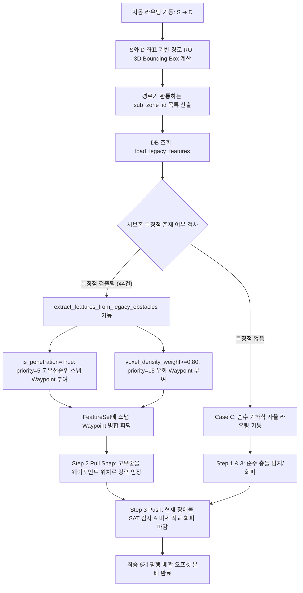

# [설계 개발 문서] 08. 장애물 특징점 추출 및 경로 탐색 활용 파이프라인

## 업데이트 내용 및 일시

- **업데이트 일시**: 2026-07-04 21:15:00 KST
- **업데이트 대상 모듈**: 
  - `D:\DINNO\DEV\AI-AutoRouting\TopKGen\Tools\Extract_Legacy_Features.py` (신규 데이터 파이프라인)
  - `D:\DINNO\DEV\AI-AutoRouting\TopKGen\RubberBandRouter\core\data_loader.py` (`load_legacy_features` 쿼리 탑재)
  - `D:\DINNO\DEV\AI-AutoRouting\TopKGen\RubberBandRouter\core\feature_extractor.py` (`extract_features_from_legacy_obstacles` 환류)
  - `D:\DINNO\DEV\AI-AutoRouting\TopKGen\RubberBandRouter\run_routing.py` (시작-종단 sub-zone 매핑 및 스냅 피딩 통합)
- **공통 업데이트 내용**:
  - 기존 설계 데이터 주변의 물리적 장애물을 3차원 공간 분석하여 서브존(Sub-zone) 단위 위상 점유 통계를 영속화하고, 이를 고무줄 밴드 엔진의 1차 Pull(스냅) 가이드라인으로 환류하여 베테랑의 우회/관통 동선 유형을 모사하는 시스템 설계 기술.

---

## 1. 목적

기존 설계 데이터의 경로(시작점 $S$, 종료점 $D$) 주변의 3차원 공간을 격자(Voxel) 단위로 세분화하여 **장애물의 점유 형태(OBB) 및 국소 공간 밀도, 관통 슬리브(Sleeve Penetration) 여부**를 사전에 공간 분석합니다. 
이후 새로운 배관 설계 요청이 들어왔을 때, 해당 최단 경로가 지나가는 서브존의 특징 정보를 데이터베이스에서 고속 조회(SELECT)하고, 이를 고무줄 밴드 라우팅 엔진의 AI 스냅 웨이포인트(Pull Snap Waypoint)로 투입함으로써 기존 숙련자의 회피/관통 노하우를 그대로 계승합니다.

---

## 2. 데이터베이스 설정 및 테이블 DDL (1단계 & 2단계)

3차원 공간 배관 경로와 OBB(Oriented Bounding Box) 장애물의 교차 검사 및 공간 인덱싱 가속을 위해, PostgreSQL의 PostGIS 확장 모듈을 활용합니다.

### 2.1 PostGIS 확장 설치 및 활성화
```sql
-- PostGIS 공간 연산 확장 모듈 활성화 (3D 연산 지원 필수)
CREATE EXTENSION IF NOT EXISTS postgis;
CREATE EXTENSION IF NOT EXISTS postgis_topology;
```

### 2.2 신규 특징점 테이블 구조 정의 (`legacy_feature_obstacles`)
문자열 식별자(프로젝트 ID 및 인스턴스 명칭)의 글자수 초과 에러를 방지하고, 3D 기하 연산을 고속으로 지원할 수 있는 테이블 스키마를 구성합니다.

```sql
CREATE TABLE legacy_feature_obstacles (
    feature_id SERIAL PRIMARY KEY,
    legacy_project_id TEXT NOT NULL,          -- 과거 프로젝트 고유 ID 또는 경로 식별자
    obstacle_id TEXT NOT NULL,                 -- 원본 장애물 인스턴스 ID
    category TEXT,                            -- STRUCTURE, EQUIPMENT 등 OST 유형
    
    -- OBB 기하 정보 (중심점, 반폭, 로컬 3축 벡터)
    center_x DOUBLE PRECISION,
    center_y DOUBLE PRECISION,
    center_z DOUBLE PRECISION,
    extent_x DOUBLE PRECISION,
    extent_y DOUBLE PRECISION,
    extent_z DOUBLE PRECISION,
    axis_u_x JSONB,                           -- {"x": 1.0, "y": 0.0, "z": 0.0}
    axis_u_y JSONB,
    axis_u_z JSONB,
    
    -- PostGIS 3D 가속 연산용 경계상자 (PolyhedralSurfaceZ 타입)
    geom_poly_3d GEOMETRY(PolyhedralSurfaceZ, 0), 
    
    -- 세부 영역 분석을 위한 메타데이터
    sub_zone_id INT,                          -- 분할된 3D 서브 존 인덱스 (0 ~ 999)
    voxel_density_weight DOUBLE PRECISION,    -- 해당 블록의 장애물 점유 밀도 가중치 (0.0 ~ 1.0)
    is_penetration BOOLEAN DEFAULT FALSE,     -- 관통 슬리브 여부
    
    created_at TIMESTAMP DEFAULT CURRENT_TIMESTAMP
);

-- 초고속 3D 공간 검색을 위한 GiST 인덱스 생성
CREATE INDEX idx_feature_geom_3d ON legacy_feature_obstacles USING gist (geom_poly_3d);

-- 프로젝트 및 서브존 검색용 복합 인덱스
CREATE INDEX idx_project_subzone ON legacy_feature_obstacles (legacy_project_id, sub_zone_id);
```

---

## 3. 공간 분석 및 특징점 추출 프로세스 (3단계 & 4단계)

`Extract_Legacy_Features.py` 파이프라인 모듈을 가동하여 기존 배관 설계 경로 범위 내의 장애물들을 공간 분석하여 DB에 적재합니다.

### 3.1 관심 영역 (ROI) 설정 및 공간 쿼리 (`ST_3DIntersects`)
기존 배관 설계 경로의 시작점($S$)과 종료점($D$)을 대각선 양 끝점으로 삼고, 공정 안전 마진(1,000mm)을 가산한 가상의 버퍼 영역(3D Bounding Box)을 생성합니다. 
PostGIS가 구축된 공간 환경 내에서 ROI 영역과 3D 적으로 겹치거나 인접한 장애물 마스터들을 조회합니다.

```sql
-- 특정 과거 설계 경로 영역 내에 걸쳐 있는 OBB 장애물 데이터 조회 스크립트 예시
SELECT "INSTANCE_NAME", "OST_TYPE", "DDWORKS_TYPE", "COLLISION_PASS",
       "AABB_MINX", "AABB_MINY", "AABB_MINZ",
       "AABB_MAXX", "AABB_MAXY", "AABB_MAXZ"
FROM "TB_BIM_OBSTACLE"
WHERE "AABB_MINX" <= %(max_x)s AND "AABB_MAXX" >= %(min_x)s
  AND "AABB_MINY" <= %(max_y)s AND "AABB_MAXY" >= %(min_y)s
  AND "AABB_MINZ" <= %(max_z)s AND "AABB_MAXZ" >= %(min_z)s;
```

### 3.2 3D 격자 기반 서브존(Sub-zone) 분할 알고리즘
* 단일 축 최대 $30,000\text{mm}$ (30m) 정밀도 입체 공간을 $3\text{m} \times 3\text{m} \times 3\text{m}$ ($3000\text{mm}$) 단위의 서브존 격자로 세분화합니다.
* 각 축별 격자 인덱스 $ix, iy, iz \in [0, 9]$를 구하고, 이를 고유 서브존 ID(0 ~ 999)로 결합하여 보관합니다.
  $$ix = \text{clip}(x // 3000, 0, 9)$$
  $$iy = \text{clip}(y // 3000, 0, 9)$$
  $$iz = \text{clip}(z // 3000, 0, 9)$$
  $$\text{sub\_zone\_id} = ix + iy \times 10 + iz \times 100$$

### 3.3 국소 점유 밀도 가중치 (`voxel_density_weight`) 및 슬리브 판별
* **국소 점유 밀도 (`voxel_density_weight`):** 
  장애물의 OBB 기하 부피(Vol_OBB)가 속해 있는 서브존 전체 공간의 가상 부피($V_{zone} = 3000^3 \text{ mm}^3$) 대비 차지하는 비율을 계산하여 보관합니다.
  $$\text{voxel\_density\_weight} = \min\left(1.0, \frac{\text{Volume of OBB}}{2.7 \times 10^{10} \text{ mm}^3}\right)$$
* **관통 슬리브 여부 (`is_penetration`):**
  장애물의 `OST_TYPE`이 바닥 슬래브(`OST_Floors`) 또는 천장 슬래브(`OST_Ceilings`)이거나, 장애물 정보 내 `COLLISION_PASS` 컬럼의 값이 `1`인 경우, 해당 구역은 장애물이 있더라도 우회하지 않고 **슬리브 통로**로 즉각 통과하도록 `is_penetration = True`로 판별합니다.

### 3.4 데이터 적재 자동화 파이프라인
파이썬 `psycopg2.extras.execute_batch`를 활용하여 추출 및 가공 처리된 수만 건의 특징점 다차원 리스트를 데이터베이스에 벌크 인서트(Bulk Insert)합니다. WKT(Well-Known Text) PolyhedralSurfaceZ 표현식을 PostGIS 함수 `ST_GeomFromText`로 매핑하여 3D Geometry로 영속화합니다.

---

## 4. 라우팅 엔진 환류 활용 (5단계)

새로운 배관 설계 요청이 기동되면, 하이브리드 고무줄 밴드 라우팅 엔진은 기하 연산을 수행하기 전 다음과 같은 순서로 국소 특징점 데이터를 환류 연동합니다.



### 4.1 데이터 로더 환류 연동
`data_loader.py` 의 `load_legacy_features(conninfo, sub_zone_ids)` 함수를 통해 현재 설계 타깃 범위에 겹쳐 있는 서브존들의 고밀도/관통 장애물 데이터만 정확하게 인덱스 탐색하여 로드합니다.

### 4.2 스냅 웨이포인트 변환 규칙
* `feature_extractor.py` 의 `extract_features_from_legacy_obstacles()` 함수가 로드된 특징점을 스냅 가이드라인으로 변환합니다.
* 관통 슬리브 구역인 경우 `priority = 5`를 부여하여 라우터가 다른 방향으로 튀지 않고 슬리브 구멍 중심을 1순위로 조준하도록 유도합니다.
* 일반 고밀도 우회 구역의 경우 `priority = 15`를 주어 주변의 베테랑 꺾임 경로(Elbow)와 유사하게 우회선을 철컥(Pull) 밀착 형성하도록 가이드합니다.
