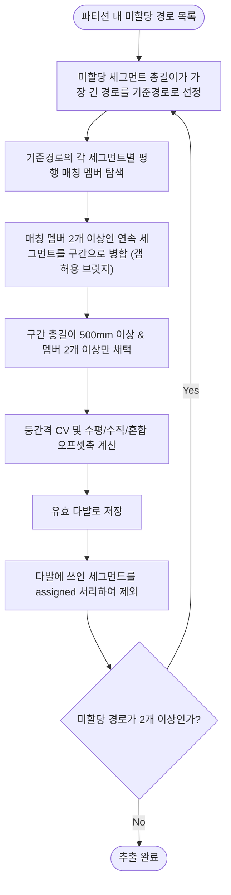

# 그룹배관(다발) 패턴 추출 개발 문서

DDW AI AutoRouting System | v1.0 | 2026-07-12

## 1. 개요 (Overview)

반도체 팹 배관 자동설계 시스템에서, 장비명(EQUIPMENT_TAG) 및 유틸리티그룹(UTILITY_GROUP)별로 기존 설계된 여러 배관 경로의 **Middle Trunk 구간(CSF구역, `Tools/PathSegmenter.py`가 산출)** 및 **Start Stub의 CSF 진입 직전 수직 하강 구간(A/F→CSF 격자보 관통 스텁)** 안에서 **평행하게 나란히 달리는 다발배관(Bundle) 구간**을 자동으로 탐지하고, 각 다발이 **등간격(Equal-Spacing)** 인지, **수평(HORIZONTAL) / 수직(VERTICAL) / 혼합(MIXED)** 중 어느 방향으로 배관들이 서로 떨어져 배치되었는지를 계산하여 데이터베이스에 저장한다.

> **2026-07-12 갱신 (1)**: 초기 구현은 Middle Trunk(CSF구역)만 스캔 대상으로 했으나, 현업에서 A/F→CSF로 내려가는 수직 하강 배관(격자보 관통 스텁)의 대부분이 실제로는 다발로 진행된다는 피드백에 따라 `extract_start_stub_vertical_tail()`을 추가해 Start Stub의 수직 꼬리 구간도 함께 스캔하도록 확장했다(§2.3, §3.1 참조). 이 변경만으로는 실측 다발 수가 358개 → 490개로 증가했다.
>
> **2026-07-12 갱신 (2)**: 위 확장 이후에도 "3개가 나란히 진행하는 수직배관 중 2개만 다발로 인식되고, 이어지는 계단식 엘보 전환 구간(경사처럼 보이는 부분)이 다발에서 누락된다"는 피드백을 받았다. 원인은 §3.4에 설명된 구간 병합 로직이 세그먼트 하나만 매칭에 실패해도 즉시 구간을 끊는 엄격한 방식이었기 때문이다. 갭 허용(Gap-Tolerant) 병합으로 개선했고(§3.4 참조), 그 결과 이전에는 여러 조각으로 분절되던 다발들이 하나의 더 완전한 다발로 합쳐지면서 실측 다발 **개수**는 490개 → 263개로 줄었지만(§5 참조), 다발당 평균 멤버 수는 늘어 실제로는 더 정확하고 완전한 다발 인식 결과다.

구축된 패턴 DB는 AI 자동 라우팅 시 다발배관 패턴 추천 및 재사용 설계 후보 탐색에 활용된다.

**구현 파일**

- `Tools/ExportGroupPattern.py` (2026-07-12, `DesignPatternAnalyzer.py`에서 개명)
- `Tools/sql/create_route_group_pattern_tables.sql`

**연관 도구** (그룹배관 관련이지만 본 파이프라인과는 독립적으로 동작 — 8절 참조)

- `Tools/AnalyzeCustomGroup.py` — 사용자가 GUID를 직접 선택했을 때의 등간격/유사도 수동 검증 도구
- `Tools/ExtractVerticalGroup.py` — `TB_SPACE_INFO` 기반의 별도 수평/수직 다발 탐지 파이프라인 (`TB_ROUTE_VERTICAL_GROUP_FEATURE`)
- `RubberBandRoutingSuite/src/RubberBandRouting.Viewer/GroupPatternViewerWindow.xaml.cs` — 장비/유틸리티그룹 선택형 3D 뷰어 다이얼로그

**기존 공통 설정 및 의존성**

- `Tools/tool_config.py`
- `psycopg2`, `pgvector`(선택), `plotly` + `kaleido`(이미지 저장 옵션 시)

---

## 2. 원본 데이터 (Source Data)

### 2.1 주요 원본 테이블

| 테이블명                   | 역할                                                 | 주요 컬럼                                                                                             |
| -------------------------- | ---------------------------------------------------- | ----------------------------------------------------------------------------------------------------- |
| TB_ROUTE_PATH              | 배관 경로 메타데이터                                 | ROUTE_PATH_GUID (PK), EQUIPMENT_TAG, EQUIPMENT_NAME, UTILITY_GROUP, SOURCE_UTILITY, SOURCE_SIZE       |
| TB_ROUTE_PATH_SEGMENTATION | 경로별 삼분할(Start Stub/Middle Trunk/End Stub) 결과 | ROUTE_PATH_GUID (FK), START_STUB_GEOM / MIDDLE_TRUNK_GEOM (LineStringZ) — 본 파이프라인이 조회하는 지오메트리 |

`TB_ROUTE_PATH_SEGMENTATION`은 `Tools/PathSegmenter.py`가 먼저 생성해두어야 하는 선행 테이블이다(`Docs/20260712_Path Segmentation.md` 참조). 그룹배관 추출은 **Middle Trunk(CSF구역) 전체** + **Start Stub 중 CSF 진입 직전 수직 하강 구간(격자보 관통 스텁)** 을 스캔 대상으로 한다. `Tools/PathSegmenter.py`의 `segment_route()`는 이 수직 하강 구간을 Middle Trunk가 아닌 Start Stub(CSF 진입점까지 포함)에 저장하기 때문에(`Tools/PathSegmenter.py:127-142`), Start Stub도 함께 읽어 수직 꼬리만 잘라 붙인다. 장비 PoC 인근의 **수평** 인입 스텁(A/F 내 이동 구간)은 여전히 스캔 대상에서 제외된다. End Stub 구간(덕트/레터럴 근접부)도 제외된다.

### 2.2 컬럼 상세 설명

| 테이블                     | 컬럼              | 설명                                                                                      |
| -------------------------- | ----------------- | ----------------------------------------------------------------------------------------- |
| TB_ROUTE_PATH              | EQUIPMENT_TAG     | 그룹배관 파티션 기준 장비명 (예:`WTNHJ02`). `EQUIPMENT_NAME`(원본 Revit 합성 문자열)과는 별개 컬럼 |
| TB_ROUTE_PATH              | UTILITY_GROUP     | 유틸리티 그룹 (예:`Gas`, `Toxic`, `Vaccum`)                                         |
| TB_ROUTE_PATH              | SOURCE_UTILITY    | 세부 유틸리티명 (예:`GN2`, `SiH4`)                                                    |
| TB_ROUTE_PATH_SEGMENTATION | START_STUB_GEOM   | `ST_AsText()`로 조회한 LINESTRING Z WKT — 장비 PoC~CSF 진입점 폴리라인. 꼬리(수직 하강분)만 사용 |
| TB_ROUTE_PATH_SEGMENTATION | MIDDLE_TRUNK_GEOM | `ST_AsText()`로 조회한 LINESTRING Z WKT — 경로의 CSF구역 본선 폴리라인                 |

### 2.3 조회 SQL (`load_route_data_bulk`)

```sql
SELECT
    rp."ROUTE_PATH_GUID",
    rp."EQUIPMENT_TAG",
    rp."SOURCE_UTILITY",
    rp."UTILITY_GROUP",
    rp."SOURCE_SIZE",
    ST_AsText(ps."START_STUB_GEOM") AS "START_WKT",
    ST_AsText(ps."MIDDLE_TRUNK_GEOM") AS "TRUNK_WKT"
FROM "TB_ROUTE_PATH" rp
JOIN "TB_ROUTE_PATH_SEGMENTATION" ps ON rp."ROUTE_PATH_GUID" = ps."ROUTE_PATH_GUID"
ORDER BY rp."ROUTE_PATH_GUID"
```

`TB_ROUTE_PATH_SEGMENTATION`이 없는(미분할) 경로는 INNER JOIN에 의해 자동으로 제외된다. `START_WKT`는 `extract_start_stub_vertical_tail()`로 CSF 진입 직전 수직 꼬리만 추출한 뒤, `TRUNK_WKT` 앞에 이어붙여 최종 스캔용 폴리라인을 구성한다(공유 경계점은 중복 제거).

---

## 3. 변환 단계별 프로세스

### 3.1 전체 파이프라인

```text
① DB 조회 (TB_ROUTE_PATH ⋈ TB_ROUTE_PATH_SEGMENTATION, MIDDLE_TRUNK_GEOM + START_STUB_GEOM)
 ├─ extract_start_stub_vertical_tail(): Start Stub에서 CSF 진입 직전 수직 꼬리만 역방향 추출
 └─ 수직 꼬리 + Middle Trunk를 하나의 폴리라인으로 이어붙임 (수평 인입 스텁은 제외)
 ↓ load_route_data_bulk()
② 경로별 특징 추출 (extract_pipe_feature)
 ├─ extract_orthogonal_segments(): 폴리라인 → 축정렬 직교 세그먼트 분해
 ├─ dir_runs / get_arrow_code / count_ortho_bends: 굽힘 패턴 요약
 └─ trunk_axis: 대표 수평 이동축 판정
 ↓
③ (EQUIPMENT_TAG, UTILITY_GROUP, SOURCE_UTILITY) 파티션 분할
 ↓
④ 파티션별 "세그먼트 레벨 평행 스캔" 반복 (analyze_patterns)
 ├─ 미할당 세그먼트 총길이가 가장 긴 경로 → 기준경로(Base Route) 선정
 ├─ check_parallel_overlap(): 같은 진행축 + 피치 ≤1500mm + 겹침 ≥100mm 판정
 ├─ 매칭 멤버 2개 이상인 연속 세그먼트 → 구간(Section) 병합, 총길이 <500mm 폐기
 ├─ compute_offset_regularity(): 등간격 CV + 수평/수직/혼합 오프셋축 계산 (신규)
 └─ 사용된 세그먼트 assigned 처리 → 다음 라운드 제외, 미할당 경로 <2개 될 때까지 반복
 ↓ WKT 변환 (bundle_parallel_segments_to_wkt / generate_trunk_centerline_wkt)
⑤ PostGIS MultiLineStringZ 직렬화
 ↓ DELETE 후 execute_batch() 재삽입 (page_size=200)
⑥ TB_ROUTE_GROUP_PATTERN 저장
 ↓ (옵션) --image-out 지정 시
⑦ Plotly + kaleido로 3D 렌더링 PNG 저장 (최대 20개)
```

### 3.2 Step 1 — 세그먼트 직교 분해 및 축 스냅

각 배관 폴리라인의 연속된 점 $(p_i, p_{i+1})$에 대해 변위 벡터의 단위벡터 $\hat{u}=(u_x,u_y,u_z)$를 구해, 특정 축 성분의 절대값이 `ARROW_TOL`(0.9) 이상이면 그 축(X/Y/Z)으로 스냅한다. 세 축 모두 미달이면 경사(D)로 분류되어 이후 평행 판정에서 제외된다.

이때 모서리 정렬 오차를 상쇄하기 위해, 진행축에 수직인 두 좌표는 세그먼트 시작·끝점의 평균값으로 고정한다(`extract_orthogonal_segments`).

### 3.3 Step 2 — 평행 오버랩 판정 (`check_parallel_overlap`)

동일 파티션 내 두 세그먼트 $S_1$, $S_2$가 나란히 달리는지 판정한다.

1. **동일 진행축**: `S_1.dir == S_2.dir`이고 경사(D)가 아니어야 함.
2. **피치(수직 이격거리) 판별**: 진행축에 수직인 평면에서의 거리 $d_{\text{perp}}$가 `max_pitch`(기본 **1500mm**) 이하여야 함.
   - 진행축 X: $d_{\text{perp}} = \sqrt{(y_1-y_2)^2+(z_1-z_2)^2}$
   - 진행축 Y: $d_{\text{perp}} = \sqrt{(x_1-x_2)^2+(z_1-z_2)^2}$
   - 진행축 Z: $d_{\text{perp}} = \sqrt{(x_1-x_2)^2+(y_1-y_2)^2}$
3. **겹침구간 판별**: 진행축 좌표계로 투영한 두 구간의 겹치는 길이 $L_{\text{overlap}}$이 `min_overlap`(기본 **100mm**) 이상이어야 함.

### 3.4 Step 3 — 반복적 배제 스캔 (기준경로 선정 + 구간 병합)

파티션 내에 여러 다발(랙)이 혼재해도 독립적으로 분리 추출하기 위해 다음을 반복한다.



- **구간 병합 (갭 허용, 2026-07-12 개선)**: 초기 구현은 $k$번째 세그먼트의 매칭 멤버 집합 $M_k$와 $k+1$번째 $M_{k+1}$의 교집합이 2개 미만으로 줄어드는 즉시 구간을 끊는 엄격한 방식이었다. 그러나 실제 배관은 배관마다 서로 다른 위치에서 개별적으로 꺾이는 "계단식" 엘보 전환 구간이 흔해, 이 방식은 눈으로 보면 명백히 하나의 다발인데도 여러 조각으로 쪼개거나 일부 멤버(예: 3개 중 1개)를 완전히 누락시키는 문제가 있었다. 이제는 어떤 멤버가 일시적으로 매칭되지 않아도 그 멤버의 누적 미스매칭 길이가 `SECTION_GAP_TOLERANCE_MM`(**300mm**) 이하이면 구간을 끊지 않고 "브릿지"하여, 재매칭되면 계속 같은 구간으로 유지한다(갭을 초과하면 그 멤버만 영구 이탈, 다른 멤버가 2개 이상 남으면 구간 자체는 유지).
  - **주의**: 기준경로 외에 실제로 매칭되는 멤버가 하나도 없는 "순수 공백 세그먼트"는 구간 데이터에 포함하지 않는다. 이 예외를 두지 않으면 서로 무관한 두 다발이 그 사이의 짧은 비축정렬(D) 잡음 세그먼트를 매개로 하나의 거대한 구간으로 잘못 합쳐지는 회귀가 발생한다(개발 중 `PATTERN_SEQ`가 `"ZDYDXDZDYD..."`처럼 비정상적으로 길어지고 `OFFSET_AXIS=UNKNOWN`이 되는 현상으로 실제 확인되어 수정함).
  - **안전장치**: 갭 유예가 만료되어 멤버가 2개 미만으로 줄어든 구간은 `valid_sections` 필터링 단계에서 다시 한번 제외된다.
- **경로 배제**: 구간에 쓰인 세그먼트는 `assigned=True`로 표시되어 다음 라운드의 평행 매칭 대상에서 제외된다. 미할당 경로가 2개 미만이 되면 해당 파티션의 스캔을 종료한다.

### 3.5 Step 4 — 등간격 판정 및 수평/수직 오프셋축 분류 (`compute_offset_regularity`, 신규)

기존 `PITCH_MM`(기준경로 대비 다른 멤버들 피치의 중앙값)은 "기준경로와의 거리"만 알려줄 뿐, 멤버들이 서로 균등한 간격으로 배치되어 있는지는 알려주지 못한다. 이를 보완하기 위해 구간(Section) 단위로 다음을 계산한다.

1. 구간의 우세 진행축(dominant_dir)을 구하고, 그에 수직인 두 횡단축을 정한다 (진행축 X → 횡단축 Y,Z / Y → X,Z / Z → X,Y).
2. 구간 내 각 멤버 배관의 횡단평면 좌표를 여러 스텝에 걸쳐 수집해 중앙값으로 대표위치를 구한다.
3. 두 횡단축 중 퍼짐(spread = max−min)이 더 큰 축을 "오프셋축"으로 채택한다.
   - 그 축이 **Z축**이면 → **VERTICAL** (배관들이 층층이 쌓여 배치)
   - 그 축이 **X 또는 Y축**이면 → **HORIZONTAL** (배관들이 옆으로 나란히 배치)
   - 두 축의 퍼짐 비율(작은쪽/큰쪽)이 **0.8 이상**이면 → **MIXED** (대각선/혼합 배치)
4. 오프셋축을 따라 멤버 위치를 정렬한 뒤, 인접 배관 간 간격(gap)들의 **변동계수(CV = 표준편차 / 평균)**를 계산한다. `PITCH_CV_MAX`(**0.30**) 이하면 `IS_EQUAL_SPACING = true`(등간격)로 판정한다.

> ※ 오프셋축은 배관이 "진행하는" 축(`PATTERN_SEQ`)과는 별개 개념이다. 예를 들어 남북(Y)으로 나란히 진행하는 배관 3개가 동서(X)로 늘어서 있으면 진행축=Y, 오프셋축=HORIZONTAL이다.

**실제 추출 예시** (`DDW_AI_DB`, 827개 경로 기준 실측)

| 파티션                       | 패턴 | 멤버 | 피치(mm) | CV    | 판정              | 오프셋축   |
| ---------------------------- | ---- | ---- | -------- | ----- | ----------------- | ---------- |
| SLWHJ01 / Vaccum / PV_VENT   | Y    | 9    | 50.0     | 0.000 | REGULAR(등간격)   | VERTICAL   |
| SLWHJ01 / Vaccum / PV_VENT   | X    | 5    | 50.0     | 0.000 | REGULAR(등간격)   | HORIZONTAL |
| WTNHJ02 / Waste Liquid / NFW | X    | 18   | 579.7    | 1.831 | IRREGULAR(불균일) | HORIZONTAL |
| WTNHJ02 / Waste Liquid / NFW | X    | 5    | 581.3    | 0.146 | REGULAR(등간격)   | HORIZONTAL |

완벽한 랙 패턴(50mm 등간격 9~5개 배관)은 CV가 0에 수렴하고, 불규칙하게 배치된 18개 배관 다발은 CV 1.8 이상으로 뚜렷이 구분됨을 실측으로 확인했다.

---

## 4. 데이터 저장 (Output Schema)

### 4.1 `TB_ROUTE_GROUP_PATTERN` DDL

```sql
CREATE TABLE IF NOT EXISTS "TB_ROUTE_GROUP_PATTERN" (
    "GROUP_ID" text PRIMARY KEY,
    "EQUIPMENT_TAG" text NOT NULL,
    "UTILITY_GROUP" text NOT NULL,
    "UTILITY" text NOT NULL,
    "N_MEMBERS" integer NOT NULL,
    "AVG_SIMILARITY" double precision NOT NULL,
    "TRUNK_Z" double precision NOT NULL,
    "TRUNK_XY_SPREAD" double precision NOT NULL,
    "PITCH_MM" double precision NOT NULL,
    "PITCH_CV" double precision NOT NULL DEFAULT 0.0,
    "IS_EQUAL_SPACING" boolean NOT NULL DEFAULT true,
    "OFFSET_AXIS" text NOT NULL DEFAULT 'UNKNOWN',
    "N_ORTHO_BENDS" integer NOT NULL,
    "MEMBER_GUIDS" jsonb NOT NULL,
    "PATTERN_SEQ" text,
    "SECTION_BOUNDS" jsonb,
    "FEAT" vector(60),
    "FEAT_JSON" jsonb,
    "GEOM_3D" geometry(MultiLineStringZ, 0),
    "TRUNK_GEOM_3D" geometry(MultiLineStringZ, 0),
    "TRUNK_LEN" double precision NOT NULL DEFAULT 0.0,
    "CREATED_AT" timestamp without time zone DEFAULT now()
);

CREATE INDEX IF NOT EXISTS "IX_TRGP_KEY" ON "TB_ROUTE_GROUP_PATTERN" ("EQUIPMENT_TAG", "UTILITY_GROUP", "UTILITY");
CREATE INDEX IF NOT EXISTS "IX_TRGP_FEAT_HNSW" ON "TB_ROUTE_GROUP_PATTERN" USING hnsw ("FEAT" vector_l2_ops);
CREATE INDEX IF NOT EXISTS "IX_TRGP_GEOM" ON "TB_ROUTE_GROUP_PATTERN" USING gist("GEOM_3D");
CREATE INDEX IF NOT EXISTS "IX_TRGP_TRUNK_GEOM" ON "TB_ROUTE_GROUP_PATTERN" USING gist("TRUNK_GEOM_3D");
```

pgvector 확장이 없는 환경에서는 `create_schema()`가 자동으로 `fallback_schema_sql()`을 사용해 `FEAT`(vector) 컬럼과 HNSW 인덱스를 제외한 스키마를 생성한다(`FEAT_JSON`으로 대체).

### 4.2 컬럼 상세

| 컬럼             | 타입                       | 설명                                                                                |
| ---------------- | -------------------------- | ----------------------------------------------------------------------------------- |
| GROUP_ID         | text PK                    | (장비, 유틸리티그룹, 유틸리티, 멤버 GUID 목록, 시작 세그먼트 인덱스) 조합 SHA1 해시 |
| EQUIPMENT_TAG    | text                       | 대상 장비명 (예:`WTNHJ02`)                                                        |
| UTILITY_GROUP    | text                       | 유틸리티 그룹 (예:`Gas`, `Toxic`)                                               |
| UTILITY          | text                       | 세부 유틸리티명 (예:`GN2`)                                                        |
| N_MEMBERS        | integer                    | 다발에 속한 멤버 배관 수                                                            |
| AVG_SIMILARITY   | double precision           | **알려진 제한사항**: 상수 0.95로 고정 저장됨 (8절 참조)                       |
| TRUNK_Z          | double precision           | 구간 내 수평 세그먼트들의 Z 고도 중앙값 (공용 랙 고도)                              |
| TRUNK_XY_SPREAD  | double precision           | 다발 전체의 최대 벌어짐 폭(mm)                                                      |
| PITCH_MM         | double precision           | 기준경로 대비 멤버들 피치의 중앙값(mm)                                              |
| PITCH_CV         | double precision           | **(신규)** 오프셋축 기준 인접 간격의 변동계수                                 |
| IS_EQUAL_SPACING | boolean                    | **(신규)** PITCH_CV ≤ 0.30이면 true (등간격)                                 |
| OFFSET_AXIS      | text                       | **(신규)** `HORIZONTAL` / `VERTICAL` / `MIXED` / `UNKNOWN`            |
| N_ORTHO_BENDS    | integer                    | 대표 진행축 시퀀스(PATTERN_SEQ) 기준 굽힘 횟수                                      |
| MEMBER_GUIDS     | jsonb                      | 소속 멤버 ROUTE_PATH_GUID 리스트                                                    |
| PATTERN_SEQ      | text                       | 진행축 시퀀스 dedup 문자열 (예:`"XYZ"`) — ※ V/H/D가 아닌 실제 X/Y/Z 문자        |
| SECTION_BOUNDS   | jsonb                      | 각 스텝의 바운딩박스(`type`, `min`, `max`) 목록                               |
| FEAT / FEAT_JSON | vector(60) / jsonb         | 기준경로의 60차원 리샘플링 방향 벡터                                                |
| GEOM_3D          | geometry(MultiLineStringZ) | 다발 멤버 배관들의 실제 평행 구간 좌표선                                            |
| TRUNK_GEOM_3D    | geometry(MultiLineStringZ) | 각 구간 바운딩박스를 관통하는 대표 중심선                                           |
| TRUNK_LEN        | double precision           | 대표 중심선 총 길이(mm)                                                             |

### 4.3 저장 방식

`save_bundle_patterns()`는 매 실행마다 `DELETE FROM "TB_ROUTE_GROUP_PATTERN"`으로 기존 레코드를 전량 삭제한 뒤 `execute_batch()`로 일괄 재삽입한다. 실행 간(run-to-run) 관점에서는 항상 빈 테이블에 INSERT되므로 이력/증분 관리는 없다.

다만 `ON CONFLICT ("GROUP_ID") DO UPDATE`는 **완전히 죽은 코드는 아니다** — GROUP_ID는 `stable_id(eq_tag, util_gp, util, member_guids, 첫세그먼트idx)` 해시값이라, **같은 실행(배치) 안에서** 서로 다른 두 다발이 우연히 같은 GROUP_ID를 만들면 UPSERT가 실제로 발동해 한쪽이 다른 쪽을 덮어쓴다. 2026-07-12 실측: 358개 다발 탐지 → 저장 후 `SELECT COUNT(*)` = 356건 (2건 병합/유실). 근본 원인(동일 조합 다발의 중복 산출 여부 vs 해시 충돌)은 미조사 상태이며, 필요 시 GROUP_ID 시드에 SECTION_BOUNDS 등을 추가하거나 저장 전 중복 카운트를 로그로 남기는 개선이 필요하다.

---

## 5. 실행 명령어

| 명령                                                                                                       | 설명                                                 |
| ---------------------------------------------------------------------------------------------------------- | ---------------------------------------------------- |
| `python Tools/ExportGroupPattern.py --password dinno create-schema`                                      | `TB_ROUTE_GROUP_PATTERN` 테이블 DDL 생성           |
| `python Tools/ExportGroupPattern.py --password dinno extract --dry-run`                                  | 추출 로그만 확인 (DB 미반영)                         |
| `python Tools/ExportGroupPattern.py --password dinno extract --dry-run --image-out "data/output/images"` | 드라이런 + 3D 렌더링 PNG 저장 (DB 미반영)            |
| `python Tools/ExportGroupPattern.py --password dinno run-all --image-out "data/output/images"`           | 스키마 생성 + 추출 + DB 적재 + 이미지 저장 일괄 실행 |

**실측 처리 결과 이력** (827개 경로 기준, 모두 2026-07-12 dry-run):

| 단계 | 다발 수 | 변경 내용 |
| --- | ---: | --- |
| 초기 | 358개 | Middle Trunk(CSF구역)만 스캔 |
| 갱신 (1) | 490개 (+132) | Start Stub의 CSF 진입 수직 꼬리 포함 (712/827개 경로, 86%에서 수직 꼬리 검출) — A/F→CSF 수직 하강 구간 대부분이 다발배관이라는 것을 실측으로 뒷받침 |
| 갱신 (2) | 263개 (-227) | 갭 허용(Gap-Tolerant) 구간 병합 — 계단식 엘보로 분절되던 다발들이 하나로 합쳐짐(개수 감소 = 다발당 평균 멤버 수 증가, 평균 2.x개 → 3.3개, 최대 20개) |

갱신 (2)(263개) 기준으로 DB(`TB_ROUTE_GROUP_PATTERN`)에 반영 완료.

---

## 6. WPF 뷰어 연동

`RubberBandRoutingSuite/src/RubberBandRouting.Viewer/GroupPatternViewerWindow.xaml.cs` (2026-07-12 신규):

- 좌측: 장비/유틸리티그룹 선택 콤보박스 2개 — 둘 다 선택하면 자동 조회
- 좌측 목록: 다발별 색상 스와치 + "⬌ 수평 / ⬍ 수직 / ◇ 혼합" 배지 + 멤버수·피치·CV·등간격여부·굽힘횟수 요약
- 우측 3D뷰: 선택한 장비+유틸리티그룹의 전체 유틸리티배관(회색 배경)을 먼저 그리고, 그 위에 그룹배관 다발을 색상별로 오버레이. 다발 선택 시 강조 표시 및 대표 중심선에 오프셋축 라벨 3D 텍스트 표시

조회 SQL은 `EQUIPMENT_TAG`(끝 `_` 제거 후 매칭)와 `UTILITY_GROUP` 기준으로 `TB_ROUTE_GROUP_PATTERN`을 필터링한다.

이 외에 `Tools/ViewRouteGroup3D.py`(독립 실행형 Plotly HTML 뷰어)와 `GroupPatternViewer`(별도 WPF 프로젝트, 8절 참조)도 같은 테이블을 소비한다.

---

## 7. 관련 파일 목록

| 파일                                                                                     | 역할                                                                                    |
| ---------------------------------------------------------------------------------------- | --------------------------------------------------------------------------------------- |
| `Tools/ExportGroupPattern.py`                                                          | 그룹배관(다발) 패턴 추출 및`TB_ROUTE_GROUP_PATTERN` DB 적재 메인 스크립트             |
| `Tools/sql/create_route_group_pattern_tables.sql`                                      | `TB_ROUTE_GROUP_PATTERN` 테이블 DDL (PostGIS + pgvector)                              |
| `Tools/PathSegmenter.py`                                                               | 본 파이프라인이 의존하는 선행 단계 — Middle Trunk(CSF구간) 산출                        |
| `Tools/AnalyzeCustomGroup.py`                                                          | 사용자 GUID 수동 선택 시 등간격/유사도 검증 (본 파이프라인의`PITCH_CV_MAX` 상수 공유) |
| `Tools/ExtractVerticalGroup.py`                                                        | 독립적인 별도 수평/수직 다발 탐지 파이프라인 (`TB_ROUTE_VERTICAL_GROUP_FEATURE`)      |
| `RubberBandRoutingSuite/src/RubberBandRouting.Viewer/GroupPatternViewerWindow.xaml.cs` | 장비/유틸리티그룹 선택형 그룹배관 3D 뷰어 다이얼로그                                    |
| `RubberBandRoutingSuite/src/RubberBandRouting.Viewer/MainWindow.xaml.cs`               | 메인 씬에 그룹배관 패턴을 직접 표시하는 기능 (`ShowGroupPatternsAsync`)               |
| `Tools/ViewRouteGroup3D.py`                                                            | 독립 실행형 Plotly HTML 3D 뷰어                                                         |
| `GroupPatternViewer/`                                                                  | 별도 WPF 프로젝트 — 패턴/세그먼트 생성 다이얼로그 제공 (8.4절 알려진 버그 있음)        |

---

## 8. 알려진 제한 및 특이 케이스

| 항목                                                                        | 설명                                                                                                                                                                               | 개선 방향                                                                                      |
| --------------------------------------------------------------------------- | ---------------------------------------------------------------------------------------------------------------------------------------------------------------------------------- | ---------------------------------------------------------------------------------------------- |
| AVG_SIMILARITY 미연결                                                       | `compute_similarity()` 함수는 구현되어 있으나 `analyze_patterns()` 자동 파이프라인에서 호출되지 않음 — 모든 레코드의 값이 상수 0.95로 고정 저장됨                             | `compute_similarity()`를 실제로 연결하거나, 무의미한 상수 컬럼임을 명시                      |
| 등간격 판정이 대체로 완만한 임계값                                          | `PITCH_CV_MAX=0.30`은 `AnalyzeCustomGroup.py`와 공유되는 값으로, 다발 크기·유틸리티 종류에 따라 최적치가 다를 수 있음                                                         | 유틸리티/구경별 임계값 세분화 검토                                                             |
| 반복적 배제 스캔의 그리디(greedy) 특성                                      | 매 라운드 "가장 긴 미할당 경로"를 기준경로로 고정 선택하므로, 특정 배치에서는 전역 최적이 아닌 다발 분할이 나올 수 있음                                                            | 대안 기준경로 후보를 비교 평가하는 방식 검토                                                   |
| `TB_ROUTE_GROUP_PATTERN` 매 실행마다 전량 재계산                          | `save_bundle_patterns()`가 항상 `DELETE` 후 재삽입 — 이력/증분 관리 없음                                                                                                      | 버전 컬럼 추가 또는 스냅샷 테이블 분리 검토                                                    |
| `UnionFind` 클래스 미사용                                                 | 파일 내 정의되어 있으나 어디에서도 인스턴스화되지 않는 죽은 코드 (실제 클러스터링은 반복적 배제 스캔 방식 사용)                                                                    | 삭제 또는 향후 대안 알고리즘 구현 시 활용 검토                                                 |
| `GroupPatternViewer`(별도 WPF 프로젝트)의 `TAG_GROUP_NM` 컬럼 참조 오류 | 실제 DDL 컬럼명은`EQUIPMENT_TAG`(과거 스키마 개명 이후 미반영) — 해당 뷰어의 패턴 목록 로딩이 SQL 오류로 실패함                                                                 | 컬럼명 수정 필요. 현재는`RubberBandRoutingSuite` 뷰어 또는 `ViewRouteGroup3D.py` 사용 권장 |
| 병렬 탐지 알고리즘 3종 중복                                                 | `ExtractGroupSegments.py`(`TB_GROUP_SEGMENTS`, 아무 뷰어도 소비하지 않는 데드엔드 파이프라인)와 `ExtractVerticalGroup.py`가 본 스크립트와 별개로 유사한 그룹핑을 각자 재구현 | 장기적으로 하나의 파이프라인/테이블로 통합 검토                                                |
| 동일 배치 내 GROUP_ID 충돌 시 유실                                        | GROUP_ID 해시가 우연히 중복되면 `ON CONFLICT DO UPDATE`가 한쪽을 덮어씀. 실측(2026-07-12): 358개 탐지 → 저장 356건(2건 유실)                                                       | GROUP_ID 시드 특이성 강화(SECTION_BOUNDS 포함 등) 또는 저장 전 중복 검출 로그 추가            |
