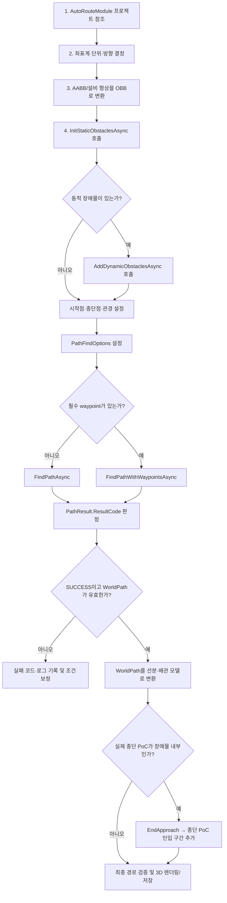
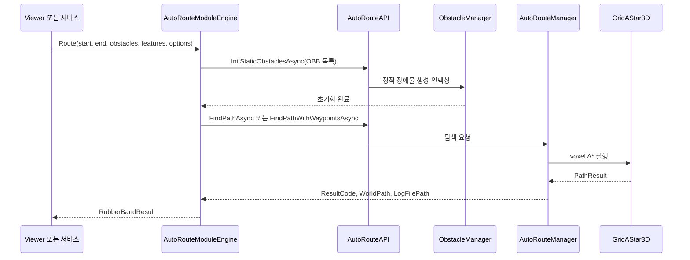

# AutoRouteModule API 단계별 튜토리얼

## 업데이트 내용 및 일시

- 업데이트 일시: 2026-07-23 KST
- 대상 프로젝트: `AutoRouteModule`, `RubberBandRoutingSuite`
- 대상 프레임워크: AutoRouteModule `netstandard2.0`, 호출 애플리케이션 `.NET 8`
- 주요 내용:
  - AutoRouteModule 참조부터 3차원 자동경로 결과 사용까지 단계별 설명
  - 정적·동적 장애물, 단일 경로, waypoint 경로, 병렬 배관 API 예제
  - `PathResult` 결과 판정과 실패 코드별 대응
  - 장비 또는 덕트 내부 PoC를 위한 `EndApproach` 처리 방법
  - Viewer 연동 시 전역 장애물 저장소의 동시성 처리 방법

---

## 1. 목적

AutoRouteModule은 시작점과 종단점, 배관 직경, 진행 방향 및 3차원 장애물을 입력받아 voxel 기반 A* 알고리즘으로 충돌 회피 경로를 탐색하는 라이브러리다.

이 문서는 다음 작업을 직접 구현할 수 있도록 구성한다.

1. C# 프로젝트에서 AutoRouteModule 참조
2. 좌표계와 배관 탐색 조건 정의
3. OBB 정적 장애물 초기화
4. 동적 장애물 관리
5. 단일 배관 경로 탐색
6. 기존 설계 특징점을 경유하는 경로 탐색
7. 종단 PoC까지 안전하게 연결
8. 결과 코드와 경로 좌표 처리
9. 탐색 취소와 동시 실행 제어
10. 여러 배관의 병렬 경로 탐색

---

## 2. 전체 단계별 흐름도



### 호출 계층



---

## 3. 1단계: 프로젝트 참조

### 3.1 프로젝트 참조 방식

호출 프로젝트의 `.csproj`에 AutoRouteModule 프로젝트를 참조한다.

```xml
<ItemGroup>
  <ProjectReference Include="..\..\..\AutoRouteModule\AutoRouteModule.csproj" />
</ItemGroup>
```

프로젝트 참조는 AutoRouteModule의 API가 변경되었을 때 호출 프로젝트도 함께 컴파일되므로 DLL을 수동 복사하는 방식보다 안전하다.

### 3.2 필요한 namespace

```csharp
using AutoRouteModule;
using AutoRouteModule.API;
using AutoRouteModule.Core;
using System.Numerics;
```

| Namespace | 주요 형식 | 용도 |
|---|---|---|
| `AutoRouteModule` | `RESULT_CODES` | 성공·실패 결과 판정 |
| `AutoRouteModule.API` | `AutoRouteAPI` | 외부 공개 API |
| `AutoRouteModule.Core` | `OBB`, `PathResult`, `PathFindOptions`, `DirectionType` | 장애물·옵션·경로 모델 |
| `System.Numerics` | `Vector3` | 3차원 좌표와 방향 벡터 |

---

## 4. 2단계: 좌표계, 단위와 방향 정의

AutoRouteModule은 `Vector3` 값을 그대로 사용한다. 라이브러리가 입력값의 단위를 자동 변환하지 않으므로 시작점, 종단점, 장애물 크기, 관경, waypoint 및 최소 직선거리는 동일한 단위를 사용해야 한다.

RubberBandRouting Viewer에서는 모든 값을 `mm` 단위로 전달한다.

```csharp
Vector3 start = new(1_000f, 2_000f, 3_000f);
Vector3 goal  = new(8_000f, 6_000f, 2_500f);
float pipeDiameter = 100f; // 100 mm
```

### `DirectionType`

| 값 | 벡터 | 설명 |
|---|---:|---|
| `Right` | `(1, 0, 0)` | +X |
| `Left` | `(-1, 0, 0)` | -X |
| `Up` | `(0, 1, 0)` | +Y |
| `Down` | `(0, -1, 0)` | -Y |
| `Forward` | `(0, 0, 1)` | +Z |
| `Backward` | `(0, 0, -1)` | -Z |
| `None` | `(0, 0, 0)` | 방향을 강제하지 않음 |

방향을 확정할 수 없다면 `DirectionType.None`을 사용한다.

```csharp
DirectionType startDirection = DirectionType.None;
DirectionType goalDirection = DirectionType.None;
```

기존 설계의 첫 선분과 마지막 선분이 있다면 가장 큰 축 성분을 기준으로 방향을 계산할 수 있다.

```csharp
DirectionType startDirection =
    Directions.GetClosestDirection(existingPoints[1] - existingPoints[0]);

DirectionType goalDirection =
    Directions.GetClosestDirection(existingPoints[^1] - existingPoints[^2]);
```

> `goalDirection`이 “종단점으로 들어가는 방향”인지 “종단점에서 경로를 바라보는 방향”인지 호출 시스템의 규칙을 하나로 통일해야 한다. 현재 API에는 목표 방향이 그대로 전달되므로 데이터 생성 측과 탐색 측이 같은 정의를 사용해야 한다.

---

## 5. 3단계: 장애물을 OBB로 구성

### 5.1 OBB 구조

| 필드 | 타입 | 예시 | 설명 |
|---|---|---|---|
| `Center` | `Vector3` | `(4000, 2500, 1800)` | 장애물 중심 좌표 |
| `Extents` | `Vector3` | `(1000, 500, 750)` | 중심에서 각 축 면까지의 반크기 |
| `Axes` | `Vector3[]` | `UnitX, UnitY, UnitZ` | OBB 로컬 X·Y·Z 회전축 |

축 정렬 장애물 예제:

```csharp
static OBB CreateAxisAlignedObb(Vector3 min, Vector3 max, float clearance)
{
    Vector3 expandedMin = min - new Vector3(clearance);
    Vector3 expandedMax = max + new Vector3(clearance);

    return new OBB
    {
        Center = (expandedMin + expandedMax) * 0.5f,
        Extents = (expandedMax - expandedMin) * 0.5f,
        Axes = new[]
        {
            Vector3.UnitX,
            Vector3.UnitY,
            Vector3.UnitZ
        }
    };
}
```

장애물 생성:

```csharp
var staticObstacles = new List<OBB>
{
    CreateAxisAlignedObb(
        min: new Vector3(3_000, 2_000, 0),
        max: new Vector3(5_000, 4_000, 3_000),
        clearance: 50),

    CreateAxisAlignedObb(
        min: new Vector3(6_000, 1_000, 1_000),
        max: new Vector3(6_500, 5_000, 2_000),
        clearance: 50)
};
```

`clearance`는 설계 안전거리다. AutoRouteModule은 배관 `diameter`도 충돌 검사에 사용하므로 다음 값을 구분한다.

- `diameter`: 배관 또는 탐색 객체 자체의 직경
- `clearance`: 배관 외곽과 장애물 사이에 추가로 확보할 설계 여유

---

## 6. 4단계: 정적 장애물 초기화

정적 장애물은 경로 탐색 전에 반드시 초기화가 완료되어야 한다.

```csharp
await AutoRouteAPI.InitStaticObstaclesAsync(staticObstacles);
```

### 올바른 호출 순서

```csharp
await AutoRouteAPI.InitStaticObstaclesAsync(staticObstacles);

PathResult result = await AutoRouteAPI.FindPathAsync(
    start,
    goal,
    DirectionType.None,
    DirectionType.None,
    pipeDiameter);
```

다음과 같이 초기화를 기다리지 않고 탐색하면 안 된다.

```csharp
// 잘못된 예: 초기화 완료 전에 탐색이 시작될 수 있다.
AutoRouteAPI.InitStaticObstacles(staticObstacles, () => { });
PathResult result = await AutoRouteAPI.FindPathAsync(...);
```

콜백 API가 필요한 경우에는 완료 콜백 안에서 탐색을 시작한다.

```csharp
AutoRouteAPI.InitStaticObstacles(staticObstacles, () =>
{
    AutoRouteAPI.FindPath(
        start,
        goal,
        DirectionType.None,
        DirectionType.None,
        pipeDiameter,
        result => HandleResult(result));
});
```

---

## 7. 5단계: 동적 장애물 관리

작업 중 추가된 배관이나 이동 가능한 객체는 동적 장애물로 등록한다.

```csharp
var routedPipeObstacles = new List<OBB>
{
    CreateAxisAlignedObb(
        new Vector3(2_000, 1_900, 1_900),
        new Vector3(7_000, 2_100, 2_100),
        clearance: 50)
};

await AutoRouteAPI.AddDynamicObstaclesAsync(routedPipeObstacles);
```

동적 장애물만 제거:

```csharp
AutoRouteAPI.ClearDynamicObstacles();
```

정적·동적 장애물을 모두 제거:

```csharp
AutoRouteAPI.ClearObstacles();
```

일반적인 배치 처리 순서:

```csharp
await AutoRouteAPI.InitStaticObstaclesAsync(staticObstacles);
AutoRouteAPI.ClearDynamicObstacles();

foreach (RouteRequest request in requests)
{
    PathResult result = await FindOneRouteAsync(request);

    if (result.ResultCode == RESULT_CODES.SUCCESS)
    {
        List<OBB> generatedPipeObstacles = ConvertPathToObstacles(result.WorldPath!);
        await AutoRouteAPI.AddDynamicObstaclesAsync(generatedPipeObstacles);
    }
}
```

이 방법은 먼저 생성된 배관을 이후 배관이 장애물로 회피하도록 만든다.

---

## 8. 6단계: 탐색 옵션 설정

```csharp
var options = new PathFindOptions(
    turnPenalty: 40,
    positivePenalty: Int3.Zero,
    negativePenalty: Int3.Zero,
    maxSearchNodes: 100_000,
    heuristicWeight: 1.1f,
    minStraightDistance: 0,
    timeoutMilliseconds: 30_000);
```

| 필드 | 타입 | 권장 시작값 | 설명 |
|---|---|---:|---|
| `TurnPenalty` | `int` | `40` | 방향 변경 비용. 높을수록 bend가 적은 경로 선호 |
| `PositivePenalty` | `Int3` | `(0,0,0)` | +X, +Y, +Z 이동 추가 비용 |
| `NegativePenalty` | `Int3` | `(0,0,0)` | -X, -Y, -Z 이동 추가 비용 |
| `MaxSearchNodes` | `int` | `100000` | 최대 탐색 노드 수. `0`은 무제한 |
| `HeuristicWeight` | `float` | `1.1` | 탐색 속도와 최적성의 균형. 최소값은 `1.0` |
| `MinStraightDistance` | `float` | `0` | bend 후 최소 직선거리. 좌표와 동일 단위 |
| `TimeoutMilliseconds` | `int` | `30000` | 탐색 제한 시간. `0`은 무제한 |

기본값 사용:

```csharp
PathFindOptions options = PathFindOptions.Default;
```

튜닝 순서:

1. 먼저 `PathFindOptions.Default`로 성공 여부 확인
2. 경로가 너무 많이 꺾이면 `TurnPenalty` 증가
3. 검색 공간이 크면 `MaxSearchNodes`와 timeout을 함께 검토
4. 속도가 중요하면 `HeuristicWeight`를 소폭 증가
5. 시공 최소 직선거리가 필요할 때만 `MinStraightDistance` 설정

---

## 9. 7단계: 단일 배관 경로 탐색

`Task<PathResult>`를 반환하는 `FindPathAsync` 사용을 권장한다.

```csharp
PathResult result = await AutoRouteAPI.FindPathAsync(
    start: start,
    goal: goal,
    startDirection: DirectionType.None,
    goalDirection: DirectionType.None,
    diameter: pipeDiameter,
    options: options);
```

방향을 강제하는 예제:

```csharp
PathResult result = await AutoRouteAPI.FindPathAsync(
    start: new Vector3(1_000, 2_000, 3_000),
    goal: new Vector3(8_000, 6_000, 2_500),
    startDirection: DirectionType.Down,
    goalDirection: DirectionType.Right,
    diameter: 100,
    options: options);
```

콜백 API:

```csharp
AutoRouteAPI.FindPath(
    start,
    goal,
    DirectionType.None,
    DirectionType.None,
    pipeDiameter,
    options,
    result => HandleResult(result));
```

콜백은 UI 스레드에서 실행된다고 가정하면 안 된다. WPF 화면을 변경할 때는 `Dispatcher.Invoke` 또는 `Dispatcher.BeginInvoke`를 사용한다.

---

## 10. 8단계: 기존 설계 특징점을 경유하는 경로 탐색

기존 설계에서 추출한 bend, 고도변경, trunk guide 및 종단 접근점을 필수 waypoint로 사용할 수 있다.

```csharp
var waypoints = new List<Vector3>
{
    new(1_000, 2_000, 2_000), // StartStub
    new(2_500, 2_000, 2_000), // Bend
    new(2_500, 4_000, 2_000), // TrunkGuide
    new(7_500, 6_000, 2_500)  // EndApproach
};

PathResult result = await AutoRouteAPI.FindPathWithWaypointsAsync(
    start,
    waypoints,
    goal,
    DirectionType.None,
    DirectionType.None,
    pipeDiameter,
    options);
```

주의 사항:

- waypoint는 입력 순서대로 경유한다.
- 시작점·종단점과 동일하거나 매우 가까운 중복점은 제거한다.
- `NaN`, `Infinity` 좌표를 전달하지 않는다.
- waypoint 자체가 장애물 안에 있으면 해당 구간이 실패할 수 있다.
- 너무 많은 필수 waypoint는 탐색 시간과 실패 가능성을 증가시킨다.
- 기존 설계의 모든 점을 넣기보다 의미 있는 특징점만 사용한다.

중복점 제거 예제:

```csharp
static List<Vector3> PrepareWaypoints(
    IEnumerable<Vector3> source,
    Vector3 start,
    Vector3 goal,
    float tolerance = 1f)
{
    return source
        .Where(p => Vector3.Distance(p, start) > tolerance)
        .Where(p => Vector3.Distance(p, goal) > tolerance)
        .Distinct()
        .ToList();
}
```

---

## 11. 9단계: 장비·덕트 내부 종단 PoC 처리

### 문제

실제 종단 PoC는 장비나 덕트 AABB의 표면 또는 내부에 존재할 수 있다. 이 상태에서 실제 PoC를 A* 목표점으로 전달하면 충돌 검사에서 다음 결과가 발생할 수 있다.

```text
FAIL_TO_END_POINT
```

장애물 전체를 제거하면 탐색 경로가 장비 내부를 관통할 수 있으므로 권장하지 않는다.

### 해결 흐름


1. 기존 설계에서 장애물 외부의 `EndApproach`를 구한다.
2. AutoRouteModule의 목표점은 `EndApproach`로 설정한다.
3. A* 탐색 성공 후 `EndApproach → 실제 PoC` 선분을 추가한다.
4. 마지막 인입 선분은 PoC 소유 장비에 대한 허용 관통 구간으로 별도 검증한다.

```csharp
Vector3 actualEndPoc = goal;
Vector3 endApproach = new(7_500, 6_000, 2_500);

var routeWaypoints = waypoints
    .Where(p => Vector3.Distance(p, endApproach) > 1f)
    .ToList();

PathResult result = await AutoRouteAPI.FindPathWithWaypointsAsync(
    start,
    routeWaypoints,
    endApproach,
    DirectionType.None,
    DirectionType.None,
    pipeDiameter,
    options);

if (result.ResultCode == RESULT_CODES.SUCCESS &&
    result.WorldPath is { Count: >= 2 })
{
    if (Vector3.Distance(result.WorldPath[^1], endApproach) > 1f)
        result.WorldPath.Add(endApproach);

    // 소유 덕트로 들어가는 허용 인입 구간
    result.WorldPath.Add(actualEndPoc);
}
```

시작 PoC도 장비 내부에 있고 첫 이동점 충돌이 발생한다면 동일하게 `StartStub` 외부점에서 A* 탐색을 시작하고 실제 시작 PoC에서 `StartStub`까지의 고정 인출 구간을 앞에 추가한다.

---

## 12. 10단계: 결과 판정과 경로 사용

### `PathResult`

| 필드 | 타입 | 설명 |
|---|---|---|
| `ResultCode` | `RESULT_CODES` | 성공 또는 실패 원인 |
| `WorldPath` | `List<Vector3>?` | 외부 시스템에서 사용할 최종 월드 좌표 경로 |
| `RawPath` | `List<Vector3>?` | 단순화 전 탐색 경로 |
| `SimplifiedPath` | `List<Vector3>?` | 단순화된 내부 경로 |
| `LogFilePath` | `string?` | 탐색 로그 파일 경로 |

성공 판정은 결과 코드와 좌표 개수를 함께 검사한다.

```csharp
static bool TryGetWorldPath(
    PathResult result,
    out IReadOnlyList<Vector3> path,
    out string error)
{
    if (result.ResultCode != RESULT_CODES.SUCCESS)
    {
        path = Array.Empty<Vector3>();
        error = $"AutoRoute 실패: {result.ResultCode}, 로그: {result.LogFilePath ?? "-"}";
        return false;
    }

    if (result.WorldPath is not { Count: >= 2 })
    {
        path = Array.Empty<Vector3>();
        error = "AutoRoute가 성공을 반환했지만 WorldPath가 비어 있습니다.";
        return false;
    }

    path = result.WorldPath;
    error = string.Empty;
    return true;
}
```

선분 변환과 총 길이 계산:

```csharp
var segments = new List<(Vector3 Start, Vector3 End, float Length)>();
float totalLength = 0;

for (int i = 0; i < path.Count - 1; i++)
{
    float length = Vector3.Distance(path[i], path[i + 1]);
    if (length <= 0.001f)
        continue;

    segments.Add((path[i], path[i + 1], length));
    totalLength += length;
}
```

### 결과 코드

| 코드 | 의미 | 우선 확인 사항 |
|---|---|---|
| `SUCCESS` | 탐색 성공 | `WorldPath.Count >= 2` 확인 |
| `FAIL` | 일반 실패 | 로그와 입력값 확인 |
| `FAIL_TO_INITIALIZE` | 초기화 실패 | 장애물 초기화 순서와 OBB 값 확인 |
| `FAIL_TO_START_POINT` | 시작점 설정 실패 | 시작점 또는 첫 이동점이 장애물 내부인지 확인 |
| `FAIL_TO_END_POINT` | 종단점 설정 실패 | 종단 PoC 포함 장애물과 EndApproach 확인 |
| `FAIL_TO_PATHFIND` | 경로를 찾지 못함 | 공간 연결성, 관경, 안전거리, waypoint 확인 |
| `TIMEOUT` | 제한 시간 초과 | 검색 범위, 노드 수, heuristic 조정 |
| `CANCELLED` | 사용자 취소 | 정상 취소 처리 |

---

## 13. 11단계: 탐색 취소

```csharp
private async Task<PathResult> FindWithCancellationAsync(
    Vector3 start,
    Vector3 goal,
    float diameter,
    PathFindOptions options,
    CancellationToken cancellationToken)
{
    using CancellationTokenRegistration registration =
        cancellationToken.Register(AutoRouteAPI.CancelPathfinding);

    return await AutoRouteAPI.FindPathAsync(
        start,
        goal,
        DirectionType.None,
        DirectionType.None,
        diameter,
        options);
}
```

취소 결과는 예외가 아니라 다음 결과 코드로 반환될 수 있으므로 반드시 판정한다.

```csharp
if (result.ResultCode == RESULT_CODES.CANCELLED)
{
    statusText = "사용자가 자동경로 탐색을 취소했습니다.";
}
```

---

## 14. 12단계: 전역 장애물 저장소와 동시성

AutoRouteModule의 장애물 저장소는 프로세스 전역으로 공유된다. 여러 요청이 다음 순서로 동시에 실행되면 요청 A가 등록한 장애물이 요청 B의 탐색에 사용될 수 있다.

```text
요청 A: 장애물 초기화 ───────────── 경로 탐색
요청 B:       장애물 초기화 ─────── 경로 탐색
```

각 요청마다 장애물 구성이 다르면 초기화와 탐색 전체를 잠금으로 보호한다.

```csharp
private static readonly SemaphoreSlim SearchGate = new(1, 1);

public static async Task<PathResult> FindSerializedAsync(
    List<OBB> obstacles,
    Vector3 start,
    Vector3 goal,
    float diameter,
    PathFindOptions options)
{
    await SearchGate.WaitAsync();
    try
    {
        await AutoRouteAPI.InitStaticObstaclesAsync(obstacles);
        AutoRouteAPI.ClearDynamicObstacles();

        return await AutoRouteAPI.FindPathAsync(
            start,
            goal,
            DirectionType.None,
            DirectionType.None,
            diameter,
            options);
    }
    finally
    {
        SearchGate.Release();
    }
}
```

모든 요청이 동일한 정적 장애물을 공유하고 동적 장애물도 변경하지 않는다면 정적 장애물은 한 번만 초기화할 수 있다. 하지만 장애물 추가·삭제와 탐색이 동시에 수행되지 않도록 애플리케이션 수준의 실행 정책이 필요하다.

---

## 15. 13단계: 병렬 배관 경로 탐색

여러 배관을 하나의 그룹 AABB로 묶어 탐색할 때 `GroupPipeSpec`을 사용한다.

```csharp
var pipes = new List<GroupPipeSpec>
{
    new(new Vector3(1_000, 2_000, 3_000), 100),
    new(new Vector3(1_000, 2_150, 3_000), 80),
    new(new Vector3(1_000, 2_280, 3_000), 80)
};

Vector3 groupCenterGoal = new(8_000, 6_000, 2_500);

GroupPathFindResult groupResult =
    await AutoRouteAPI.FindParallelPipePaths(
        pipes,
        groupCenterGoal,
        DirectionType.None,
        DirectionType.None,
        options);
```

waypoint 경유 병렬 배관:

```csharp
var groupWaypoints = new List<Vector3>
{
    new(2_500, 2_150, 3_000),
    new(2_500, 5_000, 2_500),
    new(7_500, 6_000, 2_500)
};

GroupPathFindResult groupResult =
    await AutoRouteAPI.FindParallelPipePathsWithWaypoints(
        pipes,
        groupWaypoints,
        groupCenterGoal,
        DirectionType.None,
        DirectionType.None,
        options);
```

`GroupPathFindResult`:

| 필드 | 타입 | 설명 |
|---|---|---|
| `ResultCode` | `RESULT_CODES` | 그룹 탐색 결과 |
| `WorldPath` | `List<List<Vector3>>?` | 배관별 최종 경로 |
| `SimpleCenterPath` | `List<Vector3>?` | 그룹 중심 대표 경로 |

---

## 16. 완전한 단일 배관 콘솔 예제

```csharp
using AutoRouteModule;
using AutoRouteModule.API;
using AutoRouteModule.Core;
using System.Numerics;

internal static class Program
{
    private static async Task Main()
    {
        Vector3 start = new(1_000, 2_000, 3_000);
        Vector3 actualEndPoc = new(8_000, 6_000, 2_500);
        Vector3 endApproach = new(7_500, 6_000, 2_500);
        float diameter = 100;

        var obstacles = new List<OBB>
        {
            CreateAxisAlignedObb(
                new Vector3(3_000, 2_000, 0),
                new Vector3(5_000, 4_000, 3_000),
                clearance: 50)
        };

        var waypoints = new List<Vector3>
        {
            new(1_000, 2_000, 2_000),
            new(2_500, 2_000, 2_000),
            new(2_500, 5_000, 2_500)
        };

        var options = new PathFindOptions(
            turnPenalty: 40,
            positivePenalty: Int3.Zero,
            negativePenalty: Int3.Zero,
            maxSearchNodes: 100_000,
            heuristicWeight: 1.1f,
            minStraightDistance: 0,
            timeoutMilliseconds: 30_000);

        await AutoRouteAPI.InitStaticObstaclesAsync(obstacles);
        AutoRouteAPI.ClearDynamicObstacles();

        PathResult result = await AutoRouteAPI.FindPathWithWaypointsAsync(
            start,
            waypoints,
            endApproach,
            DirectionType.None,
            DirectionType.None,
            diameter,
            options);

        if (result.ResultCode != RESULT_CODES.SUCCESS ||
            result.WorldPath is not { Count: >= 2 })
        {
            Console.WriteLine(
                $"경로 탐색 실패: {result.ResultCode}, 로그: {result.LogFilePath ?? "-"}");
            return;
        }

        // 덕트 외부 EndApproach에서 실제 종단 PoC까지 허용 인입 구간을 추가한다.
        result.WorldPath.Add(actualEndPoc);

        float totalLength = 0;
        for (int i = 0; i < result.WorldPath.Count - 1; i++)
        {
            Vector3 p1 = result.WorldPath[i];
            Vector3 p2 = result.WorldPath[i + 1];
            float length = Vector3.Distance(p1, p2);
            totalLength += length;

            Console.WriteLine(
                $"Segment {i + 1}: {p1} → {p2}, Length={length:N1}");
        }

        Console.WriteLine(
            $"탐색 성공: PointCount={result.WorldPath.Count}, TotalLength={totalLength:N1}");
    }

    private static OBB CreateAxisAlignedObb(
        Vector3 min,
        Vector3 max,
        float clearance)
    {
        Vector3 expandedMin = min - new Vector3(clearance);
        Vector3 expandedMax = max + new Vector3(clearance);

        return new OBB
        {
            Center = (expandedMin + expandedMax) * 0.5f,
            Extents = (expandedMax - expandedMin) * 0.5f,
            Axes = new[]
            {
                Vector3.UnitX,
                Vector3.UnitY,
                Vector3.UnitZ
            }
        };
    }
}
```

---

## 17. RubberBandRouting Viewer 실제 연동 구조

현재 Viewer는 다음 파일에서 AutoRouteModule을 호출한다.

- `RubberBandRouting.Engine/AutoRouteModuleEngine.cs`
- `RubberBandRouting.Viewer/MainWindow.xaml.cs`
- `RubberBandRouting.Viewer/MainWindow.xaml`

실제 처리 순서:

1. 사용자가 `AutoRoute A* 엔진` 체크
2. `ChkUseAutoRouteEngine_Changed()`가 네이티브 엔진 체크 해제
3. `ReRouteCurrentAsync()`가 현재 작업을 다시 실행
4. `ResolveEngine()`이 `AutoRouteModuleEngine` 반환
5. `ComputeRoutes()`가 태스크별 장애물, 특징점과 옵션 구성
6. `AutoRouteModuleEngine.Route()`가 전역 검색 잠금 획득
7. AABB를 안전거리만큼 확장하고 OBB로 변환
8. 정적 장애물 초기화
9. `EndApproach`를 실제 A* 종점으로 선택
10. waypoint 유무에 따라 적절한 API 호출
11. `PathResult.WorldPath`를 `RubberBandResult`로 변환
12. `EndApproach → 실제 종단 PoC` 인입 선분 추가
13. 결과 그리드와 3차원 경로 갱신

핵심 호출부:

```csharp
PathResult pathResult = requiredWaypoints.Count == 0
    ? AutoRouteAPI.FindPathAsync(
            start,
            searchEnd,
            DirectionType.None,
            DirectionType.None,
            diameter,
            findOptions)
        .GetAwaiter().GetResult()
    : AutoRouteAPI.FindPathWithWaypointsAsync(
            start,
            requiredWaypoints,
            searchEnd,
            DirectionType.None,
            DirectionType.None,
            diameter,
            findOptions)
        .GetAwaiter().GetResult();
```

Viewer의 `IRubberBandEngine.Route()`가 동기 인터페이스이므로 내부에서 Task 결과를 기다린다. 신규 서비스나 콘솔 애플리케이션은 처음부터 `async/await` 인터페이스로 구성하는 것이 좋다.

---

## 18. 운영 체크리스트

### 탐색 전

- [ ] 모든 좌표와 크기의 단위가 동일한가?
- [ ] OBB `Extents`가 전체 크기가 아니라 반크기인가?
- [ ] OBB `Axes`가 3개의 정규화된 직교축인가?
- [ ] 장애물 초기화를 `await` 했는가?
- [ ] 관경이 0보다 큰가?
- [ ] 시작점·종단점·waypoint에 NaN 또는 Infinity가 없는가?
- [ ] 시작점과 종단점이 동일하지 않은가?
- [ ] waypoint 순서가 실제 경로 진행 순서와 일치하는가?

### 탐색 후

- [ ] `ResultCode == SUCCESS`인가?
- [ ] `WorldPath.Count >= 2`인가?
- [ ] 중복 또는 길이 0인 선분을 제거했는가?
- [ ] 종단 PoC가 장애물 내부이면 EndApproach 인입 처리를 했는가?
- [ ] 결과 경로를 실제 관경과 안전거리로 재검증했는가?
- [ ] 실패 시 `ResultCode`와 `LogFilePath`를 저장했는가?

### 동시 실행

- [ ] 요청마다 장애물이 다르면 초기화와 탐색을 하나의 잠금으로 보호하는가?
- [ ] 동적 장애물 추가·삭제와 탐색이 동시에 실행되지 않는가?
- [ ] 취소 버튼이 `CancelPathfinding()`을 호출하는가?

---

## 19. 주요 문제와 해결 방법

| 증상 | 가능한 원인 | 해결 방법 |
|---|---|---|
| 시작 직후 실패 | 시작점 또는 첫 이동점이 장애물 내부 | 외부 StartStub에서 탐색 후 시작 인출부 추가 |
| 종단까지 도달하지 않음 | 종단 PoC가 덕트 AABB 내부 | EndApproach까지만 탐색 후 종단 인입부 추가 |
| `FAIL_TO_PATHFIND` | 관경·안전거리로 통로가 막힘 | 장애물, 관경, clearance와 waypoint 재확인 |
| `TIMEOUT` | 검색 공간·노드 수가 과도함 | waypoint 개선, 검색 옵션과 공간 범위 조정 |
| 경로 bend가 너무 많음 | 회전 비용이 낮음 | `TurnPenalty` 증가 |
| 요청별 결과가 섞임 | 전역 장애물 저장소 동시 변경 | 초기화+탐색 전체를 `SemaphoreSlim`으로 직렬화 |
| 성공인데 화면에 선이 없음 | `WorldPath` 미변환 또는 UI 스레드 문제 | 점을 선분으로 변환하고 Dispatcher에서 렌더링 |
| 장비를 관통함 | PoC 소유 장애물을 통째로 제외 | 장애물은 유지하고 허용된 짧은 인출·인입부만 별도 처리 |

---

## 20. 관련 소스

| 파일 | 역할 |
|---|---|
| `AutoRouteModule/API/AutoRouteAPI.cs` | 외부 공개 API와 입력 검증 |
| `AutoRouteModule/Manager/AutoRouteManager.cs` | 탐색 요청 실행과 취소 관리 |
| `AutoRouteModule/Manager/ObstacleManager.cs` | 정적·동적 장애물 관리 |
| `AutoRouteModule/Core/AStar/GridAStar3D.cs` | 단일 배관 voxel A* |
| `AutoRouteModule/Core/BoundAStar/BoundAStar3D_V2.cs` | 병렬 배관 그룹 탐색 |
| `AutoRouteModule/Core/Models/PathFindOptions.cs` | 탐색 옵션 |
| `AutoRouteModule/Core/Collisions/OBB.cs` | 장애물 OBB 모델 |
| `RubberBandRouting.Engine/AutoRouteModuleEngine.cs` | RubberBand 공통 인터페이스 어댑터 |
| `RubberBandRouting.Viewer/MainWindow.xaml.cs` | 엔진 선택, 배치 탐색, 결과 표시 |

