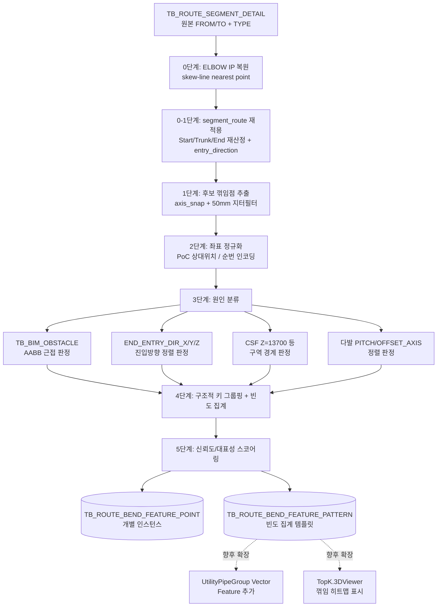

# 배관 꺾임특징점(Bend Feature Point) 추출 개발 계획서

| 항목 | 내용 |
| --- | --- |
| 작성일 | 2026-07-20 |
| 대상 프로젝트 | TopKGen (DDW AI AutoRouting) |
| 문서 상태 | v1.1 구현·정적 검증 완료 (개별 배관 범위, 19절 참고). 실제 DB 통합 검증 및 그룹배관 확장(18절)은 미착수 |
| 관련 선행 문서 | `Docs/20260712_Path Segmentation.md`, `Docs/20260712_Group Piping Pattern Extraction.md`, `Docs/UtilityPipeGroup_TopK_Development_Plan.md` |

---

## 1. 목적

장비명(Equipment Tag) + 유틸리티(Utility) 조합으로 라우팅되는 배관 경로에서, **수직↔수평으로 전환되거나 수평 방향으로 반복적으로 꺾이는 지점("꺾임특징점")을 다수의 기설계 경로에서 빈도수 기준으로 추출**하고, 각 꺾임이 왜 발생했는지(원인)를 함께 태깅하여 저장한다.

이 결과물은:

- 신규 설계 시 "이 장비×유틸리티 조합에서는 통상 N번째 꺾임이 이 위치·이 원인으로 발생한다"는 사전 지식을 라우팅 알고리즘/Top-K 추천에 제공하고,
- 이상 설계(과도한 꺾임, 근거 없는 꺾임) 탐지 기준이 되며,
- 기존 `TB_ROUTE_GROUP_PATTERN.HORIZ_ELBOWS/VERT_ELBOWS`가 갖고 있던 "개별 경로의 원좌표 꺾임점 나열"이라는 한계를 "다수 설계에 걸친 빈도 집계 + 원인 분류"로 확장한다.

## 2. 확정 요구사항

사용자 요청 원문 기준으로 다음 4가지가 확정 요구사항이다.

1. 장비명+유틸리티 단위로 라우팅 경로를 분석한다.
2. 경로가 **수직→수평 또는 수평→수직으로 전환**되거나, **수평 방향으로 자주(반복적으로) 꺾이는** 지점을 찾는다.
3. 이런 꺾임 지점을 **빈도수 기준으로 추출**한다 (한 경로의 우연한 꺾임이 아니라, 같은 조건의 여러 경로에서 반복되는 꺾임).
4. 각 꺾임에 대해 **발생 원인**을 기록한다 — 최소 (a) 장애물 회피, (b) 목적지(장비/덕트) 진입 제약 두 가지를 구분한다.

## 3. 범위

### 3.1 포함 범위

- `TB_ROUTE_PATH` + `TB_ROUTE_PATH_SEGMENTATION`에 이미 적재된 라우팅 경로(개별 배관, 그룹배관 모두)를 입력으로 사용.
- 경로 폴리라인에서 **후보 꺾임점**을 축 정렬(axis-snap) 기준으로 추출 (`PathSegmenter`/`ExportGroupPattern`과 동일한 50mm 지터 기준 채택).
- 꺾임점을 `(EQUIPMENT_KEY, UTILITY_GROUP, UTILITY, ...)` 구조적 키로 그룹핑하여 빈도 집계 (`ExtractStubPatterns.build_templates()`와 동일한 최소 표본수 방식).
- 꺾임 원인 분류: 장애물 회피 / 목적지·장비 진입 제약 / 구역(Zone) 강제 규칙 / 다발 정렬(피치) 규칙 / 미상.
- 신규 DB 테이블 2종 (`TB_ROUTE_BEND_FEATURE_POINT`, `TB_ROUTE_BEND_FEATURE_PATTERN`) 설계 및 마이그레이션 스크립트.
- CLI 도구(`Tools/ExtractBendFeaturePoints.py`, 가칭) 및 실행 문서.

### 3.2 제외 범위 (이번 단계에서 다루지 않음)

- 벡터화(Top-K 임베딩) 및 3D 뷰어 UI 연동은 6절에서 방향만 제시하고 별도 Phase 문서로 분리한다.
- 라우팅 알고리즘(A*) 자체를 꺾임특징점 기반으로 튜닝하는 것은 이번 범위 밖 — 이 문서는 "추출/분류"까지만 다룬다.
- 실시간(온라인) 분류는 다루지 않음. 배치(오프라인) 분석 전제.

## 4. 현행 구조 분석 — 재사용 가능한 자산

### 4.1 `PathSegmenter.py` — 세그멘테이션과 지터 필터링

- 경로는 `list[(x,y,z)]` mm 절대좌표 폴리라인.
- `AXIS_NAMES = ["+x","-x","+y","-y","+z","-z"]`, `axis_snap(vec)`로 방향을 6축에 스냅하고 `//2`로 X/Y/Z 3축 인덱스를 얻는다. **이 축 스냅 컨벤션을 꺾임특징점 분류에도 그대로 채택한다.**
- **50mm 미만 세그먼트는 지터로 간주**하여 "방향 판정"에서 제외 — Start/End Stub 판정 로직(`get_first_run`, `walk_stub`)에서 이미 검증된 규칙. 이번 신규 로직도 동일 임계값을 1차 필터로 사용한다.
- End Stub 판정 시 `entry_direction`(종단 PoC 진입 방향의 6축 단위벡터)을 이미 계산해 `TB_ROUTE_PATH_SEGMENTATION.END_ENTRY_DIR_X/Y/Z`에 저장 — **"목적지 진입 원인" 판정에 그대로 재사용 가능.**
- Start Stub은 CSF 구역 경계 **Z=13700mm**를 우선 기준으로 자른다 (`Docs/20260712_Path Segmentation.md`의 CR/A-F/CSF 3구역). 이 경계는 장애물이 아니라 **레이아웃 강제 규칙**이므로, 이 근방의 꺾임은 "장애물 회피"로 오분류하면 안 된다 — 원인 분류기에 별도 카테고리로 반영한다.

### 4.2 `ExportGroupPattern.py::extract_elbow_locations()` — 기존 꺾임점 추출의 한계

```python
def extract_elbow_locations(points, tol=0.9):
    # 인접 벡터 내적 < 0.99 → 꺾임 vertex
    # |u.z| >= 0.9 → vertical, else horizontal
    return {'horizontal': [...], 'vertical': [...]}
```

- 이미 `TB_ROUTE_GROUP_PATTERN.HORIZ_ELBOWS`/`VERT_ELBOWS`(jsonb)로 저장되고 있으나 **단일 경로의 원좌표 나열**일 뿐, (a) 여러 설계에 걸친 빈도 집계가 없고 (b) 원인 태깅이 없다. 본 문서가 채우는 정확한 공백.
- `extract_orthogonal_segments()`가 별도로 sub-300mm 꺾임을 정리하는 로직을 갖고 있어, "짧은 꺾임 stub"과 "실질적 방향전환"을 구분하는 데 참고할 수 있다.

### 4.3 `Extract_Design_Pattern.py`(구 DesignPatternAnalyzer.py) — 장애물 관계 신호

기존에 이미 "경로-장애물 관계"를 계산해 `TB_ROUTE_FEATURE_OBSTACLE_RELATION`에 저장하는 파이프라인이 존재한다:

- `TB_BIM_OBSTACLE(INSTANCE_NAME, OST_TYPE, DDWORKS_TYPE, COLLISION_PASS, AABB_MINX/Y/Z, AABB_MAXX/Y/Z)` — 물리 장애물 AABB.
- `classify_obstacle_type()`, `obstacle_axis()`, `bypass_side_from_obstacle()`, `segment_aabb_distance()`, `point_aabb_distance()` — 이미 구현된 지오메트리 유틸.
- `save_obstacle_relations()`가 계산하는 `required_clearance = diameter*0.5 + 150mm`, `NEAREST_DISTANCE_MM`, `RELATION_SCORE`, 그리고 **`BEND_COUNT_BEFORE`/`BEND_COUNT_AFTER`**(장애물에 가장 가까운 세그먼트를 기준으로 그 전/후 꺾임 개수)는 **"이 꺾임이 이 장애물 때문에 생겼다"를 판단하는 데 필요한 신호를 이미 절반 이상 계산해 두었다.** 본 신규 로직은 이를 재사용하며 부족한 부분(꺾임점 단위의 직접 매핑)만 보강한다.

### 4.4 `ExtractStubPatterns.py::build_templates()` — 빈도 집계 패턴

- 개별 표본(`StubSample`)을 `(STUB_KIND, ANCHOR_KIND, MAIN_EQUIPMENT_NAME, UTILITY_GROUP, UTILITY, SIZE, FACE, DIR_SEQ)` 구조적 키로 그룹핑하고, **최소 표본수(min-samples) 이상 반복된 그룹만 템플릿으로 승격**, 대표값(`REPRESENTATIVE_*`)과 평균 통계(`AVG_*`)를 저장한다.
- 이 "구조적 키 그룹핑 → 최소 반복 횟수 필터 → 대표/평균 집계"가 요구사항의 "빈도수에 따라서 추출"에 대한 이 코드베이스의 표준 패턴이며, 본 문서의 꺾임특징점 집계도 동일 패턴을 따른다.

### 4.5 ELBOW 사선 왜곡 문제 — 반드시 선행 처리해야 하는 전제조건

`Docs/Elbow_Geometry_Analysis_Report.md`에 이미 분석되어 있는 문제로, **본 문서의 정확도에 직접적인 영향을 준다.**

- 기존 설계 데이터에서 엘보우는 입구 포트(`P_in`)와 출구 포트(`P_out`) 두 점으로만 저장된다. 이 둘을 직선으로 이으면 실제로는 존재하지 않는 **사선(대각선) 세그먼트**가 생기고, 진짜 꺾임 지점(두 직관 중심선을 연장한 교차점, Intersection Point/IP)은 그보다 항상 살짝 벗어난 곳에 있다. 배관 사이즈·엘보우 종류에 따라 수십~수백 mm 오차가 난다.
- 이미 `Tools/ExtractStubPatterns.py::fetch_route_points()`(550~647행)에 해결책이 구현되어 있다: `TB_ROUTE_SEGMENT_DETAIL`에서 `TYPE='ELBOW'` 세그먼트를 만나면, 그 이전 직관의 방향벡터 $\vec{v}_1$·이후 직관의 방향벡터 $\vec{v}_2$로 두 직선의 최근접점(skew-line nearest point, 오차 500mm 이내일 때만 채택)을 계산해 IP로 대체한다.
- **그러나 코드를 직접 대조한 결과, 이 IP 복원은 `ExtractStubPatterns.py`에만 적용되어 있고, 본 문서 7절이 입력으로 쓰려던 `PathSegmenter.py::load_route_data_bulk()`(→ `TB_ROUTE_PATH_SEGMENTATION`의 원천)와 `ExportGroupPattern.py`(그 결과를 그대로 읽음, `extract_elbow_locations()` 포함)는 IP 복원 없이 FROM/TO 좌표를 그대로 이어붙인다.** 즉 `TB_ROUTE_PATH_SEGMENTATION.START_STUB_GEOM/MIDDLE_TRUNK_GEOM/END_STUB_GEOM`을 그대로 입력으로 쓰면, 엘보우/밴딩이 있는 자리마다 실제로는 없는 사선 꼭짓점을 "꺾임점"으로 잘못 추출하게 된다.
- **결론**: 본 문서의 꺾임특징점 추출은 `TB_ROUTE_PATH_SEGMENTATION`에 저장된 지오메트리를 직접 쓰지 않고, `TB_ROUTE_SEGMENT_DETAIL` 원본에서 IP 복원을 직접 수행한 폴리라인을 입력으로 삼는다 (7.1절에 반영).

## 5. 용어 정의

| 용어                              | 정의                                                                                                                                                                                                                  |
| --------------------------------- | --------------------------------------------------------------------------------------------------------------------------------------------------------------------------------------------------------------------- |
| 꺾임특징점 (Bend Feature Point)   | 경로 폴리라인 상에서 인접 세그먼트 간 진행 축이 바뀌는 정점(vertex) 중, 50mm 지터 필터를 통과한 "실질적" 방향 전환점                                                                                                  |
| 전환 유형 (Transition Type)       | `V→H`(수직→수평), `H→V`(수평→수직), `H→H`(수평 내 방향전환, 예: +x→+y), `V→V`(수직 내 반전, 드묾)                                                                                                      |
| 원인 (Cause)                      | 꺾임이 발생한 이유.`OBSTACLE_AVOID`(장애물 회피) / `DESTINATION_ENTRY`(목적지·장비 진입 제약) / `ZONE_CONSTRAINT`(구역 강제 규칙, 예: CSF 경계) / `GROUP_ALIGNMENT`(다발 정렬/피치 규칙) / `UNKNOWN`(미상) |
| 구조적 키 (Structural Key)        | 빈도 집계의 그룹 기준 —`(EQUIPMENT_KEY, UTILITY_GROUP, UTILITY, ORDINAL_INDEX, TRANSITION_TYPE, AXIS_PAIR)`                                                                                                        |
| 정규화 위치 (Normalized Position) | 서로 다른 설계 간 좌표를 직접 비교할 수 없으므로, 꺾임점을 "장비 PoC로부터의 상대 위치/순번"으로 인코딩한 값                                                                                                          |
| IP (Intersection Point)           | 밴딩/엘보우 피팅의 입/출구 포트(`P_in`/`P_out`)가 아니라, 그 전후 직관의 중심선을 연장했을 때 실제로 교차하는 가상의 꺾임 지점. 꺾임특징점의 좌표는 항상 이 IP를 기준으로 한다 (4.5절)                            |

## 6. 목표 아키텍처



## 7. 알고리즘 상세

### 7.0 0단계 — ELBOW IP 복원 (선행 전처리, 필수)

4.5절에서 확인했듯 `TB_ROUTE_PATH_SEGMENTATION`의 저장된 지오메트리는 IP 복원이 안 된 원시 좌표이므로 그대로 쓰면 안 된다. 본 도구는 `TB_ROUTE_SEGMENT_DETAIL`을 직접 읽어 `ExtractStubPatterns.py::fetch_route_points()`와 동일한 알고리즘으로 IP를 복원한다 (가급적 로직 중복을 피하기 위해 공유 유틸 함수로 분리 — 15절 참고).

```
raw_segs = SELECT FROM_POS*, TO_POS*, TYPE FROM TB_ROUTE_SEGMENT_DETAIL
           JOIN TB_ROUTE_SEGMENTS ... WHERE ROUTE_PATH_GUID = :guid
           ORDER BY SEGMENTS.ORDER, DETAIL.ORDER

for each segment i where TYPE == 'ELBOW' and 0 < i < n-1:
    v1 = normalize(prev_seg.to - prev_seg.from)   # 진입 직관 방향
    v2 = normalize(next_seg.to - next_seg.from)   # 진출 직관 방향
    # 두 직선 L1(t) = prev_seg.to + t*v1,  L2(s) = next_seg.from + s*v2 의 최근접점(skew-line nearest point)
    q1, q2 = nearest_points_on_lines(prev_seg.to, v1, next_seg.from, v2)
    ip = midpoint(q1, q2)
    skew_dist = dist(q1, q2)
    if skew_dist < 500mm:                # 유효한 직교 꺾임으로 판단
        points[-1] = ip                  # P_in/P_out 대신 IP를 꺾임점으로 채택
        mark_as_elbow_restored(ip, skew_dist)
    # else: 근접교차 실패(비정형 배관) → 원본 P_in/P_out 유지, 하류 UNKNOWN 후보로 남김
```

- 이 값은 "가상의 교차점"이지 실측점이 아니므로, 최종 저장 시 `IS_ELBOW_RESTORED_IP=true`와 `IP_RESTORE_SKEW_DIST_MM`(복원 오차)을 함께 남겨 신뢰도를 추적한다 (8.1절).
- 개선안 B(엘보우 규격 Center-to-End 거리 $E$ 기반 정밀 역산, `Docs/Elbow_Geometry_Analysis_Report.md` 65절)는 이번 단계에서는 채택하지 않는다 — 현재 코드베이스의 검증된 방식(개선안 A, skew-line 최근접점)과 일관성을 유지하고, 정밀도가 부족하면 추후 공용 유틸 고도화 시 함께 반영한다.

### 7.0-1 0-1단계 — Start/Trunk/End 재세그멘테이션

IP 복원된 폴리라인은 `TB_ROUTE_PATH_SEGMENTATION`에 저장된 시점의 정점 인덱스와 더 이상 일치하지 않는다 (엘보우 구간의 정점 개수가 줄어듦). 따라서 저장된 세그멘테이션 결과를 재사용하지 않고, `PathSegmenter.segment_route()`를 IP 복원된 폴리라인에 **직접 재적용**하여 Start Stub / Middle Trunk / End Stub 경계와 `entry_direction`을 다시 산출한다. 이렇게 하면:

- 6절 파이프라인의 이후 모든 단계(구간 판정, 진입방향 정렬 판정)가 IP 복원 폴리라인과 완전히 정합된 좌표 위에서 동작하고,
- `PathSegmenter.py` 자체를 수정하지 않고도(별도 승인·검증 필요 없이) 본 문서 범위 내에서 정확도를 확보할 수 있다.

### 7.1 1단계 — 후보 꺾임점 추출 (경로 단위)

입력: 0-1단계에서 재산출한 `(start_stub_pts, middle_trunk_pts, end_stub_pts)`를 이어붙인 전체 폴리라인 (Start/End Free Point 포함). **이 폴리라인의 정점은 이미 IP 복원이 끝난 상태이므로, 엘보우/밴딩 구간은 사선이 아니라 두 직관을 연장한 교차점 하나로 표현되어 있다.**

```
for i in 1..len(points)-2:
    u1 = normalize(points[i]   - points[i-1])
    u2 = normalize(points[i+1] - points[i])
    if dist(points[i-1], points[i]) < 50mm or dist(points[i], points[i+1]) < 50mm:
        continue  # 지터 세그먼트에 접한 정점은 후보에서 제외 (PathSegmenter와 동일 기준)
    if dot(u1, u2) >= 0.999:
        continue  # 방향 변화 없음 (직선)
    axis1 = axis_snap(u1) // 2   # 0=X,1=Y,2=Z
    axis2 = axis_snap(u2) // 2
    transition = classify_transition(axis1, axis2)  # V→H / H→V / H→H / V→V
    candidates.append(BendCandidate(point=points[i], transition, axis1, axis2, ordinal=i,
                                     is_elbow_restored_ip=..., ip_restore_skew_dist_mm=...))
```

- `extract_elbow_locations()`와 동일한 벡터 내적 방식을 쓰되, PathSegmenter의 50mm 지터 규칙과 0단계 IP 복원을 명시적으로 결합한다 (기존 `extract_elbow_locations`는 지터 필터와 IP 복원이 모두 없어 미세 꺾임·사선 왜곡을 그대로 잡아낼 위험이 있음 — 신규 로직에서 둘 다 보강).
- "수평으로 자주 꺾이는" 요구사항은 `H→H` 전환이 한 경로 내에서 **연속 2회 이상** 발생하는 구간을 별도로 태깅한다 (`ExportGroupPattern.ORTHO_PATTERN`의 `Staircase`/`Complex Multi-bend` 판정 로직을 재사용).

### 7.2 2단계 — 좌표 정규화 (설계 간 비교 가능하게)

서로 다른 설계는 절대좌표가 전혀 다르므로, 원좌표만으로는 빈도 집계가 불가능하다. 두 축으로 정규화한다.

1. **순번 기반**: Start Free Point에서부터 몇 번째 꺾임인지(`ORDINAL_FROM_START`), End Free Point로부터 몇 번째인지(`ORDINAL_FROM_END`) — `ExtractStubPatterns`가 이미 `n_bends`, `dir_seq`로 순서 정보를 다루는 방식과 동일 계열.
2. **상대위치 기반**: 꺾임점이 속한 세그먼트 구간(Start Stub / Middle Trunk / End Stub, 0-1단계 재산정 결과 기준) + 해당 구간 내 진행률(0~1, path-length 기준) + 장비 Anchor AABB 기준 상대좌표(`ExtractStubPatterns.build_feature()`의 `[18:21]` 상대위치 항과 동일 방식).

이 두 인코딩을 모두 저장해, 이후 그룹핑 시 "순번" 또는 "상대위치" 어느 쪽으로도 집계할 수 있게 한다.

### 7.3 3단계 — 원인(Cause) 분류

각 `BendCandidate`에 대해 아래 판정을 **우선순위 순서대로** 적용하고, 매칭된 첫 번째 카테고리를 원인으로 채택한다 (배타적 단일 분류 + 근거값은 모두 evidence 컬럼에 보존).

#### 7.3.1 ZONE_CONSTRAINT (구역 강제 규칙) — 최우선 판정

`abs(point.z - 13700) < 50mm` (CSF 경계) 또는 기타 `Docs/20260712_Path Segmentation.md`에 정의된 구역 경계 근방이면 `ZONE_CONSTRAINT`로 분류하고 종료. 이 판정을 가장 먼저 하는 이유는, 이 경계 근처의 꺾임을 장애물 회피로 오분류하는 것을 막기 위함이다 (4.1절 근거).

#### 7.3.2 DESTINATION_ENTRY (목적지·장비 진입 제약)

- 꺾임점이 **End Stub 구간**(0-1단계에서 재산출한 `end_stub_pts`) 내부에 있고,
- 꺾임 이후 방향(`u2`)이 `END_ENTRY_DIR_X/Y/Z`(entry_direction)와 축이 일치하면 `DESTINATION_ENTRY`로 분류.
- 마찬가지로 **Start Stub 구간**에서 장비측 PoC(`SOURCE_POS`) Anchor face 방향과 첫 세그먼트 축이 일치하는 경우도 `DESTINATION_ENTRY`(진입측)로 분류 — `ExtractStubPatterns`의 `face`/`dir_seq[0]` 개념 재사용.
- 근거: PathSegmenter가 End Stub을 "역방향 탐색, 첫 방향전환 vertex까지"로 정의하므로, End Stub의 시작 vertex(=Middle Trunk와의 경계)는 태생적으로 "진입 방향을 맞추기 위한 꺾임"일 확률이 매우 높다.

#### 7.3.3 OBSTACLE_AVOID (장애물 회피)

`TB_BIM_OBSTACLE`을 경로 AABB ±5000mm로 조회 후, 각 장애물에 대해:

```
required_clearance = diameter_mm * 0.5 + 150mm
nearest_dist = segment_aabb_distance(꺾임점 인접 세그먼트, obstacle_aabb)
if nearest_dist <= max(required_clearance * 1.5, 600mm):
    OBSTACLE_AVOID 후보로 채택, evidence = {obstacle_name, nearest_dist, bypass_side}
```

- `Extract_Design_Pattern.py`의 `segment_aabb_distance`, `bypass_side_from_obstacle`, `required_clearance` 계산식을 그대로 재사용.
- 이미 존재하는 `TB_ROUTE_FEATURE_OBSTACLE_RELATION.BEND_COUNT_BEFORE/AFTER`가 채워진 경로라면, 해당 릴레이션의 최근접 세그먼트 인덱스와 꺾임점의 순번을 대조해 **교차검증**한다 (관계 테이블이 먼저 계산해 둔 "이 장애물 근처에 꺾임이 있다"는 신호와, 본 로직이 개별 꺾임점 단위로 찾은 신호가 일치하면 신뢰도를 올린다).

#### 7.3.4 GROUP_ALIGNMENT (다발 정렬/피치 규칙)

경로가 그룹배관(다발)의 멤버이고 (`TB_ROUTE_GROUP_PATTERN.MEMBER_GUIDS`에 포함), 꺾임점이 그룹의 `TRUNK_Z` 진입/이탈 지점이며 `IS_EQUAL_SPACING=true`(등간격 배치)인 경우 `GROUP_ALIGNMENT`로 분류. 개별 배관의 회피가 아니라 다발 전체의 피치(`PITCH_MM`) 정렬을 맞추기 위한 꺾임이기 때문.

#### 7.3.5 UNKNOWN (미상)

위 4가지 중 어느 것도 매칭되지 않으면 `UNKNOWN`으로 분류하고, 이후 사람이 검토할 수 있도록 원좌표·전환유형·인근 500mm 내 최근접 장애물명(있다면)을 evidence로 남긴다. **이 비율이 높으면(예: 20% 초과) 판정 규칙 자체를 보강해야 한다는 신호로 품질 기준에 반영한다 (13절).**

### 7.4 4단계 — 구조적 그룹핑 및 빈도 집계

`ExtractStubPatterns.build_templates()`와 동일한 방식:

```
group_key = (EQUIPMENT_KEY, UTILITY_GROUP, UTILITY, TRANSITION_TYPE, ORDINAL_FROM_START 또는 상대위치 버킷, CAUSE)
group by group_key over all BendCandidate across all routes
if len(group) >= MIN_SAMPLES(기본값 3):
    승격 → TB_ROUTE_BEND_FEATURE_PATTERN 레코드 1건 생성
    REPRESENTATIVE_POINT = group 내 centroid에 가장 가까운 실측점
    AVG_POSITION, POSITION_STD, SAMPLE_COUNT, CAUSE_CONFIDENCE 계산
```

- 상대위치 버킷은 0.1 단위(10% 구간)로 양자화해 서로 다른 설계의 "비슷한 위치" 꺾임을 같은 그룹으로 묶는다.
- 같은 구조적 키 내에서 원인(CAUSE)이 갈리면(예: 70%는 OBSTACLE_AVOID, 30%는 UNKNOWN) 다수결로 대표 원인을 정하고 `CAUSE_CONFIDENCE = 다수결 비율`로 신뢰도를 남긴다.

### 7.5 5단계 — 신뢰도/대표성 스코어링

```
FREQUENCY_SCORE = sample_count / total_routes_in_group_key_scope   # 이 조합에서 몇 %의 경로가 이 꺾임을 갖는가
CAUSE_CONFIDENCE = majority_cause_count / sample_count
POSITION_CONSISTENCY = max(0, 1 - ANCHOR_REL_STD / sqrt(3))        # Anchor 정규화 좌표가 얼마나 일관적인가
```

세 지표를 `TB_ROUTE_BEND_FEATURE_PATTERN`에 함께 저장해, 소비자(라우팅 알고리즘/뷰어)가 "이 꺾임 패턴을 얼마나 신뢰할지" 스스로 판단할 수 있게 한다.

## 8. 최종 DB 설계 (v1.1 구현 기준)

기존 SQL 컨벤션(3.x절 조사 결과)을 그대로 따른다: `TB_` 대문자 테이블명, SRID=0 지오메트리 + GIST 인덱스, `jsonb` + `CHECK(jsonb_typeof=...)`, `CREATED_AT/UPDATED_AT timestamptz`, provenance 컬럼(`SOURCE_HASH`, `BUILD_RUN_ID`).

### 8.1 `TB_ROUTE_BEND_FEATURE_POINT` (개별 인스턴스 — 경로별 원자료)

```sql
CREATE TABLE "TB_ROUTE_BEND_FEATURE_POINT" (
    "BEND_ID" bigserial PRIMARY KEY,
    "ROUTE_PATH_GUID" text NOT NULL,
    "EQUIPMENT_KEY" text NOT NULL,
    "UTILITY_GROUP" text NOT NULL,
    "UTILITY" text NOT NULL,
    "ORDINAL_FROM_START" int NOT NULL,
    "ORDINAL_FROM_END" int NOT NULL,
    "SEGMENT_ZONE" text NOT NULL CHECK ("SEGMENT_ZONE" IN ('START_STUB','MIDDLE_TRUNK','END_STUB')),
    "REL_POSITION_BUCKET" numeric(3,2) NOT NULL,
    "TRANSITION_TYPE" text NOT NULL CHECK ("TRANSITION_TYPE" IN ('V_TO_H','H_TO_V','H_TO_H','V_TO_V')),
    "AXIS_BEFORE" text NOT NULL,
    "AXIS_AFTER" text NOT NULL,
    "CAUSE" text NOT NULL CHECK ("CAUSE" IN ('OBSTACLE_AVOID','DESTINATION_ENTRY','ZONE_CONSTRAINT','GROUP_ALIGNMENT','UNKNOWN')),
    "CAUSE_EVIDENCE" jsonb NOT NULL CHECK (jsonb_typeof("CAUSE_EVIDENCE") = 'object'),
    "IS_ELBOW_RESTORED_IP" boolean NOT NULL DEFAULT false,
    "IP_RESTORE_SKEW_DIST_MM" double precision,
    "ANCHOR_REL_POSITION" jsonb,
    "IS_HORIZONTAL_SEQUENCE" boolean NOT NULL DEFAULT false,
    "POINT_3D" geometry(PointZ, 0) NOT NULL,
    "BUILD_RUN_ID" uuid NOT NULL,
    "CREATED_AT" timestamptz NOT NULL DEFAULT now()
);
CREATE INDEX "IX_TRBFP_POINT_3D" ON "TB_ROUTE_BEND_FEATURE_POINT" USING GIST ("POINT_3D");
CREATE INDEX "IX_TRBFP_GROUP_KEY" ON "TB_ROUTE_BEND_FEATURE_POINT" ("EQUIPMENT_KEY","UTILITY_GROUP","UTILITY","TRANSITION_TYPE");
```

`IS_ELBOW_RESTORED_IP`/`IP_RESTORE_SKEW_DIST_MM`은 7.0절 결과를 그대로 보존한 것으로, 이 꺾임점이 실제 ELBOW/밴딩 피팅에서 두 직관을 연장해 복원한 가상 교차점인지, 단순 축전환 정점인지, 그리고 복원 시 두 직선이 정확히 교차하지 않고 벌어졌던 거리(skew distance, mm)를 추적한다. 하류 소비자(뷰어·품질 검토)가 복원 신뢰도를 함께 판단할 수 있게 한다.

`CAUSE_EVIDENCE` 예시 (jsonb):

```json
{"obstacle_name": "H-BEAM-203", "nearest_dist_mm": 214.5, "bypass_side": "+x", "required_clearance_mm": 275.0}
```

#### 8.1.1 개별 꺾임점 테이블 필드 설명과 예시

이 테이블은 경로에서 검출한 **꺾임점 하나당 한 행**을 저장한다. 동일 경로에 꺾임이 4개면 `ROUTE_PATH_GUID`가 같은 행이 4개 생성된다.

| 필드 | 타입 / 필수 | 설명 및 산출 규칙 | 예시 |
| --- | --- | --- | --- |
| `BEND_ID` | `bigserial`, PK | 개별 꺾임점의 DB 내부 식별자. INSERT 시 자동 증가하며 패턴 테이블의 `MEMBER_BEND_IDS`에서 참조한다. | `18452` |
| `ROUTE_PATH_GUID` | `text`, 필수 | 이 꺾임점이 추출된 원본 배관 경로 GUID. `TB_ROUTE_PATH.ROUTE_PATH_GUID`와 논리적으로 연결된다. | `0f17e8b6-...` |
| `EQUIPMENT_KEY` | `text`, 필수 | 빈도 집계의 장비 기준 키. `TB_ROUTE_PATH`에서 `EQUIPMENT_TAG → EQUIPMENT_NAME → SOURCE_OWNER_NAME` 우선순위로 선택하고 없으면 `UNKNOWN`을 사용한다. | `P-101A` |
| `UTILITY_GROUP` | `text`, 필수 | 상위 유틸리티 그룹. 장비·유틸리티 조합별 패턴 집계의 구조 키다. | `COOLING_WATER` |
| `UTILITY` | `text`, 필수 | 실제 배관 유틸리티 코드 또는 명칭. | `PCWS` |
| `ORDINAL_FROM_START` | `integer`, 필수 | IP 복원 폴리라인의 시작점에서부터 계산한 꺾임 정점 인덱스. 첫 내부 정점은 일반적으로 `1`이다. | `3` |
| `ORDINAL_FROM_END` | `integer`, 필수 | 동일 꺾임을 종단에서 역방향으로 센 정점 인덱스. 시작·종단 어느 쪽 기준으로도 패턴을 비교할 수 있게 한다. | `2` |
| `SEGMENT_ZONE` | `text`, 필수 | 재세그멘테이션 결과상 구간. `START_STUB`, `MIDDLE_TRUNK`, `END_STUB` 중 하나다. | `MIDDLE_TRUNK` |
| `REL_POSITION_BUCKET` | `numeric(3,2)`, 필수 | 해당 구간 누적길이 기준 진행률을 0.1 단위로 양자화한 값. `0.0`은 구간 시작, `1.0`은 구간 끝이다. | `0.60` |
| `TRANSITION_TYPE` | `text`, 필수 | 꺾임 전·후 지배축 변화. `V_TO_H`, `H_TO_V`, `H_TO_H`, `V_TO_V` 중 하나다. | `H_TO_H` |
| `AXIS_BEFORE` | `text`, 필수 | 꺾임 직전 선분을 6축으로 snap한 방향. `+x`, `-x`, `+y`, `-y`, `+z`, `-z` 중 하나다. | `+x` |
| `AXIS_AFTER` | `text`, 필수 | 꺾임 직후 선분을 6축으로 snap한 방향. | `+y` |
| `CAUSE` | `text`, 필수 | 우선순위 규칙으로 선택한 단일 발생 원인. `ZONE_CONSTRAINT`, `DESTINATION_ENTRY`, `OBSTACLE_AVOID`, `GROUP_ALIGNMENT`, `UNKNOWN` 중 하나다. | `OBSTACLE_AVOID` |
| `CAUSE_EVIDENCE` | `jsonb`, 필수 | 원인 판정 근거. 원인별로 경계 Z, 진입방향, Anchor face, 장애물명·거리·우회방향, 그룹 ID·피치 등을 저장한다. | `{"obstacle_name":"H-BEAM-203","nearest_dist_mm":214.5,"bypass_side":"+x"}` |
| `IS_ELBOW_RESTORED_IP` | `boolean`, 필수 | `true`이면 원본 ELBOW 입·출구점을 그대로 쓴 것이 아니라 전후 직관 중심선을 연장해 계산한 가상 교차점(IP)이다. | `true` |
| `IP_RESTORE_SKEW_DIST_MM` | `double precision`, 선택 | IP 복원 시 두 연장 직선의 최근접점 간 거리(mm). 값이 작을수록 복원 신뢰도가 높다. 복원하지 않은 점은 `NULL`이다. | `3.42` |
| `ANCHOR_REL_POSITION` | `jsonb`, 선택 | SOURCE 장비 Anchor AABB 기준 정규화 좌표 `[x,y,z]`. 각 성분은 `0~1`이며 Anchor를 찾지 못하면 `NULL`이다. | `[0.25,0.80,0.50]` |
| `IS_HORIZONTAL_SEQUENCE` | `boolean`, 필수 | 현재 점이 연속 2회 이상의 `H_TO_H` 꺾임 구간에 포함되는지 나타낸다. 계단형·복합 수평 우회 검출에 사용한다. | `true` |
| `POINT_3D` | `geometry(PointZ,0)`, 필수 | 최종 꺾임점의 세계좌표(mm). IP 복원점이면 복원 좌표가 저장된다. | `POINT Z (12500 8400 13700)` |
| `BUILD_RUN_ID` | `uuid`, 필수 | 이 행을 만든 build 실행 ID. 동일 실행에서 생성된 점과 패턴을 추적하는 provenance 값이다. | `310b3f6c-1102-4d56-8a77-8c0573546820` |
| `CREATED_AT` | `timestamptz`, 필수 | DB 행 생성 시각. 기본값은 `now()`다. | `2026-07-20 15:42:11+09` |

### 8.2 `TB_ROUTE_BEND_FEATURE_PATTERN` (빈도 집계 템플릿)

```sql
CREATE TABLE "TB_ROUTE_BEND_FEATURE_PATTERN" (
    "PATTERN_ID" text PRIMARY KEY,              -- "bfp_" + sha256(canonical_json(group_key))
    "EQUIPMENT_KEY" text NOT NULL,
    "UTILITY_GROUP" text NOT NULL,
    "UTILITY" text NOT NULL,
    "TRANSITION_TYPE" text NOT NULL,
    "SEGMENT_ZONE" text NOT NULL,
    "REL_POSITION_BUCKET" numeric(3,2) NOT NULL,
    "SAMPLE_COUNT" int NOT NULL CHECK ("SAMPLE_COUNT" >= 1),
    "BEND_INSTANCE_COUNT" int NOT NULL CHECK ("BEND_INSTANCE_COUNT" >= "SAMPLE_COUNT"),
    "TOTAL_ROUTES_IN_SCOPE" int NOT NULL,
    "FREQUENCY_SCORE" double precision NOT NULL CHECK ("FREQUENCY_SCORE" BETWEEN 0 AND 1),
    "DOMINANT_CAUSE" text NOT NULL,
    "CAUSE_CONFIDENCE" double precision NOT NULL CHECK ("CAUSE_CONFIDENCE" BETWEEN 0 AND 1),
    "CAUSE_BREAKDOWN" jsonb NOT NULL CHECK (jsonb_typeof("CAUSE_BREAKDOWN") = 'object'),
    "POSITION_CONSISTENCY" double precision,
    "REPRESENTATIVE_POINT" geometry(PointZ, 0),
    "AVG_POSITION" geometry(PointZ, 0),
    "POSITION_STD_MM" double precision,
    "AVG_ANCHOR_REL_POSITION" jsonb,
    "ANCHOR_REL_STD" double precision,
    "MEMBER_BEND_IDS" jsonb NOT NULL CHECK (jsonb_typeof("MEMBER_BEND_IDS") = 'array'),
    "SOURCE_HASH" text NOT NULL,
    "BUILD_RUN_ID" uuid NOT NULL,
    "CREATED_AT" timestamptz NOT NULL DEFAULT now(),
    "UPDATED_AT" timestamptz NOT NULL DEFAULT now()
);
CREATE INDEX "IX_TRBFPT_REP_POINT" ON "TB_ROUTE_BEND_FEATURE_PATTERN" USING GIST ("REPRESENTATIVE_POINT");
CREATE INDEX "IX_TRBFPT_GROUP_KEY" ON "TB_ROUTE_BEND_FEATURE_PATTERN" ("EQUIPMENT_KEY","UTILITY_GROUP","UTILITY");
```

#### 8.2.1 빈도 패턴 테이블 필드 설명과 예시

이 테이블은 개별 꺾임점을 `(장비, 유틸리티 그룹, 유틸리티, 전환유형, 구간, 상대위치 버킷)`으로 묶은 **반복 패턴 한 그룹당 한 행**을 저장한다. `--min-samples` 이상의 서로 다른 경로에서 관측된 그룹만 승격된다.

| 필드 | 타입 / 필수 | 설명 및 산출 규칙 | 예시 |
| --- | --- | --- | --- |
| `PATTERN_ID` | `text`, PK | 구조 키를 안정적으로 해시한 패턴 ID. 동일 구조 키는 재실행해도 같은 ID를 사용한다. | `bfp_91c62c9c0f7b8f2c53a4d820` |
| `EQUIPMENT_KEY` | `text`, 필수 | 패턴의 장비 키. 개별 테이블과 동일 의미다. | `P-101A` |
| `UTILITY_GROUP` | `text`, 필수 | 패턴의 상위 유틸리티 그룹. | `COOLING_WATER` |
| `UTILITY` | `text`, 필수 | 패턴의 실제 유틸리티. | `PCWS` |
| `TRANSITION_TYPE` | `text`, 필수 | 그룹핑된 꺾임의 축 전환 유형. | `H_TO_H` |
| `SEGMENT_ZONE` | `text`, 필수 | 패턴이 발생하는 경로 구간. | `MIDDLE_TRUNK` |
| `REL_POSITION_BUCKET` | `numeric(3,2)`, 필수 | 그룹핑 기준이 된 구간 내 상대위치 버킷. | `0.60` |
| `SAMPLE_COUNT` | `integer`, 필수 | 이 패턴을 가진 **서로 다른 경로 수**. 동일 경로에 같은 버킷의 꺾임이 여러 개 있어도 1개 표본으로 센다. | `18` |
| `BEND_INSTANCE_COUNT` | `integer`, 필수 | 패턴에 포함된 실제 개별 꺾임 행 수. 항상 `SAMPLE_COUNT` 이상이다. | `21` |
| `TOTAL_ROUTES_IN_SCOPE` | `integer`, 필수 | 동일 `(EQUIPMENT_KEY, UTILITY_GROUP, UTILITY)` 조합으로 분석한 전체 경로 수. | `30` |
| `FREQUENCY_SCORE` | `double precision`, 필수 | `SAMPLE_COUNT / TOTAL_ROUTES_IN_SCOPE`. 해당 조합의 경로 중 이 패턴이 나타난 비율이다. | `0.60` |
| `DOMINANT_CAUSE` | `text`, 필수 | 경로별 대표 표본의 `CAUSE`를 다수결한 대표 원인. | `OBSTACLE_AVOID` |
| `CAUSE_CONFIDENCE` | `double precision`, 필수 | 대표 원인이 차지한 경로 비율. `대표 원인 경로 수 / SAMPLE_COUNT`다. | `0.78` |
| `CAUSE_BREAKDOWN` | `jsonb`, 필수 | 경로별 원인 표본 수 분포. 값의 합은 `SAMPLE_COUNT`와 같다. | `{"OBSTACLE_AVOID":14,"UNKNOWN":4}` |
| `POSITION_CONSISTENCY` | `double precision`, 선택 | Anchor 상대좌표 일관성 점수. `max(0, 1-ANCHOR_REL_STD/sqrt(3))`; 1에 가까울수록 위치가 일정하다. Anchor 표본이 없으면 `NULL`이다. | `0.94` |
| `REPRESENTATIVE_POINT` | `geometry(PointZ,0)`, 선택 | 그룹 세계좌표 centroid에 가장 가까운 실제 꺾임점. 뷰어나 예시 형상 표시용 대표점이다. | `POINT Z (12480 8420 13700)` |
| `AVG_POSITION` | `geometry(PointZ,0)`, 선택 | 그룹에 포함된 모든 꺾임점 세계좌표의 산술평균. | `POINT Z (12512.4 8396.8 13698.2)` |
| `POSITION_STD_MM` | `double precision`, 선택 | 세계좌표 centroid로부터의 3차원 RMS 거리(mm). 서로 다른 설계 원점이 섞이면 커질 수 있어 진단값으로 사용한다. | `186.7` |
| `AVG_ANCHOR_REL_POSITION` | `jsonb`, 선택 | 경로별 대표 표본의 Anchor 상대좌표 평균 `[x,y,z]`. Anchor가 매칭된 표본이 없으면 `NULL`이다. | `[0.27,0.77,0.51]` |
| `ANCHOR_REL_STD` | `double precision`, 선택 | Anchor 상대좌표의 3차원 RMS 표준편차. `POSITION_CONSISTENCY` 계산에 사용한다. | `0.104` |
| `MEMBER_BEND_IDS` | `jsonb`, 필수 | 이 패턴에 속한 `TB_ROUTE_BEND_FEATURE_POINT.BEND_ID` 배열. 길이는 `BEND_INSTANCE_COUNT`와 같아야 한다. | `[18452,18489,18520]` |
| `SOURCE_HASH` | `text`, 필수 | 패턴에 참여한 distinct `ROUTE_PATH_GUID` 정렬 목록의 SHA-256. 현재는 변경 추적 provenance이며 증분 skip에는 아직 사용하지 않는다. | `9f41c2...a71d` |
| `BUILD_RUN_ID` | `uuid`, 필수 | 이 패턴을 생성한 build 실행 ID. 개별 점의 실행 ID와 함께 추적한다. | `310b3f6c-1102-4d56-8a77-8c0573546820` |
| `CREATED_AT` | `timestamptz`, 필수 | 패턴 행 최초 생성 시각. 전체 build 정책에서는 매 실행 다시 생성된다. | `2026-07-20 15:42:13+09` |
| `UPDATED_AT` | `timestamptz`, 필수 | 패턴 갱신 시각. 현재 전체 교체 방식에서는 생성 시각과 동일하다. | `2026-07-20 15:42:13+09` |

#### 8.2.2 두 테이블의 관계와 집계 예시

예를 들어 `P-101A + COOLING_WATER + PCWS` 범위에 전체 경로가 30개 있고, 그중 18개 경로에서 `MIDDLE_TRUNK`, 상대위치 `0.6`, `H_TO_H` 꺾임이 관측되었다고 가정한다. 동일 경로의 중복 꺾임을 포함한 실제 점은 21개다.

| 계산 항목 | 계산식 | 결과 |
| --- | --- | --- |
| 개별 점 행 수 | 해당 구조 키의 `TB_ROUTE_BEND_FEATURE_POINT` 행 수 | `BEND_INSTANCE_COUNT = 21` |
| 독립 표본 수 | distinct `ROUTE_PATH_GUID` | `SAMPLE_COUNT = 18` |
| 모집단 경로 수 | 동일 장비·유틸리티 조합의 전체 경로 | `TOTAL_ROUTES_IN_SCOPE = 30` |
| 출현 빈도 | `18 / 30` | `FREQUENCY_SCORE = 0.60` |
| 원인 신뢰도 | 대표 원인이 14개 경로라면 `14 / 18` | `CAUSE_CONFIDENCE = 0.7778` |

현재 v1.1은 두 테이블을 하나의 트랜잭션에서 **전체 교체**한다. `SOURCE_HASH`는 변경 추적용으로만 저장하며 증분 skip은 적용하지 않는다. 쓰기용 `build`는 시작 시 스키마 DDL을 자동 적용하여 기존 v1 테이블에 v1.1 컬럼을 추가한다.

## 9. 처리 파이프라인 / 실행 명령어

```
python Tools\ExtractBendFeaturePoints.py create-schema --config Tools\tools.settings.json
python Tools\ExtractBendFeaturePoints.py build --config Tools\tools.settings.json --limit 50 --dry-run --min-samples 2
python Tools\ExtractBendFeaturePoints.py build --config Tools\tools.settings.json --min-samples 2
python Tools\ExtractBendFeaturePoints.py validate --config Tools\tools.settings.json
python Tools\ExtractBendFeaturePoints.py status --config Tools\tools.settings.json
```

`BuildUtilityPipeGroupVectors.py`의 CLI 서브커맨드 구조(`create-schema|build|validate|status`)를 그대로 따른다.

## 10. Top-K/뷰어 연동 방안 (향후 확장 — 별도 Phase)

- `TB_ROUTE_BEND_FEATURE_PATTERN`을 `UtilityPipeGroup` 30D 벡터의 추가 feature 축으로 편입 (예: 상위 N개 빈도 꺾임 위치를 벡터에 인코딩) — 신규 설계 추천 시 "이 위치에 이런 이유로 꺾임이 있을 확률" 참고.
- `TopK.3DViewer`에 꺾임특징점 히트맵/마커 표시, 원인별 색상 구분(장애물=빨강, 진입제약=파랑, 구역규칙=회색, 다발정렬=초록, 미상=노랑).
- 라우팅 A*의 휴리스틱/비용함수에 "이 지점 근처는 통상 이 원인으로 꺾이는 지점"을 가중치로 반영 (알고리즘 자체 변경은 범위 밖, 신호 제공까지만).

## 11. 개발 단계 및 승인 게이트

| 단계                                             | 개발 내용                                                                     | 산출물                                                                          | 승인 기준                                                                    |
| ------------------------------------------------ | ----------------------------------------------------------------------------- | ------------------------------------------------------------------------------- | ---------------------------------------------------------------------------- |
| 0. 데이터 프로파일링                             | 대상 스코프의`TB_ROUTE_PATH_SEGMENTATION` 커버리지, 그룹별 표본수 분포 확인 | 프로파일 리포트                                                                 | 그룹당 평균 표본수 ≥ MIN_SAMPLES 확보 확인                                  |
| 1. Schema 및 계약                                | 8절 DDL 확정, JSON Schema 계약서 작성                                         | `create_bend_feature_tables.sql`, `bend_feature_point_contract.schema.json` | 리뷰 승인                                                                    |
| 2. IP 복원 + 재세그멘테이션 + 후보 추출 + 정규화 | 7.0~7.2 구현                                                                  | `ExtractBendFeaturePoints.py build` (1차: POINT만 적재)                       | 엘보우 포함 샘플 10개 경로에서 사선 왜곡 없이 IP로 복원됐는지 3D로 수동 검증 |
| 3. 원인 분류기                                   | 7.3 구현                                                                      | `CAUSE`/`CAUSE_EVIDENCE` 채움                                               | UNKNOWN 비율 ≤ 20% (13절 품질기준)                                          |
| 4. 빈도 집계                                     | 7.4~7.5 구현                                                                  | `TB_ROUTE_BEND_FEATURE_PATTERN` 적재                                          | 대표점 검증,`FREQUENCY_SCORE` 분포 확인                                    |
| 5. 평가                                          | A/B로 사람 판단과 자동 분류 비교                                              | 평가 리포트                                                                     | 원인 분류 정확도 ≥ 85% (표본 검토)                                          |
| 6. 문서와 배포                                   | 본 문서 업데이트, 실행 가이드                                                 | Docs 업데이트                                                                   | 최종 승인                                                                    |

## 12. 시험 계획

- **단위 테스트**: `classify_transition()`, 지터필터, `axis_snap` 조합 케이스 (V→H, H→V, H→H 연속, V→V 반전, 50mm 미만 무시) — `Tools/tests/bend_feature_point_tests.py` (가칭).
- **원인 분류 회귀 테스트**: 알려진 정답 라벨을 가진 샘플 경로 세트(수동 검수)로 5종 CAUSE 분류 정확도 측정.
- **DB 통합 테스트**: schema 생성 → build → validate 전체 사이클, 증분 재실행 시 `SOURCE_HASH` 불변 그룹 스킵 확인.
- **경계 케이스**: CSF 경계(Z=13700) 정확히 위의 점, 장애물 AABB 경계선상의 점, 그룹배관 멤버가 1개뿐인 경우(다발 정렬 판정 불가 → UNKNOWN 처리 확인).
- **IP 복원 검증**: 엘보우가 포함된 경로에서 복원 전/후 좌표를 비교해 사선 세그먼트가 완전히 제거되는지, `skew_dist ≥ 500mm`로 복원이 거부된 케이스가 원본 P_in/P_out을 그대로 보존하는지, `ExtractStubPatterns.py::fetch_route_points()`와 동일 입력에 대해 동일한 IP 좌표를 산출하는지(교차검증) 확인.

## 13. 잠정 품질 기준

- `UNKNOWN` 비율: 전체 꺾임특징점의 20% 이하 (초과 시 원인 판정 규칙 보강 필요 신호로 간주).
- `TB_ROUTE_BEND_FEATURE_PATTERN` 승격 최소 표본수(`MIN_SAMPLES`): 기본 3, 설정 가능.
- 원인 분류 정확도(사람 검수 대비): 85% 이상.
- 빈도 집계 재현성: 동일 입력 재실행 시 `PATTERN_ID`(구조적 키 해시) 100% 동일.

## 14. 위험요소와 대응

| 위험                                                                                                                                    | 영향                                                       | 대응                                                                                                                                           |
| --------------------------------------------------------------------------------------------------------------------------------------- | ---------------------------------------------------------- | ---------------------------------------------------------------------------------------------------------------------------------------------- |
| 원인 판정 우선순위(7.3.1~7.3.5) 오류로 오분류 다발                                                                                      | 신뢰도 저하                                                | 우선순위를 ZONE_CONSTRAINT 최우선으로 고정한 근거(4.1절)를 명문화, 평가 단계에서 사람 검수 대조                                                |
| 서로 다른 설계 간 좌표 정규화 방식이 실제 유사성을 반영 못함                                                                            | 빈도 집계가 무의미한 그룹 양산                             | 순번/상대위치 두 방식 모두 저장해 교차 검증,`POSITION_CONSISTENCY` 낮은 그룹은 별도 표기                                                     |
| `TB_BIM_OBSTACLE` 데이터 누락/부정확 시 OBSTACLE_AVOID 과소 판정                                                                      | UNKNOWN 비율 상승                                          | 13절 품질기준으로 조기 탐지, 0단계 프로파일링에서 장애물 커버리지 별도 확인                                                                    |
| 대형 스코프 전체 재계산 시 처리 시간 증가                                                                                               | 배치 지연                                                  | `SOURCE_HASH` 기반 증분 처리(8.2절) 채택                                                                                                     |
| IP 복원 로직을`ExtractStubPatterns.py`와 별개로 재구현하여 두 코드가 다르게 동작(로직 드리프트)                                       | 같은 경로인데 도구마다 다른 꺾임 좌표 산출, 신뢰도 저하    | 15절과 같이 공유 유틸 모듈(`Tools/geometry_ip_restore.py`)로 분리하고 양쪽에서 import — 최소한 단위 테스트로 두 산출값이 동일함을 고정 검증 |
| 0-1단계 재세그멘테이션 결과가`TB_ROUTE_PATH_SEGMENTATION`에 이미 저장된 값과 달라 다른 도구(ExportGroupPattern 등)와 지표 불일치 발생 | 동일 경로에 대해 도구 간 Start/End Stub 경계가 어긋나 보임 | 이번 문서 범위에서는 명시적 한계로 문서화하고, PathSegmenter 자체에 IP 복원을 반영하는 것을 후속 과제로 별도 승인 요청 (17절)                  |

## 15. 예상 변경/신규 파일

### 신규

- `Tools/geometry_ip_restore.py` — `ExtractStubPatterns.py::fetch_route_points()`의 ELBOW IP 복원 로직(7.0절)을 공유 유틸로 분리. 이 도구와 `ExtractStubPatterns.py` 양쪽에서 import해 로직 드리프트를 방지한다.
- `Tools/ExtractBendFeaturePoints.py`
- `Tools/sql/create_bend_feature_tables.sql`, `Tools/sql/drop_bend_feature_tables.sql`
- `Tools/contracts/bend_feature_point_contract.schema.json`
- `Tools/tests/bend_feature_point_tests.py` — `geometry_ip_restore.py`와 `ExtractStubPatterns.fetch_route_points()`가 동일 입력에 동일 IP를 산출하는지 확인하는 교차검증 테스트 포함.

### 수정 (필요 시)

- `Tools/PathSegmenter.py` — 필요 시 재사용 함수(`axis_snap`, `AXIS_VECTORS`) 공용 모듈로 분리 검토. `segment_route()`는 이번 문서에서 함수 시그니처 변경 없이 재호출만 하므로 수정 불필요.
- `Tools/ExtractStubPatterns.py` — `fetch_route_points()` 내부 IP 복원 부분을 `geometry_ip_restore.py` 호출로 교체 (리팩터링, 동작 변경 없음).
- `Tools/Extract_Design_Pattern.py` — `TB_ROUTE_FEATURE_OBSTACLE_RELATION` 조회 헬퍼 export.

## 16. 예상 일정

세부 일정은 리소스 배정 후 확정. 단계 0(프로파일링)~2(후보추출) 완료 후 원인 분류 정확도 초기 결과를 보고 3~6단계 일정을 재산정하는 것을 권장.

## 17. 승인 요청사항

1. 원인(CAUSE) 5분류 체계(7.3절: OBSTACLE_AVOID / DESTINATION_ENTRY / ZONE_CONSTRAINT / GROUP_ALIGNMENT / UNKNOWN) 확정 여부.
2. 우선순위 규칙(ZONE_CONSTRAINT → DESTINATION_ENTRY → OBSTACLE_AVOID → GROUP_ALIGNMENT → UNKNOWN) 확정 여부.
3. `MIN_SAMPLES=3` 등 빈도 집계 임계값 기본값 확정 여부.
4. 신규 테이블 2종(8절) 스키마 확정 및 마이그레이션 진행 승인.
5. Top-K 벡터/뷰어 연동(10절)을 별도 Phase 문서로 분리 진행할지 여부.
6. ELBOW IP 복원(7.0절)을 `geometry_ip_restore.py` 공유 유틸로 분리하고 `ExtractStubPatterns.py`를 리팩터링할지, 이번 도구 내부에 한정할지 여부.
7. `PathSegmenter.py`/`ExportGroupPattern.py` 자체에 IP 복원을 반영하는 것(현재 미반영 확인, 4.5절)을 별도 후속 과제로 분리해 진행할지 여부.
8. 그룹배관(다발) 특징점으로의 확장(18절)을 이번 Phase 범위에 포함할지, 완전히 별도 Phase로 분리할지 여부.

## 18. 그룹배관(다발)·유틸리티그룹 특징점으로의 확장 가능성 검토

향후 유틸리티(개별 배관) 및 유틸리티그룹(다발/그룹배관) 특징점 추출에도 본 파이프라인을 재사용할 수 있는지 검토한다. 결론부터 말하면 **7.0~7.4의 핵심 빌딩블록은 그대로 재사용 가능**하지만, 다발은 "여러 배관이 동시에 같은 자리에서 꺾이는가"라는 **개별 배관에는 없는 새로운 집계 축(멤버 커버리지)** 이 하나 더 필요하다.

### 18.1 현행 그룹배관 파이프라인의 실측 한계 (코드 직접 확인)

`Tools/ExportGroupPattern.py`를 직접 대조한 결과:

- 꺾임점 추출(`extract_elbow_locations()`, 1354행)은 다발의 **대표 경로(`base_route`) 단 하나에만** 적용되고, 결과가 `TB_ROUTE_GROUP_PATTERN.HORIZ_ELBOWS/VERT_ELBOWS`에 그대로 저장된다. 나머지 멤버 배관들이 실제로 그 자리에서 함께 꺾였는지는 검증하지 않는다.
- 이 `base_route['points']`는 `TB_ROUTE_PATH_SEGMENTATION`에서 읽은 값으로, 4.5절에서 확인한 것과 동일하게 **ELBOW IP 복원이 안 된 원시 좌표**다 — 다발에서도 똑같은 사선 왜곡 문제가 있다.
- `GROUP_ID = hash(장비, 유틸리티그룹, 유틸리티, 멤버GUID목록, 시작세그먼트인덱스)`(1327행)이므로, **같은 (장비, 유틸리티그룹, 유틸리티) 조합이라도 다발 인스턴스마다 별개의 row**로 저장된다. 즉 개별 배관과 마찬가지로, 다발 레벨에서도 "여러 설계에 걸친 빈도 집계"는 아직 존재하지 않는다 — 본 문서 7.4절이 메우려는 공백과 동일한 공백이 그룹 레벨에도 그대로 있다.
- 반면 `PITCH_MM`/`PITCH_CV`/`IS_EQUAL_SPACING`/`OFFSET_AXIS`/`TRUNK_Z`/`SECTION_BOUNDS`는 이미 다발의 피치·구간 정보를 잘 구조화해 두었다 — 이는 7.2 정규화, 7.3.4 GROUP_ALIGNMENT 판정에 바로 재사용 가능한 자산이다.

### 18.2 재사용 매핑

| 본 문서 단계                       | 그룹배관에 적용 시                                                                                                                            | 재사용 가능성                      |
| ---------------------------------- | --------------------------------------------------------------------------------------------------------------------------------------------- | ---------------------------------- |
| 7.0 ELBOW IP 복원                  | 다발 대표 경로 1개가 아니라**멤버 전원**에 개별 적용                                                                                    | 그대로 재사용 (적용 범위만 확장)   |
| 7.1 후보 꺾임점 추출               | 멤버별로 각각 실행                                                                                                                            | 그대로 재사용                      |
| 7.2 좌표 정규화                    | PoC 상대위치뿐 아니라, 이미 있는`TRUNK_Z`/`SECTION_BOUNDS`/`OFFSET_AXIS` 기준 **다발 국소좌표**를 추가 축으로 병행                | 확장 필요 (기존 필드 재사용)       |
| 7.3 원인 분류                      | 로직 동일. 단`GROUP_ALIGNMENT`가 개별배관보다 훨씬 비중이 커짐 — 이미 계산된 `PITCH_MM`/`IS_EQUAL_SPACING`을 evidence로 직접 대입 가능 | 그대로 재사용 + evidence 소스 교체 |
| 7.4 구조적 키 빈도 집계            | `(EQUIPMENT_TAG, UTILITY_GROUP, UTILITY, ...)` 키 그룹핑은 동일. 여기에 **"멤버 커버리지"** 축이 추가로 필요 (18.3)                   | 확장 필요 (신규 축 추가)           |
| 8.1`TB_ROUTE_BEND_FEATURE_POINT` | `GROUP_ID`(FK, nullable) 컬럼만 추가하면 `TB_ROUTE_GROUP_PATTERN.MEMBER_GUIDS`와 조인해 그룹 단위로 즉시 롤업 가능                        | 스키마 소폭 확장으로 충분          |

### 18.3 신규로 필요한 것 — 멤버 커버리지 클러스터링

개별 배관의 꺾임특징점(7절)은 "여러 **설계**에 걸쳐 얼마나 반복되는가"로 빈도를 정의했다. 그룹배관 특징점은 이와 별개로 "**같은 다발 안에서** 몇 개의 멤버 배관이 동시에 이 자리에서 꺾이는가"라는 축이 하나 더 필요하다 — 다발은 정의상 여러 배관이 나란히 가다가 함께 꺾이는 경우가 많으므로, 이 커버리지 자체가 "다발의 정체성"에 가깝다.

```python
for each member_guid in group.MEMBER_GUIDS:
    candidates[member_guid] = run 7.0~7.1 on that member route   # 멤버별 개별 꺾임 후보

# 공간 클러스터링: 서로 다른 멤버의 꺾임 후보 중, 다발 진행축 기준 위치가 비슷하고
# (SECTION_BOUNDS 구간 일치) pitch 오프셋만큼 떨어져 있는 것들을 하나의 "그룹 꺾임"으로 묶음
group_bends = cluster_by_trunk_position(candidates, tolerance=PITCH_MM * 0.5)

for gb in group_bends:
    gb.COVERAGE_RATIO = len(gb.member_guids) / N_MEMBERS   # 이 지점에서 몇 %의 멤버가 함께 꺾였는가
    gb.CAUSE = classify(gb)   # 7.3 로직 재사용, GROUP_ALIGNMENT 우선순위 상향
```

이렇게 얻은 "그룹 꺾임 인스턴스"를, 7.4와 동일한 구조적 키 그룹핑(설계 간 반복)으로 한 번 더 집계하면 결국 **3층 구조**가 된다: 개별 배관 꺾임(경로 단위) → 그룹 꺾임 인스턴스(다발 단위, `COVERAGE_RATIO` 포함) → 그룹 꺾임 패턴(여러 다발 인스턴스에 걸친 빈도 템플릿). 이는 `ExtractStubPatterns.py`의 `TB_ROUTE_STUB_PATTERN → TB_ROUTE_STUB_TEMPLATE` 2단계 집계 패턴에 한 계층을 더 얹은 형태이며, 새 개념을 발명하지 않고 기존 컨벤션을 연장하는 것으로 충분하다.

### 18.4 주의할 점 — GROUP_ALIGNMENT와 OBSTACLE_AVOID의 혼동

그룹 레벨에서는 장애물 회피도 다발 전체가 함께 꺾이는 형태로 나타나므로, `COVERAGE_RATIO`가 높다는 사실만으로는 `GROUP_ALIGNMENT`(피치 정렬 때문)와 `OBSTACLE_AVOID`(장애물 때문에 다발 전체가 우회)를 구분할 수 없다. 7.3.3의 `TB_BIM_OBSTACLE` 근접 판정을 그룹 꺾임에도 그대로 적용해, **근처에 실제 장애물이 있으면 `OBSTACLE_AVOID`가 `GROUP_ALIGNMENT`보다 우선**하도록 우선순위를 유지해야 한다 (7.3절의 우선순위 원칙과 동일 원리).

### 18.5 결론 및 후속 작업 제안

- 본 문서의 7.0(IP 복원)·7.1(후보 추출)·7.3(원인 분류)은 **수정 없이 멤버 배관 단위로 재사용**하면 된다.
- 7.2(정규화)·7.4(빈도 집계)는 **"다발 국소좌표" 및 "멤버 커버리지" 축을 추가**하는 확장이 필요하며, 이는 이미 `TB_ROUTE_GROUP_PATTERN`이 갖고 있는 `PITCH_MM`/`SECTION_BOUNDS`/`OFFSET_AXIS` 자산을 그대로 가져다 쓰면 된다.
- 장기적으로 `TB_ROUTE_GROUP_PATTERN.HORIZ_ELBOWS`/`VERT_ELBOWS`(대표 경로 1개만 보는 현재 방식)는 신규 그룹 꺾임 특징점 체계로 대체하거나, 최소한 상호 정합성을 검증하는 것이 바람직하다 — 지금은 같은 정보를 두 가지 방식(구식: 대표경로만, 신식: 멤버 커버리지 포함)으로 따로 관리하게 되어 드리프트 위험이 있다.
- 우선순위 제안: 이번 Phase는 개별 배관(7절) 구현까지 마치고 검증한 뒤, 그룹 확장(18절)은 `TB_ROUTE_BEND_FEATURE_POINT`에 `GROUP_ID` 컬럼을 추가하는 별도의 후속 Phase로 진행하는 것을 권장한다 (승인 요청 8번).

## 19. 구현 현황 (v1)

개별 배관(7절) 범위의 파이프라인을 코드로 구현했다. 그룹배관 확장(18절)과 승인 요청 6·7번(공유 유틸로의 `ExtractStubPatterns.py`/`PathSegmenter.py` 리팩터링)은 사용자 승인 전이므로 이번 구현에 포함하지 않았다.

### 19.1 신규 파일

| 파일 | 내용 |
| --- | --- |
| `Tools/geometry_ip_restore.py` | 7.0절 IP 복원 로직을 `ExtractStubPatterns.fetch_route_points()`에서 DB 조회와 분리해 순수 함수(`restore_polyline_ip`)로 추출. skew-line 최근접점 계산까지 동일 알고리즘. |
| `Tools/ExtractBendFeaturePoints.py` | `create-schema`/`build`/`status`/`validate` CLI. 0단계 IP 복원 → 0-1단계 `PathSegmenter.segment_route()` 재적용 → 1~5단계(후보 추출/정규화/원인분류/빈도집계/스코어링)를 그대로 구현. |
| `Tools/sql/create_bend_feature_tables.sql`, `drop_bend_feature_tables.sql` | 8.1/8.2절 DDL. |
| `Tools/contracts/bend_feature_point_contract.schema.json` | `bend_point`/`bend_pattern` 두 레코드 타입에 대한 JSON Schema 계약. |
| `Tools/tests/bend_feature_point_tests.py` | 분류/경계값/IP 복원/지터 필터, 연속 H→H 태그, distinct-route 빈도 집계, 장애물 공간 인덱스의 근거리 선택·초대형 AABB 보존을 검증한다. 16개 전부 통과 확인(`python -m unittest tests.bend_feature_point_tests`). |

### 19.2 문서와 실제 구현의 차이 (설계 시점에는 몰랐던 것들)

- **8.1절의 `ROUTE_PATH_GUID` FK 참조를 제거했다.** 설계 문서 초안은 `REFERENCES "TB_ROUTE_PATH"("GUID")`로 적었으나, 실제 컬럼명은 `ROUTE_PATH_GUID`이고 `TB_ROUTE_PATH_SEGMENTATION` 등 기존 테이블들도 이 컬럼에 FK를 걸지 않는 것이 이 코드베이스의 관례임을 확인했다. 실제 SQL 파일은 FK 없이 plain text 컬럼으로 구현했다.
- **7.3.2 Start Stub 쪽 DESTINATION_ENTRY 판정은 v1.1에서 Anchor AABB face 대조로 보강했다.** SOURCE 장비 Anchor가 매칭되지 않으면 DESTINATION_ENTRY를 단정하지 않고 후순위 원인 판정을 계속한다.
- **TB_ROUTE_BEND_FEATURE_POINT/PATTERN은 매 `build`마다 전량 DELETE 후 재적재한다.** `BuildUtilityPipeGroupVectors.py`류의 `SOURCE_HASH` 비교 기반 증분 스킵(변경 없는 그룹은 건너뛰기)은 이번 v1에는 넣지 않았다 — `PathSegmenter.py`/`ExportGroupPattern.py`와 같은 "단순 전량 재계산" 방식을 택했다. 데이터 규모가 커져 매번 전량 재계산이 부담되면 후속 작업으로 증분 방식을 검토해야 한다.

### 19.3 실행 전 확인 필요 사항

이 세션 환경에는 `Tools/tools.settings.json`(DB 접속 정보)이 없어 실제 DDW_AI_DB에 대한 `create-schema`/`build` 실행 및 검증은 하지 못했다. 순수 로직(좌표 계산, 분류 규칙, 지터 필터)은 단위 테스트로 검증했지만, 다음은 실제 DB에 연결해서 확인이 필요하다.

1. `python Tools/ExtractBendFeaturePoints.py create-schema --config Tools/tools.settings.json`
2. `python Tools/ExtractBendFeaturePoints.py build --config Tools/tools.settings.json --limit 50 --dry-run` 로 소량 실행 후 `cause_breakdown`의 `UNKNOWN` 비율(13절 품질기준: 20% 이하)을 확인
3. 문제 없으면 `--dry-run` 없이 전체 실행 후 `status`/`validate`로 재확인

### 19.4 다음 단계

- 19.3의 실제 DB 실행 결과를 보고 UNKNOWN 비율/원인 분류 정확도를 사람이 표본 검토 (12절 시험계획, 13절 품질기준).
- 승인 요청 6·7·8번(공유 유틸 리팩터링, `PathSegmenter.py` 반영, 그룹배관 확장)에 대한 결정.

### 19.5 v1.1 코드 검토 후 반영 사항 (2026-07-20)

초기 v1 구현과 계획서의 차이를 코드 리뷰한 뒤 다음을 순서대로 보완했다.

1. **제한 빌드 데이터 보호**: `--limit`는 반드시 `--dry-run`과 함께 사용하도록 CLI에서 강제한다. 일부 경로만 조회한 뒤 두 결과 테이블을 전량 삭제하는 오사용 경로를 차단했다. 전체 적재는 여전히 명시적인 제한 없는 `build`에서만 수행한다.
2. **Start Stub 진입 원인 기하 검증**: 기존의 “Start Stub 첫 꺾임이면 무조건 DESTINATION_ENTRY” 근사치를 제거했다. `ExtractStubPatterns.fetch_anchors/find_anchor/nearest_face`로 SOURCE 장비 Anchor를 찾고, Anchor face 축과 SOURCE PoC→첫 꺾임 축이 일치할 때만 `DESTINATION_ENTRY`로 판정한다. Anchor가 없거나 축이 다르면 후순위 원인 판정을 계속한다.
3. **장애물 회피 거리 개선**: 점-AABB 거리 대신 꺾임 전·후 인접 선분 각각에 `segment_aabb_distance()`를 적용하고 최솟값을 사용한다. 긴 선분 중간에서 장애물을 회피하는 경우의 누락을 줄였다.
4. **그룹 정렬 오분류 방지**: 그룹 멤버이고 `IS_EQUAL_SPACING=true`인 것만으로 분류하지 않는다. 꺾임 Z가 해당 그룹의 `TRUNK_Z ± 50mm`에 들어올 때만 `GROUP_ALIGNMENT`로 판정한다.
5. **Anchor 상대좌표 정규화**: 개별 점에 `ANCHOR_REL_POSITION`을 저장한다. 패턴은 경로별 대표 표본의 평균 상대좌표와 표준편차를 `AVG_ANCHOR_REL_POSITION`/`ANCHOR_REL_STD`로 저장하며, `POSITION_CONSISTENCY = max(0, 1 - ANCHOR_REL_STD / sqrt(3))`로 계산한다. 세계좌표 분산을 그룹 자체 AABB로 나누던 v1 산식은 제거했다.
6. **빈도와 인스턴스 수 분리**: `SAMPLE_COUNT`는 distinct route 수, `BEND_INSTANCE_COUNT`는 실제 꺾임 행 수로 정의했다. `FREQUENCY_SCORE = SAMPLE_COUNT / TOTAL_ROUTES_IN_SCOPE`가 컬럼 의미와 일치하며, `CAUSE_CONFIDENCE`도 경로별 1표본 기준으로 계산한다.
7. **연속 수평 꺾임 태그**: 후보 순서에서 `H_TO_H`가 2회 이상 연속되면 관련 점에 `IS_HORIZONTAL_SEQUENCE=true`를 저장한다.
8. **검증 강화**: `validate`는 `MEMBER_BEND_IDS` 길이를 `BEND_INSTANCE_COUNT`와 비교하고 `SAMPLE_COUNT <= TOTAL_ROUTES_IN_SCOPE`를 확인한다. 연속 H→H, distinct-route 집계, 장애물 공간 인덱스 테스트를 포함해 총 16개 테스트가 통과한다.

#### v1.1 추가/변경 컬럼

| 테이블 | 컬럼 | 의미 |
| --- | --- | --- |
| `TB_ROUTE_BEND_FEATURE_POINT` | `ANCHOR_REL_POSITION` | SOURCE 장비 Anchor AABB 기준 `[x,y,z]` 상대좌표. Anchor 미매칭 시 NULL |
| `TB_ROUTE_BEND_FEATURE_POINT` | `IS_HORIZONTAL_SEQUENCE` | 연속 2회 이상 H→H 꺾임 구간 여부 |
| `TB_ROUTE_BEND_FEATURE_PATTERN` | `BEND_INSTANCE_COUNT` | 패턴에 포함된 실제 꺾임 인스턴스 수 |
| `TB_ROUTE_BEND_FEATURE_PATTERN` | `AVG_ANCHOR_REL_POSITION` | 경로별 대표 표본의 평균 Anchor 상대좌표 |
| `TB_ROUTE_BEND_FEATURE_PATTERN` | `ANCHOR_REL_STD` | Anchor 상대좌표의 3차원 RMS 표준편차 |

`Tools/sql/create_bend_feature_tables.sql`은 신규 설치뿐 아니라 기존 v1 테이블에도 위 컬럼을 `ADD COLUMN IF NOT EXISTS`로 추가한다. 기존 행의 `BEND_INSTANCE_COUNT`는 최초 마이그레이션 시 `SAMPLE_COUNT`로 초기화되며, 다음 전체 `build`에서 정확한 인스턴스 수로 다시 계산된다.

v1.1부터 쓰기용 `build`는 처리 시작 전에 위 DDL을 자동 실행한다. 따라서 기존 v1 DB에서도 별도의 `create-schema` 선행 명령 없이 신규 컬럼을 추가한 후 적재하며, `--dry-run`은 DB를 변경하지 않기 위해 자동 DDL을 실행하지 않는다.

#### v1.1 이후 남은 검증 및 개선

- 실제 DDW_AI_DB에서 `create-schema → build --limit 50 --dry-run → 전체 build → validate` 통합 검증.
- 수동 정답 경로 세트로 5종 CAUSE 정확도와 UNKNOWN 20% 이하 기준 검증.
- `TB_ROUTE_FEATURE_OBSTACLE_RELATION.BEND_COUNT_BEFORE/AFTER`를 이용한 장애물 원인 교차검증은 아직 미구현이다.
- `SOURCE_HASH`는 provenance로 저장하지만 증분 skip은 아직 적용하지 않는다. 현재 정책은 안전한 트랜잭션 기반 전체 교체이며, 대용량 성능 측정 후 별도 Phase에서 증분 적재를 도입한다.

### 19.6 v1.1 장애물 판정 성능 개선 (2026-07-20)

실제 827개 경로를 전체 실행했을 때 경로 합산 AABB 안에서 155,583개 장애물이 조회되었고, 초기 v1.1은 각 꺾임 후보마다 모든 장애물에 대해 전·후 선분 거리 계산을 수행했다. `segment_aabb_distance()`가 선분을 51회 샘플링하므로 꺾임 하나당 약 1,587만 회의 점-AABB 연산이 발생해 후보 추출 19% 부근에서 정지한 것처럼 보이는 병목이 확인되었다.

이를 다음과 같이 수정했다.

- `ObstacleSpatialIndex`: 기본 2,000mm 셀의 3D uniform-grid spatial hash를 구성한다.
- 꺾임 전·후 선분을 `limit_dist`만큼 확장한 AABB와 겹치는 셀의 장애물만 후보로 가져온다.
- 후보 장애물에만 기존 `segment_aabb_distance()` 정밀 계산을 수행하므로 분류 의미와 거리 임계값은 바뀌지 않는다.
- 4,096개보다 많은 셀을 차지하는 초대형 장애물은 별도 overflow 목록에 저장해 공간 조회에서 누락되지 않게 한다.
- 실행 종료 시 전체 장애물 수 대비 공간 질의별 평균/최대 후보 수를 출력해 실제 축소 효과를 확인할 수 있게 했다.
- 공간 인덱스의 근거리 포함·원거리 제외 및 초대형 장애물 보존 테스트 2개를 추가했다. 전체 단위 테스트는 16개다.

### 19.7 v1.2 Top-K/Viewer 연동 (2026-07-21)

18절에서 검토만 하고 미뤄뒀던 "이 파이프라인을 다른 시스템에서 재사용할 수 있는가"의 첫 실제
연동을 구현했다. 대상은 그룹배관(18절, 다발 특징점)이 아니라 `UtilityPipeGroup` Top-K
검색(`Docs/UtilityPipeGroup_TopK_Development_Plan.md`) — 장비+Utility Group+Utility로 묶인
개별 Route 여러 개를 Hungarian Algorithm으로 1:1 대응시키는 기존 그룹 검색이다. 이 검색은
멤버 단위로 개별 Route를 비교하므로, 18절의 번들 형상 특징점 없이도 지금 있는 개별 꺾임점만으로
바로 연동할 수 있었다.

1. **scope 컬럼 추가(A)**: `TB_ROUTE_BEND_FEATURE_POINT`/`PATTERN`에 `PROJECT_SCOPE_KEY`/
   `MODEL_REVISION_KEY`를 추가했다. 기존 v1/v1.1은 `TB_ROUTE_PATH` 전체를 scope 구분 없이
   훑었는데, 이러면 서로 다른 scope/revision의 경로가 한 빈도 집계에 섞이고 Top-K가 join할
   scope 축도 없었다. `build`/`status`/`validate`는 `BuildUtilityPipeGroupVectors.py`와 동일한
   `--scope-mode active|explicit` 관례를 따르며, `build`의 DELETE도 이제 scope 단위로만
   지운다(과거에는 무조건 전량 삭제).
2. **그룹 검색 Pattern 축 확장(B/C)**: `TopKSearchStandalone/UtilityPipeGroupMatcher.cs`의
   `ScorePair()`가 두 멤버 모두 꺾임점이 있으면 `구조(RLE Levenshtein) : coarse Feature[12:20]
   cosine : cause-aware 꺾임점 시퀀스매칭 = 0.34:0.33:0.33`으로 섞는다. 시퀀스매칭은
   `BendFeatureMatch()` — Levenshtein과 같은 편집거리 구조지만 대체비용을
   `zone+transition+cause 모두 일치=0, zone+transition만 일치=0.4, transition만 일치=0.7,
   그 외=1.0`으로 가중해 "형상은 비슷한데 원인이 다른" 경우를 완전 불일치보다는 가깝게
   평가한다. 데이터가 없는 멤버는 기존 `구조:coarse=0.5:0.5`로 자동 fallback한다.
   `UtilityPipeGroupSearch.cs`는 후보 그룹의 멤버 GUID를 모아 `TB_ROUTE_BEND_FEATURE_POINT`를
   한 번에 조회하고(`FetchBendPointsAsync`), 테이블이 없으면(42P01) 조용히 빈 결과로
   fallback한다. `UtilityPipeGroupMatcherSelfTests.cs`에 golden test 3개를 추가했다(총 9개).
   개별 Route 검색(`TopKSearchStandalone.SearchAsync`)은 이번 범위에 넣지 않았다 — Query가
   좌표만 있고 폴리라인이 없어 꺾임점 시퀀스를 만들 수 없다.
3. **Viewer 시각화(D)**: `TopK.3DViewer`에 "꺾임원인 표시" 체크박스와 `BendFeatureLayer`를
   추가했다. 현재 화면의 Query/선택 Candidate 배관에 대해 `ViewerDatabaseService.
   LoadBendFeaturePointsAsync()`로 꺾임점을 조회하고, 원인별 색상 큐브 마커(한 변 140mm,
   주황=장애물회피, 초록=목적지진입, 파랑=구역경계, 보라=그룹정렬, 회색=미분류)로 표시한다.
   초기에는 `SphereVisual3D`(반지름 220)였으나 다른 마커(시작/종점 구, 장애물 박스)와의 형태
   구분과 시인성을 위해 `BoxVisual3D` 큐브로 교체하고 크기도 줄였다. 마찬가지로 테이블 부재는
   예외로 처리하지 않고 빈 목록으로 넘어간다. 이 색상 체계는 처음엔 체크박스 툴팁에만 텍스트로
   있었으나, 3D 뷰포트 좌하단에 상시 표시되는 범례 패널(`MainWindow.xaml`의
   `LegendBendFeature`/`LegendPathSegment`/`LegendObstacles`/`LegendMarkers` 그룹)을 추가해
   해당 표시 체크박스 상태에 맞춰 자동으로 보이거나 숨겨지도록 했다.
4. **운영 문서**: `Docs/UtilityPipeGroup_TopK_Phase6_Operations_and_Deployment.md` 8절에
   scope 일치 요구사항과 fallback 동작, 신규 배포 파일 목록, 모니터링/장애 대응 표를 추가했다.

이번 연동은 18절에서 결론 내린 "그룹배관(다발) 특징점 확장 여부"와는 독립적이다. 다발 확장을
하지 않기로 결정하더라도 지금 구현은 유효하며, 나중에 다발 확장을 하면 `UtilityPipeGroup`
검색과는 별도로 `TB_ROUTE_GROUP_PATTERN` 계열 검색에 같은 `BendFeatureMatch()` 패턴을
재사용할 수 있을 것으로 보인다(신규 검토 필요, 미구현).

미검증 항목은 19.3/19.4와 동일하게 실제 DB 연결 후 확인이 필요하다: 그룹 검색 smoke test에서
`bendFeature` 축이 실제로 0이 아닌 값을 내는지, Viewer 마커가 기대한 좌표에 찍히는지.
