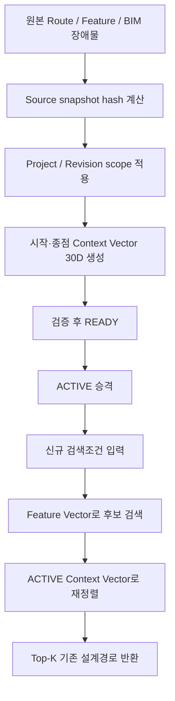
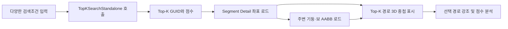

# Context Vector 생성 및 Top-K 검색 사용자 매뉴얼

## 1. 문서 목적

이 문서는 다음 두 모듈을 처음 사용하는 사용자가 데이터 준비부터 검색 결과 확인까지 직접 수행할 수 있도록 설명한다.

1. **Context Vector 생성 모듈**
   - Route 시작점과 종점 주변의 기둥·보 배치를 30차원 벡터로 생성한다.
   - 생성 결과는 PostgreSQL `TB_ROUTE_CONTEXT_VECTOR`에 저장한다.
2. **Top-K 검색 모듈**
   - 신규 Route 요청과 유사한 기존 설계경로를 검색한다.
   - 기본 Feature 검색 또는 장애물 Context를 포함한 검색을 선택할 수 있다.

본 문서의 명령은 저장소 루트인 다음 경로에서 PowerShell로 실행하는 것을 기준으로 한다.

```powershell
Set-Location D:\DINNO\DEV\AI-AutoRouting\TopKGen
```

---

## 2. 전체 사용 흐름



운영 환경에서는 다음 순서를 권장한다.

```text
RouteContextLifecycle build
    -> validate
    -> promote
    -> TopKSearchStandalone --use-obstacle-context
```

개발 확인 목적으로 Context Vector만 바로 만들 수도 있지만, 이 경우 revision 검증과 ACTIVE 승격이 자동으로 처리되지 않는다.

---

## 3. 사전 준비

### 3.1 필요 프로그램

- Windows PowerShell
- Python 3.10 이상 권장
- .NET 8 SDK 또는 .NET 8 Runtime
- PostgreSQL
- PostgreSQL `pgvector` 확장
- Python 패키지 `psycopg2-binary`

Python 패키지가 없다면 다음 명령으로 설치한다.

```powershell
python -m pip install -r Tools\requirements-context-ab.txt
```

Top-K 실행파일을 처음 준비할 때는 다음 명령으로 빌드한다.

```powershell
dotnet build TopKSearchStandalone\TopKSearchStandalone.csproj -c Release
```

빌드 결과 실행파일은 다음 위치에 생성된다.

```text
TopKSearchStandalone\bin\Release\net8.0\TopKSearchStandalone.dll
```

### 3.2 필수 원본 테이블

Vector 생성 전에 다음 데이터가 있어야 한다.

| 테이블 | 용도 | 주요 데이터 |
|---|---|---|
| `TB_ROUTE_PATH` | 기존 설계 Route 원본 | 시작/종점 좌표, Route GUID, Utility 정보 |
| `TB_ROUTE_FEATURE_VECTOR` | Top-K 1차 검색 대상 | Route GUID, 시작/종점, 30D Feature Vector |
| `TB_BIM_OBSTACLE` | Context 환경 | 기둥/보 종류와 AABB 최소·최대 좌표 |

운영 strict scope에서는 세 테이블의 `PROJECT_SCOPE_KEY`와 `MODEL_REVISION_KEY`가 같은 원본 revision을 나타내야 한다.

### 3.3 Python 도구 DB 설정

예제 파일을 복사한다.

```powershell
Copy-Item Tools\tools.settings.example.json Tools\tools.settings.json
```

`Tools\tools.settings.json`을 실제 환경에 맞게 수정한다.

```json
{
  "db": {
    "host": "localhost",
    "port": 5432,
    "database": "DDW_AI_DB",
    "user": "postgres",
    "password": "비밀번호"
  },
  "outDir": "D:\\DINNO\\DEV\\AI-AutoRouting\\TopKGen\\data\\output"
}
```

비밀번호가 포함된 설정파일은 Git에 커밋하지 않는다.

Python 도구의 DB 설정 우선순위는 다음과 같다.

1. 명령행 `--conn-str`
2. 환경변수 `TOPKGEN_CONN_STR`
3. `tools.settings.json`
4. 개별 명령행/환경변수와 기본값

개별 접속 인자를 직접 전달할 수도 있다.

```powershell
python Tools\ExtractObstacleContextVector.py `
  --host localhost --port 5432 --dbname DDW_AI_DB `
  --user postgres --password "비밀번호" status
```

---

# Part A. Context Vector 데이터 생성

## 4. Context Vector의 의미

각 기존 Route에 대해 시작점과 종점 주변 장애물 환경을 30차원으로 표현한다.

| 차원 | 의미 |
|---|---|
| 0~12 | 시작 PoC 주변 기둥·보 및 여유 공간 |
| 13~25 | 종점 PoC 주변 기둥·보 및 여유 공간 |
| 26~29 | 시작~종점 구간의 높이변화, 기둥 점유, 보 평행성, 진행방향 |

시작점과 종점에서는 두 거리 구간을 사용한다.

- `0~500mm`: PoC 바로 주변의 출구·진입 제약
- `500~1000mm`: 한 단계 바깥의 구조물과 여유 공간

장애물 중심까지의 거리가 아니라 **PoC에서 장애물 AABB 표면까지의 최단거리**를 사용한다. 따라서 길이가 긴 기둥이나 보의 중심이 멀더라도 실제 표면이 PoC에 가까우면 검색된다.

최종 30차원 값은 cosine similarity에 사용할 수 있도록 L2 정규화된다.

## 5. 권장 방식: 운영 라이프사이클로 생성

### 5.1 현재 ACTIVE 확인

```powershell
python Tools\RouteContextLifecycle.py `
  --config Tools\tools.settings.json active
```

정상 예시는 다음과 같은 정보를 반환한다.

```json
[
  {
    "project_scope_key": "DB:DDW_AI_DB",
    "model_revision_key": "snapshot:7cd7...",
    "status": "ACTIVE"
  }
]
```

아직 처음 구축하는 DB라면 빈 배열이 나올 수 있다.

### 5.2 Source scope와 Context를 한 번에 빌드

```powershell
python Tools\RouteContextLifecycle.py `
  --config Tools\tools.settings.json build `
  --project-scope-key DB:DDW_AI_DB `
  --import-batch-id IMPORT-20260714-001 `
  --source-artifact plant-model.glb `
  --source-artifact-hash <원본파일-SHA256> `
  --note "정기 Context Vector 생성"
```

각 옵션의 의미는 다음과 같다.

| 옵션 | 필수 | 설명 |
|---|---:|---|
| `--project-scope-key` | 예 | 데이터의 논리적 프로젝트 범위 |
| `--model-revision-key` | 아니요 | 생략하면 `snapshot:<계산된 SHA-256>` 자동 사용 |
| `--import-batch-id` | 아니요 | 동일 importer 실행을 식별하는 배치 ID |
| `--source-artifact` | 아니요 | GLB, Revit, CSV 등 원본 이름 |
| `--source-artifact-hash` | 아니요 | 원본 파일 checksum |
| `--parent-revision-key` | 아니요 | 이전 또는 부모 revision |
| `--note` | 아니요 | 작업 설명 |

`build`가 내부적으로 수행하는 일은 다음과 같다.

1. 필요한 migration을 멱등 실행한다.
2. 프로젝트 단위 PostgreSQL advisory lock을 획득한다.
3. `REPEATABLE READ`에서 Feature, Route, 구조 장애물 내용을 읽는다.
4. 정렬된 원본으로 deterministic SHA-256을 계산한다.
5. 세 원본 테이블에 동일한 project/revision을 적용한다.
6. Manifest 상태를 `BUILDING`으로 기록한다.
7. 모든 Feature Route의 30D Context Vector를 생성한다.
8. 벡터와 provenance를 DB에 저장한다.
9. 원본 건수, coverage, 중복, snapshot, encoder 계약을 검증한다.
10. 성공하면 `READY`, 실패하면 `FAILED`로 기록한다.

동일한 source snapshot의 READY 또는 ACTIVE revision이 이미 있고 재검증도 통과하면 전체 벡터를 다시 만들지 않고 다음 값을 반환한다.

```json
"skipped_unchanged": true
```

### 5.3 빌드 결과 검증

```powershell
python Tools\RouteContextLifecycle.py `
  --config Tools\tools.settings.json validate `
  --project-scope-key DB:DDW_AI_DB `
  --model-revision-key snapshot:<sha256>
```

`valid: true`와 모든 `checks`가 `true`인지 확인한다.

| 검사항목 | 의미 |
|---|---|
| `feature_manifest_match` | Feature 실제 건수와 Manifest 건수 일치 |
| `route_manifest_match` | Route 실제 건수와 Manifest 건수 일치 |
| `obstacle_manifest_match` | 구조 장애물 실제 건수와 Manifest 건수 일치 |
| `context_coverage_match` | 모든 Feature Route에 Context 존재 |
| `context_no_duplicates` | 동일 scope/revision/route 중복 없음 |
| `single_context_snapshot` | 하나의 장애물 snapshot만 사용 |
| `strict_scope_only` | global fallback 데이터가 섞이지 않음 |
| `encoder_contract` | encoder version/config hash 일치 |

### 5.4 READY를 ACTIVE로 승격

```powershell
python Tools\RouteContextLifecycle.py `
  --config Tools\tools.settings.json promote `
  --project-scope-key DB:DDW_AI_DB `
  --model-revision-key snapshot:<sha256> `
  --note "Top-K 운영 적용"
```

새 revision이 ACTIVE가 되면 같은 프로젝트의 기존 ACTIVE는 RETIRED로 변경된다. Top-K Context 검색에서 project/revision을 직접 지정하지 않으면 이 ACTIVE revision을 자동으로 사용한다.

### 5.5 운영 상태 점검

빠른 점검:

```powershell
python Tools\ExtractObstacleContextVector.py `
  --config Tools\tools.settings.json status
```

원본 hash를 포함한 심층 점검:

```powershell
python Tools\RouteContextLifecycle.py `
  --config Tools\tools.settings.json monitor --verify-source-hash
```

정상 조건은 다음과 같다.

```json
{
  "healthy": true,
  "issues": []
}
```

`--verify-source-hash`는 원본 전체를 다시 읽으므로 데이터가 매우 크면 정기 점검이나 배포 직후에 실행한다.

## 6. 단순 방식: Context Vector 직접 생성

라이프사이클 없이 생성 알고리즘을 확인하거나 기존 revision을 명시해 다시 생성할 때 사용한다.

### 6.1 스키마만 생성

```powershell
python Tools\ExtractObstacleContextVector.py `
  --config Tools\tools.settings.json create-schema
```

### 6.2 DB 저장 없이 계산

```powershell
python Tools\ExtractObstacleContextVector.py `
  --config Tools\tools.settings.json extract --dry-run `
  --project-scope-key DB:DDW_AI_DB `
  --model-revision-key snapshot:<sha256>
```

dry-run은 Context row를 계산하고 coverage와 shell 통계를 출력하지만 DB에 저장하지 않는다.

### 6.3 실제 저장

```powershell
python Tools\ExtractObstacleContextVector.py `
  --config Tools\tools.settings.json run-all `
  --project-scope-key DB:DDW_AI_DB `
  --model-revision-key snapshot:<sha256>
```

`--project-scope-key`와 `--model-revision-key`는 반드시 함께 지정한다. 한쪽만 지정하면 실행을 거부한다.

테스트 추적을 위해 생성 실행을 고정 UUID로 묶을 수도 있다.

```powershell
python Tools\ExtractObstacleContextVector.py `
  --config Tools\tools.settings.json run-all `
  --project-scope-key DB:DDW_AI_DB `
  --model-revision-key snapshot:<sha256> `
  --build-run-id 11111111-2222-3333-4444-555555555555
```

직접 생성 방식은 Manifest를 READY/ACTIVE로 승격하지 않는다. 운영 Top-K에서 ACTIVE 자동 선택을 사용하려면 권장 라이프사이클 방식을 사용한다.

## 7. 생성 데이터 확인 SQL

### 7.1 revision별 데이터 수

```sql
SELECT
    "PROJECT_SCOPE_KEY",
    "MODEL_REVISION_KEY",
    COUNT(*) AS context_count,
    COUNT(DISTINCT "ROUTE_PATH_GUID") AS unique_routes,
    COUNT(DISTINCT "SOURCE_SNAPSHOT_HASH") AS snapshot_count
FROM "TB_ROUTE_CONTEXT_VECTOR"
GROUP BY 1, 2
ORDER BY 1, 2;
```

### 7.2 encoder와 scope 상태

```sql
SELECT
    "SCOPE_RESOLUTION_STATUS",
    "ENCODER_VERSION",
    LEFT("ENCODER_CONFIG_HASH", 12) AS config_hash,
    COUNT(*)
FROM "TB_ROUTE_CONTEXT_VECTOR"
GROUP BY 1, 2, 3
ORDER BY 1, 2, 3;
```

운영 strict 데이터는 `SCOPE_RESOLUTION_STATUS='STRICT_COMMON_KEY'`여야 한다.

### 7.3 특정 Route의 metadata 확인

```sql
SELECT
    "ROUTE_PATH_GUID",
    "START_META_JSON",
    "END_META_JSON",
    "TIER3_META_JSON",
    "SOURCE_SNAPSHOT_HASH",
    "BUILD_RUN_ID"
FROM "TB_ROUTE_CONTEXT_VECTOR"
WHERE "PROJECT_SCOPE_KEY" = 'DB:DDW_AI_DB'
  AND "MODEL_REVISION_KEY" = 'snapshot:<sha256>'
  AND "ROUTE_PATH_GUID" = '<ROUTE_PATH_GUID>';
```

---

# Part B. Top-K 기존 설계경로 검색

## 8. Top-K 검색 원리

검색은 두 단계로 수행한다.

### 8.1 1차 후보 추출

신규 요청의 시작·종점 좌표로 endpoint-only 30D Feature query를 만든다. PostgreSQL `pgvector` cosine distance를 사용해 `TB_ROUTE_FEATURE_VECTOR`에서 후보를 가져온다.

내부 후보 수는 다음과 같다.

```text
fetchN = max(K × 30, 150)
```

### 8.2 2차 Hybrid 재정렬

Context를 사용하지 않는 기본 점수:

```text
Combined = Position × 0.50
         + Pattern  × 0.30
         + Feature  × 0.20
```

Context가 있는 후보의 점수:

```text
Combined = Position × 0.45
         + Pattern  × 0.27
         + Feature  × 0.18
         + Context  × 0.10
```

Context 검색을 요청했지만 특정 후보에 호환 Context가 없으면 `Context=0`으로 벌점을 주지 않고 그 후보만 기존 Baseline 가중치로 fallback한다.

## 9. Top-K CLI DB 접속 주의사항

`TopKSearchStandalone` 단독 CLI는 Python의 `Tools/tools.settings.json`을 읽지 않는다. 따라서 현재 운영 DB가 `DDW_AI_DB`이면 다음 DB 옵션을 명시하는 것을 권장한다.

```powershell
$dbArgs = @(
  '--host', 'localhost',
  '--port', '5432',
  '--dbname', 'DDW_AI_DB',
  '--user', 'postgres',
  '--password', '비밀번호'
)
```

이후 PowerShell splatting으로 `$dbArgs`를 재사용할 수 있다.

## 10. 검색 전 스키마 진단

```powershell
dotnet TopKSearchStandalone\bin\Release\net8.0\TopKSearchStandalone.dll `
  --check-schema @dbArgs
```

종료 코드는 다음과 같다.

- `0`: 검색 가능한 상태
- `5`: 필수 테이블, 컬럼, pgvector, 벡터 차원 등에 차단성 문제 존재

## 11. 검색 방법 1: 좌표와 조건 직접 입력

### 11.1 Baseline Top-K

```powershell
dotnet TopKSearchStandalone\bin\Release\net8.0\TopKSearchStandalone.dll `
  --process CMP `
  --equipment kscta01 `
  --utility-group UPW `
  --utility UPW_S `
  --start 12000,8500,3200 `
  --end 14500,10200,3200 `
  --k 5 `
  @dbArgs
```

### 11.2 Context Vector를 사용한 Top-K

```powershell
dotnet TopKSearchStandalone\bin\Release\net8.0\TopKSearchStandalone.dll `
  --process CMP `
  --equipment kscta01 `
  --utility-group UPW `
  --utility UPW_S `
  --start 12000,8500,3200 `
  --end 14500,10200,3200 `
  --k 5 `
  --use-obstacle-context `
  @dbArgs
```

`--use-obstacle-context`를 지정하면 다음 동작이 추가된다.

1. `TB_ROUTE_SOURCE_SCOPE_MANIFEST`에서 ACTIVE revision을 조회한다.
2. ACTIVE가 정확히 한 건인지 확인한다.
3. 신규 시작·종점 좌표의 Context Vector를 즉시 계산한다.
4. ACTIVE revision의 후보 Context와 cosine similarity를 계산한다.
5. Context 가중치 0.10을 포함해 최종 순위를 결정한다.

CLI에서는 project/revision을 직접 지정하는 옵션을 제공하지 않으므로 ACTIVE 관리가 중요하다. 고정 revision 검색이 필요하면 14장의 C# API를 사용한다.

### 11.3 선택 필터

| 옵션 | 설명 | 예시 |
|---|---|---|
| `--process` | 공정명 | `CMP` |
| `--equipment` | 장비명 | `kscta01` |
| `--utility-group` | Utility 그룹 | `UPW` |
| `--utility` | Utility | `UPW_S` |
| `--size` | 배관 구경 | `20A` |
| `--query-pattern` | 방향 패턴 힌트 | `H-R-H` |
| `--start` | 시작 좌표, mm | `12000,8500,3200` |
| `--end` | 종점 좌표, mm | `14500,10200,3200` |
| `--k` | 반환 개수 | `5` |
| `--json` | JSON 형식 출력 | 값 없음 |

필터를 지나치게 많이 지정하면 후보가 0건이 될 수 있다. 후보가 없으면 `size`, `equipment`, `process` 순서로 필터를 하나씩 완화해 확인한다.

## 12. 검색 방법 2: 기존 Route 프리셋 사용

프리셋은 `TB_ROUTE_PATH` 한 행의 공정, 장비, Utility, 시작·종점 좌표를 검색 입력으로 사용한다.

### 12.1 프리셋 목록 조회

```powershell
dotnet TopKSearchStandalone\bin\Release\net8.0\TopKSearchStandalone.dll `
  --list-presets `
  --process CMP `
  --preset-limit 20 `
  @dbArgs
```

JSON으로 받고 싶으면 `--json`을 추가한다.

### 12.2 GUID로 프리셋 실행

```powershell
dotnet TopKSearchStandalone\bin\Release\net8.0\TopKSearchStandalone.dll `
  --preset-guid <ROUTE_PATH_GUID> `
  --k 5 `
  --use-obstacle-context `
  @dbArgs
```

### 12.3 필터 결과의 N번째 프리셋 실행

```powershell
dotnet TopKSearchStandalone\bin\Release\net8.0\TopKSearchStandalone.dll `
  --preset-rank 1 `
  --process CMP `
  --k 5 `
  --use-obstacle-context `
  @dbArgs
```

`--preset-rank`는 1부터 시작한다. 개별 `--start`, `--end`, `--utility` 등을 함께 지정하면 해당 값이 프리셋 값을 덮어쓴다.

## 13. 검색 결과 읽는 방법

각 `SearchResult`의 주요 필드는 다음과 같다.

| 필드 | 설명 |
|---|---|
| `Rank` | 최종 순위, 1부터 시작 |
| `RoutePathGuid` | 기존 Route 식별자 |
| `DirectionPattern` | 기존 경로 방향 패턴 |
| `TotalLengthMm` | 기존 경로 총 길이 |
| `ScorePosition` | 신규 요청과 후보의 상대위치 유사도 |
| `ScorePattern` | 방향 패턴 유사도 |
| `ScoreVector` | 기존 30D Feature cosine 유사도 |
| `ScoreContext` | 장애물 Context cosine 유사도 |
| `SimilarityScore` | 가중합 최종점수 |

CLI의 `--json` 출력 `meta`에서는 다음 항목을 확인한다.

| Meta 항목 | 정상 판단 기준 |
|---|---|
| `used_obstacle_context` | Context 검색이면 `true` |
| `context_coverage` | 운영 권장 `1.0`, 최소 gate는 환경 정책에 따름 |
| `context_fallback_candidates` | 운영 strict 완전색인이면 `0` |
| `rerank_weight_profile` | `context-v3:0.45/0.27/0.18/0.10` |

CLI의 현재 JSON 형식은 상세 provenance 필드를 출력하지 않는다. 다만 일반 텍스트 출력의
`필터` 항목에는 자동 선택된 `project_scope_key`와 `model_revision_key`가 표시된다. 다음 상세
정보가 필요한 프로그램은 14장의 C# API가 반환하는 `SearchMeta`를 사용한다.

| C# `SearchMeta` 항목 | 정상 판단 기준 |
|---|---|
| `ContextScopeStatus` | `STRICT_COMMON_KEY` |
| `ContextProjectScopeKey` | 기대한 프로젝트와 일치 |
| `ContextModelRevisionKey` | ACTIVE revision과 일치 |
| `ContextProvenanceConsistent` | `true` |
| `ContextProvenanceIssue` | 빈 문자열 |
| `ContextEncoderVersion` | 현재 `topkgen-v3` |

JSON 출력 예시 명령:

```powershell
dotnet TopKSearchStandalone\bin\Release\net8.0\TopKSearchStandalone.dll `
  --preset-rank 1 --process CMP --k 5 `
  --use-obstacle-context --json `
  @dbArgs
```

파일로 보관하려면 PowerShell의 `Out-File`을 사용할 수 있다.

```powershell
dotnet TopKSearchStandalone\bin\Release\net8.0\TopKSearchStandalone.dll `
  --preset-rank 1 --process CMP --k 5 `
  --use-obstacle-context --json `
  @dbArgs | Out-File data\output\topk_result.json -Encoding utf8
```

## 14. C# 라이브러리에서 검색

```csharp
using RoutingAI.Standalone;

var db = new DbConfig(
    Host: "localhost",
    Port: 5432,
    Database: "DDW_AI_DB",
    User: "postgres",
    Password: "비밀번호");

var (results, meta) = await TopKSearchStandalone.SearchAsync(
    db: db,
    processName: "CMP",
    equipmentName: "kscta01",
    utilityGroup: "UPW",
    utility: "UPW_S",
    startXyz: (12000, 8500, 3200),
    endXyz: (14500, 10200, 3200),
    k: 5,
    size: "20A",
    queryPattern: "H-R-H",
    useObstacleContext: true);

Console.WriteLine($"Context coverage: {meta.ContextCoverage:P1}");
Console.WriteLine($"Scope: {meta.ContextProjectScopeKey}");
Console.WriteLine($"Revision: {meta.ContextModelRevisionKey}");

foreach (var result in results)
{
    Console.WriteLine(
        $"#{result.Rank} GUID={result.RoutePathGuid} " +
        $"score={result.SimilarityScore:F4} ctx={result.ScoreContext:F4}");
}
```

scope를 생략하면 ACTIVE를 자동 선택한다. 특정 revision을 고정하려면 다음 인자를 함께 전달한다.

```csharp
projectScopeKey: "DB:DDW_AI_DB",
modelRevisionKey: "snapshot:<sha256>"
```

두 값 중 하나만 전달하면 `ArgumentException`이 발생한다.

진단 목적으로만 legacy global Context를 허용하려면 다음 값을 사용한다.

```csharp
allowGlobalContextFallback: true
```

운영 코드에서는 잘못된 revision 사용을 숨길 수 있으므로 global fallback을 권장하지 않는다.

---

## 15. 장애 대응

### 15.1 `No ACTIVE context revision`

원인:

- READY 데이터는 만들었지만 promote하지 않았다.
- Manifest에 ACTIVE가 없다.

조치:

```powershell
python Tools\RouteContextLifecycle.py `
  --config Tools\tools.settings.json active

python Tools\RouteContextLifecycle.py `
  --config Tools\tools.settings.json promote `
  --project-scope-key DB:DDW_AI_DB `
  --model-revision-key snapshot:<sha256>
```

### 15.2 ACTIVE가 복수라는 오류

정상 migration 상태에서는 프로젝트별 ACTIVE partial unique index가 복수를 막는다. 여러 project의 ACTIVE가 있고 CLI가 project를 특정하지 못하는 구성이라면 사용 범위를 하나로 정리하거나 C# API에서 project/revision을 명시한다.

### 15.3 Context coverage가 100%보다 낮음

가능 원인:

- Feature를 다시 생성한 후 Context를 재생성하지 않았다.
- 서로 다른 revision을 조회했다.
- 일부 Feature Route의 좌표가 NULL 또는 유효하지 않다.

조치:

```powershell
python Tools\RouteContextLifecycle.py `
  --config Tools\tools.settings.json monitor --verify-source-hash

python Tools\RouteContextLifecycle.py `
  --config Tools\tools.settings.json build `
  --project-scope-key DB:DDW_AI_DB
```

### 15.4 `projectScopeKey and modelRevisionKey must be provided together`

두 값을 모두 지정하거나 모두 생략한다. 운영 권장값은 둘 다 생략해 ACTIVE를 자동 선택하는 것이다.

### 15.5 `pgvector` 또는 `vector(30)` 오류

먼저 스키마 진단을 실행한다.

```powershell
dotnet TopKSearchStandalone\bin\Release\net8.0\TopKSearchStandalone.dll `
  --check-schema @dbArgs
```

필요하면 Context migration을 다시 적용한다.

```powershell
python Tools\ExtractObstacleContextVector.py `
  --config Tools\tools.settings.json create-schema
```

### 15.6 검색 후보가 0건

다음을 순서대로 확인한다.

1. DB 이름이 `DDW_AI_DB`로 정확한지 확인한다.
2. `--check-schema`의 Feature row 수를 확인한다.
3. `--size`를 제거한다.
4. `--equipment` 또는 `--process` 필터를 완화한다.
5. `--list-presets`로 실제 저장된 문자열 값을 확인한다.

### 15.7 원본 hash drift

`monitor --verify-source-hash`에서 `SOURCE_HASH_DRIFT`가 나오면 ACTIVE 승격 후 원본 Route/Feature/BIM 데이터가 바뀐 것이다. 기존 ACTIVE Context를 계속 사용하지 말고 새 revision을 build, validate, promote한다.

---

## 16. Revision 복구와 정리

이전 revision으로 복구:

```powershell
python Tools\RouteContextLifecycle.py `
  --config Tools\tools.settings.json rollback `
  --project-scope-key DB:DDW_AI_DB `
  --model-revision-key <이전-revision> `
  --note "운영 rollback"
```

오래된 revision 삭제 계획 확인:

```powershell
python Tools\RouteContextLifecycle.py `
  --config Tools\tools.settings.json cleanup `
  --project-scope-key DB:DDW_AI_DB --keep 2
```

기본은 dry-run이다. 결과의 `delete_revisions`와 `protected_revisions`를 확인한 뒤 실제 삭제가 필요할 때만 `--execute`를 추가한다.

```powershell
python Tools\RouteContextLifecycle.py `
  --config Tools\tools.settings.json cleanup `
  --project-scope-key DB:DDW_AI_DB --keep 2 --execute
```

---

## 17. 운영 체크리스트

### Vector 생성 전

- [ ] Route, Feature, BIM 장애물 import가 완료되었다.
- [ ] Python DB 설정이 올바르다.
- [ ] 원본 artifact와 checksum을 기록했다.
- [ ] 운영 중인 build와 겹치지 않는 작업 시간인지 확인했다.

### ACTIVE 승격 전

- [ ] `validate` 결과가 `valid=true`이다.
- [ ] Context coverage가 100%이다.
- [ ] `strict_scope_only=true`이다.
- [ ] `encoder_contract=true`이다.
- [ ] 새 revision으로 Top-K smoke test를 수행했다.

### Top-K 검색 시

- [ ] `--dbname DDW_AI_DB`를 명시했다.
- [ ] Context 검색이면 `--use-obstacle-context`를 지정했다.
- [ ] 결과 meta의 scope/revision이 기대값과 일치한다.
- [ ] `context_provenance_consistent=true`이다.
- [ ] 실제 설계 재사용 전 후보 Route 형상과 Utility 조건을 검토했다.

---

## 18. 관련 소스

- `Tools/ExtractObstacleContextVector.py`: Context 데이터 추출/저장 CLI
- `Tools/context_vector_encoder.py`: 500/1000mm AABB 기반 공용 30D 인코더
- `Tools/RouteContextLifecycle.py`: build/validate/promote/rollback/monitor/cleanup
- `Tools/sql/create_route_context_vector_table.sql`: Context migration
- `TopKSearchStandalone/TopKSearchStandalone.cs`: Top-K API와 CLI
- `Docs/ContextVector_Phase15_Operational_Lifecycle_Complete.md`: 운영 라이프사이클 개발 결과

---

# Part C. TopK.3DViewer 사용 설명

## 19. 3D Viewer의 역할

`TopK.3DViewer`는 Part B의 Top-K 검색을 화면에서 실행하고, 검색된 기존 설계경로의 실제
상세 좌표를 3차원으로 비교하는 WPF 프로그램이다.



3D Viewer는 Top-K 알고리즘을 별도로 다시 구현하지 않는다. 현재 프로젝트의
`TopKSearchStandalone.SearchAsync`를 호출하므로 CLI, C# API와 같은 Feature/Context 검색
알고리즘과 ACTIVE revision 정책을 사용한다.

## 20. 프로젝트 위치와 빌드

### 20.1 프로젝트 파일

```text
TopK.3DViewer/
├─ TopK.3DViewer.slnx
├─ TopK.3DViewer.csproj
├─ App.xaml
├─ MainWindow.xaml
├─ MainWindow.xaml.cs
├─ Models/ViewerModels.cs
├─ Services/ViewerDatabaseService.cs
├─ viewer.settings.example.json
└─ README.md
```

### 20.2 Release 빌드

저장소 루트에서 실행한다.

```powershell
Set-Location D:\DINNO\DEV\AI-AutoRouting\TopKGen

dotnet build TopK.3DViewer\TopK.3DViewer.slnx -c Release
```

빌드 결과:

```text
TopK.3DViewer\bin\Release\net8.0-windows\TopK.3DViewer.exe
TopK.3DViewer\bin\Release\net8.0-windows\TopK.3DViewer.dll
```

현재 `HelixToolkit.Wpf 2.25.0`에서 `NU1701` 호환성 경고가 나올 수 있다. 현재 빌드는
성공하며 오류는 아니지만, 향후 HelixToolkit 패키지를 변경할 때 3D 화면을 다시 검증한다.

## 21. 3D Viewer 설정

### 21.1 설정파일 준비

예제 설정을 복사한다.

```powershell
Copy-Item `
  TopK.3DViewer\viewer.settings.example.json `
  TopK.3DViewer\viewer.settings.json
```

`viewer.settings.json`을 실제 환경에 맞게 수정한다.

```json
{
  "host": "localhost",
  "port": 5432,
  "database": "DDW_AI_DB",
  "user": "postgres",
  "password": "비밀번호",
  "defaultK": 5,
  "useObstacleContext": true,
  "obstacleLimit": 2500
}
```

| 항목 | 설명 |
|---|---|
| `host` | PostgreSQL 서버 주소 |
| `port` | PostgreSQL 포트, 일반적으로 5432 |
| `database` | Route/Feature/Context가 저장된 DB |
| `user` | 읽기 권한이 있는 DB 사용자 |
| `password` | DB 비밀번호 |
| `defaultK` | 화면 시작 시 기본 검색 결과 수 |
| `useObstacleContext` | 화면 시작 시 Context 검색 체크 여부 |
| `obstacleLimit` | 3D에 표시할 주변 구조 장애물 최대 개수 |

실제 비밀번호가 들어 있는 `viewer.settings.json`은 `.gitignore`에 등록되어 있다. 설정파일이
없어도 프로그램은 기본 접속값으로 시작하며 화면에서 직접 수정할 수 있다.

### 21.2 설정파일 검색 위치

프로그램은 다음 순서로 `viewer.settings.json`을 찾는다.

1. 실행파일과 같은 디렉터리
2. 현재 작업경로의 `TopK.3DViewer` 디렉터리
3. 현재 작업경로

## 22. 프로그램 실행

DLL 실행:

```powershell
dotnet TopK.3DViewer\bin\Release\net8.0-windows\TopK.3DViewer.dll
```

또는 EXE 실행:

```powershell
TopK.3DViewer\bin\Release\net8.0-windows\TopK.3DViewer.exe
```

## 23. 화면 구성

3D Viewer 화면은 크게 세 영역으로 구성된다.

```text
┌──────────────────┬─────────────────────────────────┬──────────────────┐
│ DB 및 검색조건   │                                 │ Top-K 결과 목록  │
│                  │            3D 화면              │                  │
│ Route 프리셋     │                                 ├──────────────────┤
│ 시작/종점, K     │                                 │ 선택 경로 상세   │
└──────────────────┴─────────────────────────────────┴──────────────────┘
```

### 23.1 좌측 영역

- PostgreSQL Host, Port, Database, User, Password
- 기존 Route 프리셋
- 공정
- 장비
- Utility Group
- Utility
- Size
- 방향 Pattern
- 시작점 X/Y/Z
- 종점 X/Y/Z
- K
- 장애물 Context Vector 사용 여부
- 검색 후 자동 카메라 맞춤 여부

### 23.2 중앙 3D 영역

- Top-K 기존 설계경로
- 신규 요청 시작점과 종점
- 선택적으로 주변 기둥·보 AABB
- 좌표축과 기준 grid
- View Cube와 카메라

### 23.3 우측 영역

- Top-K 순위와 최종점수
- Context 점수
- 장비, Utility, Size
- 선택 경로 GUID와 전체 점수 구성
- 실제 경로점 개수와 기존 경로 길이

### 23.4 상단 도구영역

| 기능 | 설명 |
|---|---|
| `주변 구조 BIM` | 검색경로 주변 1,000mm 범위의 기둥·보 표시 |
| `Top-K 전체 표시` | 전체 후보 또는 선택 후보만 표시 |
| `카메라 맞춤` | 표시 중인 경로에 카메라 자동 맞춤 |
| `초기화` | 검색 결과와 3D 객체 제거 |

## 24. 기본 사용 순서

### 24.1 DB 연결 및 검색조건 로드

1. 좌측 상단에서 PostgreSQL 접속정보를 확인한다.
2. `DB 연결 및 조건 로드` 버튼을 누른다.
3. 하단 상태표시줄에서 연결 성공 메시지를 확인한다.
4. 공정·장비·Utility·Size 목록과 Route 프리셋이 로드됐는지 확인한다.

내부적으로 다음 테이블의 distinct 값을 읽는다.

```text
TB_ROUTE_FEATURE_VECTOR
  - PROCESS_NAME
  - EQUIPMENT_NAME
  - UTILITY_GROUP
  - UTILITY
  - SIZE
```

프리셋은 `TB_ROUTE_PATH`에서 최대 200건을 읽는다.

### 24.2 검색조건 직접 입력

다음 값을 입력하거나 선택한다.

| 조건 | 필수 여부 | 설명 |
|---|---:|---|
| 공정 | 선택 | 일치하는 Feature 후보만 검색 |
| 장비 | 선택 | 기존 설계 장비 필터 |
| Utility Group | 선택 | Utility 상위 그룹 |
| Utility | 선택 | 실제 배관 Utility |
| Size | 선택 | 배관 구경 |
| 방향 Pattern | 선택 | `H-R-H` 등의 패턴 힌트 |
| 시작 XYZ | 필수 | 신규 Route 시작 PoC, mm |
| 종점 XYZ | 필수 | 신규 Route 종점 PoC, mm |
| K | 필수 | 1~50 범위의 결과 개수 |

ComboBox는 직접 입력할 수 있다. DB 목록에 없는 문자열을 입력하면 후보가 0건일 수 있으므로
가능하면 `DB 연결 및 조건 로드` 후 목록에서 선택한다.

### 24.3 기존 Route 프리셋 사용

`기존 Route 프리셋`에서 한 항목을 선택하면 다음 항목이 자동 입력된다.

- 공정
- 장비
- Utility Group
- Utility
- Size
- 시작점 XYZ
- 종점 XYZ

프리셋을 선택하면 좌표·필터 입력뿐 아니라 해당 기존 Route의 실제 상세 배관과 주변 장애물이
중앙 3D 화면에 즉시 표시된다. 프리셋은 기존 Route를 query로 사용해 유사 경로와 비교하거나
검색 기능을 smoke test할 때 유용하며, 선택 후 좌표나 필터를 직접 수정할 수도 있다.

### 24.4 Baseline과 Context 선택

`장애물 Context Vector 재정렬`을 해제하면 Context 점수를 제외하고, JSON/UI에서 0보다 크게
설정된 Position, Pattern, Feature 항목만 균등 배분한다. 세 항목이 모두 활성이라면 다음과 같다.

```text
Position 0.3333 + Pattern 0.3333 + Feature 0.3333
```

체크하면 ACTIVE Context Vector를 포함한다. 네 항목이 모두 활성이라면 다음과 같다.

```text
Position 0.25 + Pattern 0.25 + Feature 0.25 + Context 0.25
```

Context 검색에서는 Manifest의 ACTIVE revision을 자동 선택한다. ACTIVE가 없거나 여러 건이면
잘못된 revision을 임의로 선택하지 않고 오류 대화상자를 표시한다.

### 24.5 유사도 가중치 조정

Viewer의 `유사도 가중치 (자동 정규화)` 영역에서 다음 네 항목을 조정할 수 있다.

| 입력 | 의미 | 기본값 |
|---|---|---:|
| Position | 시작~종점 상대변위 유사도 | 25 |
| Pattern | 방향 Pattern 편집거리 유사도 | 25 |
| Feature | 30D Feature Vector cosine 유사도 | 25 |
| Context | 장애물 Context Vector cosine 유사도 | 25 |

`0`은 해당 점수를 제외한다는 뜻이고, 0보다 큰 항목은 입력한 값의 크기와 무관하게 모두
`100/N`으로 균등 배분한다. 예를 들어 `Position=70, Pattern=0, Feature=0, Context=30`이면
실제 저장·적용값은 `50/0/0/50`이다. `모두 사용 (25/25/25/25)` 버튼은 네 항목을 모두
활성화한다. Similarity는 별도 가중치가 아니라 이 네 점수의 가중합 결과이다.

초기값은 `viewer.settings.json`의 `weightPosition`, `weightPattern`, `weightVector`,
`weightContext`에서 설정한다. UI에서 값을 수정한 뒤 다른 입력으로 포커스를 옮기거나 검색을
실행하면 활성 항목을 균등 배분한 최종 값이 같은 JSON 파일에 자동 저장된다.

`Pattern 미입력 시 해당 가중치 자동 재배분`을 체크하면 방향 Pattern 입력이 비어 있을 때
Pattern 점수를 0으로 벌점 처리하지 않고 Pattern 가중치 자체를 제외한다. 네 항목이 모두
활성인 기본값에서 Context를 사용하면 실제 적용 비율은 다음과 같다.

```text
Position 33.3% + Pattern 0.0% + Feature 33.3% + Context 33.3%
```

Context 체크를 해제하면 Context 가중치도 제외하고 나머지 활성 가중치만 다시 균등 배분한다.
우측 결과 요약과 선택 상세의 `Weight Profile`에서 실제 적용값을 확인한다.

### 24.6 검색 실행

`Top-K 검색 및 3D 로드` 버튼을 누른다.

프로그램은 다음 순서로 처리한다.

1. 좌표와 K 입력값 검증
2. `TopKSearchStandalone.SearchAsync` 호출
3. 요청 K보다 넓은 검색 pool의 GUID와 점수 반환
4. 결과 GUID의 상세 경로점을 일괄 로드
5. 실제 상세경로 우선으로 K개를 선정하고 부족분은 메타데이터 경로로 재구성
6. Top-K 결과표 갱신
7. 시작점·종점 marker 표시
8. 모든 Top-K 경로 3D 렌더링
9. 첫 번째 결과 자동 선택
10. Context scope와 coverage를 상태표시줄에 출력
11. 자동 카메라 맞춤

## 25. 3D 경로 데이터 로딩

Viewer는 DB schema 차이를 고려해 다음 순서로 경로점을 읽는다.

### 25.1 신형 direct schema

```text
TB_ROUTE_SEGMENTS.ROUTE_PATH_GUID
    -> TB_ROUTE_SEGMENT_DETAIL.SEGMENT_GUID
```

`TB_ROUTE_SEGMENTS.ORDER`, `TB_ROUTE_SEGMENT_DETAIL.ORDER` 순서로 실제 polyline을 조립한다.

### 25.2 구형 map schema

```text
TB_ROUTE_PATH.ROUTE_PATH_ID
    -> TB_ROUTE_PATH_SEGMENT_MAP.ROUTE_PATH_ID
    -> TB_ROUTE_SEGMENT_DETAIL.SEGMENT_GUID
```

### 25.3 상세점 fallback

두 schema에서 상세점을 읽지 못하면 `TB_ROUTE_PATH`의 다음 좌표로 직선을 표시한다.

```text
SOURCE_POSX/Y/Z -> TARGET_POSX/Y/Z
```

따라서 상세 segment 테이블이 없는 DB에서도 검색 결과의 시작~종점 관계는 확인할 수 있다.

### 25.4 Feature Vector GUID 미연결 fallback

운영 중 원본 Route 테이블이 교체되고 Feature Vector가 이전 snapshot을 유지하면 검색 GUID가
`TB_ROUTE_PATH`/`TB_ROUTE_SEGMENTS`에 존재하지 않을 수 있다. Viewer는 이런 후보 때문에
화면이 비지 않도록 Feature Vector의 시작·종점과 방향 분류를 이용해 직교 polyline을
재구성한다. 우측 결과표의 `3D` 컬럼과 상세의 `Geometry Source`에서 다음을 구분한다.

```text
실제   : DB 상세경로를 그대로 표시
재구성 : 원본 GUID가 없어 Feature 메타데이터로 표시
```

정확한 원본 굴곡 비교가 필요하면 Feature/Context Vector를 현재 `TB_ROUTE_PATH` snapshot으로
재생성하여 GUID 계보를 일치시켜야 한다.

## 26. 3D 표시 의미

### 26.1 색상

| 화면 객체 | 의미 |
|---|---|
| 녹색 구 | 신규 검색 시작점 |
| 주황색 구 | 신규 검색 종점 |
| 흰색 굵은 선 | 현재 선택한 Top-K 경로 |
| 파랑·녹색·주황 등 | 나머지 Top-K 경로, 순위별 색상 |
| 회색 박스 | 기둥 AABB |
| 붉은 박스 | 보 AABB |

Top-K 경로의 선 두께는 상위 순위일수록 상대적으로 굵게 표시된다. 사용자가 결과표의 다른
행을 선택하면 해당 경로는 흰색 원통형 3D 파이프 체인으로 강조되고, 나머지 후보는 비교용
색상 선으로 유지된다. 카메라와 바닥 Grid도 선택 경로의 실제 플랜트 좌표 범위로 이동한다.

### 26.2 마우스 조작

| 조작 | 기능 |
|---|---|
| 마우스 오른쪽 버튼 드래그 | 3D 회전 |
| 마우스 가운데 버튼 드래그 | 화면 이동 |
| 마우스 휠 | 확대·축소 |
| View Cube 클릭 | 표준 시점 변경 |
| `카메라 맞춤` | 표시 경로 전체가 보이도록 조정 |

### 26.3 전체 경로와 선택 경로

- `Top-K 전체 표시` 체크: 검색된 모든 경로를 함께 비교한다.
- 체크 해제: 우측에서 선택한 경로 하나만 표시한다.

경로가 겹쳐 구분하기 어렵거나 상세 굴곡을 확인할 때 선택 경로 모드를 사용한다.

## 27. 주변 구조 BIM 표시

`선택 경로 주변 장애물`은 기본으로 체크되어 있다. 검색 직후 또는 우측 Top-K 결과 행을
선택할 때 해당 경로의 AABB를 계산하고, 그 범위에서 1,000mm margin과 겹치는 다음 장애물을
자동으로 다시 읽는다.

```text
COLUMN_ARCHITECTURE
COLUMN_STRUCTURE
BEAM_ARCHITECTURE
BEAM_STRUCTURE
```

전체 BIM 30만 건을 모두 화면에 올리지 않고 선택 경로 주변만 읽는다. 장애물은 얇은 선만
그리지 않고, 유형별 반투명 3D 솔리드와 외곽선을 함께 표시한다. 실제 표시 상한은
`viewer.settings.json`의 `obstacleLimit`으로 제한한다.

장애물이 잘려 보이면 다음 값을 적절히 높일 수 있다.

```json
"obstacleLimit": 5000
```

값을 과도하게 높이면 DB 조회와 WPF 렌더링 시간이 증가하므로 먼저 2,500~5,000 범위에서
확인한다.

## 28. Top-K 결과 해석

우측 결과표의 필드는 다음과 같다.

| 항목 | 설명 |
|---|---|
| `#` | 최종 순위 |
| `Score` | 최종 Hybrid 유사도 |
| `Ctx` | 장애물 Context cosine 유사도 |
| `장비` | 기존 후보의 장비명 |
| `Utility` | 기존 후보 Utility |
| `Size` | 기존 후보 배관 구경 |

행을 선택하면 하단 상세영역에 다음 값이 표시된다.

- Route GUID
- 공정, 장비, Utility Group, Utility, Size
- 방향 Pattern
- 기존 경로 길이와 Step 수
- DB에서 읽은 실제 3D Point 수
- Position, Pattern, Feature, Context 개별점수
- 최종 Similarity
- pgvector Cosine Distance
- 후보 시작·종점 좌표

Context 점수만 높다고 무조건 좋은 설계는 아니다. 최종 재사용 후보를 선택할 때는 다음을
함께 검토한다.

1. Position과 Context가 모두 충분히 높은지
2. Utility와 Size가 실제 요청에 맞는지
3. 방향 Pattern과 굴곡 형태가 적용 가능한지
4. 3D 경로가 주변 기둥·보와 충돌하지 않는지
5. 상세점이 아닌 직선 fallback으로 표시된 후보인지

## 29. 상태표시줄 확인

검색 완료 후 하단 상태표시줄에는 다음 정보가 표시된다.

```text
검색 결과 수
검색 소요시간
Context coverage
Context fallback 후보 수
주변 구조 BIM 수
```

상단에는 검색에서 자동 선택한 다음 값이 표시된다.

```text
PROJECT_SCOPE_KEY
MODEL_REVISION_KEY
```

운영 Context 검색의 권장 상태:

```text
Context coverage = 100%
fallback = 0
scope/revision = 현재 승인한 ACTIVE
```

## 30. 3D Viewer 오류 대응

### 30.1 DB 연결 실패

확인 순서:

1. Host와 Port
2. Database가 `DDW_AI_DB`인지
3. User와 Password
4. PostgreSQL 서비스 실행 여부
5. 방화벽과 원격접속 설정

### 30.2 조건 목록이 비어 있음

`TB_ROUTE_FEATURE_VECTOR`에 데이터가 있는지 확인한다.

```sql
SELECT COUNT(*) FROM "TB_ROUTE_FEATURE_VECTOR";
```

### 30.3 프리셋이 비어 있음

`TB_ROUTE_PATH`와 좌표를 확인한다.

```sql
SELECT COUNT(*)
FROM "TB_ROUTE_PATH"
WHERE "ROUTE_PATH_GUID" IS NOT NULL
  AND "SOURCE_POSX" IS NOT NULL
  AND "TARGET_POSX" IS NOT NULL;
```

#### 30.3.1 `SOURCE_OWNER_NAME` 또는 장비명 컬럼 오류

DB 버전에 따라 `TB_ROUTE_PATH`의 장비명 컬럼이 다를 수 있다. 현재 DDW_AI_DB는
`EQUIPMENT_NAME`을 사용한다. Viewer는 접속 시 `information_schema.columns`를 읽고 다음
우선순위로 실제 존재하는 컬럼을 자동 선택한다.

```text
장비명       : EQUIPMENT_NAME → SOURCE_OWNER_NAME → EQUIPMENT_TAG
공정명       : PROCESS_NAME → PROCESS
Utility      : SOURCE_UTILITY → UTILITY
Size         : SOURCE_SIZE → SIZE
```

DB의 실제 컬럼은 다음 SQL로 확인한다.

```sql
SELECT column_name, data_type
FROM information_schema.columns
WHERE table_schema = 'public'
  AND table_name = 'TB_ROUTE_PATH'
ORDER BY ordinal_position;
```

구버전 Viewer에서 `42703: "SOURCE_OWNER_NAME" 이름의 칼럼은 없습니다`가 표시되면 최신
소스로 다시 빌드한다. 테이블을 변경하거나 `SOURCE_OWNER_NAME` 컬럼을 임의로 추가할 필요는
없다.

### 30.4 `No ACTIVE context revision`

Part A의 `build → validate → promote` 절차를 수행한다.

```powershell
python Tools\RouteContextLifecycle.py `
  --config Tools\tools.settings.json active
```

Context 없이 화면 동작만 확인하려면 `장애물 Context Vector 재정렬` 체크를 해제하고 Baseline
검색을 수행할 수 있다.

### 30.5 검색 결과가 없음

1. Size를 비운다.
2. 장비 필터를 비운다.
3. 공정 필터를 비운다.
4. 실제 DB 문자열과 대소문자·공백이 같은지 확인한다.
5. 기존 Route 프리셋으로 smoke test한다.

### 30.6 경로가 직선으로만 표시됨

Top-K 검색은 성공했지만 segment detail을 읽지 못한 상태이다. 다음 테이블의 GUID 연결을
확인한다.

```text
TB_ROUTE_SEGMENTS
TB_ROUTE_SEGMENT_DETAIL
TB_ROUTE_PATH_SEGMENT_MAP
```

Viewer는 이 경우 의도적으로 `TB_ROUTE_PATH` 시작~종점 직선을 표시한다.

### 30.7 3D 객체가 보이지 않음

1. `카메라 맞춤`을 누른다.
2. 우측 결과가 존재하는지 확인한다.
3. `Top-K 전체 표시`를 체크한다.
4. 결과 행을 선택한다.
5. 좌표 단위가 mm인지 확인한다.

### 30.8 주변 BIM이 표시되지 않음

1. `주변 구조 BIM`을 체크한다.
2. `TB_BIM_OBSTACLE`에 기둥·보가 있는지 확인한다.
3. 장애물 AABB와 검색경로가 같은 좌표계인지 확인한다.
4. `obstacleLimit`을 확인한다.

## 31. 3D Viewer 운영 체크리스트

### 실행 전

- [ ] `TopK.3DViewer.slnx` Release 빌드가 성공했다.
- [ ] `viewer.settings.json` DB 정보가 올바르다.
- [ ] Feature와 Context 데이터가 생성되어 있다.
- [ ] Context 검색이면 ACTIVE revision이 있다.

### 검색 후

- [ ] Top-K 결과가 1건 이상 표시된다.
- [ ] 시작점과 종점 marker가 올바른 위치에 있다.
- [ ] 선택 경로가 흰색으로 강조된다.
- [ ] Context coverage가 기대값과 일치한다.
- [ ] ACTIVE project/revision이 승인값과 일치한다.
- [ ] 상세 경로점 수가 2개보다 많은지 확인한다.
- [ ] 필요하면 주변 구조 BIM과 간섭 여부를 확인한다.

### 결과 활용 전

- [ ] Utility와 Size를 확인했다.
- [ ] 경로 Pattern과 길이를 확인했다.
- [ ] 직선 fallback이 아닌 실제 상세경로인지 확인했다.
- [ ] 실제 신규 배치공간에서 충돌 가능성을 검토했다.

## 32. 3D Viewer 관련 소스

- `TopK.3DViewer/MainWindow.xaml`: 3영역 화면과 검색조건 UI
- `TopK.3DViewer/MainWindow.xaml.cs`: 검색 실행, 결과 선택, 3D 렌더링
- `TopK.3DViewer/Services/ViewerDatabaseService.cs`: 필터·프리셋·경로점·BIM 조회
- `TopK.3DViewer/Models/ViewerModels.cs`: 설정과 화면 모델
- `TopK.3DViewer/viewer.settings.example.json`: 설정 예제
- `TopK.3DViewer/README.md`: 프로젝트 단독 빠른 시작 문서

---

# Part D. Utility 배관 그룹 Vector와 Top-K

## 33. 개별 배관 검색과 그룹 검색의 차이

| 검색 단위 | Query | 권장 용도 |
|---|---|---|
| 개별 배관 | 한 Route의 시작/종점·Utility·Size | 신규 배관 한 줄의 유사 경로 검색 |
| Utility 배관 그룹 | 장비 + Utility Group + Utility의 복수 Route | 장비 주변 동일 계통 배관 묶음의 재사용 설계 검색 |

그룹 검색은 Size를 그룹 키에 포함하지 않는다. 동일 Utility에 여러 Size가 섞일 수 있으므로
검색 시 `PreferExact`, `ExactOnly`, `Ignore` 정책으로 멤버 Pair의 Size 호환성을 제어한다.

## 34. 그룹 테이블 Migration

신규 테이블은 기존 테이블을 변경하지 않는 additive migration이다.

```powershell
python Tools\MigrateUtilityPipeGroupSchema.py apply `
  --config Tools\tools.settings.json

python Tools\MigrateUtilityPipeGroupSchema.py verify `
  --config Tools\tools.settings.json
```

생성되는 테이블:

- `TB_ROUTE_UTILITY_GROUP_VECTOR`: 그룹 대표 Feature/Context와 배치 통계
- `TB_ROUTE_UTILITY_GROUP_MEMBER`: 그룹에 포함된 개별 Route와 Size·좌표·provenance

Rollback은 데이터 손실 작업이므로 자동 CLI에서 제공하지 않는다. 운영 승인 후 다음 SQL을
검토하고 별도로 실행한다.

```text
Tools/sql/drop_route_utility_group_vector_tables.sql
```

## 35. 그룹 Vector 생성

ACTIVE Context revision을 기준으로 다음 순서로 실행한다.

```powershell
python Tools\BuildUtilityPipeGroupVectors.py create-schema `
  --config Tools\tools.settings.json

python Tools\BuildUtilityPipeGroupVectors.py build `
  --config Tools\tools.settings.json --scope-mode active --min-members 2

python Tools\BuildUtilityPipeGroupVectors.py validate `
  --config Tools\tools.settings.json --scope-mode active

python Tools\BuildUtilityPipeGroupVectors.py status `
  --config Tools\tools.settings.json --scope-mode active
```

`SOURCE_HASH`가 같은 READY 그룹은 다시 생성하지 않는다. Route 멤버나 개별 Feature/Context가
변경된 그룹만 갱신하며 사라진 그룹은 `STALE`로 전환한다.

정상 데이터 기준 기대값:

```text
READY 그룹       : 106
그룹 멤버        : 747
Feature coverage : 100%
Context coverage : 100%
상세경로 coverage: 100%
```

## 36. 그룹 검색 CLI

그룹 프리셋 확인:

```powershell
dotnet run --project TopKSearchStandalone\TopKSearchStandalone.csproj -c Release -- `
  --list-group-presets --utility-group VACCUM --utility FORELINE `
  --dbname DDW_AI_DB
```

그룹 ID 검색:

```powershell
dotnet run --project TopKSearchStandalone\TopKSearchStandalone.csproj -c Release -- `
  --group-query-id <GROUP_VECTOR_ID> --group-size-mode PreferExact --k 5 `
  --dbname DDW_AI_DB
```

장비 조건으로 Query 그룹 자동 선택:

```powershell
dotnet run --project TopKSearchStandalone\TopKSearchStandalone.csproj -c Release -- `
  --group-search --process CVD --equipment TNMHJ04 `
  --utility-group VACCUM --utility FORELINE --k 5 `
  --dbname DDW_AI_DB
```

## 37. 그룹 점수 해석

개별 멤버 Pair는 Position, Pattern, Feature, Context의 가중합에 Size 점수를 곱한다.

```text
PairAdjusted = (Position×Wpos + Pattern×Wpat + Feature×Wfeat + Context×Wctx)
             × SizeScore
```

Hungarian Algorithm이 전체 Pair 합이 최대가 되는 1:1 대응을 선택하고 그룹 점수를 계산한다.

```text
GroupSimilarity = (MatchedAverage × MatchedWeight
                 + Arrangement × ArrangementWeight)
                 × Coverage

Coverage = 2 × MatchedCount / (QueryCount + CandidateCount)
```

예시:

```text
Pair 평균   : 0.640552 × 0.80 = 0.512442
배치 유사도 : 0.591459 × 0.20 = 0.118292
Coverage    : 0.571429
최종 유사도 : (0.512442 + 0.118292) × 0.571429 = 0.360419
```

## 38. Viewer 그룹 검색 사용법

1. Viewer를 Release로 빌드하고 실행한다.
2. `DB 연결 및 조건 로드`를 누른다.
3. 검색 단위에서 `Utility 배관 그룹`을 선택한다.
4. 그룹 프리셋을 선택한다.
5. 중앙에 Query 그룹 전체 배관과 주변 기둥·보가 표시되는지 확인한다.
6. Size 정책을 선택한다. 기본값은 `PreferExact`이다.
7. Pair 평균/Arrangement 가중치를 지정한다. 기본값은 80/20이다.
8. 3D 비교를 `Original` 또는 `SideBySide`로 선택한다.
9. `그룹 Top-K 검색 및 3D 비교`를 누른다.
10. 우측 후보 그룹을 선택하고 Pair 상세 계산을 확인한다.

그룹 결과표:

| 열 | 의미 |
|---|---|
| Score | Coverage까지 반영된 최종 그룹 유사도 |
| 매칭 | `대응 수/Query 수/Candidate 수` |
| Cov | 멤버 구성 Coverage |
| Arr | 상대 배치 유사도 |
| 장비 | 후보 장비 인스턴스 |
| Sizes | 후보 그룹 Size별 배관 수 |
| 3D | 전체 실제 형상 또는 재구성 멤버 수 |

3D 색상:

- 같은 Pair 색상: 대응 Query/Candidate
- 빨강: 미대응 Query
- 주황: 미대응 Candidate
- 노랑: Size 불일치 Pair 강조
- 초록/주황 구: Query 배관 시작/종점

`SideBySide`는 Candidate를 화면에서만 평행이동한다. 검색 점수와 장애물 조회는 항상 DB
원좌표를 사용한다.

## 39. 정량평가 실행

```powershell
dotnet run --project TopKSearchStandalone\TopKSearchStandalone.csproj -c Release -- `
  --group-evaluate --group-evaluate-sample 20 --k 5 `
  --dbname DDW_AI_DB `
  --group-evaluate-out Docs\UtilityPipeGroup_TopK_Phase5_Evaluation.md
```

보고서는 Baseline, Size ExactOnly/Ignore, Context Off, Arrangement Off를 동일 표본에서 비교한다.
정답 라벨이 없는 DB에서는 Precision/Recall을 임의로 계산하지 않으며 설계자가 표본 Top-K를
검토해 적합 여부를 라벨링한다.

## 40. 그룹 검색 장애 대응

| 증상 | 확인 및 조치 |
|---|---|
| 그룹 프리셋이 비어 있음 | Migration, Vector build, `STATUS='READY'`, ACTIVE scope 확인 |
| 후보가 K보다 적음 | 같은 Utility Group+Utility의 실제 후보 수가 K보다 적을 수 있음 |
| Score가 0 | ExactOnly Size 불일치 또는 PreferExact에서 허용 Size 단계 밖인지 확인 |
| Coverage가 낮음 | Query/Candidate 멤버 수 차이와 미대응 목록 확인 |
| Size Ignore에서 순위 급변 | Size가 중요한 검색 버킷이므로 PreferExact 유지 권장 |
| 배관이 직교선으로 표시 | Route GUID와 상세 segment 연결을 확인하고 `재구성` 라벨 확인 |
| SideBySide 장애물 위치가 다름 | 장애물은 의도적으로 Query 원좌표 주변만 표시 |
| Viewer가 시작 즉시 종료 | 최신 빌드인지 확인하고 Windows Application 로그의 .NET Runtime 예외 확인 |

## 41. 그룹 검색 운영 체크리스트

### 데이터 준비

- [ ] Context ACTIVE revision이 정확히 1개이다.
- [ ] Migration apply/verify가 통과했다.
- [ ] 그룹 build/validate/status가 통과했다.
- [ ] READY 그룹과 멤버 수가 예상 범위이다.

### 검색 검증

- [ ] Query 자신이 결과에서 제외된다.
- [ ] 동일 입력의 결과 순서가 반복 실행 시 같다.
- [ ] Size 정책과 가중치가 JSON에 저장된다.
- [ ] 결과표의 매칭 수·Coverage·Arrangement를 확인했다.
- [ ] 실제/재구성 geometry 상태를 확인했다.

### 배포

- [ ] Python 15개 그룹 테스트가 통과했다.
- [ ] C# 그룹 Matcher 6개 테스트가 통과했다.
- [ ] TopKSearchStandalone Release 빌드가 성공했다.
- [ ] TopK.3DViewer Release 빌드가 성공했다.
- [ ] 신규 PC에서 문서의 명령만으로 Migration→Build→Search를 재현했다.
