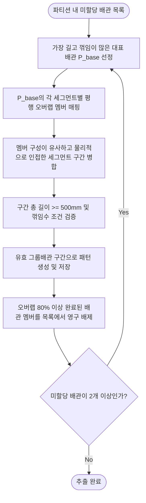

# 그룹배관 패턴 분석 및 저장 기능 구현 문서

## 1. 구현 개요

본 기능은 `DDW_AI_DB`의 기존 설계 배관 데이터로부터 장비명 및 유틸리티별로 평행하게 배치된 다발배관(Bundle) 그룹을 자동으로 식별하고 패턴 데이터베이스를 구축하는 Python 도구이다. 구축된 패턴 DB는 AI 자동 라우팅 시 다발배관 패턴 추천 및 재사용 설계 후보 탐색에 활용된다.

구현 파일:

- `Tools/DesignPatternAnalyzer.py`
- `Tools/sql/create_route_group_pattern_tables.sql`

기존 공통 설정 및 의존성:

- `Tools/tool_config.py`
- `Tools/tools.settings.json` 또는 CLI 인자
- `psycopg2`, `pgvector`

---

## 2. 주요 기능

| 기능 | Subcommand | 설명 |
| --- | --- | --- |
| 스키마 생성 | `create-schema` | 다발배관 패턴 저장 테이블(`TB_ROUTE_GROUP_PATTERN`) 및 인덱스 생성 |
| 그룹 패턴 추출 | `extract` | `TB_ROUTE_PATH/SEGMENT/DETAIL`로부터 다발배관을 세그먼트 단위로 스캔하여 검증 및 저장 |
| 일괄 실행 | `run-all` | 스키마 생성 및 그룹 패턴 추출을 한 번에 수행 |

---

## 3. 저장 테이블 (`TB_ROUTE_GROUP_PATTERN`)

추출 및 검증 단계를 거쳐 최종 도출된 구간별 평행 다발배관 그룹 정보를 저장한다.

### 3.1 테이블 컬럼 구조

- **`GROUP_ID`** (text, Primary Key): 장비명, 유틸리티 그룹, 유틸리티, 멤버 GUID 및 시작 세그먼트 인덱스를 조합하여 생성한 고유 해시 ID
- **`EQUIPMENT_TAG`** (text): 대상 장비명 (호기) (예: `WTNHJ09`, `SLWHJ04`)
- **`UTILITY_GROUP`** (text): 배관의 유틸리티 그룹 (예: `EXHAUST`, `GAS`, `DRAIN`)
- **`UTILITY`** (text): 배관의 유틸리티명 (예: `PCWS`, `LPR`)
- **`N_MEMBERS`** (integer): 해당 다발배관 그룹에 속한 멤버 배관 수
- **`AVG_SIMILARITY`** (double precision): 세그먼트 수준의 평균 평행도 (1.0에 가까울수록 강한 평행성, 기본값 0.95)
- **`TRUNK_Z`** (double precision): 주경로(Trunk)가 형성된 공용 랙 고도 (mm)
- **`TRUNK_XY_SPREAD`** (double precision): 주경로 내 배관들 간의 최대 수평 벌어짐 (다발의 전체 horizontal 폭, mm)
- **`PITCH_MM`** (double precision): 인접 배관 간 대표 이격간격 (중앙값, mm)
- **`N_ORTHO_BENDS`** (integer): 그룹 배관들의 대표 수직/수평 꺾임 수 (중앙값)
- **`MEMBER_GUIDS`** (jsonb): 소속 멤버들의 `ROUTE_PATH_GUID` 리스트
- **`PATTERN_SEQ`** (text): 그룹 배관의 대표 V/H/D 패턴 분석 시퀀스 문자열 (예: `"VHV"`)
- **`SECTION_BOUNDS`** (jsonb): 각 세부 구간(수직배관 및 수평배관)의 Boundary Box 목록 리스트
- **`FEAT`** (vector(60)): 60차원 대표 리샘플링 방향 벡터 (pgvector 코사인/L2 유사도 검색용)
- **`FEAT_JSON`** (jsonb): pgvector 미지원 환경을 대비한 60차원 json 실수 배열
- **`GEOM_3D`** (geometry(MultiLineStringZ, 0)): 해당 다발배관 그룹에 속한 실제 멤버 배관들의 3D Polyline 경로선들을 병합한 포스트지아이에스(PostGIS) 공간 기하 정보 (시각화용)
- **`CREATED_AT`** (timestamp): 데이터 생성 시각

---

## 4. 추출 및 클러스터링 알고리즘 (Segment-level Parallelism Scan)

배관 다발 식별은 개별 배관 전체 경로를 비교하는 대신, **세그먼트 단위 공간 스캔 및 평행성 추적 알고리즘**을 통해 평행하게 달리는 연속적인 구간들을 정밀하게 추출한다.

### 4.1 Phase 1 — 파티셔닝 및 특징 추출
1. **파티션 분할**: DB 내 모든 배관 데이터를 `(EQUIPMENT_TAG, UTILITY_GROUP, SOURCE_UTILITY)` 기준으로 파티셔닝하여 독립적으로 분석한다.
2. **세그먼트 직교 분해 및 스냅**: 
   - 각 배관 폴리라인의 연속된 점 $(p_i, p_{i+1})$에 대해 변위 벡터 $\vec{v} = (\Delta x, \Delta y, \Delta z)$와 단위 벡터 $\hat{u} = (u_x, u_y, u_z)$를 구한다.
   - Z 성분 절대값 $|u_z| \ge \text{ARROW\_TOL}(0.9)$이면 수직(`Z`), X 성분 절대값 $|u_x| \ge \text{ARROW\_TOL}(0.9)$이면 수평 X(`X`), Y 성분 절대값 $|u_y| \ge \text{ARROW\_TOL}(0.9)$이면 수평 Y(`Y`) 축으로 스냅하여 분류한다.
   - 이때 모서리 정렬 오차를 상쇄하기 위해 수직 평면 좌표를 두 끝점의 평균값으로 고정하는 축 정렬(Orthogonal Alignment)을 수행한다.

### 4.2 Phase 2 — 세그먼트 평행 오버랩 검사 (Parallel Overlap Check)
동일 파티션 내의 임의의 두 세그먼트 $S_1$, $S_2$가 나란히 달리는지 다음 기하학적 기준을 충족해야 한다.

1. **동일 진행 축**: $S_1.\text{dir} == S_2.\text{dir}$ 이면서 사선(D)이 아니어야 한다.
2. **수직 이격거리(Pitch) 판별**:
   - $S_1$과 $S_2$ 사이의 수직 단면에서의 최단 거리 $d_{\text{perp}}$를 아래와 같이 구하며, 이 값이 최대 피치 임계값($d_{\text{perp}} \le 800\text{mm}$) 이내여야 한다.
     * 진행 축이 `X`인 경우: $d_{\text{perp}} = \sqrt{(y_1 - y_2)^2 + (z_1 - z_2)^2}$
     * 진행 축이 `Y`인 경우: $d_{\text{perp}} = \sqrt{(x_1 - x_2)^2 + (z_1 - z_2)^2}$
     * 진행 축이 `Z`인 경우: $d_{\text{perp}} = \sqrt{(x_1 - x_2)^2 + (y_1 - y_2)^2}$
3. **진행 구간 오버랩(Overlap) 판별**:
   - 진행 축 좌표계 상으로 투영하여 두 세그먼트의 구간 $[\min(v_{\text{from}}, v_{\text{to}}), \max(v_{\text{from}}, v_{\text{to}})]$을 구한다.
   - 두 구간의 겹치는 구간 길이 $L_{\text{overlap}} = \min(\max_1, \max_2) - \max(\min_1, \min_2)$가 최소 오버랩 길이 임계값($L_{\text{overlap}} \ge 100\text{mm}$) 이상이어야 한다.

### 4.3 Phase 3 — 반복적 스캔 및 구간 추출 (Iterative Scan with Exclusion)
파티션 내에 분기되는 여러 랙 다발이 혼재해 있을 때 오탐 없이 독립적인 다발로 분리 추출하기 위해 **점진적 배제 스캔** 기법을 적용합니다.



1. **Jaccard 기반의 연속 구간 병합**:
   - $k$번째 세그먼트의 평행 배관 세트를 $M_k$, $k+1$번째 세그먼트의 평행 배관 세트를 $M_{k+1}$이라고 할 때, 공통된 배관 멤버가 2개 이상($|M_k \cap M_{k+1}| \ge 2$)이고 물리적으로 인접해 있다면 두 세그먼트 구간을 연속 다발 구간으로 병합한다.
   - 배관 다발이 일부 호기 연결부로 인해 찢어지는 분기점에서 멤버 교집합 개수가 줄어들며 자연스럽게 구간이 분할된다.
2. **경로 배제(Exclusion)**:
   - 병합된 다발 구간에서 감지된 총 오버랩 길이가 자기 전체 경로 길이의 80% 이상을 차지하는 멤버 배관은 다른 랙 다발로의 중복 매핑을 방지하기 위해 미할당 목록에서 제외한다.
   - 이후 남은 배관 중 가장 긴 배관을 다음 $P_{base}$로 선정하여 반복 수집한다.

### 4.4 Phase 4 — 대표 정보 및 3D 공간 기하 정보 산출
1. **Bounding Box 산출**: 각 세부 구간에 대해 병합된 멤버 세그먼트들의 3D 영역 경계 좌표를 구하여 `SECTION_BOUNDS`를 산출한다.
2. **PostGIS MultiLineStringZ 생성**: 그룹 내 멤버 배관들의 3D Polyline 좌표점 배열을 PostGIS 공간 연산 및 가시화가 가능하도록 WKT `MULTILINESTRING Z ((x1 y1 z1, x2 y2 z2, ...), ...)` 문자열로 변환하여 `GEOM_3D` 컬럼에 매핑한다.
3. **트렁크 정보 감지**: 구간 내 수평 세그먼트들의 Z 고도 최빈값(`TRUNK_Z`), 멤버 간 수직 오버랩 벌어짐 폭(`TRUNK_XY_SPREAD`), pitch 중앙값(`PITCH_MM`) 등을 계산하여 최종 적재한다.

---

## 5. 실행 명령어 예시

### 5.1 데이터베이스 스키마 생성
```powershell
python Tools/DesignPatternAnalyzer.py --password dinno create-schema
```

### 5.2 드라이런 테스트 (DB 저장 생략)
실제 적재하기 전에 추출 및 매핑이 원활한지 로그로 사전 확인한다.
```powershell
python Tools/DesignPatternAnalyzer.py --password dinno extract --dry-run
```

### 5.3 배관 패턴 추출 및 데이터베이스 적재
데이터를 전량 분석하여 `TB_ROUTE_GROUP_PATTERN`에 덮어쓰기 방식으로 저장한다.
```powershell
python Tools/DesignPatternAnalyzer.py --password dinno extract
```
