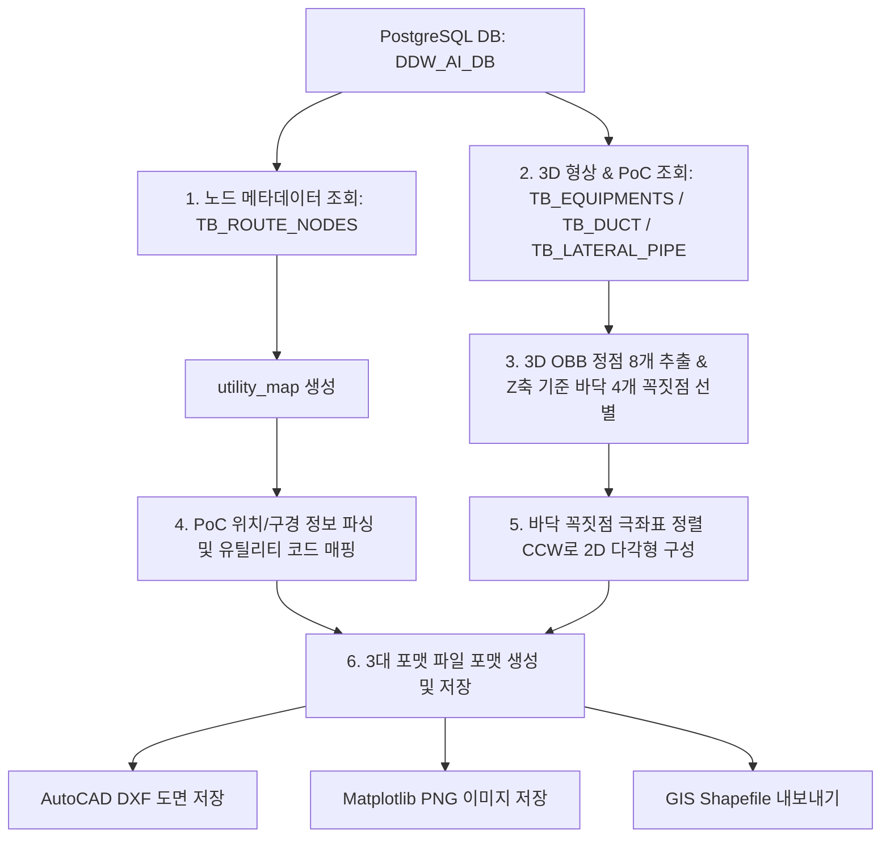

# 3D 설비 평면도 및 PoC 도면 추출 모듈 개발 문서
이 문서는 PostgreSQL 데이터베이스(`DDW_AI_DB`)에 저장된 3D 기하 데이터(OBB 정점 좌표) 및 연결점(PoC) 정보를 바탕으로, AutoCAD DXF 도면, Matplotlib PNG 이미지, GIS 공간 정보 파일(Shapefile)을 일괄 생성하는 3개 핵심 모듈의 아키텍처 및 세부 설계 사양을 정의합니다.

대상 스크립트:
1. `ExportEquipmentPlan.py` (장비 평면도 및 상세 뷰어 생성)
2. `ExportDuctPlan.py` (덕트 평면도 생성)
3. `ExportLateralPlan.py` (분기배관 평면도 생성)

---

## 1. 아키텍처 및 공통 데이터 파이프라인
3개 모듈은 데이터 원천이 되는 DB 테이블만 다를 뿐, 데이터를 조회하고 2D 평면 기하로 가공하여 다중 파일 포맷으로 출력하는 전체적인 파이프라인 구조는 동일합니다.



---

## 2. 공통 핵심 알고리즘 및 헬퍼 함수

### 2.1. OBB 바닥면 추출 및 2D 다각형 변환 알고리즘 (`get_bottom_footprint`)
3차원 공간 상에 임의의 방향으로 회전해 있는 직육면체 OBB(Oriented Bounding Box)의 8개 정점 좌표 중에서 물리적으로 바닥에 접한 4개 정점을 추출하고, 선이 꼬이지 않도록 반시계 방향(CCW) 정렬을 수행합니다.

*   **동작 단계**:
    1.  8개의 정점을 Z좌표(고도) 오름차순으로 정렬하여 가장 낮은 4개 점을 바닥 정점(`bottom_vertices`)으로 선별합니다.
    2.  4개 정점의 XY 평면 투영 중심점 $C(cx, cy)$를 계산합니다.
        $$cx = \frac{1}{4} \sum_{i=1}^{4} x_i, \quad cy = \frac{1}{4} \sum_{i=1}^{4} y_i$$
    3.  각 정점 $P_i(x_i, y_i)$와 중심점 $C$ 사이의 각도 $\theta = \text{atan2}(y_i - cy, x_i - cx)$를 구합니다.
    4.  구해진 각도 $\theta$ 기준으로 정점을 정렬하여 닫힌 반시계 방향 루프를 만듭니다.

*   **구현 코드**:
```python
def get_bottom_footprint(obb_3d):
    vertices = list(obb_3d.values())
    bottom_vertices = sorted(vertices, key=lambda p: p[2])[:4]
    cx = sum(p[0] for p in bottom_vertices) / 4.0
    cy = sum(p[1] for p in bottom_vertices) / 4.0
    def angle(p):
        return math.atan2(p[1] - cy, p[0] - cx)
    return sorted(bottom_vertices, key=angle)
```

### 2.2. 배관 및 덕트 규격 파싱 알고리즘 (`parse_size_to_radius`)
인치(`B`), 밀리미터(`A`, `mm`), 분수식 표현(`1 1/2`), 사각 덕트(`Width x Height`) 규격 문자열을 유연하게 분석하여 물리적인 반지름(Radius, mm 단위) 실수값을 반환합니다.

*   **규격별 환산 공식**:
    *   **사각 덕트 (`X` 또는 `*` 포함)**: 폭 $w$와 높이 $h$의 평균 원 반경 공식인 $(w+h)/4.0$을 적용합니다.
    *   **인치 단위 (수치가 36 미만인 경우)**: $1\text{ inch} = 25.4\text{ mm}$를 곱하고 2로 나누어 반지름을 산출합니다.
    *   **밀리미터 단위 (수치가 36 이상인 경우)**: 직경 밀리미터 값으로 판단하여 단순히 2로 나눕니다.

---

## 3. 모듈별 상세 상세 설계 문서

### 3.1. 장비 도면 내보내기 (`ExportEquipmentPlan.py`)

#### A. 원본 데이터 테이블 및 필드 맵
*   **대표 테이블**: `TB_EQUIPMENTS`
*   **유틸리티 조회 테이블**: `TB_ROUTE_NODES`

| 원본 필드명 | 데이터 타입 | 설명 | 가공 및 변수 매핑 |
| :--- | :--- | :--- | :--- |
| `INSTANCE_NAME` | `text` | 장비 명칭 (예: `WTNHJ02_`) | `name` (문자열 변수) |
| `OBB_LEFT_BOTTOM_BACK_X/Y/Z` | `double` | OBB 꼭짓점 LBB의 X, Y, Z 좌표 | `obb_3d['lbb']` (3차원 튜플) |
| `OBB_RIGHT_BOTTOM_BACK_X/Y/Z` | `double` | OBB 꼭짓점 RBB의 X, Y, Z 좌표 | `obb_3d['rbb']` (3차원 튜플) |
| `OBB_RIGHT_TOP_BACK_X/Y/Z` | `double` | OBB 꼭짓점 RTB의 X, Y, Z 좌표 | `obb_3d['rtb']` (3차원 튜플) |
| `OBB_LEFT_TOP_BACK_X/Y/Z` | `double` | OBB 꼭짓점 LTB의 X, Y, Z 좌표 | `obb_3d['ltb']` (3차원 튜플) |
| `OBB_LEFT_BOTTOM_FRONT_X/Y/Z` | `double` | OBB 꼭짓점 LBF의 X, Y, Z 좌표 | `obb_3d['lbf']` (3차원 튜플) |
| `OBB_RIGHT_BOTTOM_FRONT_X/Y/Z` | `double` | OBB 꼭짓점 RBF의 X, Y, Z 좌표 | `obb_3d['rbf']` (3차원 튜플) |
| `OBB_RIGHT_TOP_FRONT_X/Y/Z` | `double` | OBB 꼭짓점 RTF의 X, Y, Z 좌표 | `obb_3d['rtf']` (3차원 튜플) |
| `OBB_LEFT_TOP_FRONT_X/Y/Z` | `double` | OBB 꼭짓점 LTF의 X, Y, Z 좌표 | `obb_3d['ltf']` (3차원 튜플) |
| `POC_ID_LIST` | `text` (JSON Array) | 장비에 장착된 PoC GUID 목록 | `id_list` (문자열 리스트) |
| `POC_POSITIONS_LIST` | `text` (JSON Array) | PoC 3D 절대 좌표 목록 (Array of Arrays) | `pos_list` (3차원 좌표의 2차원 리스트) |
| `POC_SIZES_LIST` | `text` (JSON Array) | PoC 배관/구경 규격 목록 | `size_list` (규격 문자열 리스트) |

#### B. 핵심 함수 및 내부 변수

##### 1) `fetch_data(conn)`
*   **설명**: DB에서 장비 정보와 노드 유틸리티 관계를 질의하고 매핑 및 정렬을 수행하여 구조화된 딕셔너리 리스트를 리턴합니다.
*   **주요 변수**:
    *   `utility_map` (`dict`): `{"NODE_GUID": "UTILITY_CODE"}` 매핑 사전
    *   `pos_list` (`list`): 파싱된 PoC 3D 좌표 리스트. 요소 형태가 딕셔너리(`{'x':..., 'y':...}`) 또는 리스트(`[x, y, z]`) 모두 호환되도록 파싱 조건 분기 처리.
    *   `x_size`, `y_size`, `z_size` (`float`): OBB 정점 사이의 거리를 계산하여 얻은 실제 장비의 가로, 세로, 높이 크기.

##### 2) `export_dxf(eqs, out_path)`
*   **설명**: AutoCAD용 DXF 파일을 생성합니다.
*   **동작**:
    *   `ezdxf.new('R2010')` 문서 모델 생성
    *   `EQUIPMENT` 레이어에 장비 바닥면 폴리라인 작성: `msp.add_lwpolyline(eq['poly'], close=True)`
    *   각 PoC를 해당 고도(Z)와 반지름(`radius`)에 맞춰 유틸리티 전용 레이어(`POC_{UTILITY}`)의 원 객체로 추가: `msp.add_circle((poc['x'], poc['y'], poc['z']), poc['radius'])`

##### 3) `export_png(eqs, out_path)`
*   **설명**: Matplotlib을 통해 평면 레이아웃 도면 이미지를 생성합니다.
*   **특징**: 무한 루프 방지를 위한 Path `__deepcopy__` 패치와 비대화형 `matplotlib.use('Agg')` 백엔드가 작용합니다.

##### 4) `export_individual_images(eqs, out_dir)`
*   **설명**: 각 장비별 외곽 치수선 및 4개 정점의 좌표 텍스트 라벨을 포함한 고유 상세 배치도 PNG를 생성합니다.

---

### 3.2. 덕트 도면 내보내기 (`ExportDuctPlan.py`)

#### A. 원본 데이터 테이블 및 필드 맵
*   **대표 테이블**: `TB_DUCT`
*   **유틸리티 조회 테이블**: `TB_ROUTE_NODES`

| 원본 필드명 | 데이터 타입 | 설명 | 가공 및 변수 매핑 |
| :--- | :--- | :--- | :--- |
| `INSTANCE_NAME` | `text` | 덕트 개체 명칭 | `name` |
| `UTILITY` | `text` | 대표 유틸리티명 (예: `EX`) | `utility_col` |
| `LATERAL_NUMBER`| `text` | 대피 또는 덕트 번호 | `lateral_number` |
| `UTILITY_GROUP` | `text` | 유틸리티 대그룹명 | `utility_group` |
| `LEVEL` | `text` | 설치 층 정보 | `level` |
| `BAY` | `text` | 영역 베이 위치 | `bay` |
| `BOP` | `double` | 하부 기준 높이 | `bop` |
| `OBB_LEFT_BOTTOM_BACK_X/...` | `double` | 24개의 OBB 정점 좌표 필드 | `obb_3d` 딕셔너리로 조립 |
| `POC_POSITIONS_LIST` | `text` (JSON Array) | 덕트 기단 연결구 위치 좌표 배열 | `pos_list` 로드 후 개별 좌표 분리 |

#### B. 핵심 함수 및 내부 변수

##### 1) `fetch_data(conn)`
*   **설명**: `TB_DUCT`에서 덕트의 24개 OBB 정점 필드와 PoC 데이터를 조회하여 정밀 좌표 풋프린트와 연결구 리스트를 메모리에 적재합니다.
*   **덕트용 기하 파싱 규칙**:
    *   사각 덕트가 대부분이므로 `parse_size_to_radius`에서 `600X400`과 같은 표기를 만나면 가로 세로 치수 합의 4분의 1을 원용 반지름으로 환산하여 표현합니다.

##### 2) `export_png(ducts, out_path)`
*   **설명**: 전체 덕트 면적을 비스크 황갈색 패치(`facecolor='#FFE4C4'`)로 표현하여 시인성을 높이고, 배기(EX) 및 진공(PV) 등의 유틸리티를 색상별 원으로 오버레이합니다.

---

### 3.3. 분기배관 도면 내보내기 (`ExportLateralPlan.py`)

#### A. 원본 데이터 테이블 및 필드 맵
*   **대표 테이블**: `TB_LATERAL_PIPE`
*   **유틸리티 조회 테이블**: `TB_ROUTE_NODES`

| 원본 필드명 | 데이터 타입 | 설명 | 가공 및 변수 매핑 |
| :--- | :--- | :--- | :--- |
| `INSTANCE_NAME` | `text` | 분기배관 개체 명칭 | `name` |
| `UTILITY` | `text` | 배관 고유 유틸리티 종류 | `utility_col` |
| `LATERAL_NUMBER`| `text` | 분기 배관 고유 번호 | `lateral_number` |
| `OBB_LEFT_BOTTOM_BACK_X/...` | `double` | 24개의 OBB 정점 좌표 필드 | `obb_3d` 딕셔너리 적재 |
| `POC_POSITIONS_LIST` | `text` (JSON Array) | 배관 PoC 3D 좌표 배열 | `pos_list` |

#### B. 핵심 함수 및 내부 변수

##### 1) `fetch_data(conn)`
*   **설명**: `TB_LATERAL_PIPE`에서 분기 배관의 형상 데이터와 PoC 좌표 정보를 불러옵니다.
*   **분기배관용 기하 처리 특징**:
    *   `pocs` 정보 매핑 시, 특정 PoC의 유틸리티 매핑이 캐시에 없을 경우, 배관 자체가 보유한 대표 유틸리티명(`utility_col`)을 폴백(Fallback) 기본값으로 주입하여 데이터 유실을 보강합니다.
        `utility = utility_map.get(pid) or utility_col or 'DEFAULT'`

##### 2) `export_shp(laterals, out_dir)`
*   **설명**: GIS 공간정보 포맷인 Shapefile 포맷으로 배관 바닥면 외곽 영역(`POLYGONZ`)과 PoC 포인트(`POINTZ`) 정보 세트를 빌드하여 저장합니다.

---

## 4. 파일 포맷별 출력 상세 명세

### 4.1. AutoCAD DXF 파일 사양
*   **규격 버전**: AutoCAD Release 2010 (`R2010`)
*   **레이어 설정 및 표준 색상 인덱스 (ACI)**:

| 레이어명 | 도면 요소 종류 | 색상 이름 | ACI 색상 번호 |
| :--- | :--- | :--- | :--- |
| `EQUIPMENT` / `DUCT` / `LATERAL` | 닫힌 외곽선 폴리라인 | White | 7 |
| `POC_PCW_S` | 원 (3D 절대고도 Z 반영) | Blue | 5 |
| `POC_PCW_R` | 원 (3D 절대고도 Z 반영) | Light Blue | 150 |
| `POC_EX` | 원 (3D 절대고도 Z 반영) | Orange | 30 |
| `POC_CDA` | 원 (3D 절대고도 Z 반영) | Green | 3 |
| `POC_PV` | 원 (3D 절대고도 Z 반영) | Red | 1 |
| `POC_DEFAULT` | 원 (3D 절대고도 Z 반영) | White | 7 |

### 4.2. Matplotlib PNG 이미지 사양
*   **도면 크기**: 15인치 $\times$ 15인치 (`figsize=(15, 15)`)
*   **해상도**: 300 DPI
*   **물리적 축척비**: 가로/세로 물리적 비율 강제 고정 (`ax.set_aspect('equal')`)
*   **범례 (Legend)**: 화면에 실제로 작도된 유틸리티 항목만 동적으로 선별하여 범례 생성 및 표시

### 4.3. GIS Shapefile 파일 사양
*   **형상 유형**:
    1.  **설비 외곽 영역 세트**: `POLYGONZ` (Z좌표를 내포하는 3차원 면 형상)
    2.  **연결점 세트**: `POINTZ` (Z좌표를 내포하는 3차원 점 형상)
*   **속성 필드 스키마**:
    *   **장비/덕트/배관 면 파일**: `NAME` (C, 50자), `X_SIZE` (N, 소수점 2자리), `Y_SIZE` (N, 소수점 2자리), `Z_SIZE` (N, 소수점 2자리)
    *   **PoC 포인트 파일**: `EQ_NAME` / `DUCT_NAME` (C, 50자), `UTILITY` (C, 50자), `RADIUS` (N, 소수점 2자리)
