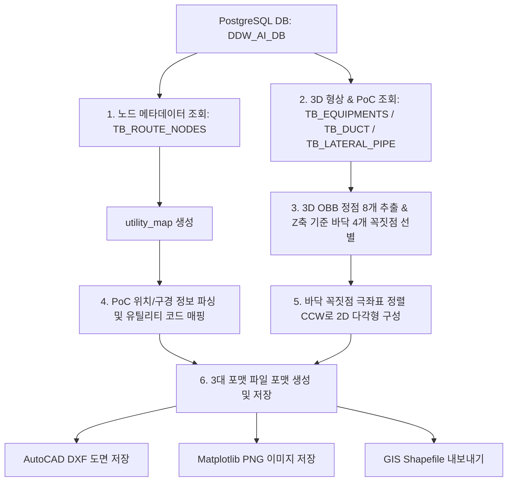

# 3D 설비 평면도 및 PoC 도면 추출 모듈 개발 문서
이 문서는 PostgreSQL 데이터베이스(`DDW_AI_DB`)에 저장된 3D 기하 데이터(OBB 정점 좌표) 및 연결점(PoC) 정보를 바탕으로, AutoCAD DXF 도면, Matplotlib PNG 이미지, GIS 공간 정보 파일(Shapefile)을 일괄 생성하는 3개 핵심 모듈의 아키텍처 및 세부 설계 사양을 정의합니다.

대상 스크립트:
1. `ExportEquipmentPlan.py` (장비 평면도 및 상세 뷰어 생성)
2. `ExportDuctPlan.py` (덕트 평면도 생성)
3. `ExportLateralPlan.py` (분기배관 평면도 생성)

---

## 1. 아키텍처 및 공통 데이터 파이프라인
3개 모듈은 데이터 원천이 되는 DB 테이블만 다를 뿐, 데이터를 조회하고 2D 평면 기하로 가공하여 다중 파일 포맷으로 출력하는 전체적인 파이프라인 구조는 동일합니다.



---

## 2. 공통 핵심 알고리즘 및 헬퍼 함수

### 2.1. OBB 바닥면 추출 및 2D 다각형 변환 알고리즘 (`get_bottom_footprint`)
3차원 공간 상에 임의의 방향으로 회전해 있는 직육면체 OBB(Oriented Bounding Box)의 8개 정점 좌표 중에서 물리적으로 바닥에 접한 4개 정점을 추출하고, 선이 꼬이지 않도록 반시계 방향(CCW) 정렬을 수행합니다.

*   **동작 단계**:
    1.  8개의 정점을 Z좌표(고도) 오름차순으로 정렬하여 가장 낮은 4개 점을 바닥 정점(`bottom_vertices`)으로 선별합니다.
    2.  4개 정점의 XY 평면 투영 중심점 $C(cx, cy)$를 계산합니다.
        $$cx = \frac{1}{4} \sum_{i=1}^{4} x_i, \quad cy = \frac{1}{4} \sum_{i=1}^{4} y_i$$
    3.  각 정점 $P_i(x_i, y_i)$와 중심점 $C$ 사이의 각도 $\theta = \text{atan2}(y_i - cy, x_i - cx)$를 구합니다.
    4.  구해진 각도 $\theta$ 기준으로 정점을 정렬하여 닫힌 반시계 방향 루프를 만듭니다.

*   **구현 코드**:
```python
def get_bottom_footprint(obb_3d):
    vertices = list(obb_3d.values())
    bottom_vertices = sorted(vertices, key=lambda p: p[2])[:4]
    cx = sum(p[0] for p in bottom_vertices) / 4.0
    cy = sum(p[1] for p in bottom_vertices) / 4.0
    def angle(p):
        return math.atan2(p[1] - cy, p[0] - cx)
    return sorted(bottom_vertices, key=angle)
```

### 2.2. 배관 및 덕트 규격 파싱 알고리즘 (`parse_size_to_radius`)
인치(`B`), 밀리미터(`A`, `mm`), 분수식 표현(`1 1/2`), 사각 덕트(`Width x Height`) 규격 문자열을 유연하게 분석하여 물리적인 반지름(Radius, mm 단위) 실수값을 반환합니다.

*   **규격별 환산 공식**:
    *   **사각 덕트 (`X` 또는 `*` 포함)**: 폭 $w$와 높이 $h$의 평균 원 반경 공식인 $(w+h)/4.0$을 적용합니다.
    *   **인치 단위 (수치가 36 미만인 경우)**: $1\text{ inch} = 25.4\text{ mm}$를 곱하고 2로 나누어 반지름을 산출합니다.
    *   **밀리미터 단위 (수치가 36 이상인 경우)**: 직경 밀리미터 값으로 판단하여 단순히 2로 나눕니다.

---

## 3. 모듈별 상세 상세 설계 문서

### 3.1. 장비 도면 내보내기 (`ExportEquipmentPlan.py`)

#### A. 원본 데이터 테이블 및 필드 맵
*   **대표 테이블**: `TB_EQUIPMENTS`
*   **유틸리티 조회 테이블**: `TB_ROUTE_NODES`

| 원본 필드명 | 데이터 타입 | 설명 | 가공 및 변수 매핑 |
| :--- | :--- | :--- | :--- |
| `INSTANCE_NAME` | `text` | 장비 명칭 (예: `WTNHJ02_`) | `name` (문자열 변수) |
| `OBB_LEFT_BOTTOM_BACK_X/Y/Z` | `double` | OBB 꼭짓점 LBB의 X, Y, Z 좌표 | `obb_3d['lbb']` (3차원 튜플) |
| `OBB_RIGHT_BOTTOM_BACK_X/Y/Z` | `double` | OBB 꼭짓점 RBB의 X, Y, Z 좌표 | `obb_3d['rbb']` (3차원 튜플) |
| `OBB_RIGHT_TOP_BACK_X/Y/Z` | `double` | OBB 꼭짓점 RTB의 X, Y, Z 좌표 | `obb_3d['rtb']` (3차원 튜플) |
| `OBB_LEFT_TOP_BACK_X/Y/Z` | `double` | OBB 꼭짓점 LTB의 X, Y, Z 좌표 | `obb_3d['ltb']` (3차원 튜플) |
| `OBB_LEFT_BOTTOM_FRONT_X/Y/Z` | `double` | OBB 꼭짓점 LBF의 X, Y, Z 좌표 | `obb_3d['lbf']` (3차원 튜플) |
| `OBB_RIGHT_BOTTOM_FRONT_X/Y/Z` | `double` | OBB 꼭짓점 RBF의 X, Y, Z 좌표 | `obb_3d['rbf']` (3차원 튜플) |
| `OBB_RIGHT_TOP_FRONT_X/Y/Z` | `double` | OBB 꼭짓점 RTF의 X, Y, Z 좌표 | `obb_3d['rtf']` (3차원 튜플) |
| `OBB_LEFT_TOP_FRONT_X/Y/Z` | `double` | OBB 꼭짓점 LTF의 X, Y, Z 좌표 | `obb_3d['ltf']` (3차원 튜플) |
| `POC_ID_LIST` | `text` (JSON Array) | 장비에 장착된 PoC GUID 목록 | `id_list` (문자열 리스트) |
| `POC_POSITIONS_LIST` | `text` (JSON Array) | PoC 3D 절대 좌표 목록 (Array of Arrays) | `pos_list` (3차원 좌표의 2차원 리스트) |
| `POC_SIZES_LIST` | `text` (JSON Array) | PoC 배관/구경 규격 목록 | `size_list` (규격 문자열 리스트) |

#### B. 핵심 함수 및 내부 변수

##### 1) `fetch_data(conn)`
*   **설명**: DB에서 장비 정보와 노드 유틸리티 관계를 질의하고 매핑 및 정렬을 수행하여 구조화된 딕셔너리 리스트를 리턴합니다.
*   **주요 변수**:
    *   `utility_map` (`dict`): `{"NODE_GUID": "UTILITY_CODE"}` 매핑 사전
    *   `pos_list` (`list`): 파싱된 PoC 3D 좌표 리스트. 요소 형태가 딕셔너리(`{'x':..., 'y':...}`) 또는 리스트(`[x, y, z]`) 모두 호환되도록 파싱 조건 분기 처리.
    *   `x_size`, `y_size`, `z_size` (`float`): OBB 정점 사이의 거리를 계산하여 얻은 실제 장비의 가로, 세로, 높이 크기.

##### 2) `export_dxf(eqs, out_path)`
*   **설명**: AutoCAD용 DXF 파일을 생성합니다.
*   **동작**:
    *   `ezdxf.new('R2010')` 문서 모델 생성
    *   `EQUIPMENT` 레이어에 장비 바닥면 폴리라인 작성: `msp.add_lwpolyline(eq['poly'], close=True)`
    *   각 PoC를 해당 고도(Z)와 반지름(`radius`)에 맞춰 유틸리티 전용 레이어(`POC_{UTILITY}`)의 원 객체로 추가: `msp.add_circle((poc['x'], poc['y'], poc['z']), poc['radius'])`

##### 3) `export_png(eqs, out_path)`
*   **설명**: Matplotlib을 통해 평면 레이아웃 도면 이미지를 생성합니다.
*   **특징**: 무한 루프 방지를 위한 Path `__deepcopy__` 패치와 비대화형 `matplotlib.use('Agg')` 백엔드가 작용합니다.

##### 4) `export_individual_images(eqs, out_dir)`
*   **설명**: 각 장비별 외곽 치수선 및 4개 정점의 좌표 텍스트 라벨을 포함한 고유 상세 배치도 PNG를 생성합니다.

---

### 3.2. 덕트 도면 내보내기 (`ExportDuctPlan.py`)

#### A. 원본 데이터 테이블 및 필드 맵
*   **대표 테이블**: `TB_DUCT`
*   **유틸리티 조회 테이블**: `TB_ROUTE_NODES`

| 원본 필드명 | 데이터 타입 | 설명 | 가공 및 변수 매핑 |
| :--- | :--- | :--- | :--- |
| `INSTANCE_NAME` | `text` | 덕트 개체 명칭 (현재 데이터셋 기준 전 건 공백) | `name` (공백일 경우 `INSTANCE_ID`로 대체) |
| `INSTANCE_ID` | `text` | 덕트 고유 식별자(GUID). `TB_DUCT` 전체에서 유일함이 확인됨 | `instance_id` |
| `UTILITY` | `text` | 대표 유틸리티명 (예: `EX`) | `utility_col` |
| `LATERAL_NUMBER`| `text` | 대피 또는 덕트 번호 | `lateral_number` |
| `UTILITY_GROUP` | `text` | 유틸리티 대그룹명 | `utility_group` |
| `LEVEL` | `text` | 설치 층 정보 | `level` |
| `BAY` | `text` | 영역 베이 위치 | `bay` |
| `BOP` | `double` | 하부 기준 높이 | `bop` |
| `OBB_LEFT_BOTTOM_BACK_X/...` | `double` | 24개의 OBB 정점 좌표 필드 | `obb_3d` 딕셔너리로 조립 |
| `POC_POSITIONS_LIST` | `text` (JSON Array) | 덕트 기단 연결구 위치 좌표 배열 | `pos_list` 로드 후 개별 좌표 분리 |

#### B. 핵심 함수 및 내부 변수

##### 1) `fetch_data(conn)`
*   **설명**: `TB_DUCT`에서 덕트의 24개 OBB 정점 필드와 PoC 데이터를 조회하여 정밀 좌표 풋프린트와 연결구 리스트를 메모리에 적재합니다.
*   **덕트용 기하 파싱 규칙**:
    *   사각 덕트가 대부분이므로 `parse_size_to_radius`에서 `600X400`과 같은 표기를 만나면 가로 세로 치수 합의 4분의 1을 원용 반지름으로 환산하여 표현합니다.
*   **2026-07-13 수정**: `INSTANCE_NAME`이 비어있는 행이 다수 존재해(현재 `DDW_AI_DB`의 `TB_DUCT` 198건 전체) 반환 딕셔너리의 `name`이 공백으로 나가던 문제를 수정. `INSTANCE_ID`(전 건 유일함 확인)를 함께 조회해 `name = INSTANCE_NAME or INSTANCE_ID`로 폴백 처리하고, 원본 `INSTANCE_ID` 값도 `instance_id` 키로 별도 보존.

##### 2) `export_png(ducts, out_path)`
*   **설명**: 전체 덕트 면적을 비스크 황갈색 패치(`facecolor='#FFE4C4'`)로 표현하여 시인성을 높이고, 배기(EX) 및 진공(PV) 등의 유틸리티를 색상별 원으로 오버레이합니다.

---

### 3.3. 분기배관 도면 내보내기 (`ExportLateralPlan.py`)

#### A. 원본 데이터 테이블 및 필드 맵
*   **대표 테이블**: `TB_LATERAL_PIPE`
*   **유틸리티 조회 테이블**: `TB_ROUTE_NODES`

| 원본 필드명 | 데이터 타입 | 설명 | 가공 및 변수 매핑 |
| :--- | :--- | :--- | :--- |
| `INSTANCE_NAME` | `text` | 분기배관 개체 명칭 | `name` |
| `UTILITY` | `text` | 배관 고유 유틸리티 종류 | `utility_col` |
| `LATERAL_NUMBER`| `text` | 분기 배관 고유 번호 | `lateral_number` |
| `OBB_LEFT_BOTTOM_BACK_X/...` | `double` | 24개의 OBB 정점 좌표 필드 | `obb_3d` 딕셔너리 적재 |
| `POC_POSITIONS_LIST` | `text` (JSON Array) | 배관 PoC 3D 좌표 배열 | `pos_list` |

#### B. 핵심 함수 및 내부 변수

##### 1) `fetch_data(conn)`
*   **설명**: `TB_LATERAL_PIPE`에서 분기 배관의 형상 데이터와 PoC 좌표 정보를 불러옵니다.
*   **분기배관용 기하 처리 특징**:
    *   `pocs` 정보 매핑 시, 특정 PoC의 유틸리티 매핑이 캐시에 없을 경우, 배관 자체가 보유한 대표 유틸리티명(`utility_col`)을 폴백(Fallback) 기본값으로 주입하여 데이터 유실을 보강합니다.
        `utility = utility_map.get(pid) or utility_col or 'DEFAULT'`

##### 2) `export_shp(laterals, out_dir)`
*   **설명**: GIS 공간정보 포맷인 Shapefile 포맷으로 배관 바닥면 외곽 영역(`POLYGONZ`)과 PoC 포인트(`POINTZ`) 정보 세트를 빌드하여 저장합니다.

---

## 4. 파일 포맷별 출력 상세 명세

### 4.1. AutoCAD DXF 파일 사양
*   **규격 버전**: AutoCAD Release 2010 (`R2010`)
*   **레이어 설정 및 표준 색상 인덱스 (ACI)**:

| 레이어명 | 도면 요소 종류 | 색상 이름 | ACI 색상 번호 |
| :--- | :--- | :--- | :--- |
| `EQUIPMENT` / `DUCT` / `LATERAL` | 닫힌 외곽선 폴리라인 | White | 7 |
| `POC_PCW_S` | 원 (3D 절대고도 Z 반영) | Blue | 5 |
| `POC_PCW_R` | 원 (3D 절대고도 Z 반영) | Light Blue | 150 |
| `POC_EX` | 원 (3D 절대고도 Z 반영) | Orange | 30 |
| `POC_CDA` | 원 (3D 절대고도 Z 반영) | Green | 3 |
| `POC_PV` | 원 (3D 절대고도 Z 반영) | Red | 1 |
| `POC_DEFAULT` | 원 (3D 절대고도 Z 반영) | White | 7 |

### 4.2. Matplotlib PNG 이미지 사양
*   **도면 크기**: 15인치 $\times$ 15인치 (`figsize=(15, 15)`)
*   **해상도**: 300 DPI
*   **물리적 축척비**: 가로/세로 물리적 비율 강제 고정 (`ax.set_aspect('equal')`)
*   **범례 (Legend)**: 화면에 실제로 작도된 유틸리티 항목만 동적으로 선별하여 범례 생성 및 표시

### 4.3. GIS Shapefile 파일 사양
*   **형상 유형**:
    1.  **설비 외곽 영역 세트**: `POLYGONZ` (Z좌표를 내포하는 3차원 면 형상)
    2.  **연결점 세트**: `POINTZ` (Z좌표를 내포하는 3차원 점 형상)
*   **속성 필드 스키마**:
    *   **장비/덕트/배관 면 파일**: `NAME` (C, 50자), `X_SIZE` (N, 소수점 2자리), `Y_SIZE` (N, 소수점 2자리), `Z_SIZE` (N, 소수점 2자리)
    *   **PoC 포인트 파일**: `EQ_NAME` / `DUCT_NAME` (C, 50자), `UTILITY` (C, 50자), `RADIUS` (N, 소수점 2자리)

---

## 5. 연관 모듈: 덕트 PoC 분포 패턴 분석 (`AnalyzeDuctPocPattern.py`, 2026-07-13 신규)

`ExportDuctPlan.py`는 시각화/파일 내보내기 전용이라 Duct별 PoC 분포의 "패턴"(어느 면에, 몇 개가, 얼마나 등간격으로 붙어있는지)을 계산하지 않는다. 이 갭을 메우기 위해 `fetch_data()`를 재사용하는 별도 분석 스크립트를 신설했다.

*   **실행**: `python Tools/AnalyzeDuctPocPattern.py {create-schema|analyze|run-all} [--dry-run]`
*   **출력 테이블**: `TB_DUCT_POC_PATTERN` (`Tools/sql/create_duct_poc_pattern_table.sql`), PK = `DUCT_NAME`(=`INSTANCE_NAME` 또는 폴백된 `INSTANCE_ID`)

### 5.1. 문제의식 — 덕트는 "기다란 육면체"이므로 취출구를 1차원으로만 정렬하면 안 됨
덕트는 길이축 방향으로 길고 단면(폭×높이)이 얇은 육면체이며, 곁가지 취출구는 **상단(TOP)/좌측(LEFT)/우측(RIGHT)/하단(BOTTOM)** 면 어디에든 붙을 수 있다. 따라서 취출구 위치를 덕트 고유의 3축(길이/높이/폭)에 투영해 소속 면부터 판정한 뒤, 면별로 정렬·간격을 계산해야 실제 시공 패턴(예: "상단에 등간격 3개 분기 + 우측에 단독 1개")을 왜곡 없이 표현할 수 있다.

### 5.1.1. (2026-07-13 정정) 분석 대상은 `POC_POSITIONS_LIST`가 아니라 `TAKEOFF_POC_POSITIONS_LIST`
최초 구현 시 `duct['pocs']`(TB_DUCT의 `POC_ID_LIST`/`POC_POSITIONS_LIST`/`POC_SIZES_LIST`)를 분석 대상으로 삼았는데, 실제 라이브 데이터로 돌려보니 **전 건이 정확히 PoC 2개, 항상 길이축 양 끝단(END)** 이라는 결과만 나왔다. 원인을 확인한 결과, TB_DUCT 1행은 덕트 1개를 의미하고 `POC_*` 컬럼은 그 덕트가 앞뒤로 인접 덕트와 체인처럼 이어지는 **"본선 연결 관절"** 이지, 곁가지 분기점이 아니었다. 실제 곁가지 취출구는 별도 컬럼인 `TAKEOFF_POC_ID_LIST`/`TAKEOFF_POC_POSITIONS_LIST`/`TAKEOFF_POC_SIZES_LIST`(+ `TAKEOFF_POC_COUNT`)에 담겨 있었다.

**수정 내용**:
*   `ExportDuctPlan.fetch_data()`: PoC 파싱 로직을 `_parse_poc_entries(pos_json, id_json, size_json, utility_map, fallback_utility, context_name)` 공용 헬퍼로 분리하고, `POC_*`(→ `duct['pocs']`, 본선 연결점)와 `TAKEOFF_POC_*`(→ `duct['takeoffs']`, 곁가지 취출구)를 동일 로직으로 각각 파싱. SQL에 `TAKEOFF_POC_ID_LIST`/`TAKEOFF_POC_POSITIONS_LIST`/`TAKEOFF_POC_SIZES_LIST`/`TAKEOFF_POC_COUNT` 추가 조회.
*   `AnalyzeDuctPocPattern.py`: `classify_duct_pocs()` → `classify_duct_takeoffs()`로 개명, 모든 면 분류·통계·PNG 시각화가 `duct['pocs']` 대신 `duct['takeoffs']`를 대상으로 하도록 전면 수정.
*   **재분석 결과 (198건 중 취출구 보유 191건)**: TOP 184건(등간격 41/138) / LEFT 23건(등간격 10/23) / RIGHT 8건(등간격 8/8) / END 7건(길이축 끝단 근접 취출) / BOTTOM 2건(드묾). 실무적으로 덕트 상단 취출이 압도적으로 많다는 것과 일치하는, 의미 있는 분포가 확인됨.
*   **부수 버그**: `analyze_all()`이 `duct['takeoffs']`가 빈 덕트(TAKEOFF_POC_COUNT=0, 7건)를 건너뛰도록 했더니, `save_patterns()`가 이 7건을 건드리지 않아 **과거(POC 기반) 분석 때 저장된 낡은 `DOMINANT_FACE='END'` 값이 DB에 그대로 남는 문제**가 발생했다. `analyze_all()`에서 스킵 로직을 제거하여 취출구가 없는 덕트도 `analyze_duct_pattern()`이 자연스럽게 산출하는 빈 패턴(`dominant_face=None`, `faces={}`, `n_poc_total=0`)으로 매번 갱신되도록 수정. 재실행 후 DB 확인: `DOMINANT_FACE` 분포 TOP 182 / RIGHT 8 / LEFT 1 / NULL(취출구 없음) 7건, 전체 198건이 동일 타임스탬프로 일관되게 갱신됨.

### 5.2. `compute_duct_local_frame(obb_3d)` — 덕트 로컬 3축 산출
OBB 8정점(`lbb/rbb/rtb/ltb/lbf/rbf/rtf/ltf`)에서 좌/우, 상/하, 후/전 4점씩의 평균 위치차로 3개 후보축을 만들고,
*   **높이축(`axis_h`)**: 세계 Z축 `(0,0,1)`과 내적 절대값이 가장 큰 축을 채택(평면상 회전된 덕트에도 안전), 위쪽이 +가 되도록 부호 보정
*   **길이축(`axis_len`)**: 높이축을 제외한 나머지 두 축 중 half-extent가 더 큰 쪽 (컬럼명이 암시하는 "back/front=길이축" 가정을 실측으로 재검증)
*   **폭축(`axis_w`)**: 남은 한 축

### 5.3. `classify_poc_face(poc_xyz, frame)` — 면 판정
취출구를 3축에 투영해 정규화(half-extent 대비 비율)한 뒤:
1.  길이축 투영 비율이 `END_ZONE_RATIO=0.95` 이상이면 본선 연결부에 가까운 예외적 위치로 보고 **END**로 분류
2.  그 외에는 높이축/폭축 정규화값 중 절대값이 큰 쪽 부호로 **TOP/BOTTOM/LEFT/RIGHT** 결정

### 5.4. `analyze_duct_pattern(duct)` — 면별 정렬·간격·시퀀스
`classify_duct_takeoffs(duct)`로 얻은 취출구를 면별로 그룹핑한 뒤, 각 면 내에서 길이축 위치 순 정렬 후 인접 간격 리스트, 평균 간격, 변동계수(CV, `EQUAL_SPACING_CV_THRESHOLD=0.15` 이하면 등간격 판정), 유틸리티 시퀀스를 계산해 JSON(`FACE_PATTERN_JSON`)으로 저장한다.

### 5.5. 검증 결과
*   합성 OBB + 6개 포인트(END×2, TOP×3 등간격, LEFT×1, BOTTOM 케이스 별도)로 단위 검증 → 전 케이스 기대대로 분류됨(`classify_poc_face`), `analyze_duct_pattern`도 면별 그룹/간격/CV를 올바르게 산출.
*   실제 라이브 데이터(`TAKEOFF_POC_*` 기반) 재분석으로 TOP/LEFT/RIGHT 케이스가 모두 실증됨 (5.1.1 참조).

### 5.6. 결과 확인 방법 (콘솔 / DB / PNG 시각화)
결과를 확인하는 방법은 세 가지다.
1.  **콘솔 요약** (`print_summary`): 매 `analyze`/`run-all` 실행 시 면별 등장 빈도·등간격 비율을 자동 출력.
2.  **DB 직접 조회**: `run-all`(non-dry-run) 실행 후 `SELECT * FROM "TB_DUCT_POC_PATTERN" WHERE "DOMINANT_FACE" NOT IN ('END') AND "DOMINANT_FACE" IS NOT NULL`로 곁가지 패턴만 조회 가능.
3.  **PNG 시각화 — 전체 플랜트 1장** (`export_face_pattern_png`, 2026-07-13 신규): `ExportDuctPlan.export_png()`와 동일한 도면 규격(15x15인치, 300dpi, XY 1:1)으로 전체 덕트 풋프린트와 취출구를 한 이미지에 그리되, 점 색상 기준이 유틸리티가 아니라 **면(Face)**이다 — TOP=빨강, BOTTOM=갈색, LEFT=파랑, RIGHT=초록, END=회색(`FACE_COLORS`). `classify_duct_takeoffs()`를 `analyze_duct_pattern()`과 공유해 통계와 그림이 항상 일치하도록 했다. `analyze`/`run-all` 실행 시 dry-run 여부와 무관하게 `{out_dir}/duct_poc_face_pattern.png`로 항상 저장된다. **한계**: 전체 플랜트 스케일(예: X 0~440,000mm)로 한 이미지에 몰아 그리면 개별 취출구(반경 50~150mm)가 1~3픽셀 수준으로 작아져 색이 검은 테두리에 묻혀 잘 안 보인다.
4.  **PNG 시각화 — 덕트 1개당 1장** (`export_duct_face_pattern_pngs`, 2026-07-14 신규): 위 한계를 해결하기 위해 덕트마다 그 덕트 하나의 바운딩 박스에 맞춰 확대한 개별 이미지를 `PER_DUCT_PNG_DIR`(기본값 `data/out/duct-face-img/`, 프로젝트 루트 기준)에 `{DUCT_NAME}.png`로 저장한다(198개 덕트 → 198장, takeoff가 0개인 덕트도 풋프린트만 있는 빈 이미지로 저장해 "덕트 1개당 이미지 1장" 1:1 대응을 유지). 원 크기는 실제 취출구 반경(`p['radius']`)을 그대로 사용하되(2026-07-14: 시각화용으로 크기를 부풀리던 최소 반경 보정을 제거하고 실제 크기로 환원), matplotlib 패치 테두리 두께가 데이터 좌표가 아닌 포인트(pt) 단위라 작은 반경에서 테두리가 두드러지는 문제만 얇은 테두리(`linewidth=0.6`)로 완화한다 — 크기 왜곡 없이 색상 판독성만 개선. 198장 생성에 약 20~25초 소요.

### 5.7. 장비(EQUIPMENT_TAG)·유틸리티별 취출구 패턴 집계 (2026-07-16 신규)

"장비명(TAG)과 유틸리티별로 덕트에 취출구가 어떻게 배치되는 패턴이 몇 가지인지" 알기 위해서는, 각 덕트를 어느 장비의 배관망에 속하는지부터 알아야 하는데 `TB_DUCT`에는 장비 TAG 컬럼이 없다. 조사 결과 `TB_DUCT.TAKEOFF_POC_ID_LIST`의 원소가 `TB_ROUTE_PATH.TARGET_GUID`와 **정확히 일치**하는 경우에만 그 취출구가 어느 장비(`EQUIPMENT_TAG`)로 이어지는지 확인할 수 있었다.

**커버리지 실측(2026-07-15)**: 전체 취출구 1,193건 중 **105건(8.8%)만** `TARGET_GUID` 정확 일치로 장비까지 추적됨. 100mm 거리 허용으로 확장하는 방안도 검증했으나 108건(+3)에 그쳤고 그나마 후보가 2개 이상 겹치는 모호한 경우가 4건 있어 채택하지 않음 — 나머지 취출구는 좌표 오차가 아니라 **중간 레터럴/부속 배관 자체가 이 DB에 적재되지 않은 데이터 공백**이 원인.

*   **`resolve_takeoff_equipment_map(conn)`**: `TB_ROUTE_PATH`에서 `{TARGET_GUID: EQUIPMENT_TAG}` 매핑을 로드.
*   **`build_equipment_takeoff_patterns(ducts, equipment_map)`**: 장비가 확인된 취출구만 모아 (덕트명, EQUIPMENT_TAG) 단위로 면(Face)별 (길이축, 횡방향) 좌표를 모은 뒤, `"면:개수:배치형태"`를 면 이름 알파벳 순으로 정렬·연결한 정규 시그니처(예: `"LEFT:6:ZIGZAG,TOP:2:STRAIGHT"`)로 변환(배치형태 판정은 §5.8 참조). 이 시그니처를 키로 `(EQUIPMENT_TAG, UTILITY)`별 덕트 수를 집계 — 개수만 같고 배치 형태가 다르면 서로 다른 패턴으로 구분된다(예: `TOP:2:ZIGZAG`와 `TOP:2:STRAIGHT`는 별개 패턴).
*   **출력 테이블**: `TB_DUCT_EQUIPMENT_TAKEOFF_PATTERN` (`Tools/sql/create_duct_equipment_takeoff_pattern_table.sql`), `(EQUIPMENT_TAG, UTILITY, PATTERN_SIGNATURE)` UNIQUE. 매 실행마다 `TRUNCATE` 후 재적재(이전 실행에는 있었지만 이번엔 관측되지 않는 조합이 낡은 채로 남지 않도록).
*   **실측 결과(105건 매칭 기준, 2026-07-16 배치형태 포함 재집계)**: 34개의 서로 다른 (장비, 유틸리티, 패턴) 조합이 34개 덕트에서 발견됨. 대부분 `TOP:N:STRAIGHT` 또는 `TOP:N:ZIGZAG` 패턴이며, `PSTWA03/ALKA`는 `LEFT:6:ZIGZAG,TOP:2:STRAIGHT` 같은 면별로 배치형태가 다른 혼합 패턴. `Comp_Pump_KAS_MU300P_9??/ACID`는 개수(`TOP:2`)는 같지만 배치형태가 달라(`ZIGZAG` 1건, `STRAIGHT` 1건) 서로 다른 패턴으로 분리됨 — 배치형태를 시그니처에 포함시키기 전(§5.7 최초 구현)에는 33개 조합·해당 2건이 하나로 뭉뚱그려졌었음.
*   `run-all`/`analyze` 실행 시 기존 파이프라인에 자동 포함되어 함께 출력·저장된다. `create_schema()`가 `TB_DUCT_POC_PATTERN`과 이 테이블의 DDL을 모두 실행하도록 확장됨.

### 5.8. 배치 형태(일직선/지그재그) 판정 — `classify_layout_pattern()` (2026-07-16 신규)

간격 시퀀스(길이축 1차원)만으로는 같은 면에 취출구가 여러 개 있을 때 "일직선으로 나란히" 붙었는지 "좌우로 번갈아(지그재그)" 붙었는지 구분할 수 없다. 이를 구분하려면 그 면의 **횡방향**(TOP/BOTTOM면은 폭축 `axis_w`, LEFT/RIGHT면은 높이축 `axis_h`)으로 각 취출구가 얼마나, 어떤 순서로 퍼져있는지 봐야 한다.

*   **`_transverse_axis(face, frame)`**: 면(Face)에 따라 폭축 또는 높이축 중 어느 쪽이 "그 면 위에서의 좌우 방향"인지 결정.
*   **`classify_duct_takeoffs()`**: 기존 `proj_len`(길이축 위치)에 더해 `proj_transverse`(횡방향 위치)도 함께 계산하도록 확장.
*   **`_cluster_1d(values, gap_threshold)`**: 정렬된 1차원 값들을 간격 기준으로 끊어 클러스터(물리적 열/track)로 묶는 범용 헬퍼.
*   **`classify_layout_pattern(transverse_offsets)`** 판정 순서:
    1.  횡방향 오프셋의 표준편차가 `STRAIGHT_STD_THRESHOLD_MM`(30mm) 이하면 곧바로 **STRAIGHT**(일직선).
    2.  그 외에는 `_cluster_1d()`로 `CLUSTER_GAP_THRESHOLD_MM`(80mm) 간격 기준 열 개수(`track_count`)를 추정. 1개면 STRAIGHT로 재확인, 3개 이상이면 바로 **IRREGULAR**(불규칙).
    3.  정확히 2개 열인 경우에만, 길이축 순서대로 전체 평균 대비 좌우 부호가 바뀌는 비율(`alternation_rate`)을 계산 — `ZIGZAG_ALTERNATION_MIN`(0.7) 이상이면 **ZIGZAG**(지그재그), `SPLIT_ALTERNATION_MAX`(0.3) 이하이면 **SPLIT_ROWS**(분리형 이중열, 앞뒤로 몰려 배치), 그 사이면 IRREGULAR.
*   **임계값 보정 근거(2026-07-16 실측)**: takeoff 3개 이상인 면(Face) 그룹 146건의 횡방향 오프셋 표준편차 분포 — 중앙값 5.6mm, 상위 25%부터 100mm 이상으로 뚜렷이 갈림. 이를 근거로 STRAIGHT 임계값을 30mm로 설정.
*   **알려진 한계**: 아웃라이어(노이즈성 이상치) 1~2개가 섞이면 실제로는 대부분 STRAIGHT에 가까운 배치도 `track_count`가 3 이상으로 잡혀 IRREGULAR로 분류될 수 있다. 아웃라이어에 강건한 클러스터링(예: DBSCAN)은 이번 구현 범위에서 제외 — 실측 샘플에서는 간단한 임계값 방식으로도 STRAIGHT/ZIGZAG 주요 케이스가 뚜렷하게 갈렸기 때문.
*   **저장**: `TB_DUCT_POC_PATTERN`에 `DOMINANT_LAYOUT` 컬럼 추가(기존 테이블에는 `ALTER TABLE ADD COLUMN IF NOT EXISTS`로 반영), `FACE_PATTERN_JSON`의 각 면 항목에 `layout`/`transverse_std_mm`/`track_count`/`alternation_rate` 추가.
*   **실측 결과(전체 224개 면-덕트 그룹 기준)**: STRAIGHT 97 / ZIGZAG 57 / SPLIT_ROWS 10 / IRREGULAR 5 / SINGLE(취출구 1개뿐) 55. 덕트 대표값(`DOMINANT_LAYOUT`) 기준으로는 STRAIGHT 74 / ZIGZAG 57 / SINGLE 45 / SPLIT_ROWS 10 / IRREGULAR 5 / 취출구 없음(NULL) 7.

### 5.9. 취출구 공간 지오메트리 저장 — `TAKEOFF_LAYOUT` (2026-07-16 신규)

면/배치형태 분류와는 별개로, 덕트 하나의 취출구 전체 3D 좌표를 GIS 도구·공간 쿼리에서 바로 쓸 수 있는 형태로도 남겨두기 위해 PostGIS `MULTIPOINT Z` 지오메트리 컬럼을 추가했다.

*   **`build_multipoint_z_wkt(points)`**: `[(x,y,z), ...]` 좌표 리스트를 `'MULTIPOINT Z (x1 y1 z1, x2 y2 z2, ...)'` WKT 문자열로 변환. 취출구가 없으면 `None` 반환.
*   **`analyze_duct_pattern()`**의 반환값에 `takeoff_layout_wkt` 추가 — `classify_duct_takeoffs()`가 반환한 취출구 전체(면 분류와 무관하게 모든 takeoff)의 좌표로 만든 WKT.
*   **저장**: `TB_DUCT_POC_PATTERN.TAKEOFF_LAYOUT`(`geometry(MultiPointZ, 0)`, `Tools/sql/create_duct_poc_pattern_table.sql`에 `CREATE EXTENSION IF NOT EXISTS postgis;` + `ALTER TABLE ... ADD COLUMN IF NOT EXISTS`로 반영, GIST 인덱스 `IX_TDPP_TAKEOFF_LAYOUT` 포함). `save_patterns()`는 `ST_GeomFromText(%s, 0)`로 감싸 저장하며, `ST_GeomFromText(NULL, 0)`이 NULL을 반환하는 성질을 이용해 취출구 없는 덕트도 별도 분기 없이 동일한 SQL로 처리한다. `TB_ROUTE_GROUP_PATTERN.GEOM_3D`와 동일하게 SRID=0(로컬 엔지니어링 좌표계) 사용.
*   **검증**: 실제 덕트(취출구 3개)로 `ST_GeomFromText()` 파싱 → `ST_NumGeometries()=3` 확인, `NULL` 입력 시 `NULL` 반환도 확인.
