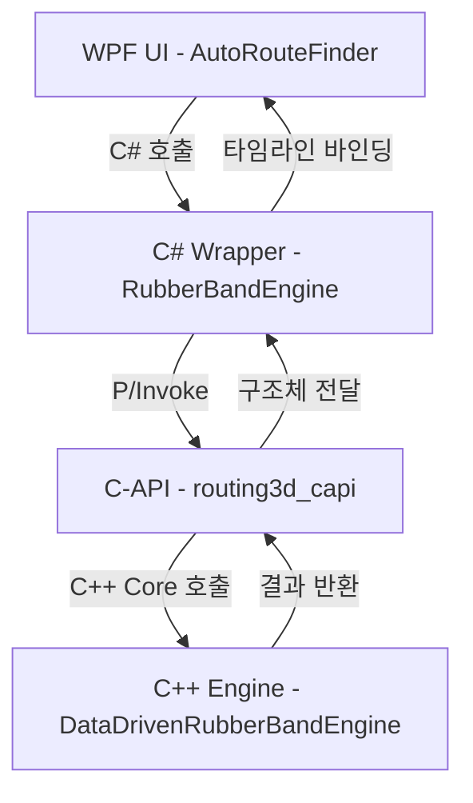

# 3차원 직교형 고무줄 배관 라우팅 엔진 개발 보고서
(3D Orthogonal Rubber-Band Piping Routing Engine Development Report)

본 문서는 축 길이 최대 30,000에 달하는 대공간 건축/플랜트 환경에서 기존 설계 특징점을 반영하고, 복수 배관을 최적의 90도 직교(Orthogonal) 형태로 배치하기 위해 개발된 **"데이터 특징점 및 고무줄 변형(Rubber-Band Sketch Model)"** 기반 3차원 라우팅 엔진의 기술 사양 및 개발 현황을 기록합니다.

---

## 1. 개발 배경 및 목적
1. **대공간 격자(Voxel) 연산 한계 극복**: 단일 축 30,000 이상의 초대형 공간을 복셀 격자로 분할하여 A* 알고리즘 등으로 탐색 시, 기하급수적인 메모리 사용량과 초 단위 연산 병목이 발생합니다.
2. **기하 연산 기반의 초고속 라우팅**: 격자를 생성하지 않고 연속적인 기하 공간(Continuous Geometry) 상에서 결정론적 규칙과 장애물 확장을 활용해 마이크로초(µs) 단위의 속도로 90도 직교 경로를 탐색합니다.
3. **사용자 친화적 단계별 시각화**: 고무줄이 팽팽하게 수축하고 장애물에 걸려 90도로 꺾이는 물리적 변형 단계를 디버거 UI를 통해 시각적으로 제어하고 검증할 수 있도록 지원합니다.

---

## 2. 엔진 아키텍처 및 연동 흐름
전체 엔진은 고성능 C++ 코어 엔진, C-API 바인딩, C# Wrapper 라이브러리, WPF 시뮬레이션 UI의 4단 레이어로 구성됩니다.

1. **C++ Core Engine** (`Routing3D/cpp/src/rubber_band_engine.cpp`): 기하 처리 및 회피 전략 연산 수행.
2. **C-API Wrapper** (`Routing3D/cpp/capi/routing3d_capi.cpp`): C#과의 상호 운용성을 보장하는 C-Linkage 내보내기 함수들 제공.
3. **C# Library** (`AutoRoutingLibrary/Core/RubberBandEngine.cs`): P/Invoke 호출 및 C++ 포인터 자원 자동 해소(`IDisposable` 패턴).
4. **WPF UI Application** (`AutoRouteFinder`): 3D Helix Viewport를 통한 실시간 시뮬레이션 렌더링 및 타임라인 슬라이더 연동.

---

## 3. 고무줄 변형 핵심 4단계 알고리즘 (Deformation Pipeline)

고무줄 변형 모델은 다음의 4단계를 거쳐 경로를 점진적으로 90도 직교화하며 장애물을 회피합니다.

### 1단계: 초기 인장 (Initial Tension)
* **목적**: 출발지(S)와 목적지(D) 사이의 장애물을 무시하고 가장 짧은 다이렉트 직선 경로를 형성합니다.
* **산출**: `{S, D}` 2개의 웨이포인트를 갖는 직선 형태의 고무줄 가이드 라인 생성.

### 2단계: 특징점 고도 스냅 (Z-Layer Snap)
* **목적**: 기존 배관 설계 데이터의 통계적 빈도가 높은 대표 고도(Z-Level)로 경로를 투영하고 수직 상승/하강 구간을 분리합니다.
* **방식**: 
  - 출발/종단의 수직 성향(UP, DOWN, FLAT)을 분석합니다.
  - FLAT 성향일 경우 시작점 근처의 다빈도 Z 레벨로 스냅하고, 수직 성향인 경우 중간 지점과 가장 가까운 다빈도 Z 레벨을 선택합니다.
* **산출**: `{S, (S.x, S.y, Z_way), (D.x, D.y, Z_way), D}` 4개의 수직 분할 웨이포인트 생성.

### 3단계: 장애물 간섭 감지 (Obstacle Interference)
* **목적**: 수평 이동 세그먼트 구간 내에서 충돌을 일으키는 거대 장애물과 가깝게 부딪히는 모서리 영역을 검출합니다.
* **방식**:
  - 트레이 폭(W), 높이(H), 안전 마진을 합산하여 모든 장애물 AABB를 사전 가상 확장(Padding) 처리합니다.
  - 확장된 AABB와 수평 세그먼트 간의 Ray-AABB 교차 검사를 수행하여 충돌 포인트(CP, Red Spheres)를 추출합니다.

### 4단계: 최종 변형 완료 (Deformation)
장애물 충돌 감지 시, 다음의 3대 회피 전략을 우선순위에 따라 순차적으로 적용하여 직각 우회 웨이포인트를 생성합니다.
1. **1순위 (특징점 터널링 - Spine Tunneling)**: 충돌 지점 인근에 다빈도 꺾임 영역(Zone) 틈새가 존재하고 간섭이 없다면, 해당 터널링 포인트로 고무줄을 스냅해 90도로 우회합니다.
2. **2순위 (수직 오버/언더패스 - Vertical Bypass)**: 현재 수직 꺾임 횟수가 최대 허용치(Max Bends) 이하인 경우, 다빈도 Z 레벨 중 장애물의 상단 또는 하단 공간을 거치는 입체 우회 경로를 생성합니다.
3. **3순위 (xy 외곽 최소 마진 우회 - Horizontal Bypass)**: 장애물의 확장된 AABB 모서리를 안전 마진을 적용해 XY 평면 상에서 90도로 꺾어 감싸 도는 우회 경로를 계산합니다.

---

## 4. 다발 배관 개별 좌표 분배 (Multi-Pipe Distribution)
* 최종 생성된 중심선(Centerline) 경로 상의 각 세그먼트 진행 방향에 대해, XY 평면 내 법선 벡터(Normal Vector) 방향으로 개별 오프셋 좌표를 도출합니다.
* 공식: `pt.x += nx * offset_mag`, `pt.y += ny * offset_mag`
* 이를 통해 트레이 내에 배치되는 복수 배관(Pipe Count)이 피치(Pipe Pitch) 간격을 일정하게 유지하며 평행하게 배치되도록 분배합니다.

---

## 5. UI 시각화 색상 스키마 (Color Schemes)
WPF 시뮬레이터에서는 4단계의 시각적 검증을 위해 Helix 3D 뷰포트에 5가지 전용 색상 필터를 적용합니다.

* **Green (출발/목적지)**: 라우팅 대상 배관 작업의 시종단 앵커 구체.
* **Blue (특징점 영역)**: 통계 데이터에서 추출된 다빈도 Z 레이어 평면 가이드 및 꺾임 가이드 박스.
* **Yellow (변형 중인 고무줄 경로)**: 슬라이더 조작에 따라 당겨지고 있는 고무줄 가이드 튜브.
* **Red (충돌 모서리)**: 고무줄이 장애물 모퉁이에 부딪혀 걸려 있는 간섭 지점 구체.
* **White/Gray (확장 장애물)**: 트레이 사양과 안전 마진에 의해 패딩 연산이 완료된 투명 가상 장애물 박스.

---

## 6. 향후 예정된 개선 사항 (진행 계획)
사용자 피드백을 기반으로 아래의 사용성 및 기하 정밀도 문제를 해결할 예정입니다.

1. **다중 시종단 개별 연결선(Tails Routing) 연동**:
   - 현재는 단일 시작점/끝점으로 계산된 중심선에서 오프셋하여 다발 배관을 분배하므로, 각 배관의 실제 실제 출발점(빨강)과 종단점(파랑)의 개별 연결이 누락되거나 어긋납니다.
   - C++ 코어 엔진을 개별 `starts` 및 `ends` 배열을 동시에 주입받는 방식으로 확장하고, 각 배관 오프셋 경로의 끝단에서 실제 PoC까지 90도 수직/수평 꼬리 연결 세그먼트를 자동으로 이어 붙여 직교성을 완성할 계획입니다.
2. **3D 뷰포트 시각적 간섭 해소 (Filtering)**:
   - 전체 159개 이상의 배관 PoC와 기존 설계 배관이 모두 중첩되어 가림 현상이 발생합니다.
   - 좌측 필터에서 특정 유틸리티(예: `ALKA`) 선택 시, 이에 해당하는 PoC 구체 마커 및 기존 배관만 렌더링하고 나머지는 감추어 고무줄 경로 매칭 결과를 시각적으로 선명하게 확인 가능하도록 렌더링 구조를 변경합니다.
