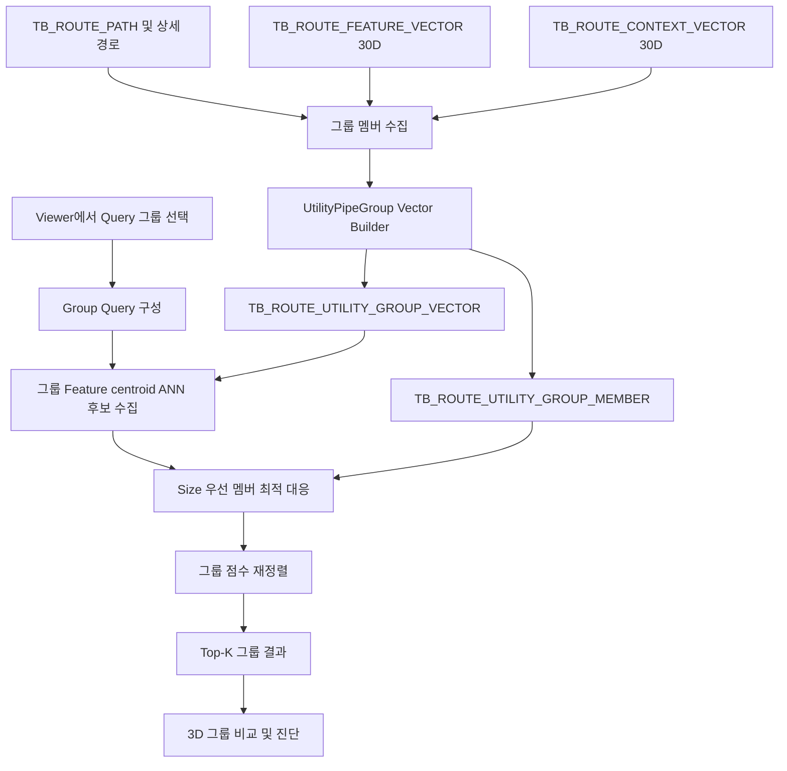

# 유틸리티 배관 그룹 Top-K 개발 계획서

- 작성일: 2026-07-16
- 대상 프로젝트: `D:\DINNO\DEV\AI-AutoRouting\TopKGen`
- 문서 상태: 단계 0~6 구현 완료, 최종 회귀검증 완료
- 검색 단위: `장비 + Utility Group + Utility`
- 핵심 산출물: 그룹 Vector 생성기, 그룹 Top-K 검색 API, TopK.3DViewer 그룹 검색/검증 UI

## 1. 목적

현재 Top-K 검색은 하나의 배관 경로를 Query로 사용하고 `TB_ROUTE_FEATURE_VECTOR`의 개별 경로를 검색한다. 신규 기능은 동일 장비의 동일 Utility Group 및 Utility에 속한 여러 배관을 하나의 `UtilityPipeGroup`으로 정의하고, 과거 설계의 유사한 배관 그룹을 Top-K로 검색한다.

```text
현재
장비 + Utility Group + Utility + 시작/종점 → 개별 Route Top-K

신규
장비 + Utility Group + Utility → 복수 Route로 구성된 UtilityPipeGroup Top-K
```

신규 기능은 기존 개별 Route Top-K를 변경하거나 제거하지 않고 별도 검색 모드로 추가한다. 따라서 기존 사용자와 API의 동작을 유지하면서 단계적으로 배포할 수 있어야 한다.

## 2. 확정 요구사항

1. 그룹 선택 기준은 사용자 관점에서 `장비명 + Utility Group + Utility`로 한다.
2. 한 그룹은 동일 조건에 속한 2개 이상의 배관 Route로 구성한다.
3. Size는 기본 그룹 키에 포함하지 않는다.
4. 같은 Utility는 동일 Size일 가능성이 높으므로 Size는 멤버 대응의 강한 우선조건으로 사용한다.
5. 그룹 Vector를 사전에 생성해 PostgreSQL에 저장한다.
6. 그룹 대표 Vector로 1차 ANN 후보를 수집하고, 후보 그룹의 멤버를 정밀 대응시켜 최종 순위를 계산한다.
7. 기존 Position, Pattern, Feature, Context 원점수와 가중치 설정을 그룹 검색에서도 재사용한다.
8. TopK.3DViewer에서 Query 그룹과 Top-K 후보 그룹의 전체 배관을 3차원으로 확인할 수 있어야 한다.
9. Query와 Candidate의 대응 배관, 미대응 배관, Size 불일치를 화면에서 구분해야 한다.
10. 기존 개별 검색, Context ACTIVE scope 검증, JSON 가중치 저장 기능은 회귀 없이 유지해야 한다.

## 3. 범위

### 3.1 포함 범위

- UtilityPipeGroup 데이터 계약 및 Migration
- 기존 개별 30D Feature Vector를 이용한 그룹 대표 Vector 생성
- 그룹 Context 대표 Vector 생성
- 그룹 내 배관 배치 통계 및 Arrangement 특징 생성
- 그룹 Vector 전체/증분 생성 CLI
- 그룹 ANN 후보 검색
- Size 호환성을 포함한 멤버 최적 대응
- 그룹 Position/Pattern/Feature/Context/Coverage/Arrangement 점수 계산
- TopK.3DViewer 개별/그룹 검색 모드
- 그룹 전체 배관 및 주변 장애물 3D 표시
- 단위·통합·DB·UI 검증
- 사용자 매뉴얼 및 운영 명령어 추가

### 3.2 제외 범위

- 검색 결과를 이용한 신규 배관 자동 라우팅 생성
- RubberBandRouting 엔진 자동 연동
- 딥러닝 기반 그룹 Embedding
- Neo4j 기반 그룹 후보 검색
- 기존 `TB_ROUTE_GROUP_PATTERN` 추출 알고리즘 변경
- 기존 개별 Route Feature Vector 30D 규격 변경

## 4. 현행 구조 분석과 제약사항

### 4.1 현재 개별 Top-K

`TopKSearchStandalone.SearchAsync()`는 시작/종점으로 30D Query Vector를 만들고 `TB_ROUTE_FEATURE_VECTOR`에서 개별 Route 후보를 조회한다. 이후 Position, Pattern, Feature Vector, Context Vector 원점수를 가중합해 재정렬한다.

현재 API에서 `Utility` 필터만 비우면 여러 Utility의 개별 Route가 한 결과 목록에 섞일 뿐, 복수 배관을 하나의 후보 그룹으로 평가하지 않는다. 따라서 Utility 필터 제거만으로 그룹 Top-K를 구현할 수 없다.

### 4.2 `TB_ROUTE_GROUP_PATTERN`과의 차이

`TB_ROUTE_GROUP_PATTERN`은 평행하게 나란히 주행하는 국부 다발 구간을 저장한다. 주요 키에 `UTILITY`가 포함되고 `SECTION_BOUNDS`, `PITCH_MM`, `OFFSET_AXIS`, `TRUNK_GEOM_3D`, 60D `FEAT` 등을 보유한다.

이 테이블은 전체 장비의 동일 Utility Route 집합을 나타내지 않으므로 UtilityPipeGroup 검색 원본으로 직접 사용하지 않는다. 다만 후보 그룹의 배치 유사도를 계산할 때 Pitch, 평행성, Trunk 방향 등의 보조 정보로 선택적으로 활용한다.

### 4.3 기존 Design Group 코드 제약

`Tools/BuildDesignGroups.py`는 현재 저장소에 없는 `AutoRouteDesigner.group_builder`를 import하고, 문서에서 언급한 `create_auto_design_tables.sql`도 현재 체크아웃에 없다. 따라서 신규 기능은 이 스크립트에 의존하지 않고 독립적으로 완결된 Migration과 빌더를 제공한다.

### 4.4 그룹 식별의 주의점

사용자 화면의 그룹 기준은 `장비명 + Utility Group + Utility`이지만, DB 내부 식별자는 다음 범위를 포함해야 한다.

```text
PROJECT_SCOPE_KEY
+ MODEL_REVISION_KEY
+ PROCESS_NAME
+ EQUIPMENT_INSTANCE_KEY
+ UTILITY_GROUP
+ UTILITY
```

장비명이 장비 타입명이고 여러 실제 장비 인스턴스가 같은 이름을 공유한다면 서로 다른 물리 장비의 Route가 합쳐질 수 있다. `EQUIPMENT_INSTANCE_ID`, `OWNER_INSTANCE_GUID`, `EQUIPMENT_TAG` 등 안정적인 인스턴스 키를 우선 사용하고, 없을 때만 정규화된 `EQUIPMENT_NAME`을 fallback으로 사용한다.

## 5. 목표 아키텍처



검색은 다음 2단계로 분리한다.

1. **후보 수집**: 그룹 Feature centroid의 pgvector ANN 검색으로 `fetchN`개 후보 그룹을 빠르게 조회한다.
2. **정밀 재정렬**: Query/Candidate 그룹 멤버를 대응시키고 기존 4개 원점수, Coverage, Arrangement를 계산해 상위 K개 그룹을 확정한다.

## 6. DB 설계 계획

신규 테이블명은 기존 `TB_ROUTE_GROUP_PATTERN`과 의미 충돌을 피하기 위해 `UTILITY_GROUP_VECTOR` 명칭을 사용한다.

### 6.1 `TB_ROUTE_UTILITY_GROUP_VECTOR`

| 컬럼 | 형식 | 설명 |
|---|---|---|
| `GROUP_VECTOR_ID` | text PK | 범위·장비 인스턴스·Utility 조건·멤버 Source Hash 기반 안정 ID |
| `PROJECT_SCOPE_KEY` | text | 프로젝트 범위 |
| `MODEL_REVISION_KEY` | text | 모델 Revision |
| `PROCESS_NAME` | text | 공정명 |
| `EQUIPMENT_INSTANCE_KEY` | text | 물리 장비 인스턴스 식별자 |
| `EQUIPMENT_NAME` | text | 화면 표시용 장비명 |
| `EQUIPMENT_FAMILY_KEY` | text | 후보 호환성 필터용 장비 타입/Family |
| `UTILITY_GROUP` | text | Utility Group |
| `UTILITY` | text | Utility |
| `MEMBER_COUNT` | integer | 그룹 내 Route 수 |
| `SIZE_SIGNATURE` | jsonb | Size별 멤버 수. 예: `{"50A":3,"65A":1}` |
| `MEMBER_GUIDS` | jsonb | 정렬된 Route GUID 목록 |
| `FEATURE_CENTROID` | vector(30) | 멤버 30D Feature Vector의 정규화 평균 |
| `CONTEXT_CENTROID` | vector(30) nullable | 호환 Context Vector의 정규화 평균 |
| `ARRANGEMENT_VECTOR_JSON` | jsonb | 그룹 배치 통계 Vector 및 버전 |
| `START_CENTROID_X/Y/Z` | double precision | 멤버 시작점 중심 |
| `END_CENTROID_X/Y/Z` | double precision | 멤버 종점 중심 |
| `AABB_MIN/MAX_X/Y/Z` | double precision | 그룹 전체 공간 범위 |
| `FEATURE_COVERAGE` | double precision | Feature Vector 보유 멤버 비율 |
| `CONTEXT_COVERAGE` | double precision | 호환 Context Vector 보유 멤버 비율 |
| `SOURCE_HASH` | text | 멤버·Vector·설정 입력 해시 |
| `BUILD_RUN_ID` | text | 생성 실행 ID |
| `ENCODER_VERSION` | text | 그룹 Encoder 버전 |
| `ENCODER_CONFIG_HASH` | text | Encoder 설정 해시 |
| `STATUS` | text | `BUILDING/READY/FAILED/STALE` |
| `CREATED_AT/UPDATED_AT` | timestamptz | 생성·수정 시각 |

권장 인덱스:

```sql
UNIQUE (
  "PROJECT_SCOPE_KEY", "MODEL_REVISION_KEY",
  "EQUIPMENT_INSTANCE_KEY", "UTILITY_GROUP", "UTILITY"
)

BTREE ("EQUIPMENT_FAMILY_KEY", "UTILITY_GROUP", "UTILITY")
HNSW  ("FEATURE_CENTROID" vector_cosine_ops)
BTREE ("STATUS", "PROJECT_SCOPE_KEY", "MODEL_REVISION_KEY")
```

### 6.2 `TB_ROUTE_UTILITY_GROUP_MEMBER`

| 컬럼 | 형식 | 설명 |
|---|---|---|
| `GROUP_VECTOR_ID` | text FK | 소속 그룹 |
| `ROUTE_PATH_GUID` | text | 개별 Route GUID |
| `MEMBER_ORDER` | integer | 결정론적 표시 순서 |
| `UTILITY` | text | Utility 검증용 |
| `SIZE` | text | 배관 Size |
| `START_X/Y/Z` | double precision | 시작 좌표 |
| `END_X/Y/Z` | double precision | 종점 좌표 |
| `DIRECTION_PATTERN` | text | 방향 Pattern |
| `TOTAL_LENGTH_MM` | double precision | 총 길이 |
| `STEP_COUNT` | integer | Step/Segment 수 |
| `FEATURE_VECTOR_BUILD_RUN_ID` | text | 사용한 개별 Feature 생성 이력 |
| `CONTEXT_VECTOR_BUILD_RUN_ID` | text nullable | 사용한 Context 생성 이력 |

기본키는 `(GROUP_VECTOR_ID, ROUTE_PATH_GUID)`로 한다. 개별 Vector는 원본 테이블과 JOIN하여 읽되, 사용한 Build Run 및 Source Hash를 그룹 테이블에 기록해 재현성을 보장한다.

### 6.3 Migration 특성

- 신규 테이블과 인덱스만 추가하는 additive migration으로 작성한다.
- 기존 테이블을 DROP 또는 ALTER하지 않는다.
- pgvector 확장과 Vector 차원을 preflight에서 검사한다.
- 재실행 가능한 `CREATE TABLE/INDEX IF NOT EXISTS` 방식으로 작성한다.
- rollback은 신규 테이블/인덱스만 제거하는 별도 SQL로 제공한다.

예정 파일:

```text
Tools/sql/create_route_utility_group_vector_tables.sql
Tools/sql/drop_route_utility_group_vector_tables.sql
```

## 7. 그룹 Vector 생성 알고리즘

### 7.1 입력 데이터

| 입력 | 용도 |
|---|---|
| `TB_ROUTE_PATH` | 장비, Utility Group, Utility, Size, 시작/종점, Route 메타 |
| `TB_ROUTE_FEATURE_VECTOR` | 개별 Route 30D Feature Vector |
| `TB_ROUTE_CONTEXT_VECTOR` | 개별 Route 30D Context Vector와 provenance |
| Route 상세점 테이블 | 그룹 AABB, 배치 통계, 3D 표시 검증 |
| `TB_ROUTE_SOURCE_SCOPE_MANIFEST` | ACTIVE project/revision 선택 및 호환성 검증 |

### 7.2 그룹 멤버 수집

1. 대상 project/revision을 확정한다.
2. 유효한 장비 인스턴스 키를 결정한다.
3. `(scope, revision, process, equipment instance, utility group, utility)`로 Route를 그룹화한다.
4. Route GUID를 정렬해 결정론적인 그룹 ID와 Source Hash를 만든다.
5. 기본 `minMemberCount=2` 미만 그룹은 제외한다.
6. Feature coverage가 기준 미만인 그룹은 `FAILED` 또는 `STALE`로 기록하고 검색 대상에서 제외한다.

### 7.3 Feature centroid

각 멤버의 L2 정규화된 30D Vector를 평균한 뒤 다시 L2 정규화한다.

```text
rawCentroid[d] = Σ memberFeature[i][d] / memberCount
FEATURE_CENTROID = L2Normalize(rawCentroid)
```

Size가 다른 멤버에 별도 가중치를 주지 않는다. Size는 검색 시 멤버 대응 조건으로 평가해 그룹 대표 Vector가 특정 Size에 편향되지 않게 한다.

### 7.4 Context centroid

동일 project/revision, encoder version/config hash에 속한 Context Vector만 집계한다.

```text
CONTEXT_CENTROID = L2Normalize(호환 Context Vector 평균)
CONTEXT_COVERAGE = 호환 Context 멤버 수 / 전체 멤버 수
```

서로 다른 snapshot 또는 encoder 설정의 Context를 한 그룹에 혼합하지 않는다. Context coverage가 부족해도 Feature 그룹 검색은 허용하되, 검색 결과에 fallback과 coverage를 표시한다.

### 7.5 Arrangement 특징

멤버 순서에 영향을 받지 않는 통계로 구성한다.

- 시작점과 종점의 축별 분산/표준편차
- 그룹 전체 AABB 크기
- 멤버 변위벡터의 평균 및 분산
- 시작점/종점 pairwise 거리의 평균·표준편차·최솟값·최댓값
- Route 길이와 Bend 수의 평균·표준편차
- Size 분포와 멤버 수
- 선택적으로 `TB_ROUTE_GROUP_PATTERN`의 Pitch/Offset Axis/Trunk 방향 통계

초기 버전은 JSON에 명시적인 이름/값으로 저장한다. 데이터 분포와 정규화 상수를 확정한 뒤 고정 차원 pgvector가 필요하면 후속 migration으로 승격한다.

### 7.6 전체/증분 생성

예정 모듈:

```text
Tools/BuildUtilityPipeGroupVectors.py
Tools/utility_pipe_group_encoder.py
Tools/tests/utility_pipe_group_encoder_tests.py
```

명령 계약 초안:

```powershell
python Tools\BuildUtilityPipeGroupVectors.py create-schema `
  --config Tools\tools.settings.json

python Tools\BuildUtilityPipeGroupVectors.py build `
  --config Tools\tools.settings.json `
  --scope-mode active `
  --min-members 2

python Tools\BuildUtilityPipeGroupVectors.py validate `
  --config Tools\tools.settings.json `
  --scope-mode active
```

증분 생성은 `SOURCE_HASH`가 동일한 READY 그룹은 건너뛰고, 멤버 또는 원본 Vector가 변경된 그룹만 재생성한다.

## 8. 그룹 Top-K 검색 알고리즘

### 8.1 신규 API

기존 `TopKSearchStandalone.SearchAsync()`는 유지하고 다음 API를 추가한다.

```csharp
SearchUtilityPipeGroupsAsync(
    DbConfig db,
    string processName,
    string equipmentInstanceKey,
    string equipmentFamilyKey,
    string utilityGroup,
    string utility,
    int k,
    GroupSizeMatchMode sizeMatchMode,
    RerankWeights rerankWeights,
    bool useObstacleContext,
    string projectScopeKey = "",
    string modelRevisionKey = "")
```

예정 코드:

```text
TopKSearchStandalone/UtilityPipeGroupModels.cs
TopKSearchStandalone/UtilityPipeGroupSearch.cs
TopKSearchStandalone/UtilityPipeGroupMatcher.cs
```

### 8.2 Query 그룹 결정

- Viewer에서 선택한 그룹 ID가 있으면 저장된 그룹 Vector와 멤버를 Query로 사용한다.
- 장비/Utility 조건만 입력한 경우 ACTIVE scope에서 Query 그룹을 조회한다.
- 검색 결과에는 Query 자신을 제외한다.
- Candidate filter는 `UTILITY_GROUP + UTILITY`를 필수로 한다.
- 장비명 자체가 유일 인스턴스명이라 후보가 부족할 수 있으므로 `EQUIPMENT_FAMILY_KEY` 일치 여부를 선택 필터로 제공한다.

### 8.3 1차 후보 수집

```text
fetchN = clamp(max(K × 20, 100), 100, 1000)
```

```sql
WHERE "STATUS" = 'READY'
  AND "UTILITY_GROUP" = @utilityGroup
  AND "UTILITY" = @utility
  AND "GROUP_VECTOR_ID" <> @queryGroupId
ORDER BY "FEATURE_CENTROID" <=> @queryFeatureCentroid
LIMIT @fetchN
```

필요하면 Process, Equipment Family, project/revision 정책을 추가 필터로 적용한다.

### 8.4 Size 대응 정책

```csharp
enum GroupSizeMatchMode
{
    PreferExact, // 기본값: 동일 Size 우선, 다른 Size는 감점
    ExactOnly,   // 동일 Size끼리만 대응
    Ignore       // Size를 사용하지 않음
}
```

기본 Size 호환 점수 초안:

| 조건 | SizeScore |
|---|---:|
| 정규화 Size 완전 일치 | 1.00 |
| 인접 Size 단계 | 0.80 |
| 두 단계 차이 | 0.50 |
| 그 이상 또는 파싱 불가 | 0.00 또는 정책 fallback |

Size 단계표는 하드코딩하지 않고 JSON 설정 또는 DB 규칙 테이블로 분리한다. 초기 데이터 프로파일링에서 실제 Size 문자열과 단계 순서를 확정한다.

### 8.5 멤버 Pair 점수

Query 멤버 `q`와 Candidate 멤버 `c`의 원점수는 기존 개별 검색과 동일하게 계산한다.

```text
PairBase(q,c)
= Position(q,c) × WPosition
 + Pattern(q,c) × WPattern
 + Feature(q,c) × WFeature
 + Context(q,c) × WContext

PairAdjusted(q,c)
= PairBase(q,c) × SizeScore(q,c)
```

가중치가 0보다 큰 기존 네 항목은 현재 Viewer 계약대로 균등 배분한다. 각 원점수, 적용 가중치, 최종 기여도는 결과 진단에 보존한다.

### 8.6 멤버 최적 대응

그룹 멤버는 순서가 없는 집합이므로 배열 인덱스로 대응시키지 않는다.

1. Query/Candidate 멤버의 모든 PairAdjusted 점수 행렬을 만든다.
2. `ExactOnly`이면 Size가 다른 pair를 금지한다.
3. Hungarian Algorithm으로 전체 합이 최대가 되는 1:1 대응을 구한다.
4. 대응되지 않은 Query/Candidate 멤버를 별도 목록으로 보존한다.

멤버 수가 매우 작으면 완전탐색 결과와 Hungarian 결과를 비교하는 단위 테스트를 작성한다.

### 8.7 그룹 최종 점수

```text
MatchedAverage
= 대응된 PairAdjusted 점수의 평균

Coverage
= 2 × MatchedCount
 / (QueryMemberCount + CandidateMemberCount)

Arrangement
= 시작/종점 배치, 간격, 높이, 평행성, AABB 형상의 유사도

GroupSimilarity
= Coverage
 × (MatchedAverage × WMatched + Arrangement × WArrangement)
```

초기 기본값:

```text
WMatched     = 0.80
WArrangement = 0.20
```

두 값은 `viewer.settings.json` 및 검색 API 옵션으로 설정하고 합계 1로 정규화한다. 이 값은 기존 네 원점수 가중치와 역할이 다르므로 별도 UI 영역에 표시한다.

최종 결과에는 다음 진단값을 제공한다.

- `GroupSimilarity`
- `MatchedAverage`
- `Coverage`
- `Arrangement`
- `MatchedCount / QueryCount / CandidateCount`
- 멤버별 Position/Pattern/Feature/Context/Size/PairAdjusted
- Context coverage/fallback
- 적용된 Weight Profile과 Size 정책

## 9. TopK.3DViewer 개발 계획

### 9.1 검색 모드

좌측 검색조건 상단에 검색 단위를 추가한다.

```text
검색 단위
(●) 개별 배관
( ) Utility 배관 그룹
```

개별 모드는 현재 화면과 동작을 그대로 유지한다.

### 9.2 그룹 Query 선택 UI

- Process
- 장비 또는 장비 인스턴스
- Utility Group
- Utility
- Size 대응 정책
- Query 그룹 프리셋
- 그룹 멤버 DataGrid
- 멤버 전체 선택/해제
- 멤버 수 및 Size 분포

프리셋 선택 시 그룹의 모든 실제 배관과 주변 장애물을 3D 화면에 먼저 표시한다.

### 9.3 그룹 Top-K 결과 UI

우측 결과의 한 행은 개별 Route가 아니라 후보 그룹 하나를 나타낸다.

| 열 | 설명 |
|---|---|
| Rank | 그룹 순위 |
| Similarity | 최종 그룹 유사도 |
| Matched | 대응 수/Query 수/Candidate 수 |
| Coverage | 멤버 구성 일치도 |
| Arrangement | 그룹 배치 유사도 |
| Equipment | 후보 장비 |
| Utility | Utility |
| Sizes | Size 분포 |
| 3D | 실제/부분 재구성 상태 |

선택 상세에는 계산식을 값과 함께 표시한다.

```text
MatchedAverage : 0.920000 × 0.80 = 0.736000
Arrangement    : 0.850000 × 0.20 = 0.170000
Coverage       : 0.888889
------------------------------------------------
GroupSimilarity: (0.736000 + 0.170000) × 0.888889
               = 0.805333
```

그 아래에 멤버 대응표를 표시한다.

```text
Query ACID/50A #1 → Candidate ACID/50A #3 : 0.963
Query ACID/50A #2 → Candidate ACID/50A #1 : 0.941
Query ACID/65A #3 → Candidate ACID/50A #2 : 0.752 (Size 감점)
미대응 Candidate: ACID/80A #4
```

### 9.4 3D 표시 규칙

- Query 그룹: 파란색 계열 또는 반투명 기준선
- 선택 Candidate 그룹: 대응 Pair별 고유 색상
- Query/Candidate에서 대응된 배관: 동일 계열 색상
- 미대응 Query 멤버: 빨간색 굵은 점선
- 미대응 Candidate 멤버: 주황색 점선
- Size 불일치 Pair: 노란색 강조
- 시작점/종점: 기존 구 표시 유지
- 주변 Column/Beam: 기존 Context 장애물 표시 재사용
- `실제 DB 상세경로`와 `메타데이터 재구성` 상태를 그룹 및 멤버 수준에서 각각 표시

보기 방식:

1. **원좌표 보기**: 실제 공간 위치에서 Query/Candidate 표시
2. **정렬 비교 보기**: Candidate 시작 중심을 Query 시작 중심에 평행이동해 형상/배치 비교
3. **나란히 보기**: Query와 Candidate를 일정 거리만큼 분리해 육안 비교

초기 구현은 원좌표 보기와 나란히 보기를 제공하고, 정렬 비교는 2차 고도화 항목으로 둔다.

### 9.5 설정 JSON

`viewer.settings.json`에 다음 항목을 추가한다.

```json
{
  "groupSearch": {
    "minMemberCount": 2,
    "sizeMatchMode": "PreferExact",
    "matchedWeight": 80,
    "arrangementWeight": 20,
    "candidateFetchMultiplier": 20,
    "minimumCoverage": 0.5,
    "showUnmatchedMembers": true
  }
}
```

UI 변경 시 기존 설정 저장 규칙과 동일하게 JSON에 자동 저장한다.

## 10. 개발 단계 및 승인 게이트

| 단계 | 개발 내용 | 주요 산출물 | 완료/승인 기준 |
|---:|---|---|---|
| 0 | 데이터 프로파일링 및 그룹 키 확정 | 그룹 수, 멤버 수, Size 분포, 장비 인스턴스 키 보고서 | 잘못 합쳐지는 장비가 없고 Top-K 후보 수가 충분함 |
| 1 | DB Migration 및 모델 계약 | 신규 2개 테이블, 인덱스, rollback SQL, 모델 | 재실행 가능, 기존 스키마 무변경 |
| 2 | 그룹 Vector 생성기 | Builder, encoder, validation, 단위 테스트 | 결정론적 ID/Vector, coverage/provenance 검증 통과 |
| 3 | 그룹 Top-K 검색 API | ANN 조회, Size 정책, Hungarian matcher, 점수 진단 | 순서 불변성, 자기검색 제외, 점수식 golden test 통과 |
| 4 | 3D Viewer 그룹 모드 **완료** | Query/결과/상세/3D 비교 UI | K개 그룹 및 전체 멤버 표시, 실제/재구성 상태 진단 |
| 5 | 정량 평가와 성능 튜닝 **완료** | A/B, latency, 사례 분석 보고서 | 결정론/자기제외 100%, Baseline P95 282.0ms |
| 6 | 매뉴얼·운영·배포 **완료** | 사용자 매뉴얼, 실행 명령, 장애 대응 | 통합 매뉴얼과 신규 환경 배포 순서 제공 |

각 단계 완료 후 결과와 다음 단계 변경 목록을 보고하고 승인을 받은 뒤 다음 단계로 진행한다.

## 11. 단계별 상세 개발 항목

### 단계 0. 데이터 프로파일링

- 장비 인스턴스 식별 후보 컬럼 조사
- `(장비 인스턴스, Utility Group, Utility)`별 그룹/멤버 수 집계
- 1개 멤버 그룹과 2개 이상 그룹 비율
- 동일 그룹 내 Size 단일/혼합 비율
- Feature/Context Vector coverage
- 동일 장비 Family의 후보 그룹 수
- 원본 상세 경로 GUID 연결률
- 기존 `TB_ROUTE_GROUP_PATTERN` 보조 정보 연결률
- 결과에 따라 `minMemberCount`, Size 정책, 후보 필터 확정

### 단계 1. Schema 및 계약

- create/drop migration
- C#/Python 공용 컬럼 계약 문서
- ACTIVE scope 및 provenance 규칙
- 그룹 상태 전이 `BUILDING → READY/FAILED/STALE`
- 중복/재실행/부분 실패 트랜잭션 정책
- HNSW index 생성 및 데이터 건수별 index build 정책

### 단계 2. Vector Builder

- Route/Feature/Context batch 조회
- 그룹 키 및 stable ID 생성
- Feature/Context centroid
- Arrangement 통계
- Source Hash 및 증분 판정
- staging 후 원자적 READY 전환
- build/validate/status CLI
- 누락 Vector 및 불량 좌표 진단 리포트

### 단계 3. 검색 API

- Group Query 모델
- Candidate SQL과 ANN
- Size parser 및 compatibility policy
- Pair 원점수 계산 재사용
- Hungarian matcher
- Coverage/Arrangement/최종 점수
- 상세 진단 DTO
- Context 미색인 후보 fallback
- 검색 결과 결정론 및 tie-break 규칙
- CLI smoke command 추가

### 단계 4. Viewer

- 개별/그룹 모드 전환
- 그룹 프리셋과 멤버 목록
- 그룹 결과 DataGrid
- 멤버 대응 상세
- 실제/재구성 형상 표시
- 장애물 표시와 카메라 범위 최적화
- 많은 멤버의 렌더링 성능 제한
- 설정 JSON 확장 및 자동 저장

### 단계 5. 평가

- Query 자신 제외 Leave-One-Group-Out
- 동일 그룹 멤버 순서 변경 불변성
- Size 완전일치/혼합 Size 비교
- 멤버 누락/추가에 대한 Coverage 감점
- Context On/Off A/B
- Arrangement On/Off A/B
- Top-1/Top-3/Top-5 정성 검토
- 후보 수와 검색시간 측정
- 3D 실제 경로 로딩률 측정

### 단계 6. 문서와 배포

- Vector 생성 운영 명령
- Migration 실행/rollback
- 그룹 검색 API 예제
- Viewer 사용자 매뉴얼
- 점수 해석 예제
- 장애/데이터 누락 대응표
- 기존 개별 검색과 그룹 검색 선택 기준

## 12. 시험 계획

### 12.1 단위 테스트

- 멤버 순서가 달라도 같은 GROUP_VECTOR_ID/centroid 생성
- Feature centroid L2 norm 검증
- 서로 다른 scope/revision Vector 혼합 방지
- Size 문자열 정규화와 단계 점수
- Hungarian 최적 대응 golden case
- 모든 가중치 0 거부
- 0보다 큰 기존 네 가중치 균등 배분
- Coverage 계산
- GroupSimilarity 계산식
- 미대응 멤버 처리

### 12.2 DB 통합 테스트

- Migration 2회 실행
- 빈 DB/부분 테이블/pgvector 미설치 진단
- 전체 build 후 group/member count 정합성
- 증분 build no-op 및 일부 변경 재생성
- HNSW query plan 확인
- ACTIVE scope 0개/1개/복수 오류 처리
- 원본 Vector build run 변경 시 STALE 전환

### 12.3 검색 정확성 테스트

- Query 자신 결과 제외
- 동일 Size 후보 우선
- 동일 형상이나 멤버 수가 다른 후보의 Coverage 감점
- 개별 점수는 높지만 그룹 배치가 다른 후보의 Arrangement 감점
- Context가 유사/상이한 후보 순위 변화
- 동일 점수 tie-break의 결정론

### 12.4 Viewer 테스트

- 그룹 프리셋 선택 즉시 전체 실제 배관 표시
- K개 그룹 결과 표시
- 후보 선택 시 전체 멤버 갱신
- 대응 Pair 동일 색상
- 미대응 및 Size 불일치 강조
- 장애물 On/Off
- 실제 상세경로가 없는 멤버의 재구성 표시
- 그룹 멤버 수 증가 시 UI 응답성과 메모리 확인

## 13. 잠정 품질 기준

단계 0의 데이터 규모 측정 후 최종 수치를 승인한다. 초기 목표는 다음과 같다.

| 항목 | 잠정 목표 |
|---|---:|
| Vector build 정합성 | 유효 입력 대비 99% 이상 READY 또는 누락 사유 명시 |
| 검색 결과 결정론 | 동일 입력 반복 시 100% 동일 |
| 그룹 자신 제외 | 100% |
| 실제 상세경로 3D 표시율 | 연결 가능한 GUID 기준 100% |
| ANN 후보 조회 | warm DB 기준 500ms 이내 |
| 최종 Top-K 검색 | 일반 그룹 크기 기준 2초 이내 |
| Viewer 검색/렌더링 | 일반 K=5 기준 3초 이내 |
| 기존 개별 Top-K 회귀 | 기존 테스트 및 빌드 모두 통과 |

정확도는 정답 레이블이 없으므로 초기에는 설계자 Top-5 적합 판정률과 Leave-One-Group-Out 사례 분석으로 측정한다.

## 14. 위험요소와 대응

| 위험 | 영향 | 대응 |
|---|---|---|
| 장비명이 인스턴스를 식별하지 못함 | 서로 다른 물리 장비 Route가 한 그룹으로 합쳐짐 | 안정 인스턴스 키 조사 및 필수화 |
| 정확한 그룹 후보가 부족함 | Top-K 의미 저하 | Equipment Family 및 project 정책을 단계적 fallback으로 제공 |
| 동일 Utility 내 혼합 Size | 잘못된 멤버 대응 | PreferExact/ExactOnly/Ignore 정책과 Size 분포 표시 |
| Feature centroid 정보 손실 | ANN 후보 누락 | fetchN 확대 후 멤버 정밀 재정렬, recall 평가 |
| 멤버 수 차이 | 큰 그룹이 유리하거나 불리함 | 대칭 Coverage 공식 적용 |
| Context Vector scope 혼합 | 잘못된 환경 유사도 | snapshot/version/config hash strict gate |
| 실제 상세 GUID 미연결 | 3D 재구성 형상이 실제처럼 보임 | 그룹/멤버별 실제·재구성 라벨과 표시 방식 분리 |
| Hungarian 계산량 | 큰 그룹 검색 지연 | Size 사전 파티션, 후보 제한, 최대 멤버 정책 |
| 기존 그룹 테이블과 혼동 | 운영/문서 오류 | 독립 명칭과 테이블 역할 문서화 |

## 15. 예상 변경 파일

### 신규

```text
Tools/sql/create_route_utility_group_vector_tables.sql
Tools/sql/drop_route_utility_group_vector_tables.sql
Tools/BuildUtilityPipeGroupVectors.py
Tools/utility_pipe_group_encoder.py
Tools/tests/utility_pipe_group_encoder_tests.py
Tools/tests/utility_pipe_group_builder_tests.py
TopKSearchStandalone/UtilityPipeGroupModels.cs
TopKSearchStandalone/UtilityPipeGroupSearch.cs
TopKSearchStandalone/UtilityPipeGroupMatcher.cs
TopKSearchStandalone.Tests/UtilityPipeGroupSearchTests.cs
```

### 수정

```text
TopK.3DViewer/MainWindow.xaml
TopK.3DViewer/MainWindow.xaml.cs
TopK.3DViewer/Models/ViewerModels.cs
TopK.3DViewer/Services/ViewerDatabaseService.cs
TopK.3DViewer/viewer.settings.example.json
TopK.3DViewer/README.md
Docs/ContextVector_and_TopK_User_Manual_KO.md
```

## 16. 예상 일정

데이터/스키마 접근이 정상이고 단계별 승인 지연을 제외한 순수 개발 예상이다.

| 단계 | 예상 |
|---:|---:|
| 0. 데이터 프로파일링 | 1일 |
| 1. Migration/계약 | 1일 |
| 2. Vector Builder | 2~3일 |
| 3. 검색 API/Matcher | 3~4일 |
| 4. 3D Viewer | 3~4일 |
| 5. 평가/튜닝 | 2~3일 |
| 6. 문서/배포 | 1일 |
| 합계 | 약 13~17 개발일 |

## 17. 승인 요청사항

개발 시작 전에 다음 항목을 확정한다.

1. 사용자 그룹 키를 `장비 + Utility Group + Utility`로 확정한다.
2. DB 내부 장비 인스턴스 식별 컬럼은 단계 0 조사 결과로 확정한다.
3. 기본 최소 멤버 수를 2로 한다.
4. 기본 Size 정책을 `PreferExact`로 한다.
5. 최종 그룹 점수 기본 비율을 `MatchedAverage 80% + Arrangement 20%`로 한다.
6. 기존 개별 Top-K와 신규 그룹 Top-K를 Viewer에서 병행 제공한다.
7. 단계 0부터 순차 개발하며 각 단계 완료 후 승인받는다.

승인 후 가장 먼저 단계 0 데이터 프로파일링을 수행하고, 실제 그룹 수·Size 분포·Vector coverage·장비 인스턴스 키 후보를 보고한 뒤 단계 1 Migration을 진행한다.

## 18. 단계 0 실측 반영사항

2026-07-16 ACTIVE `DDW_AI_DB` 프로파일링 결과를 다음과 같이 반영한다. 상세 결과는 `Docs/UtilityPipeGroup_TopK_Phase0_Data_Profile.md`를 참조한다.

| 항목 | 실측 |
|---|---:|
| 유효 Route | 827 |
| 전체 `(장비+Utility Group+Utility)` 그룹 | 186 |
| 멤버 2개 이상 개발 대상 그룹 | 106 |
| 개발 대상 멤버 | 747 |
| 동일 Size 그룹 | 74 / 69.8% |
| 혼합 Size 그룹 | 32 / 30.2% |
| Feature/Context/상세경로 멤버 coverage | 각 100% |
| Utility 후보 버킷 중 그룹 2개 이상 | 22 |
| Utility 후보 버킷 중 그룹 5개 이상 | 9 |

단계 1 계약은 다음과 같이 보정한다.

1. `EQUIPMENT_TAG`를 내부 장비 인스턴스 키로 사용한다.
2. 그룹 식별은 `장비 + Utility Group + Utility`로 유지한다.
3. 정확한 장비 키까지 Candidate 필터로 사용하면 Query 자신 외 후보가 없으므로, Candidate 필수 필터는 `Utility Group + Utility`로 한다.
4. Process/Equipment Family는 선택 필터로 제공한다.
5. 혼합 Size 그룹이 30.2%이므로 `PreferExact`를 기본으로 하고 `ExactOnly`를 기본값으로 사용하지 않는다.
6. Feature/Context/상세경로가 모두 연결된 106개 그룹을 1차 READY 대상으로 한다.
7. 후보 그룹 수가 K보다 적으면 다른 Utility를 섞지 않고 실제 가용 개수만 반환한다.
