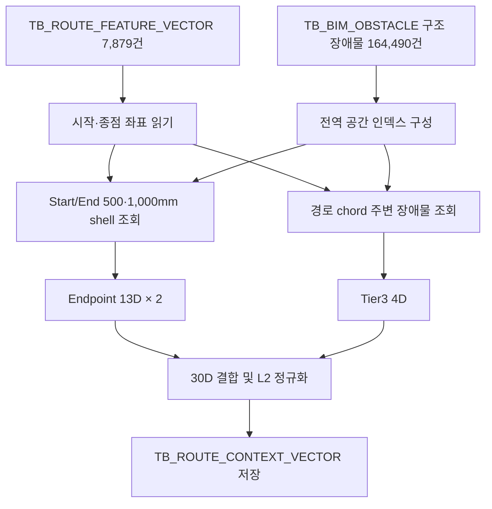

# VectorDBGen Context Vector 모듈 상세 문서

최종 갱신: 2026-07-13
인코더: `topkgen-v3`, `vector(30)`

## 1. 목적

기존 설계 경로의 시작점과 종점 주변 장애물 환경을 30차원 벡터로 저장하고, 신규 라우팅 요청의 장애물 환경과 비교해 Top-K 후보를 재정렬한다. Context Vector는 1차 pgvector ANN 후보 추출에는 사용하지 않고, 후보 재정렬의 `ctxScore`에만 사용한다.

## 2. 구성과 데이터 흐름

| 항목 | 내용 |
|---|---|
| VectorDBGen tag | `context` |
| 실행 스크립트 | `Tools/BuildContextVectors.py` |
| 상세 CLI | `Tools/ExtractObstacleContextVector.py` |
| 공용 인코더 | `Tools/context_vector_encoder.py` |
| DDL | `Tools/sql/create_route_context_vector_table.sql` |
| 경로 입력 | `TB_ROUTE_FEATURE_VECTOR`의 시작·종점 좌표 |
| 장애물 입력 | `TB_BIM_OBSTACLE`의 구조 장애물 AABB |
| 출력 | `TB_ROUTE_CONTEXT_VECTOR` |
| 벡터 차원 | 30D |



`BuildContextVectors.py`와 상세 CLI는 동일한 Python 공용 인코더를 사용한다. C# 검색기는 같은 반경, 차원 배치, 정규화 및 설정 해시를 사용한다.

## 3. 범위 정책

v3의 범위는 다음과 같다.

- `SCOPE_KIND = GLOBAL_SPATIAL_ALL_BAYS`
- `SCOPE_VALUE = ''`
- `ENCODER_VERSION = topkgen-v3`

현재 DB에서는 모든 구조 장애물이 하나의 전역 좌표계에 있고, 같은 AABB가 서로 다른 BAY에 중복 배치된 사례가 없다. 따라서 문자열 BAY로 미리 거르지 않고 전역 공간 인덱스에서 실제 좌표 반경과 chord 영역에 닿는 장애물만 조회한다.

이 방식은 `PROCESS_NAME -> BAY`가 일대일이 아니고, 경로 BAY와 장애물 BAY의 명명 수준도 서로 다른 현재 데이터에서 누락을 방지한다. 단, 향후 여러 프로젝트나 revision의 좌표가 겹치는 DB로 확장하면 `PROJECT_ID` 또는 `MODEL_REVISION_ID`를 범위 키에 추가해야 한다.

## 4. 30D 레이아웃

### START `[0:13]`, END `[13:26]`

| 상대 인덱스 | 특징 |
|---:|---|
| 0 | 0~500mm 구조 장애물 수 / 8 |
| 1 | 500~1,000mm 구조 장애물 수 / 8 |
| 2~4 | 가장 가까운 구조 장애물 AABB 표면 방향 XYZ |
| 5 | 가장 가까운 구조 장애물 표면거리 / 1,000 |
| 6 | 0~500mm 벽 수 / 5 |
| 7 | 500~1,000mm 벽 수 / 5 |
| 8~10 | 가장 가까운 벽 AABB 표면 방향 XYZ |
| 11 | 가장 가까운 벽 표면거리 / 1,000 |
| 12 | 1,000mm 이내 구조물·벽이 없는 free-space 표시 |

### Tier3 `[26:30]`

| 인덱스 | 특징 |
|---:|---|
| 26 | 시작·종점 Z level 변화 |
| 27 | 시작~종점 chord 격자별 구조 장애물 점유 점수 |
| 28 | 주변 벽 장축과 chord의 평행도 |
| 29 | chord 수평방향의 X축 cosine |

마지막에 전체 30D를 L2 정규화한다. free-space 차원 때문에 완전 무장애 환경도 영벡터가 되지 않는다.

## 5. 기하 계산 원칙

- 장애물 중심거리가 아니라 point-to-AABB 최단 표면거리를 사용한다.
- AABB가 점유하는 모든 1,000mm grid cell에 장애물을 등록한다.
- 여러 cell에서 발견된 동일 장애물은 `INSTANCE_ID + AABB`로 중복 제거한다.
- Endpoint 계산은 최대 1,000mm shell만 조회한다.
- Tier3 chord 계산은 순서가 보장되는 grid traversal을 사용하며 200점을 넘으면 균등 downsampling한다.

## 6. 실행

전체 재생성과 저장:

```powershell
python Tools/BuildContextVectors.py --config Tools/tools.settings.json
```

DB를 변경하지 않는 검증:

```powershell
python Tools/ExtractObstacleContextVector.py --config Tools/tools.settings.json extract --dry-run
```

현재 DB coverage와 인코더 계약 확인:

```powershell
python Tools/ExtractObstacleContextVector.py --config Tools/tools.settings.json status
```

전체 Top-K 품질 평가와 배포 게이트 강제 적용:

```powershell
python Tools/EvaluateContextTopK.py `
  --config Tools/tools.settings.json `
  --output-json data/output/context_topk_deployment_gate.json `
  --output-md Docs/ContextVector_Deployment_Gate.md `
  --enforce-gate
```

게이트가 차단되면 종료 코드는 `2`다. 기본 기준은 전체/후보 coverage 99% 이상, 양끝축·패턴 Top-1 각각 1%p 이상 개선, Feature cosine 감소 0.04 이하, 운영 쿼리 100건 이상, 현재 가중치와 권장 가중치 일치다.

개발용 일부 행 검증은 반드시 `--dry-run`과 함께 사용한다. 부분 행 저장은 전체 테이블을 축소할 수 있으므로 프로그램이 차단한다.

```powershell
python Tools/BuildContextVectors.py --config Tools/tools.settings.json --limit 100 --dry-run
```

## 7. 저장 컬럼과 검색 계약

| 컬럼 | 설명 |
|---|---|
| `ROUTE_PATH_GUID` | `TB_ROUTE_FEATURE_VECTOR`의 경로 GUID |
| `CONTEXT_VECTOR` | `vector(30)` |
| `START_META_JSON`, `END_META_JSON` | shell count와 최근접 표면거리 |
| `TIER3_META_JSON` | chord 보조 특징 원시값 |
| `SCOPE_KIND`, `SCOPE_VALUE` | 전역 공간 범위 정책과 값 |
| `SOURCE_BAY` | 계보 진단용 원본 process 값; 공간 필터로 사용하지 않음 |
| `ENCODER_VERSION` | `topkgen-v3` |
| `ENCODER_CONFIG_JSON`, `ENCODER_CONFIG_HASH` | Python/C# 계산 계약 |
| `ENCODED_AT` | 생성 시각 |

C# 검색기는 후보 Context Vector를 사용할 때 version, config hash 및 scope kind가 모두 일치하는 행만 조인한다. `bay` 인자는 하위 호환 진단용이며 v3 장애물 공간 필터에는 필요하지 않다.

재정렬 기본 가중치는 다음과 같다.

```text
position 0.45 + pattern 0.27 + feature 0.18 + context 0.10
```

후보 Context가 없으면 기존 baseline 가중치 `0.50 + 0.30 + 0.20`으로 개별 후보를 재정규화한다.

## 8. 검증 결과

- Feature/Context: 7,879 / 7,879건, coverage 100%
- 구조 장애물: 164,490건, 고유 기하 164,445건
- 전체 30D norm min/max: 1.0 / 1.0
- 실제 C# 검색 후보 Context: 150 / 150건
- Python 저장 벡터와 C# 실시간 계산 최대 오차: 약 `1.8E-08`
- leave-one-out 운영 표본 825건에서 기본 가중치 0.10의 양끝축 Top-1: 21.212% (baseline 대비 +2.91%p)
- 같은 조건의 패턴 Top-1: 14.303% (baseline 대비 +2.06%p)

세부 내용은 `Docs/ContextVector_Phase4_Implementation.md`와 `Docs/ContextVector_Phase4_GlobalSpatial_Evaluation.md`를 참조한다.

## 9. 실제 라우팅 A/B 관측

`AutoRouteFinder`의 `Context v3 A/B arm`을 선택하면 `CONTEXT_V3`, 해제하면 `BASELINE_TOPK`로 실제 Routing3DEngine 결과가 `TB_CONTEXT_ROUTING_AB_LOG`에 저장된다. 동일 요청은 SHA-256 `REQUEST_KEY`로 페어링된다.

```powershell
python Tools/AnalyzeContextRoutingAB.py --config Tools/tools.settings.json status
python Tools/AnalyzeContextRoutingAB.py --config Tools/tools.settings.json report
```

현재 비교 지표는 성공률, 실패 사유, 성공 경로 길이, bend 수, 확장 노드와 처리시간이다. 자세한 구현과 운용 절차는 `Docs/ContextVector_Phase6_Implementation.md`를 참조한다.

반복 수집은 `ContextRoutingABRunner`를 사용한다. 기본은 read-only dry-run이며 `--execute`를 지정할 때만 baseline/context 실제 라우팅을 순차 수행하고 로그를 저장한다. 자세한 안전 조건과 최초 실측은 `Docs/ContextVector_Phase7_Implementation.md`를 참조한다.

8단계 층화 캠페인에서 8개 프로젝트의 실제 라우팅 30페어를 수집했다. Top-K는 53.3%의 페어에서 변경됐지만 성공률·길이·bend는 동일해 자동 판정은 `NO_OBSERVED_ROUTE_QUALITY_EFFECT`였다. 자세한 표본과 해석은 `Docs/ContextVector_Phase8_Implementation.md` 및 `Docs/ContextVector_Phase8_Routing_AB_Report.md`를 참조한다.
