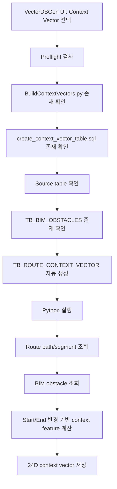

# VectorDBGen Context Vector 모듈 상세 문서

## 1. 문서 목적

본 문서는 VectorDBGen에서 `Context Vector` 빌더로 호출되는 `BuildContextVectors.py` 모듈의 처리 구조와 구현 기준을 설명한다. Context Vector는 단순 경로 형상뿐 아니라 시작점/종료점 주변의 BIM 장애물, 밀집도, clearance, 인접 설비 환경 등을 벡터화하여 route path의 환경 맥락을 표현한다.

현재 저장소에는 `BuildContextVectors.py` 파일이 포함되어 있지 않으므로, 본 문서는 VectorDBGen의 호출 계약과 예상 알고리즘을 기준으로 작성한다.

## 2. 모듈 개요

| 항목 | 내용 |
| --- | --- |
| VectorDBGen 빌더 Tag | `context` |
| 실행 스크립트 | `BuildContextVectors.py` |
| 대상 테이블 | `TB_ROUTE_CONTEXT_VECTOR` |
| DDL 파일 | `create_context_vector_table.sql` |
| 벡터 차원 | 24D |
| 주요 입력 테이블 | `TB_ROUTE_PATH`, `TB_ROUTE_SEGMENTS`, `TB_ROUTE_SEGMENT_DETAIL`, `TB_BIM_OBSTACLES` |
| 주요 목적 | 경로 주변 공간 맥락과 장애물 영향을 24차원 vector로 변환 |

Context Vector는 Feature Vector와 달리 경로 자체의 모양보다 “경로가 놓인 환경”을 수치화한다. 예를 들어 시작점 주변 장애물 개수, 종료점 주변 설비 밀도, 경로 bounding corridor 내 장애물 점유율, 수직/수평 공간 여유 등을 계산하여 AI rerank 또는 후속 설계 자동화에 활용한다.

## 3. 전체 프로세스



세부 처리 단계:

1. VectorDBGen에서 Context Vector 빌더를 선택한다.
2. UI에서 시작 반경, 종료 반경, 개발용 limit 값을 입력한다.
3. `PreflightCheckAsync("context")`가 `TB_BIM_OBSTACLES`까지 포함해 필수 source table을 검사한다.
4. target table이 없으면 `create_context_vector_table.sql`을 실행한다.
5. Python 빌더가 route path와 obstacle 데이터를 조회한다.
6. 각 route path별 시작점/종료점/경로 corridor 주변 context를 계산한다.
7. 24D vector를 `TB_ROUTE_CONTEXT_VECTOR`에 저장한다.

## 4. 핵심 알고리즘

### 4.1 Start/End 반경 기반 공간 분석

VectorDBGen UI 기본값:

- `--start-radius`: 기본 1000 mm
- `--end-radius`: 기본 2000 mm

예상 처리:

1. route path의 시작 좌표와 종료 좌표를 가져온다.
2. `TB_BIM_OBSTACLES`에서 해당 좌표 반경 내 장애물을 조회한다.
3. 장애물의 개수, 평균 거리, 최소 거리, bounding volume, 카테고리 분포를 계산한다.
4. 시작점과 종료점 각각에 대해 별도 context feature를 만든다.

### 4.2 경로 Corridor 기반 분석

route segment 전체를 감싸는 corridor 또는 bounding box를 만든 뒤, 해당 영역과 겹치는 장애물 정보를 계산한다.

예상 feature:

- corridor 내 장애물 개수
- corridor 내 obstacle volume 합계
- segment와 가장 가까운 obstacle 거리
- X/Y/Z 방향 여유 공간
- 수직 이동 구간 주변 장애물 밀도
- 장비/덕트/배관 유형별 주변 객체 비율

### 4.3 24D Context Vector 예시 구성

| Index 범위 | 의미 | 설명 |
| --- | --- | --- |
| 0~3 | Start obstacle summary | 시작점 주변 장애물 개수, 최소거리, 평균거리, 밀도 |
| 4~7 | End obstacle summary | 종료점 주변 장애물 개수, 최소거리, 평균거리, 밀도 |
| 8~11 | Corridor obstacle summary | 경로 corridor 내 장애물 개수/밀도/점유율/최소거리 |
| 12~15 | Clearance statistics | X/Y/Z/전체 clearance 요약 |
| 16~19 | Vertical context | 상부/하부 공간 여유, Z 이동 주변 장애물 영향 |
| 20~23 | Category distribution | 장애물/설비 유형별 비율 또는 one-hot 요약 |

실제 구현에서는 프로젝트 DB 스키마의 obstacle 타입, AABB/OBB 좌표 보유 여부에 따라 feature 정의를 확정해야 한다.

## 5. 주요 함수 설계

| 함수 | 역할 |
| --- | --- |
| `parse_args()` | DB 인자, `--start-radius`, `--end-radius`, `--limit` 파싱 |
| `connect_db(args)` | DB 연결 |
| `fetch_routes(conn, limit=None)` | route path와 segment 요약 조회 |
| `fetch_obstacles(conn)` | BIM obstacle geometry 조회 |
| `build_spatial_index(obstacles)` | 장애물 공간 검색 가속 구조 생성. R-tree 또는 grid index 권장 |
| `query_nearby_obstacles(index, point, radius)` | 특정 좌표 반경 내 장애물 검색 |
| `query_corridor_obstacles(index, route_bbox)` | 경로 corridor와 겹치는 장애물 검색 |
| `compute_context_vector(route, obstacles, start_radius, end_radius)` | 24D context vector 계산 |
| `upsert_context_vectors(conn, rows)` | `TB_ROUTE_CONTEXT_VECTOR` 저장 |
| `main()` | 전체 실행 |

## 6. 주요 변수

| 변수 | 의미 |
| --- | --- |
| `start_radius` | 시작점 주변 context 조회 반경. 기본 1000 mm |
| `end_radius` | 종료점 주변 context 조회 반경. 기본 2000 mm |
| `limit` | 개발/디버깅용 처리 row 제한 |
| `route_bbox` | 경로 전체 bounding box |
| `obstacle_rows` | BIM 장애물 데이터 |
| `spatial_index` | 장애물 검색용 공간 인덱스 |
| `near_start` | 시작점 주변 장애물 목록 |
| `near_end` | 종료점 주변 장애물 목록 |
| `corridor_obstacles` | 경로 corridor 주변 장애물 목록 |
| `context_vector` | 24D float 배열 |

## 7. 실행 명령어

VectorDBGen에서 생성하는 기본 명령어 형식:

```powershell
python -u BuildContextVectors.py `
  --host <host> `
  --port <port> `
  --dbname <database> `
  --user <user> `
  --password <password> `
  --start-radius 1000 `
  --end-radius 2000 `
  --limit <optional-limit>
```

예시:

```powershell
python -u BuildContextVectors.py `
  --host localhost `
  --port 5432 `
  --dbname DDW_AI_DB `
  --user postgres `
  --password "<password>" `
  --start-radius 1000 `
  --end-radius 2000 `
  --limit 500
```

인자 설명:

| 인자 | 필수 | 설명 |
| --- | --- | --- |
| `--host` | 예 | PostgreSQL host |
| `--port` | 예 | PostgreSQL port |
| `--dbname` | 예 | DB명 |
| `--user` | 예 | DB 사용자 |
| `--password` | 예 | DB 비밀번호 |
| `--start-radius` | 아니오 | 시작점 주변 장애물 분석 반경 |
| `--end-radius` | 아니오 | 종료점 주변 장애물 분석 반경 |
| `--limit` | 아니오 | 처리 row 제한. 개발/성능 검증용 |

## 8. DB 저장 컬럼 권장안

| 컬럼 | 타입 | 설명 |
| --- | --- | --- |
| `ROUTE_PATH_GUID` | text | 원본 경로 GUID |
| `PROCESS_NAME` | text | 공정명 |
| `EQUIPMENT_NAME` | text | 장비명 |
| `UTILITY_GROUP` | text | 유틸리티 그룹 |
| `UTILITY` | text | 유틸리티 |
| `START_RADIUS_MM` | double precision | 시작점 분석 반경 |
| `END_RADIUS_MM` | double precision | 종료점 분석 반경 |
| `OBSTACLE_COUNT_START` | integer | 시작점 주변 장애물 수 |
| `OBSTACLE_COUNT_END` | integer | 종료점 주변 장애물 수 |
| `MIN_CLEARANCE_MM` | double precision | 최소 여유거리 |
| `CONTEXT_VECTOR` | vector(24) | pgvector context vector |
| `CREATED_AT` | timestamp | 생성 시각 |

## 9. 성능 고려 사항

- `TB_BIM_OBSTACLES` row 수가 많으면 단순 전수 비교는 급격히 느려질 수 있다.
- 장애물 AABB/OBB 좌표에 대해 GiST, SP-GiST 또는 별도 공간 인덱스를 고려한다.
- Python 내부에서는 R-tree, grid hashing, KD-tree 등의 공간 인덱스를 사용하는 것이 좋다.
- VectorDBGen UI 주석 기준으로 Context 단계는 수천 건 처리 시 수십 초 이상 걸릴 수 있다.

## 10. 실패 시 확인 사항

| 증상 | 확인 사항 |
| --- | --- |
| Context 빌더 실행 불가 | `TB_BIM_OBSTACLES` 존재 여부 확인 |
| 처리 시간이 과도함 | `--limit`으로 샘플 실행 후 공간 인덱스 최적화 |
| context vector null | obstacle 좌표 컬럼명, route 좌표 컬럼명 확인 |
| target table 미존재 | `create_context_vector_table.sql` 실행 여부 확인 |

