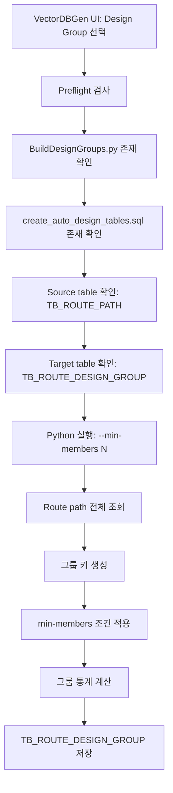

# VectorDBGen Design Group 모듈 상세 문서

## 1. 문서 목적

본 문서는 VectorDBGen에서 `Design Group` 빌더로 호출되는 `BuildDesignGroups.py` 모듈의 프로세스, 핵심 알고리즘, 주요 함수/변수, 실행 명령어를 설명한다.

Design Group 모듈은 개별 route path를 공정, 장비, 유틸리티, 사이즈, 경로 패턴 등의 기준으로 묶어 “설계 재사용 단위”를 만든다. 후속 Segment Template 생성 및 AI 자동 라우팅 후보 추천의 그룹 메타데이터로 활용된다.

## 2. 모듈 개요

| 항목 | 내용 |
| --- | --- |
| VectorDBGen 빌더 Tag | `group` |
| 실행 스크립트 | `BuildDesignGroups.py` |
| 대상 테이블 | `TB_ROUTE_DESIGN_GROUP` |
| DDL 파일 | `create_auto_design_tables.sql` |
| 주요 입력 테이블 | `TB_ROUTE_PATH` |
| 주요 목적 | route path를 설계 재사용이 가능한 그룹으로 집계 |
| UI 옵션 | 최소 멤버 수 `TxtMinMembers`, 기본값 3 |

Design Group은 “비슷한 조건의 경로가 N건 이상 반복되는 설계 패턴”을 찾아낸다. 예를 들어 같은 공정/장비/유틸리티/사이즈 조합에서 여러 경로가 존재하면 하나의 group으로 묶고, 대표 길이/평균 bend 수/대표 패턴 등을 계산한다.

## 3. 전체 프로세스



세부 처리 단계:

1. DB 접속 후 Design Group 빌더를 선택한다.
2. 최소 멤버 수를 입력한다. 기본값은 3이다.
3. `PreflightCheckAsync("group")`는 `TB_ROUTE_PATH`와 DDL/스크립트 존재 여부를 검사한다.
4. target table이 없으면 `create_auto_design_tables.sql`을 실행한다.
5. Python 빌더가 `TB_ROUTE_PATH`를 조회한다.
6. group key를 생성한다.
7. 같은 key에 속한 route가 `--min-members` 이상인 그룹만 저장한다.

## 4. 핵심 알고리즘

### 4.1 그룹 키 생성

그룹 키는 설계 재사용 단위를 결정하는 핵심이다.

권장 그룹 키 후보:

- `PROCESS_NAME`
- `EQUIPMENT_NAME`
- `UTILITY_GROUP`
- `UTILITY` 또는 `SOURCE_UTILITY`
- `SIZE` 또는 `SOURCE_SIZE`
- 필요 시 `TARGET_OWNER_NAME`
- 필요 시 방향 패턴 또는 bend count bucket

예시:

```text
CMP|KSCTA01|UPW|UPW_S|20A
```

### 4.2 최소 멤버 필터

VectorDBGen UI 옵션:

- `--min-members`: 기본 3

알고리즘:

1. 모든 route path를 group key로 묶는다.
2. 그룹별 row count를 계산한다.
3. count가 `min_members` 미만인 그룹은 제외한다.
4. 남은 그룹만 `TB_ROUTE_DESIGN_GROUP`에 저장한다.

### 4.3 그룹 대표값 계산

각 그룹에 대해 다음 통계를 계산하는 것이 권장된다.

| 통계 | 설명 |
| --- | --- |
| `member_count` | 그룹에 포함된 route path 수 |
| `avg_total_length_mm` | 평균 경로 길이 |
| `min_total_length_mm` | 최소 경로 길이 |
| `max_total_length_mm` | 최대 경로 길이 |
| `avg_bend_count` | 평균 bend 수 |
| `representative_route_path_guid` | 대표 route path |
| `representative_pattern` | 대표 방향 패턴 |
| `size_distribution` | size가 혼합될 경우 분포 |

대표 route 선정 기준:

- 평균 길이에 가장 가까운 route
- 또는 bend count가 가장 작은 route
- 또는 feature vector centroid에 가장 가까운 route

현재 Design Group의 source requirement는 `TB_ROUTE_PATH`만이므로, feature vector centroid 방식은 선택 사항이다. 필요한 경우 `TB_ROUTE_FEATURE_VECTOR`를 추가 source로 확장할 수 있다.

## 5. 주요 함수 설계

| 함수 | 역할 |
| --- | --- |
| `parse_args()` | DB 인자와 `--min-members` 파싱 |
| `connect_db(args)` | DB 연결 |
| `fetch_route_paths(conn)` | `TB_ROUTE_PATH` 전체 또는 유효 route 조회 |
| `make_group_key(route)` | route row에서 group key 생성 |
| `group_routes(routes)` | group key 기준으로 route 목록 집계 |
| `filter_groups(groups, min_members)` | 최소 멤버 수 조건 적용 |
| `compute_group_stats(group)` | 그룹별 통계 계산 |
| `choose_representative(group)` | 대표 route 선정 |
| `upsert_design_groups(conn, rows)` | `TB_ROUTE_DESIGN_GROUP` 저장 |
| `main()` | 전체 실행 |

## 6. 주요 변수

| 변수 | 의미 |
| --- | --- |
| `min_members` | 그룹 등록 최소 route 수 |
| `routes` | `TB_ROUTE_PATH`에서 조회한 원본 route 목록 |
| `group_key` | 설계 그룹 식별 키 |
| `groups` | group key별 route 목록 dictionary |
| `member_count` | 그룹 내 route 수 |
| `representative_route` | 대표 route row |
| `group_stats` | 그룹별 통계값 |
| `design_group_id` | 저장될 그룹 ID |

## 7. 실행 명령어

VectorDBGen에서 생성하는 기본 명령어:

```powershell
python -u BuildDesignGroups.py `
  --host <host> `
  --port <port> `
  --dbname <database> `
  --user <user> `
  --password <password> `
  --min-members 3
```

예시:

```powershell
python -u BuildDesignGroups.py `
  --host localhost `
  --port 5432 `
  --dbname DDW_AI_DB `
  --user postgres `
  --password "<password>" `
  --min-members 3
```

인자 설명:

| 인자 | 필수 | 설명 |
| --- | --- | --- |
| `--host` | 예 | PostgreSQL host |
| `--port` | 예 | PostgreSQL port |
| `--dbname` | 예 | DB명 |
| `--user` | 예 | DB 사용자 |
| `--password` | 예 | DB 비밀번호 |
| `--min-members` | 아니오 | 그룹으로 등록하기 위한 최소 route 수. 기본 3 |

## 8. DB 저장 컬럼 권장안

| 컬럼 | 타입 | 설명 |
| --- | --- | --- |
| `DESIGN_GROUP_ID` | text 또는 uuid | 설계 그룹 ID |
| `GROUP_KEY` | text | 그룹 기준 문자열 |
| `PROCESS_NAME` | text | 공정명 |
| `EQUIPMENT_NAME` | text | 장비명 |
| `UTILITY_GROUP` | text | 유틸리티 그룹 |
| `UTILITY` | text | 유틸리티 |
| `SIZE` | text | 사이즈 |
| `MEMBER_COUNT` | integer | 그룹 구성 route 수 |
| `REPRESENTATIVE_ROUTE_PATH_GUID` | text | 대표 route |
| `AVG_TOTAL_LENGTH_MM` | double precision | 평균 길이 |
| `AVG_BEND_COUNT` | double precision | 평균 bend 수 |
| `CREATED_AT` | timestamp | 생성 시각 |

## 9. 검증 포인트

- `TB_ROUTE_PATH` row count가 충분한지 확인한다.
- `--min-members`가 너무 높으면 그룹이 거의 생성되지 않을 수 있다.
- group key에 size까지 포함할지 여부에 따라 그룹 수가 크게 달라진다.
- 같은 그룹의 route들이 실제로 설계상 재사용 가능한지 샘플 검토가 필요하다.

## 10. 실패 시 확인 사항

| 증상 | 확인 사항 |
| --- | --- |
| 그룹이 0건 생성됨 | `min_members` 값, group key 기준, source data 분포 확인 |
| 중복 그룹 생성 | `GROUP_KEY` unique index 또는 upsert 정책 확인 |
| 통계값 null | `TOTAL_LENGTH`, `BEND_COUNT` 컬럼명/데이터 타입 확인 |
| target table 없음 | `create_auto_design_tables.sql` 실행 여부 확인 |

