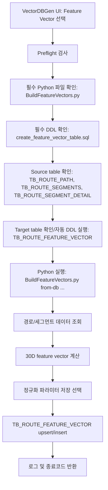

# VectorDBGen Feature Vector 모듈 상세 문서

## 1. 문서 목적

본 문서는 VectorDBGen에서 `Feature Vector` 빌더로 호출되는 `BuildFeatureVectors.py` 모듈의 설계 의도, 처리 프로세스, 핵심 알고리즘, 주요 함수와 변수, 실행 명령어를 정리한 개발 문서이다.

현재 저장소 기준으로 `BuildFeatureVectors.py` 원본 파일은 포함되어 있지 않다. 따라서 본 문서는 `VectorDBGen/MainWindow.xaml.cs`에 구현된 호출 계약, 대상 테이블, 선행 테이블, UI 입력값, 일반적인 라우팅 feature vector 생성 구조를 기준으로 작성한다. 실제 빌더 구현 시 본 문서를 인터페이스 기준 문서로 사용할 수 있다.

## 2. 모듈 개요

| 항목 | 내용 |
| --- | --- |
| VectorDBGen 빌더 Tag | `feature` |
| 실행 스크립트 | `BuildFeatureVectors.py` |
| 대상 테이블 | `TB_ROUTE_FEATURE_VECTOR` |
| DDL 파일 | `create_feature_vector_table.sql` |
| 벡터 차원 | 30D |
| 주요 입력 테이블 | `TB_ROUTE_PATH`, `TB_ROUTE_SEGMENTS`, `TB_ROUTE_SEGMENT_DETAIL` |
| 주요 목적 | 기존 라우팅 경로의 기하/방향/길이/패턴 특성을 30차원 feature vector로 변환하여 Top-K 유사 경로 검색 기반 데이터를 생성 |

Feature Vector 모듈은 Top-K 경로 검색의 핵심 데이터셋을 만든다. 원본 경로와 세그먼트 정보를 읽고, 시작/종료 방향, displacement, bounding box, bend/segment pattern, 전체 길이, 방향 통계 등을 정규화된 30차원 벡터로 변환한 뒤 `TB_ROUTE_FEATURE_VECTOR`에 저장한다.

## 3. 전체 프로세스



세부 처리 단계:

1. VectorDBGen에서 DB 접속 테스트를 완료한다.
2. Feature Vector 빌더를 선택한다.
3. `PreflightCheckAsync("feature")`가 빌더 스크립트, DDL 파일, source table 존재 여부를 검사한다.
4. `TB_ROUTE_FEATURE_VECTOR`가 없으면 `create_feature_vector_table.sql`을 자동 실행한다.
5. `BuildCommand("feature")`가 Python 명령어를 만든다.
6. `RunPythonAsync(...)`가 `python -u BuildFeatureVectors.py from-db ...` 형태로 실행한다.
7. Python 빌더가 DB에서 route path와 segments를 조회한다.
8. 각 route path 단위로 30차원 feature vector를 계산한다.
9. 결과를 `TB_ROUTE_FEATURE_VECTOR`에 저장한다.
10. 선택적으로 normalization parameter와 vector JSON을 파일로 저장한다.

## 4. 핵심 알고리즘

### 4.1 Route 단위 데이터 수집

기본 처리 단위는 `ROUTE_PATH_GUID`이다.

예상 조회 데이터:

- `TB_ROUTE_PATH`
  - `ROUTE_PATH_GUID`
  - `PROCESS_NAME`
  - `EQUIPMENT_NAME`
  - `UTILITY_GROUP`
  - `SOURCE_UTILITY` 또는 `UTILITY`
  - `SOURCE_SIZE`
  - `SOURCE_POSX/Y/Z`
  - `TARGET_POSX/Y/Z`
  - `TOTAL_LENGTH` 또는 `PR_TOTAL_LENGTH`
  - `BEND_COUNT`
- `TB_ROUTE_SEGMENTS`
  - route path별 segment sequence
  - segment 시작/종료 좌표
  - segment 길이
  - 방향 또는 축 정보
- `TB_ROUTE_SEGMENT_DETAIL`
  - bend, elbow, vertical/horizontal movement 등 세부 형상 정보

### 4.2 30D Feature Vector 구성

TopKSearchStandalone의 query vector 생성 로직과 호환되도록 다음과 같은 feature group을 갖는 30D 벡터를 구성하는 것이 목표다.

| Index 범위 | 의미 | 설명 |
| --- | --- | --- |
| 0~2 | Start direction | 경로 시작부 방향 단위벡터 |
| 3~5 | End direction | 경로 종료부 방향 단위벡터 |
| 6~8 | Displacement | 시작점에서 종료점까지의 X/Y/Z 변위 |
| 9~11 | Bounding box ratio | 경로 전체가 차지하는 X/Y/Z 범위 비율 |
| 12~20 | Bend/turn section statistics | 3구간 또는 방향군별 bend/segment 통계 |
| 21 | Total length | 전체 경로 길이 정규화 값 |
| 22~24 | Obstacle/clearance summary | 주변 장애물/회피 관련 요약값. 없으면 0 |
| 25~29 | Direction/arrow statistics | 방향 패턴 빈도 또는 축 이동 통계 |

실제 구현에서는 모든 feature를 계산한 뒤 scale factor 또는 normalization parameter를 적용하고, 최종적으로 L2 normalization을 수행하는 방식이 권장된다.

### 4.3 방향 패턴 생성

방향 패턴은 `DIRECTION_PATTERN` 컬럼으로 저장되어 Top-K rerank의 pattern similarity 계산에 사용된다.

예상 처리:

1. segment별 주 이동축을 판단한다.
2. X/Y 평면 이동은 수평 방향, Z 이동은 상하 방향으로 분류한다.
3. 연속된 같은 방향은 run-length compression 형태로 축약한다.
4. 예: `H-R-H-D`, `X+ > Y+ > Z-` 등 프로젝트 표준 문자열로 저장한다.

### 4.4 정규화 파라미터 저장

VectorDBGen UI의 Feature 옵션:

- `TxtSaveNorm`: 기본값 `../data/FeatureVectors/db_norm_params.json`
- `TxtSaveJson`: 선택 입력

예상 동작:

- `--save_norm`이 주어지면 min/max, mean/std, scale factor 등 정규화 기준값을 JSON으로 저장한다.
- `--save_json`이 주어지면 생성된 feature vector 레코드 샘플 또는 전체를 JSON으로 저장한다.

## 5. 주요 함수 설계

실제 `BuildFeatureVectors.py` 구현 시 권장되는 함수 구조는 다음과 같다.

| 함수 | 역할 |
| --- | --- |
| `parse_args()` | CLI 인자 파싱. `from-db`, DB 접속 정보, `--save_norm`, `--save_json` 처리 |
| `connect_db(args)` | psycopg2 또는 SQLAlchemy 기반 DB 연결 생성 |
| `fetch_route_paths(conn)` | `TB_ROUTE_PATH`에서 route path 기본 메타데이터 조회 |
| `fetch_segments(conn, route_path_guid)` | 경로별 segment/detail 조회 |
| `build_direction_pattern(segments)` | segment sequence로부터 방향 패턴 문자열 생성 |
| `compute_feature_vector(route, segments, norm)` | 30D feature vector 계산 |
| `fit_normalization(rows)` | 전체 데이터 기반 정규화 파라미터 산정 |
| `apply_normalization(vector, norm)` | feature vector 정규화 |
| `upsert_feature_vectors(conn, rows)` | `TB_ROUTE_FEATURE_VECTOR`에 결과 저장 |
| `save_norm_params(path, norm)` | 정규화 파라미터 JSON 저장 |
| `save_vectors_json(path, rows)` | vector dump JSON 저장 |
| `main()` | 전체 orchestration |

## 6. 주요 변수

| 변수 | 의미 |
| --- | --- |
| `conninfo` | DB 접속 문자열 |
| `route_path_guid` | 경로 고유 ID |
| `process_name` | 공정명 |
| `equipment_name` | 장비명 |
| `utility_group` | 유틸리티 그룹 |
| `utility` | 유틸리티 코드 |
| `size` | 배관/덕트 사이즈 |
| `start_xyz` | 시작 좌표 `(x, y, z)` |
| `end_xyz` | 종료 좌표 `(x, y, z)` |
| `segments` | route path 하위 segment 목록 |
| `direction_pattern` | 방향 패턴 문자열 |
| `feature_vector` | 30D float 배열 |
| `norm_params` | 정규화 기준값 |
| `total_length_mm` | 경로 총 길이 |
| `step_count` | segment 또는 bend step 개수 |

## 7. 실행 명령어

VectorDBGen에서 생성하는 기본 명령어 형식:

```powershell
python -u BuildFeatureVectors.py from-db `
  --host <host> `
  --port <port> `
  --dbname <database> `
  --user <user> `
  --password <password> `
  --save_norm "<norm-json-path>" `
  --save_json "<vector-json-path>"
```

예시:

```powershell
python -u BuildFeatureVectors.py from-db `
  --host localhost `
  --port 5432 `
  --dbname DDW_AI_DB `
  --user postgres `
  --password "<password>" `
  --save_norm "D:\DINNO\DEV\AI-AutoRouting\TopKGen\data\FeatureVectors\db_norm_params.json"
```

인자 설명:

| 인자 | 필수 | 설명 |
| --- | --- | --- |
| `from-db` | 예 | DB에서 원천 데이터를 읽어 vector를 생성하는 실행 모드 |
| `--host` | 예 | PostgreSQL host |
| `--port` | 예 | PostgreSQL port |
| `--dbname` | 예 | DB명 |
| `--user` | 예 | DB 사용자 |
| `--password` | 예 | DB 비밀번호 |
| `--save_norm` | 아니오 | 정규화 파라미터 저장 경로 |
| `--save_json` | 아니오 | 생성 vector JSON 저장 경로 |

## 8. DB 저장 컬럼 권장안

`TB_ROUTE_FEATURE_VECTOR`는 최소 다음 컬럼을 가져야 한다.

| 컬럼 | 타입 | 설명 |
| --- | --- | --- |
| `ROUTE_PATH_GUID` | text | 원본 경로 GUID |
| `PROCESS_NAME` | text | 공정명 |
| `EQUIPMENT_NAME` | text | 장비명 |
| `UTILITY_GROUP` | text | 유틸리티 그룹 |
| `UTILITY` | text | 유틸리티 |
| `SIZE` | text | 배관/덕트 사이즈 |
| `START_POSX/Y/Z` | double precision | 시작 좌표 |
| `END_POSX/Y/Z` | double precision | 종료 좌표 |
| `DIRECTION_PATTERN` | text | 방향 패턴 |
| `TOTAL_LENGTH_MM` | double precision | 전체 길이 |
| `STEP_COUNT` | integer | step/segment 개수 |
| `FEATURE_VECTOR` | vector(30) | pgvector feature vector |
| `CREATED_AT` | timestamp | 생성 시각 |

## 9. 검증 포인트

- `TB_ROUTE_PATH`, `TB_ROUTE_SEGMENTS`, `TB_ROUTE_SEGMENT_DETAIL` row count가 0이 아닌지 확인한다.
- 모든 `FEATURE_VECTOR`의 차원이 30인지 확인한다.
- `FEATURE_VECTOR` null row가 없어야 한다.
- 동일한 `ROUTE_PATH_GUID`가 중복 insert되지 않도록 upsert 또는 delete-insert 정책을 정한다.
- HNSW index가 생성되어 있는지 확인한다.
- TopKSearchStandalone `--check-schema`로 검색 테이블 상태를 검증한다.

## 10. 실패 시 확인 사항

| 증상 | 확인 사항 |
| --- | --- |
| Python 파일을 찾지 못함 | VectorDBGen `vectordbgen.settings.json`의 `ScriptDirectory` 확인 |
| DDL 파일을 찾지 못함 | `DdlDirectory` 또는 프로젝트 루트 내 DDL 파일 위치 확인 |
| pgvector 타입 오류 | PostgreSQL `vector` extension 설치 확인 |
| insert 실패 | target table 컬럼명/대소문자/DDL 버전 확인 |
| 검색 결과 품질 낮음 | feature 정규화, direction pattern, source table 좌표 품질 확인 |

