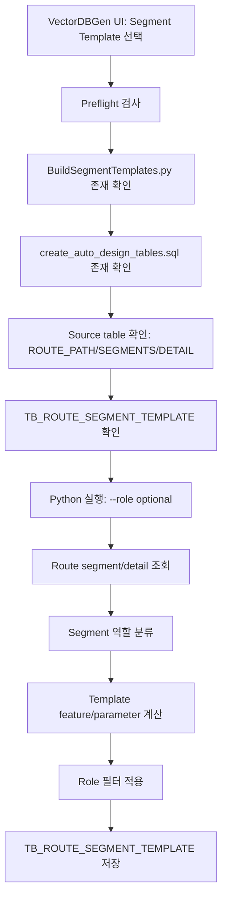

# VectorDBGen Segment Template 모듈 상세 문서

## 1. 문서 목적

본 문서는 VectorDBGen에서 `Segment Template` 빌더로 호출되는 `BuildSegmentTemplates.py` 모듈의 상세 설계 문서이다. Segment Template은 기존 route path의 segment/detail 데이터를 분석하여 자동 라우팅에서 재사용 가능한 세그먼트 단위 설계 패턴을 생성한다.

현재 저장소에는 `BuildSegmentTemplates.py` 원본 파일이 포함되어 있지 않다. 본 문서는 VectorDBGen의 호출 계약과 route segment 기반 template 생성 알고리즘을 기준으로 작성한다.

## 2. 모듈 개요

| 항목 | 내용 |
| --- | --- |
| VectorDBGen 빌더 Tag | `segment` |
| 실행 스크립트 | `BuildSegmentTemplates.py` |
| 대상 테이블 | `TB_ROUTE_SEGMENT_TEMPLATE` |
| DDL 파일 | `create_auto_design_tables.sql` |
| 주요 입력 테이블 | `TB_ROUTE_PATH`, `TB_ROUTE_SEGMENTS`, `TB_ROUTE_SEGMENT_DETAIL` |
| 주요 목적 | route segment를 역할별 template으로 추출하여 자동 설계 재사용 데이터 생성 |
| UI 옵션 | Role 필터: 전체, `A_EQUIP_STUB`, `B_BRIDGE`, `C_DUCT_ENTRY` |

Segment Template은 경로 전체가 아니라 경로를 구성하는 부분 패턴을 저장한다. 예를 들어 장비에서 나오는 stub 구간, duct로 진입하는 구간, 중간 bridge 구간을 분리해 template으로 관리한다.

## 3. 전체 프로세스



세부 처리 단계:

1. VectorDBGen에서 Segment Template 빌더를 선택한다.
2. role 필터를 선택한다.
3. `PreflightCheckAsync("segment")`가 source table 및 DDL/스크립트 존재 여부를 검사한다.
4. target table이 없으면 `create_auto_design_tables.sql`을 실행한다.
5. Python 빌더가 route path, segment, detail 데이터를 조회한다.
6. segment sequence를 분석해 role을 분류한다.
7. role별 template parameter를 계산한다.
8. `TB_ROUTE_SEGMENT_TEMPLATE`에 저장한다.

## 4. 핵심 알고리즘

### 4.1 Segment 역할 분류

VectorDBGen UI에서 지원하는 role:

| Role | 의미 | 설명 |
| --- | --- | --- |
| 전체 | role 필터 없음 | 모든 role template 생성 |
| `A_EQUIP_STUB` | 장비 stub 구간 | 장비 연결부에서 시작되는 짧은 인입/인출 구간 |
| `B_BRIDGE` | 중간 bridge 구간 | 장비와 duct/메인라인 사이를 연결하는 주 이동 구간 |
| `C_DUCT_ENTRY` | duct entry 구간 | duct 또는 목적지 진입 직전의 연결 구간 |

역할 분류 기준 예시:

1. route path의 segment sequence를 순서대로 정렬한다.
2. 시작점에 가까운 N개 segment는 `A_EQUIP_STUB` 후보로 본다.
3. 종료점 또는 target owner/duct 근처 segment는 `C_DUCT_ENTRY` 후보로 본다.
4. 나머지 중 주요 displacement를 담당하는 구간은 `B_BRIDGE`로 분류한다.
5. detail 정보에 elbow, vertical drop/rise, branch 등이 있으면 role 보정에 사용한다.

### 4.2 Template Parameter 계산

각 template은 재사용 가능한 설계 단위이므로 segment의 절대 좌표보다 상대 파라미터를 저장하는 것이 중요하다.

권장 parameter:

- role
- utility group / utility
- size
- segment count
- total length
- direction sequence
- normalized start/end direction
- delta vector
- bend count
- vertical movement 여부
- recommended clearance
- connection type

### 4.3 Template 일반화

동일 role과 유사 조건의 segment pattern을 하나의 template으로 합칠 수 있다.

일반화 방식:

1. role + utility + size + direction pattern을 key로 묶는다.
2. 길이, bend count, delta vector의 평균/분산을 계산한다.
3. 대표 route/segment를 선정한다.
4. 허용 편차 범위를 저장한다.

예:

```text
role=A_EQUIP_STUB
utility=PCW_S
size=20A
pattern=X+>Z+>Y+
avg_length=3200mm
segment_count=3
```

## 5. 주요 함수 설계

| 함수 | 역할 |
| --- | --- |
| `parse_args()` | DB 인자와 `--role` 파싱 |
| `connect_db(args)` | DB 연결 |
| `fetch_routes(conn)` | route path 메타데이터 조회 |
| `fetch_segments(conn)` | segment sequence 조회 |
| `fetch_segment_details(conn)` | 세부 bend/connection 정보 조회 |
| `classify_segment_role(route, segments, detail)` | segment 또는 segment group 역할 분류 |
| `build_template_key(segment_group)` | template grouping key 생성 |
| `compute_template_params(segment_group)` | template parameter 계산 |
| `aggregate_templates(template_rows)` | 유사 template 집계 |
| `filter_by_role(rows, role)` | role 필터 적용 |
| `upsert_segment_templates(conn, rows)` | `TB_ROUTE_SEGMENT_TEMPLATE` 저장 |
| `main()` | 전체 실행 |

## 6. 주요 변수

| 변수 | 의미 |
| --- | --- |
| `role` | 생성 대상 role 필터 |
| `route_path_guid` | 원본 route path ID |
| `segment_id` | segment ID |
| `segment_order` | route 내 segment 순번 |
| `segment_group` | template 단위로 묶인 segment 목록 |
| `template_key` | role/utility/size/pattern 기반 key |
| `direction_sequence` | segment 방향 sequence |
| `delta_xyz` | template 시작/종료 상대 변위 |
| `template_params` | 저장할 설계 파라미터 dictionary |
| `member_count` | 같은 template에 속한 segment group 수 |

## 7. 실행 명령어

VectorDBGen에서 생성하는 기본 명령어:

```powershell
python -u BuildSegmentTemplates.py `
  --host <host> `
  --port <port> `
  --dbname <database> `
  --user <user> `
  --password <password> `
  --role <optional-role>
```

전체 role 생성:

```powershell
python -u BuildSegmentTemplates.py `
  --host localhost `
  --port 5432 `
  --dbname DDW_AI_DB `
  --user postgres `
  --password "<password>"
```

특정 role만 생성:

```powershell
python -u BuildSegmentTemplates.py `
  --host localhost `
  --port 5432 `
  --dbname DDW_AI_DB `
  --user postgres `
  --password "<password>" `
  --role A_EQUIP_STUB
```

인자 설명:

| 인자 | 필수 | 설명 |
| --- | --- | --- |
| `--host` | 예 | PostgreSQL host |
| `--port` | 예 | PostgreSQL port |
| `--dbname` | 예 | DB명 |
| `--user` | 예 | DB 사용자 |
| `--password` | 예 | DB 비밀번호 |
| `--role` | 아니오 | 생성 대상 role. 비워두면 전체 생성 |

지원 role:

- `A_EQUIP_STUB`
- `B_BRIDGE`
- `C_DUCT_ENTRY`

## 8. DB 저장 컬럼 권장안

| 컬럼 | 타입 | 설명 |
| --- | --- | --- |
| `TEMPLATE_ID` | text 또는 uuid | template ID |
| `ROLE` | text | segment role |
| `TEMPLATE_KEY` | text | grouping key |
| `PROCESS_NAME` | text | 공정명 |
| `EQUIPMENT_NAME` | text | 장비명 |
| `UTILITY_GROUP` | text | 유틸리티 그룹 |
| `UTILITY` | text | 유틸리티 |
| `SIZE` | text | 사이즈 |
| `DIRECTION_SEQUENCE` | text | 방향 sequence |
| `SEGMENT_COUNT` | integer | template 내 segment 수 |
| `AVG_LENGTH_MM` | double precision | 평균 길이 |
| `AVG_BEND_COUNT` | double precision | 평균 bend 수 |
| `PARAMS_JSON` | jsonb | 상세 파라미터 |
| `REPRESENTATIVE_ROUTE_PATH_GUID` | text | 대표 route |
| `MEMBER_COUNT` | integer | 집계에 사용된 sample 수 |
| `CREATED_AT` | timestamp | 생성 시각 |

## 9. 검증 포인트

- `TB_ROUTE_SEGMENTS`와 `TB_ROUTE_SEGMENT_DETAIL`의 route path 기준 join이 정상인지 확인한다.
- role별 생성 건수가 0이 아닌지 확인한다.
- `A_EQUIP_STUB`, `B_BRIDGE`, `C_DUCT_ENTRY`의 분류 기준을 샘플 route로 수동 검증한다.
- 동일 template key 중복 저장 방지 정책을 둔다.
- role 필터 실행 시 해당 role만 삭제 후 재생성할지, 전체 삭제 후 재생성할지 정책을 명확히 한다.

## 10. 실패 시 확인 사항

| 증상 | 확인 사항 |
| --- | --- |
| role별 결과가 0건 | role 분류 기준, segment order, route detail 데이터 확인 |
| template 중복 과다 | template key가 너무 세분화되었는지 확인 |
| template이 너무 적음 | grouping key가 너무 넓거나 role 필터가 잘못되었는지 확인 |
| target table 없음 | `create_auto_design_tables.sql` 실행 여부 확인 |
| segment join 실패 | `ROUTE_PATH_GUID`, segment ID, detail FK 컬럼 확인 |

