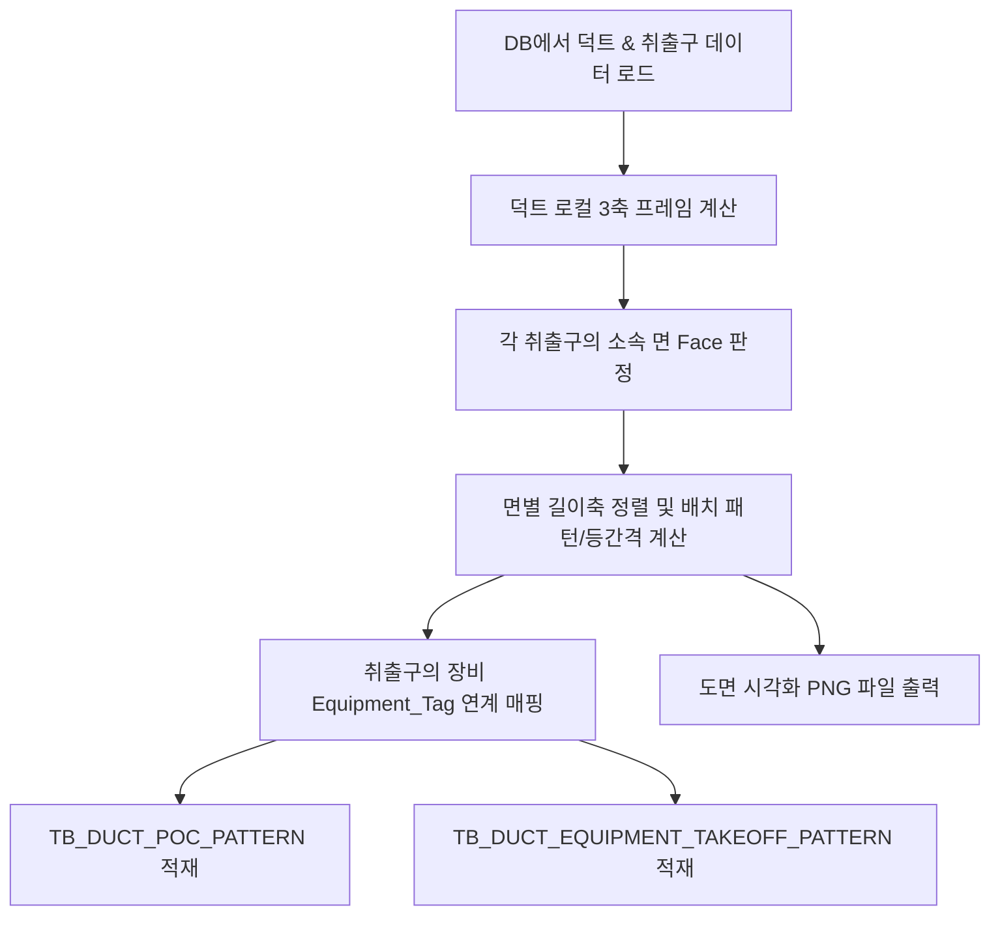

# 덕트 취출구(Takeoff/PoC) 패턴 분석기(AnalyzeDuctPocPattern) 개발 사양서

본 문서는 [AnalyzeDuctPocPattern.py](file:///d:/DINNO/DEV/AI-AutoRouting/TopKGen/Tools/AnalyzeDuctPocPattern.py) 스크립트에 구현된 덕트 분기 취출구 패턴 분석 알고리즘, 파이프라인 프로세스 및 데이터베이스 테이블 사양을 설명합니다.

---

## 1. 원본 데이터 구조 (Input Data)

분석기는 PostgreSQL 데이터베이스(`DDW_AI_DB`)로부터 덕트와 취출구에 관한 정보를 로드합니다. 주요 원본 컬럼은 다음과 같습니다.

### TB_DUCT 테이블
* **`INSTANCE_NAME` / `INSTANCE_ID`**: 덕트 객체를 유일하게 구분하는 ID/이름
* **`OBB_POSITIONS` (OBB 8정점)**: 덕트의 3D 회전 상태와 크기를 지니는 최소 경계 상자 정점 좌표 (딕셔너리 포맷: `lbb`, `rbb`, `rtb`, `ltb`, `lbf`, `rbf`, `rtf`, `ltf` 각 3차원 XYZ 좌표)
* **`TAKEOFF_POC_POSITIONS_LIST`**: 덕트에서 갈라져 나가는 취출구(곁가지)의 3D 절대좌표 리스트
* **`TAKEOFF_POC_SIZES_LIST`**: 취출구의 규격(내경/외경 반경) 리스트
* **`TAKEOFF_POC_ID_LIST`**: 취출구의 고유 ID(GUID) 리스트 (장비 연계에 사용)
* **`UTILITY` / `UTILITY_GROUP`**: 배관/덕트의 용도 및 유틸리티 그룹 정보
* **`LEVEL` / `BAY`**: 덕트가 위치한 물리적 위치 정보

> [!NOTE]
> 덕트 본선의 시작/끝 연결부인 `POC_POSITIONS_LIST`는 길이축 양 끝단(END)에만 항상 고정으로 존재하므로, 실질적인 상/하/좌/우 분기 분석 대상인 `TAKEOFF_` 계열 리스트를 주 대상으로 삼아 분석을 진행합니다.

---

## 2. 생성 단계 프로세스 (Pipeline Process)

분석 및 적재 프로세스는 아래와 같이 단계별로 진행됩니다.



### 상세 단계 설명
1. **데이터 추출**: `ExportDuctPlan.py`의 `fetch_data()`를 통해 DB에 저장된 덕트 풋프린트, OBB, 취출구의 ID/좌표/반경/유틸리티 목록을 로드합니다.
2. **로컬 프레임 빌드**: OBB 8정점을 해석하여 평면 회전을 고려한 로컬 좌표계를 만듭니다.
3. **면 판정 & 투영**: 각 취출구 좌표를 덕트의 로컬 프레임에 투영하여 어느 면(`TOP`, `BOTTOM`, `LEFT`, `RIGHT`, `END`)에 속해 있는지 계산합니다.
4. **패턴 분석**: 각 면별로 취출구를 정렬하고, 간격(Spacing), 등간격 여부, 유틸리티 시퀀스, 그리고 횡방향 형태(배치 패턴)를 판정합니다.
5. **장비 연계**: 취출구 ID를 `TB_ROUTE_PATH`의 `TARGET_GUID`와 정확히 일치시켜 취출구가 연결되는 목적지 장비(`EQUIPMENT_TAG`)를 매핑합니다.
6. **DB 저장**: 최종 통계 데이터를 `TB_DUCT_POC_PATTERN` 및 `TB_DUCT_EQUIPMENT_TAKEOFF_PATTERN`에 UPSERT/TRUNCATE 적재합니다.
7. **도면 출력**: 전체 스케일 및 개별 덕트 단위로 확대 시각화한 PNG 결과물을 로컬 디렉토리에 저장합니다.

---

## 3. 핵심 알고리즘 (Key Algorithms)

### A. 로컬 3축 계산 알고리즘 ([compute_duct_local_frame](file:///d:/DINNO/DEV/AI-AutoRouting/TopKGen/Tools/AnalyzeDuctPocPattern.py#L179))
덕트가 3D 공간 상에서 비스듬히 누워있거나 평면 회전되어 있어도 올바른 면 판정을 수행할 수 있도록 로컬 프레임을 형성합니다.

1. **대응쌍 평균 차이 분석**: OBB 정점 중 (Left-Right), (Top-Bottom), (Back-Front)의 평균점 차이로 3개의 후보 벡터(축)와 후보별 치수(전체 두께/길이)를 구합니다.
2. **높이축(Height Axis) 결정**: 세계(World) Z축 `(0, 0, 1)`과 내적의 절대값이 가장 큰 후보축을 높이축(`axis_h`)으로 지정합니다. 일관된 판정을 위해 높이축의 Z 방향은 항상 양의 방향(`+Z`)이 되도록 부호를 보정합니다.
3. **길이축(Length Axis) & 폭축(Width Axis) 결정**: 높이축을 제외한 나머지 두 후보축 중 실제 치수(half-extent)가 더 큰 쪽을 길이축(`axis_len`), 남은 쪽을 폭축(`axis_w`)으로 최종 정의합니다.

### B. 소속 면(Face) 분류 알고리즘 ([classify_poc_face](file:///d:/DINNO/DEV/AI-AutoRouting/TopKGen/Tools/AnalyzeDuctPocPattern.py#L252))
취출구의 상대 좌표를 산출하여 로컬 축 방향으로 투영하고, half-extent 대비 비율로 소속 면을 판정합니다.

1. **상대 벡터 투영**: $\vec{rel} = \vec{pos} - \vec{centroid}$
2. **정규화 좌표 획득**:
   * $norm\_len = (\vec{rel} \cdot \vec{axis\_len}) / half\_len$
   * $norm\_h = (\vec{rel} \cdot \vec{axis\_h}) / half\_h$
   * $norm\_w = (\vec{rel} \cdot \vec{axis\_w}) / half\_w$
3. **면 할당 규칙**:
   * $|norm\_len| \ge 0.95$ (`END_ZONE_RATIO` 임계값) 이면 본선 연결 존인 **`END`**로 판정
   * 그 외에는 높이와 폭의 투영 비율 중 큰 쪽을 선택하여:
     * $|norm\_h| \ge |norm\_w|$ 이면: $norm\_h \ge 0$ 이면 **`TOP`**, 미만이면 **`BOTTOM`**
     * $|norm\_h| < |norm\_w|$ 이면: $norm\_w \ge 0$ 이면 **`RIGHT`**, 미만이면 **`LEFT`**

### C. 횡방향 배치 형태 판정 알고리즘 ([classify_layout_pattern](file:///d:/DINNO/DEV/AI-AutoRouting/TopKGen/Tools/AnalyzeDuctPocPattern.py#L330))
면 위에 취출구들이 어떻게 늘어서 있는지 폭 또는 높이 방향 오프셋의 규칙성을 추정합니다.
* **`STRAIGHT` (일직선)**: 횡방향 오프셋의 표준편차(Standard Deviation)가 `STRAIGHT_STD_THRESHOLD_MM(30.0mm)` 이하일 때.
* **`ZIGZAG` (지그재그) / `SPLIT_ROWS` (분리형)**: 
  * 표준편차가 크다면, 이웃한 횡방향 위치를 `CLUSTER_GAP_THRESHOLD_MM(80.0mm)` 기준으로 묶어 물리적 배치 열(track) 개수를 계산합니다.
  * 열 개수가 정확히 2개일 때, 길이축 정렬 순서대로 횡방향 부호가 번갈아 바뀌는 비율(Alternation Rate)을 계산합니다.
    * 교대 비율 $\ge 0.7$ $\rightarrow$ **`ZIGZAG`**
    * 교대 비율 $\le 0.3$ $\rightarrow$ **`SPLIT_ROWS`**
    * 그 외 애매한 구간 $\rightarrow$ **`IRREGULAR`** (불규칙)
  * 열 개수가 3개 이상이면 무조건 **`IRREGULAR`**로 판정합니다.

### D. 등간격 판정 알고리즘
* 각 면별로 정렬된 취출구 사이의 인접 간격들 $S = [s_1, s_2, \dots, s_{n-1}]$을 획득합니다.
* 간격의 **변동계수 $CV = 표준편차 / 평균$**을 구하여 $CV \le 0.15$ (`EQUAL_SPACING_CV_THRESHOLD`) 인 경우 현장 시공에서 등간격 설계를 적용한 것으로 판정(`is_equal_spacing = True`)합니다.

---

## 4. 저장 데이터 구조 (Schema Specification)

### A. TB_DUCT_POC_PATTERN
덕트 개체별 분기점 패턴 정보를 저장하는 메인 통계 테이블입니다.

| 필드명 | 데이터 타입 | 설명 | 값 예시 |
| :--- | :--- | :--- | :--- |
| **`DUCT_NAME`** | `text` (PK) | 덕트 식별 이름 | `DUCT_AA_001` |
| **`UTILITY`** | `text` | 유틸리티 명칭 | `HVAC_SUPPLY` |
| **`UTILITY_GROUP`** | `text` | 유틸리티 그룹 | `DUCT` |
| **`LEVEL`** | `text` | 설치 레벨 | `L1` |
| **`BAY`** | `text` | 설치 베이(영역) | `BAY_C` |
| **`N_POC_TOTAL`** | `integer` | 전체 취출구 개수 | `4` |
| **`DOMINANT_FACE`** | `text` | 분기가 가장 많이 부착된 대표 면 | `TOP` |
| **`DOMINANT_LAYOUT`** | `text` | 대표 면의 횡방향 배치 형태 | `ZIGZAG` |
| **`FACE_PATTERN_JSON`** | `jsonb` | 각 면별 상세 분석 통계 (하단 구조 참조) | *JSON 데이터* |
| **`TAKEOFF_LAYOUT`** | `geometry(MultiPointZ, 0)` | 취출구 전체의 로컬 3D 공간 좌표 지오메트리 | `MULTIPOINT Z (0 0 0, 100 200 0)` |
| **`ANALYZED_AT`** | `timestamptz` | 분석 및 갱신 시각 | `2026-07-20 16:00:00+09` |

#### `FACE_PATTERN_JSON` 상세 필드 사양 예시
```json
{
  "TOP": {
    "count": 3,
    "layout": "ZIGZAG",
    "spacing_mm": [1200.0, 1200.0],
    "spacing_cv": 0.0,
    "track_count": 2,
    "utility_seq": ["HVAC_SUPPLY", "HVAC_SUPPLY", "HVAC_SUPPLY"],
    "mean_spacing_mm": 1200.0,
    "alternation_rate": 1.0,
    "is_equal_spacing": true,
    "transverse_std_mm": 120.5
  },
  "LEFT": {
    "count": 1,
    "layout": "SINGLE",
    "spacing_mm": [],
    "spacing_cv": 0.0,
    "track_count": 1,
    "utility_seq": ["HVAC_DRAIN"],
    "mean_spacing_mm": 0.0,
    "alternation_rate": null,
    "is_equal_spacing": true,
    "transverse_std_mm": 0.0
  }
}
```

---

### B. TB_DUCT_EQUIPMENT_TAKEOFF_PATTERN
취출구가 최종 연결되는 장비 태그별로 덕트의 분기 시그니처를 집계해둔 통계 테이블입니다.

| 필드명 | 데이터 타입 | 설명 | 값 예시 |
| :--- | :--- | :--- | :--- |
| **`ID`** | `bigserial` (PK) | 자동 증가 인덱스 ID | `12` |
| **`EQUIPMENT_TAG`** | `text` | 장비 식별 태그 | `AHU_01_A` |
| **`UTILITY`** | `text` | 연결된 유틸리티 종류 | `HVAC_SUPPLY` |
| **`PATTERN_SIGNATURE`** | `text` | 면:개수:배치 형태의 정렬 및 결합 시그니처 | `LEFT:1:SINGLE,TOP:2:ZIGZAG` |
| **`N_DUCTS`** | `integer` | 해당 설계 패턴이 나타난 총 덕트 개수 | `5` |
| **`N_TAKEOFFS_TOTAL`** | `integer` | 해당 패턴에 소속된 전체 취출구 개수 | `15` |
| **`EXAMPLE_DUCT_NAMES`** | `jsonb` | 해당 패턴의 실제 매칭 덕트 예시 목록 (최대 5개) | `["DUCT_AA_001", "DUCT_AA_003"]` |
| **`ANALYZED_AT`** | `timestamptz` | 적재 시각 | `2026-07-20 16:00:00+09` |
