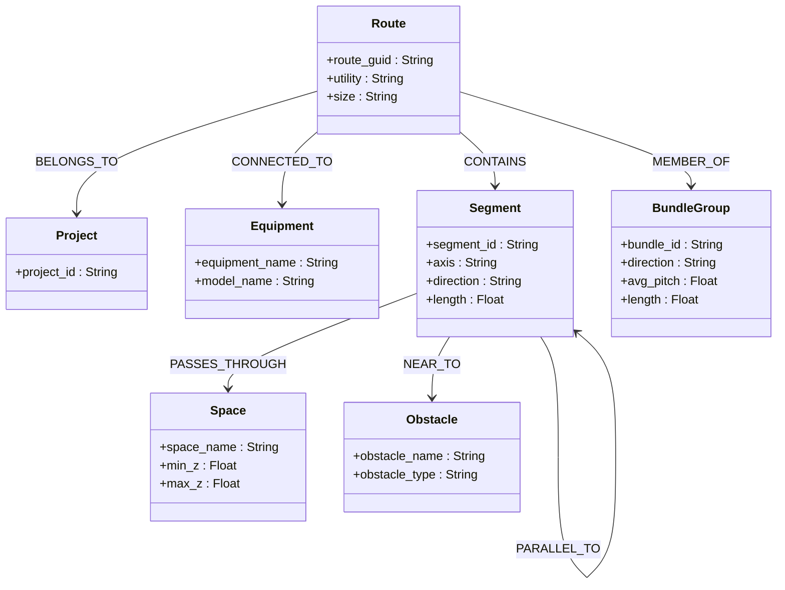
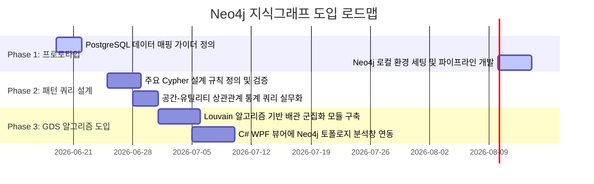

# [설계 개발 문서] PostgreSQL 기반 배관 설계 데이터를 활용한 Neo4j 지식그래프(Knowledge Graph) 구축 및 설계 패턴 추출 가이드

본 문서는 PostgreSQL 관계형 데이터베이스에 저장된 기존 배관 경로, 장비, 유틸리티, 공간구간 및 장애물 간의 유기적인 관계 데이터를 **지식그래프(Knowledge Graph, Neo4j)**로 전환하여, 수평/수직 다발배관(Bundle) 및 라우팅 설계 패턴을 토폴로지 관점에서 직관적이고 고속으로 추출하는 연동 가이드 및 아키텍처 설계를 다룹니다.

---

## 1. 지식그래프(Neo4j) 도입 배경 및 기대 효과

기존 PostgreSQL 방식은 기하 좌표(AABB, 2D/3D Point) 연산이나 다중 Join 질의(R-Tree, PostGIS)를 매번 수행해야 하므로 설계 패턴이나 위상적 연결성(Connectivity)을 조회할 때 쿼리가 복잡해지고 연산 비용이 큽니다.
배관 설계 데이터를 그래프 구조로 매핑하면 다음과 같은 장점이 있습니다:

* **토폴로지 관계 직관화**: 배관의 시작/종점 장비 연결 상태, 다발(Bundle) 공유 상태, 특정 공간 통과 여부 등이 테이블 Join 없이 노드(Node)와 관계(Relationship)의 엣지 탐색(Traverse)만으로 고속 연산됩니다.
* **패턴 탐지의 단순성**: Cypher 쿼리를 사용하면 **"동일 유틸리티를 쓰면서 동일 장비로 가고, 평행하게 500mm 이상 동행하는 배관 네트워크"** 같은 복잡한 규칙 기반 패턴을 단 몇 줄로 선언적으로 추출할 수 있습니다.
* **그래프 알고리즘 활용**: Neo4j Graph Data Science(GDS) 라이브러리를 활용하여, Louvain 커뮤니티 감지 알고리즘(배관 다발 클러스터링), Degree Centrality(간섭 및 병목 위험 영역 분석), Shortest Path(경로 추적) 등을 손쉽게 적용할 수 있습니다.

---

## 2. 그래프 데이터 모델 스키마 설계 (Graph Schema Design)

배관 설계 데이터를 그래프로 추상화하기 위해 다음과 같이 **노드(Labels)**와 **관계(Relationships)**를 구성합니다.



### ① 노드 (Nodes) 정의

| 노드 레이블 (Label) | 주요 속성 (Properties) | 설명 |
| :--- | :--- | :--- |
| **`Project`** | `project_id` (PK) | 프로젝트명 (예: CHILLER 002) |
| **`Equipment`** | `equipment_name` (PK), `model_name` | 설비/장비 호기 정보 |
| **`Route`** | `route_guid` (PK), `utility`, `size`, `total_length` | 전체 배관 경로 정보 |
| **`Segment`** | `segment_id` (PK), `axis`, `direction`, `length`, `start_xyz`, `end_xyz` | 경로를 구성하는 개별 직선 세그먼트 |
| **`Space`** | `space_name` (PK), `min_z`, `max_z` | CSF, A/F, CR 등 건물 공간 정보 |
| **`Obstacle`** | `obstacle_name` (PK), `obstacle_type`, `aabb` | 주요 간섭 장애물 데이터 |
| **`BundleGroup`** | `bundle_id` (PK), `direction`, `avg_pitch`, `length` | 추출된 수평/수직 다발배관 그룹 정보 |

### ② 관계 (Relationships) 정의

| 관계 유형 (Type) | 시작 노드 $\to$ 종료 노드 | 속성 (Properties) | 설명 |
| :--- | :--- | :--- | :--- |
| **`BELONGS_TO`** | `(:Route) -> (:Project)` | 없음 | 배관이 속한 프로젝트 매핑 |
| **`CONNECTED_TO`** | `(:Route) -> (:Equipment)` | `port_no`, `type` ("START" 또는 "END") | 배관이 장비의 어떤 포트에 연결되었는지 표시 |
| **`CONTAINS`** | `(:Route) -> (:Segment)` | `sequence_no` | 배관 경로 내 세그먼트의 진행 순서 |
| **`PARALLEL_TO`** | `(:Segment) -> (:Segment)` | `distance`, `overlap_length` | 두 세그먼트가 평행하게 동행할 때 관계 연결 |
| **`PASSES_THROUGH`**| `(:Segment) -> (:Space)` | 없음 | 세그먼트 중점이 특정 공간 내에 위치할 때 |
| **`MEMBER_OF`** | `(:Route) -> (:BundleGroup)`| 없음 | 배관이 특정 다발 그룹의 구성원임을 명시 |
| **`NEAR_TO`** | `(:Segment) -> (:Obstacle)` | `clearance_dist` | 세그먼트와 장애물 간의 최단 이격 거리 |

---

## 3. 데이터 이관 파이프라인 (PostgreSQL $\to$ Neo4j)

PostgreSQL의 원본 RDB 데이터를 Neo4j 지식그래프로 적재하는 절차는 **1) Python 데이터 로드/정규화**, **2) Graph Node 생성 및 Bulk Insert**, **3) 관계 설정 Cypher 구문 기동**의 파이프라인으로 구축할 수 있습니다.

### ① 파이프라인 단계별 흐름

```text
  [PostgreSQL] (Source)
       │
       ▼ (psycopg2를 활용해 관계형 데이터 적재)
  [Python 파이프라인 (Transform)]
       │  - Route, Segment, Space 데이터 가공 및 관계성 튜플 생성
       │  - utility_group별 스냅 및 매핑 관계 정리
       ▼ (neo4j 파이썬 드라이버로 Cypher 파라미터 벌크 전달)
  [Neo4j Database] (Target Graph)
```

### ② Python 이관 코드 예시 (`export_to_neo4j.py`)

지식그래프 이관을 수행할 수 있는 실무 예시 코드는 아래와 같이 구현할 수 있습니다.
(`pip install neo4j psycopg2-binary` 사전 설치 필요)

```python
import json
import psycopg2
from neo4j import GraphDatabase

# 1. DB 커넥션 설정
pg_conn = psycopg2.connect("host=localhost dbname=DDW_AI_DB user=postgres password=dinno")
neo4j_driver = GraphDatabase.driver("bolt://localhost:7687", auth=("neo4j", "password"))

def import_pipeline():
    with pg_conn.cursor() as cur:
        # (1) 장비 데이터 로드
        cur.execute('SELECT DISTINCT "EQUIPMENT_NAME" FROM "TB_ROUTE_VERTICAL_GROUP_FEATURE";')
        equipments = [r[0] for r in cur.fetchall()]

        # (2) 공간 데이터 로드
        cur.execute('SELECT "SPACE_NAME", "AABB_MINZ", "AABB_MAXZ" FROM "TB_SPACE_INFO";')
        spaces = [{'name': r[0], 'min_z': r[1], 'max_z': r[2]} for r in cur.fetchall()]

        # (3) 다발배관 데이터 로드
        cur.execute("""
            SELECT "VERTICAL_GROUP_ID", "PROJECT_ID", "EQUIPMENT_NAME", "UTILITY", 
                   "SPACE_NAME", "DIRECTION", "BUNDLE_LENGTH", "AVG_PITCH_MM", "MEMBER_ROUTE_GUIDS_JSON"
            FROM "TB_ROUTE_VERTICAL_GROUP_FEATURE";
        """)
        bundles = []
        for r in cur.fetchall():
            bundles.append({
                'id': r[0], 'project_id': r[1], 'eq_name': r[2], 'utility': r[3],
                'space_name': r[4], 'direction': r[5], 'length': r[6], 'pitch': r[7],
                'guids': r[8] if isinstance(r[8], list) else json.loads(r[8])
            })

    # 2. Neo4j 이관 쿼리 실행
    with neo4j_driver.session() as session:
        # 데이터베이스 초기화
        session.run("MATCH (n) DETACH DELETE n;")

        # (1) Space 노드 생성
        session.run("""
            UNWIND $spaces AS sp
            CREATE (s:Space {name: sp.name, min_z: sp.min_z, max_z: sp.max_z});
        """, spaces=spaces)

        # (2) Equipment 노드 생성
        session.run("""
            UNWIND $eqs AS eq
            CREATE (e:Equipment {name: eq});
        """, eqs=equipments)

        # (3) Bundle 및 Route, 관계(CONNECTED_TO, MEMBER_OF, PASSES_THROUGH) 일괄 생성
        for b in bundles:
            session.run("""
                MERGE (p:Project {id: $project_id})
                CREATE (bg:BundleGroup {
                    id: $id, 
                    direction: $direction, 
                    length: $length, 
                    avg_pitch: $pitch
                })
                MERGE (e:Equipment {name: $eq_name})
                CREATE (bg)-[:CONNECTED_TO]->(e)
                
                WITH p, bg
                UNWIND $guids AS r_guid
                CREATE (r:Route {guid: r_guid, utility: $utility})
                CREATE (r)-[:BELONGS_TO]->(p)
                CREATE (r)-[:MEMBER_OF]->(bg)
                
                WITH r
                MATCH (s:Space {name: $space_name})
                CREATE (r)-[:PASSES_THROUGH]->(s)
            """, **b)

    print("Neo4j 지식그래프 적재 완료!")

if __name__ == "__main__":
    import_pipeline()
    neo4j_driver.close()
    pg_conn.close()
```

---

## 4. 지식그래프를 활용한 설계 패턴 분석 Cypher 쿼리 예시

Neo4j 적재 후, **Cypher** 질의 언어를 사용하여 우리가 추출하고자 하는 배관의 위상 특징과 다발 유형을 손쉽게 필터링할 수 있습니다.

### ① 특정 장비에 연결되어 동일한 공간을 지나는 배관 경로 패턴 조회
```cypher
MATCH (eq:Equipment {name: "CHILLER 002"})<-[:CONNECTED_TO]-(bg:BundleGroup)<-[:MEMBER_OF]-(r:Route)
MATCH (r)-[:PASSES_THROUGH]->(sp:Space)
RETURN eq.name AS Equipment, sp.name AS Space, r.utility AS Utility, count(r) AS PipeCount, collect(r.guid) AS RouteGuids
ORDER BY Space, PipeCount DESC;
```
* **효과**: 장비 주변에서 어떤 유틸리티 배관들이 묶여서 어떤 공간(예: A/F, CSF)을 가로지르는지 토폴로지 통계를 즉각 집계합니다.

### ② 두 개 이상의 서로 다른 유틸리티 다발이 동일한 공간을 평행하게 통과하는 패턴 검출
```cypher
MATCH (sp:Space)<-[:PASSES_THROUGH]-(r1:Route)-[:MEMBER_OF]->(bg1:BundleGroup)
MATCH (sp)<-[:PASSES_THROUGH]-(r2:Route)-[:MEMBER_OF]->(bg2:BundleGroup)
WHERE r1.utility <> r2.utility AND bg1.id <> bg2.id
RETURN sp.name AS Space, 
       r1.utility AS Utility1, bg1.direction AS Dir1, bg1.avg_pitch AS Pitch1,
       r2.utility AS Utility2, bg2.direction AS Dir2, bg2.avg_pitch AS Pitch2,
       count(distinct r1) AS Utility1_Count, count(distinct r2) AS Utility2_Count
LIMIT 10;
```
* **효과**: 서로 다른 이기종 유틸리티(예: Water 다발과 Exhaust 다발)가 같은 공간(CSF) 내에서 어떻게 평행하게 복도를 공유하여 주행하는지 복합 상관관계를 찾아냅니다.

### ③ Louvain 커뮤니티 감지 알고리즘을 이용한 배관 군집(Cluster) 추출
Neo4j Graph Data Science(GDS) 라이브러리를 사용하여 배관 연결 네트워크 상의 밀집 구조를 탐지합니다:
```cypher
// 1. 배관 공유 그래프 프로젝션 생성
CALL gds.graph.project(
  'pipingGraph',
  ['Route', 'BundleGroup'],
  {
    MEMBER_OF: {orientation: 'UNDIRECTED'}
  }
);

// 2. Louvain 알고리즘 실행 및 군집 번호 도출
CALL gds.louvain.stream('pipingGraph')
YIELD nodeId, communityId
RETURN gds.util.asNode(nodeId).guid AS RouteGuid, gds.util.asNode(nodeId).utility AS Utility, communityId
ORDER BY communityId;
```
* **효과**: 물리적 거리 연산 없이 오직 다발 멤버십 연결 네트워크 위상만 분석하여, 설계 내에서 "핵심적인 주행 라인 묶음(Sub-network)"을 자연스럽게 클러스터링합니다.

---

## 5. 지식그래프 기반 설계 패턴 추출 로드맵

지식그래프를 실무에 도입하기 위해 추천하는 점진적 로드맵은 다음과 같습니다.



1. **Phase 1: 데이터 변환 및 적재 프로토타입 구축 (1주일)**
   - 본 문서에 첨부된 Python 이관 스크립트를 로컬 환경에서 테스트하고, `TB_ROUTE_VERTICAL_GROUP_FEATURE` 및 `TB_SPACE_INFO` 데이터를 Neo4j로 안정적 이관합니다.
2. **Phase 2: 설계 패턴 규칙 Cypher 템플릿화 (0.5주일)**
   - 라우팅 가이더(C#)가 참조할 설계 패턴 규칙을 Cypher 질의로 정의하고 속도 튜닝을 실행합니다.
3. **Phase 3: WPF 뷰어 및 GDS 알고리즘 연동 (1주일)**
   - C#의 WPF 설계 뷰어에 Neo4j Bolt 클라이언트 라이브러리를 설치하여, 분석가가 3D 화면 상에서 배관 클릭 시 해당 배관과 연계된 지식그래프 네트워크(장비, 연관 다발, 최단 거리 장애물)를 토폴로지 형태로 즉각 띄워줄 수 있도록 연동합니다.
