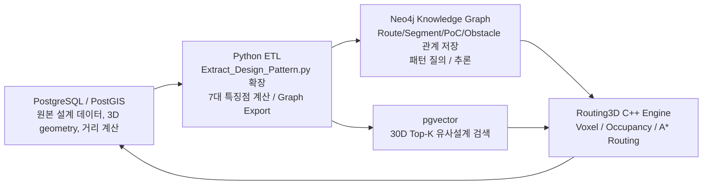
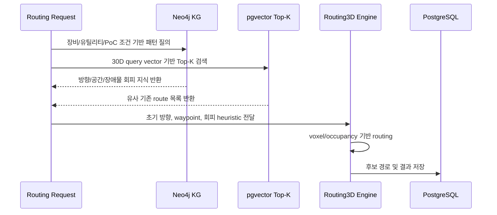

# PostgreSQL 기존설계데이터 기반 Neo4j 지식그래프 전환 및 7대 특징점 분석 개발계획서

## 문서 정보

- **문서명**: PostgreSQL 기존설계데이터 기반 Neo4j 지식그래프 전환 및 7대 특징점 분석 개발계획서
- **작성 일시**: 2026-06-24 16:34:37 KST
- **대상 시스템**: TopKGen / Routing3D / PostgreSQL(PostGIS, pgvector) / Neo4j
- **대상 소스**: `D:\DINNO\DEV\AI-AutoRouting\TopKGen\Tools\Extract_Design_Pattern.py`
- **관련 문서**:
  - `Docs/01_Vector_Topology_StartEndDirection.md` ~ `Docs/07_Vector_ArrowPattern_DirectionStatistics.md`
  - `Docs/knowledge_graph_neo4j_design_patterns_spec.md`

---

## 1. 개발 목적

본 개발의 목적은 PostgreSQL에 저장된 기존 배관 설계 데이터를 Neo4j 지식그래프로 전환하여, 기존 30D 벡터 기반 Top-K 유사설계 검색을 보완하고 설계 패턴의 관계형 지식을 추론할 수 있는 기반을 구축하는 것이다.

현재 `Extract_Design_Pattern.py`는 PostgreSQL 기존 설계 데이터에서 다음 7가지 30D 벡터 특징을 추출한다.

1. Start/End Direction 토폴로지
2. Displacement 상대 변위
3. BoundingBox / Spatial Range
4. Resampled Segment 방향
5. Total Length / Path Length
6. Obstacle Avoidance / Env Cost
7. Arrow Pattern / Direction Statistics

Neo4j 전환 개발은 이 7가지 특징을 단순 숫자 벡터로만 저장하는 것이 아니라, 다음 질문에 답할 수 있는 지식 기반을 만드는 것을 목표로 한다.

- 어떤 장비/유틸리티/공간 조건에서 특정 배관 패턴이 반복되는가?
- 어떤 장애물 유형을 만났을 때 설계자는 주로 어느 방향으로 회피했는가?
- 시작 PoC와 종단 PoC 방향이 유사한 기존 설계 route는 무엇인가?
- 같은 랙/공간/다발에 속하는 route들은 어떤 공통 topology를 갖는가?
- Routing3D 자동경로 탐색 시 어떤 기존 설계 패턴을 heuristic으로 적용해야 하는가?

---

## 2. 권장 전체 구조

권장 구조는 Neo4j 단독 처리 방식이 아니라, PostgreSQL/PostGIS, Python ETL, Neo4j, Routing3D가 역할을 나누는 하이브리드 구조이다.



### 2.1 역할 분담

| 구성요소 | 주요 역할 | 비고 |
|---|---|---|
| PostgreSQL/PostGIS | 원본 설계 데이터, 3D geometry, AABB, 거리/공간 연산 | 정밀 기하 계산 담당 |
| pgvector | 30D 특징 벡터 저장 및 Top-K 검색 | cosine/HNSW 검색 담당 |
| Python ETL | PostgreSQL 데이터 로딩, 특징 계산, Neo4j 적재 | `Extract_Design_Pattern.py` 확장 또는 별도 모듈화 |
| Neo4j | 지식그래프 저장, 관계 질의, 패턴 추론 | Route/Segment/Obstacle/Space 관계 분석 |
| Routing3D | 실제 자동경로 탐색, voxel/occupancy 기반 routing | KG/Top-K 결과를 heuristic으로 사용 |

---

## 3. 개발 범위

### 3.1 포함 범위

| 구분 | 개발 내용 |
|---|---|
| Graph Schema | Project, Equipment, Route, Segment, Point, PoC, Utility, Obstacle, Space, FeatureVector 노드/관계 설계 |
| ETL | PostgreSQL 원본 및 특징 테이블을 Neo4j 노드/관계로 적재 |
| 특징점 매핑 | 7대 30D 특징을 Neo4j 속성/관계로 저장 |
| 패턴 질의 | Start/End 방향, 축별 주행 비율, 장애물 회피, 다발/공간 패턴 Cypher 질의 작성 |
| 자동경로 연동 | Routing3D 탐색 전 KG/Top-K 특징을 초기 방향, 중간 waypoint, 장애물 회피 heuristic에 반영 |
| 검증 | PostgreSQL 추출 결과와 Neo4j 계산 결과의 route 단위 일치성 검증 |

### 3.2 제외 또는 후순위 범위

| 항목 | 사유 |
|---|---|
| Neo4j 단독 3D 충돌 계산 | 정밀 geometry 연산은 PostGIS/Routing3D가 적합 |
| Cypher 단독 리샘플링 보간 | 누적 길이 기반 보간은 Python batch 계산이 효율적 |
| 실시간 전체 KG 재구축 | 초기 단계에서는 batch sync 우선 |
| GDS 기반 ML 모델 학습 | KG 구축 후 2차 고도화 단계로 분리 |

---

## 4. Neo4j 그래프 데이터 모델

### 4.1 노드 설계

| Label | 주요 속성 | 원천 데이터 |
|---|---|---|
| `Project` | `project_id`, `name` | 실행 파라미터 / `EQUIPMENT_TAG` 범위 |
| `Equipment` | `equipment_name`, `equipment_type` | `TB_ROUTE_PATH.EQUIPMENT_TAG` |
| `Utility` | `utility_group`, `utility`, `size` | `TB_ROUTE_PATH` |
| `Route` | `route_path_guid`, `total_length_mm`, `direction_pattern`, `bend_count` | `TB_ROUTE_PATH`, feature tables |
| `Segment` | `segment_id`, `order`, `length_mm`, `axis`, `direction`, `dir_x/y/z` | `TB_ROUTE_SEGMENT_DETAIL` |
| `Point` | `point_id`, `x`, `y`, `z`, `seq` | route polyline points |
| `PoC` | `poc_id`, `kind`, `x`, `y`, `z`, `face` | source/target positions, anchor feature |
| `Obstacle` | `obstacle_name`, `obstacle_type`, `aabb_min/max` | `TB_BIM_OBSTACLE` |
| `Space` | `space_name`, `aabb_min/max` | `TB_SPACE_INFO` |
| `FeatureVector` | `vector_dim`, `feature_vector_json` | `TB_ROUTE_FEATURE_VECTOR` |
| `BundleGroup` | `bundle_id`, `route_count`, `avg_pitch_mm`, `direction` | `TB_ROUTE_VERTICAL_GROUP_FEATURE`, bundle tables |

### 4.2 관계 설계

| Relationship | From -> To | 주요 속성 | 설명 |
|---|---|---|---|
| `BELONGS_TO` | `Route -> Project` | 없음 | route의 프로젝트 범위 |
| `CONNECTED_TO` | `Route -> Equipment` | `role: START/END` | 장비/PoC 연결 관계 |
| `USES_UTILITY` | `Route -> Utility` | 없음 | 유틸리티/사이즈 관계 |
| `STARTS_AT` | `Route -> PoC` | 없음 | 시작 PoC |
| `ENDS_AT` | `Route -> PoC` | 없음 | 종단 PoC |
| `HAS_SEGMENT` | `Route -> Segment` | `order`, `length_mm` | route 구성 segment 순서 |
| `FROM_POINT` | `Segment -> Point` | 없음 | segment 시작점 |
| `TO_POINT` | `Segment -> Point` | 없음 | segment 끝점 |
| `NEXT_SEGMENT` | `Segment -> Segment` | 없음 | route 내 segment 순서 연결 |
| `PASSES_THROUGH` | `Route/Segment -> Space` | `overlap_length_mm` | 공간 통과 관계 |
| `NEAR_OBSTACLE` | `Route/Segment -> Obstacle` | `nearest_distance_mm`, `clearance_margin_mm`, `bypass_axis`, `z_delta_near_obstacle_mm` | 장애물 회피 관계 |
| `HAS_FEATURE_VECTOR` | `Route -> FeatureVector` | 없음 | 30D vector 연결 |
| `MEMBER_OF` | `Route -> BundleGroup` | 없음 | 다발/공용 spine 소속 관계 |
| `SIMILAR_TO` | `Route -> Route` | `score`, `vector_distance`, `reason` | Top-K 또는 KG 기반 유사 관계 |

---

## 5. 7대 특징점 Neo4j 전환 전략

| 특징점 | PostgreSQL/Python 계산 | Neo4j 저장 방식 | Neo4j 분석 가능성 |
|---|---|---|---|
| Start/End Direction | `pts[1]-p0`, `pts[-2]-pn` 단위 벡터 | `Route.start_dir_x/y/z`, `Route.end_dir_x/y/z`, 또는 `PoC` 관계 속성 | 높음 |
| Displacement | `pn-p0`, `DISPLACEMENT_MAX` 정규화 | `Route.dx/dy/dz`, `Route.displacement_norm` | 높음 |
| BoundingBox / Spatial Range | route bbox 및 `abs(end-start)` 축별 범위 | `Route.bbox_x/y/z`, `Route.range_x/y/z` | 중간~높음 |
| Resampled Segments | Python에서 3구간 리샘플링 | `(:Route)-[:HAS_RESAMPLED_DIRECTION {part,x,y,z}]->(:DirectionFeature)` | 중간 |
| Total Length | segment length 합산 | `Route.total_length_mm` 및 `HAS_SEGMENT.length_mm` | 높음 |
| Obstacle Avoidance | PostGIS/Python 거리 계산 | `NEAR_OBSTACLE` 관계 속성 | 중간~높음 |
| Arrow Pattern | 축별 지배 길이, bend count | `Route.axis_ratio_x/y/z`, `Route.bend_count`, `direction_pattern` | 높음 |

### 5.1 원칙

- 정밀 거리/충돌/리샘플링 계산은 PostgreSQL/PostGIS 또는 Python에서 수행한다.
- Neo4j에는 계산 결과와 관계를 저장한다.
- Neo4j에서는 반복 패턴, 조건별 통계, 유사 관계, 설계 지식 질의를 수행한다.

---

## 6. ETL 개발 계획

### 6.1 모듈 구성안

```text
TopKGen/Tools/
  Extract_Design_Pattern.py                 # 기존 7대 특징점 추출
  Export_Design_KG_Neo4j.py                 # 신규: PostgreSQL -> Neo4j ETL
  kg/
    graph_schema.py                         # 노드/관계 schema 상수
    pg_loader.py                            # PostgreSQL 데이터 로더
    feature_mapper.py                       # 7대 특징점 -> graph 속성 매핑
    neo4j_writer.py                         # Neo4j batch upsert
    cypher_templates.py                     # 제약조건/인덱스/분석 질의
    kg_validator.py                         # PG-KG 검증
```

### 6.2 ETL 단계

| 단계 | 작업 | 산출물 |
|---:|---|---|
| 1 | Neo4j 제약조건/인덱스 생성 | uniqueness constraint, lookup index |
| 2 | Project/Equipment/Utility 노드 적재 | 기본 master graph |
| 3 | Route/PoC 노드 및 STARTS_AT/ENDS_AT 관계 적재 | route topology |
| 4 | Segment/Point 노드 및 순서 관계 적재 | route polyline graph |
| 5 | FeatureVector 노드 및 7대 특징 속성 적재 | feature graph |
| 6 | Obstacle/Space 노드 및 관계 적재 | environment graph |
| 7 | BundleGroup/VerticalGroup 관계 적재 | bundle/rack graph |
| 8 | 검증 Cypher 실행 및 리포트 생성 | validation report |

### 6.3 Upsert 방식

Neo4j 적재는 `CREATE`가 아니라 `MERGE` 기반 idempotent upsert로 구현한다. 반복 실행해도 중복 노드/관계가 생기지 않아야 한다.

```cypher
MERGE (r:Route {route_path_guid: $route_path_guid})
SET r.total_length_mm = $total_length_mm,
    r.direction_pattern = $direction_pattern,
    r.updated_at = datetime()
```

---

## 7. Neo4j 제약조건 및 인덱스 계획

```cypher
CREATE CONSTRAINT project_id IF NOT EXISTS
FOR (p:Project) REQUIRE p.project_id IS UNIQUE;

CREATE CONSTRAINT route_guid IF NOT EXISTS
FOR (r:Route) REQUIRE r.route_path_guid IS UNIQUE;

CREATE CONSTRAINT segment_id IF NOT EXISTS
FOR (s:Segment) REQUIRE s.segment_id IS UNIQUE;

CREATE CONSTRAINT point_id IF NOT EXISTS
FOR (p:Point) REQUIRE p.point_id IS UNIQUE;

CREATE CONSTRAINT obstacle_name IF NOT EXISTS
FOR (o:Obstacle) REQUIRE o.obstacle_name IS UNIQUE;

CREATE INDEX route_equipment IF NOT EXISTS
FOR (r:Route) ON (r.equipment_name);

CREATE INDEX route_utility_group IF NOT EXISTS
FOR (r:Route) ON (r.utility_group);

CREATE INDEX segment_axis IF NOT EXISTS
FOR (s:Segment) ON (s.axis);
```

Neo4j 5.x를 사용하는 경우 vector index를 추가로 검토할 수 있다. 다만 현재 Top-K 검색은 pgvector가 담당하므로 Neo4j vector index는 2차 고도화로 분리한다.

---

## 8. 주요 Cypher 분석 질의 개발 계획

### 8.1 Start/End 방향 유사 route 조회

```cypher
MATCH (r:Route)
WHERE r.equipment_name = $equipment_name
  AND r.utility_group = $utility_group
WITH r,
     r.start_dir_x * $sx + r.start_dir_y * $sy + r.start_dir_z * $sz AS start_cos,
     r.end_dir_x * $ex + r.end_dir_y * $ey + r.end_dir_z * $ez AS end_cos
RETURN r.route_path_guid, start_cos, end_cos, (start_cos + end_cos) / 2.0 AS score
ORDER BY score DESC
LIMIT 20;
```

### 8.2 장애물 유형별 회피 방향 통계

```cypher
MATCH (r:Route)-[rel:NEAR_OBSTACLE]->(o:Obstacle)
WHERE r.utility_group = $utility_group
RETURN o.obstacle_type,
       rel.bypass_axis,
       count(*) AS cnt,
       avg(rel.clearance_margin_mm) AS avg_margin,
       avg(rel.z_delta_near_obstacle_mm) AS avg_z_delta
ORDER BY cnt DESC;
```

### 8.3 축별 주행 패턴 통계

```cypher
MATCH (r:Route)
WHERE r.equipment_name = $equipment_name
RETURN r.utility_group,
       avg(r.axis_ratio_x) AS avg_x,
       avg(r.axis_ratio_y) AS avg_y,
       avg(r.axis_ratio_z) AS avg_z,
       avg(r.bend_count) AS avg_bend
ORDER BY r.utility_group;
```

### 8.4 다발/공간 기반 route 패턴 조회

```cypher
MATCH (r:Route)-[:MEMBER_OF]->(b:BundleGroup)
MATCH (r)-[:PASSES_THROUGH]->(s:Space)
WHERE s.space_name = $space_name
RETURN b.bundle_id,
       b.direction,
       b.route_count,
       collect(r.route_path_guid) AS routes
ORDER BY b.route_count DESC;
```

---

## 9. Routing3D 자동경로 연동 계획

### 9.1 연동 흐름



### 9.2 Routing3D 적용 지점

| Routing 단계 | KG/Top-K 활용 내용 |
|---|---|
| 복셀맵 생성 | KG의 Space/Obstacle 관계로 관심 영역 우선 로딩 |
| 장애물 로딩 | `NEAR_OBSTACLE` 통계로 장애물 유형별 회피 정책 설정 |
| 시작점 설정 | Start Direction Top-K 방향을 초기 확장 후보로 설정 |
| 종단점 설정 | End Direction Top-K 방향을 종단 접근 방향 후보로 설정 |
| 중간 탐색 | BundleGroup/Space 패턴으로 rack/spine 선호 영역 설정 |
| 비용 함수 | 기존 설계 axis ratio, bend count, env cost와 유사한 후보에 가중치 부여 |
| 결과 평가 | 생성 route의 30D vector를 계산하여 기존 Top-K/KG 패턴과 비교 |

---

## 10. 단계별 개발 일정안

| 단계 | 기간 | 주요 작업 | 산출물 |
|---:|---|---|---|
| 1 | 1주 | 상세 요구사항/스키마 확정, Neo4j 설치/접속 설정 | schema spec, connection config |
| 2 | 1주 | PostgreSQL loader 및 Neo4j writer 기본 구현 | `Export_Design_KG_Neo4j.py` 1차 |
| 3 | 1주 | Route/Segment/Point/PoC graph 적재 | route topology graph |
| 4 | 1주 | 7대 특징점 graph 속성/관계 매핑 | feature graph |
| 5 | 1주 | Obstacle/Space/Bundle 관계 적재 | environment/bundle graph |
| 6 | 1주 | Cypher 분석 질의 및 검증 리포트 구현 | query library, validation report |
| 7 | 1~2주 | Routing3D 연동 API/heuristic 적용 | KG-assisted routing prototype |
| 8 | 1주 | 성능 튜닝, 문서화, 운영 절차 작성 | 운영 가이드, 최종 보고서 |

총 예상 기간은 8~9주이며, PostgreSQL 원본 데이터 품질과 Neo4j 운영 환경 준비 상태에 따라 조정될 수 있다.

---

## 11. 개발 산출물

| 산출물 | 설명 |
|---|---|
| Neo4j Graph Schema 문서 | 노드/관계/속성/제약조건 정의 |
| ETL 실행 스크립트 | PostgreSQL -> Neo4j batch 적재 도구 |
| Cypher Query Library | 설계 패턴 분석 질의 모음 |
| KG Validation Report | PG 원본과 Neo4j graph 적재 결과 비교 |
| Routing3D 연동 설계서 | KG/Top-K 특징을 routing heuristic에 적용하는 방법 |
| 운영 가이드 | 재적재, 증분 업데이트, 장애 대응 절차 |

---

## 12. 검증 계획

### 12.1 데이터 정합성 검증

| 검증 항목 | 방법 | 기준 |
|---|---|---|
| Route 수 | PostgreSQL route count와 Neo4j `Route` count 비교 | 100% 일치 |
| Segment 수 | route별 segment count 비교 | 99% 이상 일치 또는 차이 사유 기록 |
| PoC 좌표 | source/target 좌표 비교 | 허용 오차 1mm 이하 |
| 30D vector | `FEATURE_VECTOR_JSON`과 Neo4j 속성 비교 | 길이 30, 값 오차 1e-6 이하 |
| 장애물 관계 | `TB_ROUTE_FEATURE_OBSTACLE_RELATION`과 `NEAR_OBSTACLE` count 비교 | route별 count 일치 |

### 12.2 분석 결과 검증

- Start/End 방향 유사 route Top-K가 pgvector Top-K와 유사한 후보를 반환하는지 확인한다.
- 장애물 유형별 회피 방향 통계가 실제 설계 사례와 맞는지 샘플 route로 검토한다.
- BundleGroup 멤버 route가 PostgreSQL feature table의 `MEMBER_ROUTE_GUIDS_JSON`과 일치하는지 확인한다.
- Routing3D prototype에서 KG heuristic 적용 전/후 bend count, route length, clearance margin을 비교한다.

---

## 13. 위험요소 및 대응 방안

| 위험요소 | 영향 | 대응 |
|---|---|---|
| 원본 좌표/segment order 불일치 | 방향 특징 오류 | `load_data()` 방향 보정 결과와 KG 적재 전 validation 수행 |
| Neo4j 중복 노드 생성 | 분석 결과 왜곡 | 모든 핵심 노드에 uniqueness constraint 적용 |
| 대량 Point 노드 적재 성능 저하 | ETL 시간 증가 | batch size 조정, 필요 시 Point 노드 축약 저장 옵션 제공 |
| Cypher로 정밀 거리 계산 시 성능 저하 | 장애물 분석 지연 | 정밀 거리는 PostGIS/Python에서 계산 후 관계 속성으로 저장 |
| pgvector와 Neo4j 유사도 결과 불일치 | Top-K 혼선 | pgvector는 수치 Top-K, Neo4j는 관계 기반 보정으로 역할 분리 |
| Routing3D heuristic 과적용 | 경로 탐색 편향 | heuristic weight를 설정값으로 분리하고 A/B 테스트 수행 |

---

## 14. 우선 구현 권장 순서

1. `TB_ROUTE_FEATURE_VECTOR.FEATURE_VECTOR_JSON`을 Neo4j `Route` 또는 `FeatureVector`로 적재한다.
2. `Route`, `Segment`, `Point`, `PoC`의 기본 topology graph를 만든다.
3. 7대 특징점 중 계산이 쉬운 Start/End, Displacement, Total Length, Arrow Pattern부터 Cypher 검증한다.
4. Obstacle/Space/Bundle 관계를 추가한다.
5. pgvector Top-K 결과를 Neo4j의 `SIMILAR_TO` 관계로 캐싱한다.
6. Routing3D에서 KG 결과를 초기 방향/종단 접근 방향/장애물 회피 heuristic으로 사용한다.
7. 성능과 품질 평가 후 증분 업데이트 구조를 추가한다.

---

## 15. 최종 목표 아키텍처

최종적으로는 다음과 같은 설계 지식 순환 구조를 목표로 한다.

```text
기존 설계 데이터(PostgreSQL)
  -> 특징 추출(Python/PostGIS/pgvector)
  -> 지식그래프 전환(Neo4j)
  -> 설계 패턴/관계 추론(Cypher/GDS)
  -> 자동경로 heuristic 생성(Routing3D)
  -> 신규 경로 결과 저장(PostgreSQL)
  -> 신규 설계 사례 재학습
```

이 구조가 구축되면 자동경로 탐색은 단순 최단거리 탐색이 아니라, 기존 설계자의 반복 패턴과 장애물 회피 경험을 반영한 지식 기반 경로탐색으로 확장될 수 있다.
