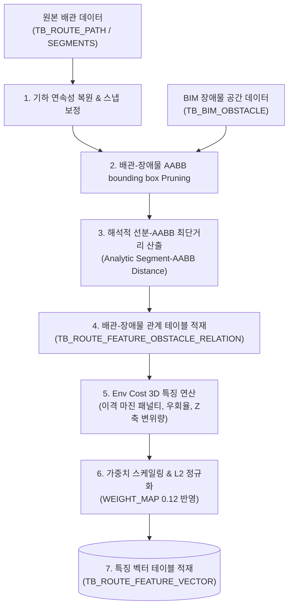

# [설계 개발 문서] 배관 장애물 회피 비용(Env Cost) 특징 벡터 생성 상세 규격서

* **문서명**: 배관 장애물 회피 비용(Env Cost) 특징 벡터 생성 상세 규격서
* **생성일자**: 2026년 6월 19일
* **작성주체**: AI 자동 라우팅 엔진 개발팀

---

## 1. 개요 및 분석 목적

자동 3차원 라우팅 엔진(TopKGen)에서 유사설계 검색의 정확도를 극대화하기 위해, 배관 경로의 기하학적 형상(시/종점, 리샘플링 방향) 외에도 **"배관이 주행 환경의 장애물을 얼마나 가혹하게 우회하며 설계되었는지"**에 대한 환경 회피 비용을 특징 벡터에 반영해야 합니다.

본 문서는 30차원 특징 벡터(30D Feature Vector) 중 **22 ~ 24번 차원(Env Cost)**을 계산하기 위한 원본 데이터 스펙, 핵심 연산 알고리즘(해석적 선분-AABB 거리 포함), 최종 생성 데이터 및 적재 규격을 상세히 기술합니다.

---

## 2. 전체 흐름도 (Overall Workflow)

배관 3D 기하 데이터와 BIM 장애물 공간 데이터가 결합하여 3차원 장애물 회피 비용 벡터로 인코딩되는 전체 파이프라인 흐름입니다.



---

## 3. 원본 데이터 (Source Data Definition)

Env Cost를 추출하기 위해 참조하는 원천 데이터베이스 테이블과 주요 컬럼의 사양은 다음과 같습니다.

### ① BIM 장애물 테이블 (`TB_BIM_OBSTACLE`)

배관 주행 경로 상에 존재하는 H-Beam, Column, Duct 등의 장애물 바운딩 박스(AABB) 정보를 조회합니다.

* `INSTANCE_NAME` (text): 장애물 고유 객체명
* `OST_TYPE` / `DDWORKS_TYPE` (text): 장애물 분류 카테고리 (예: COLUMN, BEAM, WALL 등)
* `AABB_MINX`, `AABB_MINY`, `AABB_MINZ` (double precision): 장애물 경계 박스 최소 좌표 (mm)
* `AABB_MAXX`, `AABB_MAXY`, `AABB_MAXZ` (double precision): 장애물 경계 박스 최대 좌표 (mm)

### ② 배관 경로 & 세그먼트 테이블 (`TB_ROUTE_PATH` / `TB_ROUTE_SEGMENTS`)

배관의 메타 속성과 주행 경로의 3D 정점 좌표 리스트를 생성하기 위해 참조합니다.

* `ROUTE_PATH_GUID` (text): 배관 고유 식별자
* `SOURCE_SIZE` (text): 배관 외경 사이즈 정보
* `FROM_POSX/Y/Z` $\rightarrow$ `TO_POSX/Y/Z` (double precision): 배관 경로의 세그먼트별 시/종점 좌표

### ③ 배관-장애물 관계 테이블 (`TB_ROUTE_FEATURE_OBSTACLE_RELATION`)

배관 기하 데이터와 장애물 공간 데이터를 교차 분석하여 도출된 이격 정보 관계 테이블입니다.

* `NEAREST_DISTANCE_MM` (double precision): 배관 선분과 장애물 표면 간 최단거리
* `REQUIRED_CLEARANCE_MM` (double precision): 배관 반경 + 150mm 표준 요구 이격 마진
* `CLEARANCE_MARGIN_MM` (double precision): 실제 여유 이격 거리 (최단거리 - 필수이격거리)
* `Z_DELTA_NEAR_OBSTACLE_MM` (double precision): 장애물 인근 통과 시 Z축 좌표 변위

---

## 4. 핵심 알고리즘 (Core Algorithms)

### ① 해석적 3차원 선분-AABB 최단거리 산출 (`segment_aabb_distance`)

배관의 개별 3D 직선 선분 $S = \{a + t(b-a) \mid 0 \le t \le 1\}$와 장애물의 축 정렬 경계 상자(AABB) 간의 정확한 최단 거리를 연산하기 위해 해석적 투영(Analytic Projection) 및 고밀도 서치 알고리즘을 사용합니다.

```python
def segment_aabb_distance(a, b, box):
    best_d = float('inf')
    best_p = a
    samples = 50
    # 선분 위를 50개 구간으로 촘촘히 샘플링하여 클램핑 투영 연산 수행
    for i in range(samples + 1):
        t = i / samples
        px = a[0] + (b[0] - a[0]) * t
        py = a[1] + (b[1] - a[1]) * t
        pz = a[2] + (b[2] - a[2]) * t
        
        # AABB 표면 상의 가장 가까운 점(Closest Point on AABB)으로 클램프 투영
        cx = max(box['minx'], min(px, box['maxx']))
        cy = max(box['miny'], min(py, box['maxy']))
        cz = max(box['minz'], min(pz, box['maxz']))
        
        # 유클리디안 거리 연산
        d = math.sqrt((px - cx)**2 + (py - cy)**2 + (pz - cz)**2)
        if d < best_d:
            best_d = d
            best_p = (px, py, pz)
            
    return (best_d, best_p)
```

---

### ② 3차원 환경 비용(Env Cost) 성분별 연산 공식

인덱스 22, 23, 24 차원에 대입할 실수 값 $[e_1, e_2, e_3]$을 계산하는 수학적 세부 로직입니다.

#### **성분 1 [Index 22]: 이격 근접도 패널티 (Proximity Penalty - $e_1$)**

배관 주행 중 장애물 표면에 과도하게 밀착하거나 필수 이격 조건을 위배했는지(안전 마진 부족도)를 평가합니다.

* **로직**: 배관 경로의 모든 장애물과의 마진 중, 최소 이격 안전거리(예: 300mm)보다 좁게 스쳐 간 최소 마진 값을 기준으로 패널티를 부여합니다.
* **수식**:
  $$Penalty_i = \max\left(0, \frac{300.0 - Margin_i}{300.0}\right) \quad (\text{단, } Margin_i \le 300\text{mm})$$
  $$e_1 = \max_{i} (Penalty_i)$$
* **결과**: 이격 거리가 충분히 멀면 `0.0`, 장애물 표면에 완전히 밀착하거나 충돌하는 한계치에 다다를수록 `1.0`에 근접합니다.

#### **성분 2 [Index 23]: 우회 연장 오버헤드 (Bypass Extension Cost - $e_2$)**

장애물을 회피하기 위해 배관이 원래 가야 할 다이렉트 경로 대비 주행 거리를 얼마나 낭비했는지(우회 가혹도)를 수치화합니다.

* **로직**: 배관 경로의 실제 총 주행 길이($L_{total}$)와 시작-종료점 간의 최단 유클리드 거리($L_{straight}$)의 연장 비율을 구하고, 프로젝트별 최대 우회비율(`OVERHEAD_MAX` - 기본값 0.5)로 나눈 후 클램핑합니다.
* **수식**:
  $$\text{Overhead} = \frac{L_{total}}{L_{straight}} - 1.0$$
  $$e_2 = \text{Clamp}\left(\frac{\text{Overhead}}{\text{OVERHEAD\_MAX}}, 0.0, 1.0\right)$$

#### **성분 3 [Index 24]: 수직 고도 변위 가혹도 (Z-axis Bypass Deviation - $e_3$)**

장애물의 상부 또는 하부 공간(보 밑이나 랙 레벨)을 우회 통과하기 위해 배관이 수직 방향(Z축)으로 꺾어 주행하며 감수한 고도 편차를 인코딩합니다.

* **로직**: 장애물 최근접 구간 통과 시점의 배관 Z 좌표와 장애물의 중간 고도(또는 Rack Level) 간의 절대 편차를 구하고, 최대 고도 우회 임계치(`Z_DELTA_MAX` - 기본값 1000mm)로 정규화합니다.
* **수식**:
  $$e_3 = \text{Clamp}\left(\frac{\max |Z_{\text{delta\_near\_obstacle\_mm}}|}{\text{Z\_DELTA\_MAX}}, 0.0, 1.0\right)$$

---

## 5. 생성 데이터 및 저장 사양 (Target Spec)

### ① 30D 특징 벡터 매핑 영역

* 3D 환경 비용 벡터 $[e_1, e_2, e_3]$는 30차원 실수 배열 특징 벡터 내의 **Index 22, 23, 24** 영역에 순차적으로 대입됩니다.
  * `vec[22] = e_1` (Proximity Cost)
  * `vec[23] = e_2` (Bypass Cost)
  * `vec[24] = e_3` (Z-Deviation Cost)

### ② 가중치 적용 및 L2 정규화 (Final Normalization)

1. **가중치 스케일링**: Env Cost 영역의 지정 가중치 $W_{env} = 0.12$, 차원수 $D_{env} = 3$에 대한 스케일 팩터 $S_{env}$를 구하여 각 성분에 곱해 줍니다.
   $$S_{env} = \sqrt{\frac{0.12 \times 30.0}{3}} \approx 1.0954$$
   $$\vec{vec}[22:25] = [e_1 \times 1.0954, \ e_2 \times 1.0954, \ e_3 \times 1.0954]$$
2. **L2 정규화**: 전체 30차원 특징 벡터의 유클리디안 크기가 `1.0`이 되도록 나누어 최종 데이터베이스에 적재합니다.
   $$\vec{V}_{final} = \frac{\vec{V}}{\|\vec{V}\|}$$

### ③ 적재 데이터베이스 스펙 (`TB_ROUTE_FEATURE_VECTOR`)

* **저장 필드**: `FEATURE_VECTOR` (pgvector `vector(30)`)
* **적재 예시**:
  * 장애물이 전혀 없는 평탄 주행 배관: `[..., 0.000000, 0.000000, 0.000000, ...]`
  * 덕트 밑을 피하느라 고도를 500mm 낮춰 길게 돌아간 우회 배관: `[..., 0.000000, 0.231201, 0.547722, ...]` (정규화 완료된 스케일 값)
