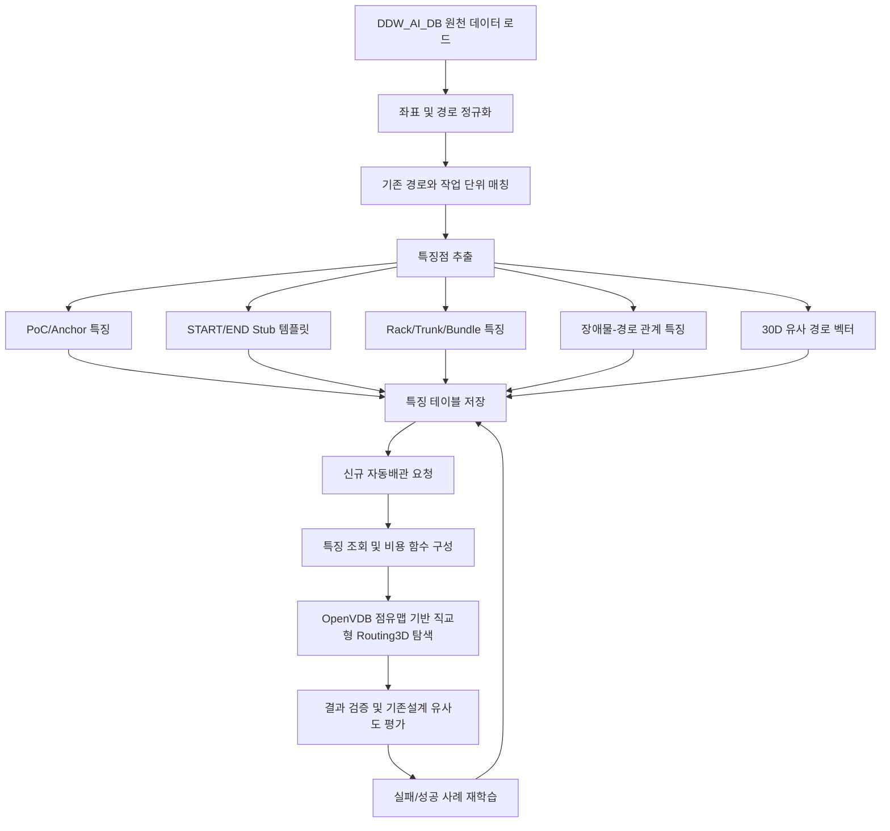

# DDW_AI_DB 기존 배관설계 특징 학습 및 Routing3D 자동배관설계 적용 방안

작성일: 2026-06-14  
최종 업데이트: 2026-06-14 22:06:23  
대상: Routing3D / DDW_AI_DB / PostgreSQL / OpenVDB 기반 직교형 3D 라우팅 엔진  
관련 구현: `D:\DINNO\DEV\AI-AutoRouting\TopKGen\Tools\learn_design_features.py`, `D:\DINNO\DEV\AI-AutoRouting\TopKGen\Tools\ExtractStubPatterns.py`

---

## 1. 목적과 기본 방향

자동배관설계의 목표는 단순 최단 경로를 찾는 것이 아니라, 사람이 설계한 기존 배관과 유사한 설계 습관을 재현하는 것이다. 실제 배관설계에서는 장비 PoC에서 바로 최단거리로 덕트나 레터럴까지 연결하지 않고, 다음과 같은 설계 의도가 반복적으로 나타난다.

- 장비별로 선호하는 출발 방향과 출발면이 있다.
- 덕트/레터럴 PoC별로 선호하는 진입 방향과 진입면이 있다.
- 같은 장비 또는 같은 유틸리티 그룹의 배관은 일정 높이의 공통 rack 또는 trunk를 따라 모인다.
- 기둥, H-beam, 벽체, 기존 배관/덕트 같은 장애물 근처에서는 배관의 꺾임, 높이 변경, 우회 방향이 달라진다.
- 배관경, 유틸리티 종류, 장비군에 따라 이격거리, 허용 꺾임 수, 선호 높이, 번들 간격이 달라진다.
- 장비 PoC와 덕트/레터럴 PoC 주변의 stub 구간은 전체 경로보다 더 강하게 기존 설계 습관을 따른다.

따라서 자동배관 엔진은 다음 두 단계를 가져야 한다.

1. **기존설계 특징 학습 단계**  
   DDW_AI_DB의 기존 경로, 장비, PoC, 덕트/레터럴, 장애물 데이터를 분석하여 설계자가 반복적으로 사용한 특징점을 추출하고 DB에 저장한다.

2. **특징점 기반 자동설계 단계**  
   저장된 특징점을 Routing3D 엔진의 시작/종단 보정, 비용 함수, rack 유도, obstacle 회피, bundle 배관 전략에 반영한다.

이번 구현에서는 특히 기존에 부족했던 다음 항목을 보완했다.

- START/END 스텁을 단순 상하 방향 벡터가 아니라 실제 기존 설계 경로의 PoC부터 첫 엘보까지 추출하도록 보완
- 장애물과 배관 경로의 연관 특징 저장
- 유틸리티 그룹별 공통 trunk/bundle 특징 저장
- 신규 특징 테이블과 필드명을 기존 DDW_AI_DB 관례에 맞춰 대문자 테이블/필드명으로 정리

---

## 2. 입력 데이터 기준

### 2.1 주요 원천 테이블

| 구분 | 테이블 | 용도 |
|---|---|---|
| 프로젝트/공간 | `TB_SPACE_GROUP_INFO`, `TB_BIM_SPACE_INFO` | 프로젝트 또는 공간 그룹, 설계 범위, 공간 AABB |
| 장애물 | `TB_BIM_OBSTACLE` | 기둥, H-beam, 벽체, 충돌 회피 대상 AABB |
| 장비 | `TB_EQUIPMENTS`, `TB_BIM_EQUIPMENT` | 장비/부대장비 AABB, 장비명, 장비 타입 |
| 덕트/레터럴 | `TB_DUCT`, `TB_LATERAL_PIPE`, `TB_DUCT_LATERAL` | 종단 접속 대상, 유틸리티 분기 대상, AABB |
| 라우팅 작업 | `TB_ROUTE_PATH` | 장비 PoC에서 덕트/레터럴 PoC까지의 기존 설계 작업 단위 |
| 경로 세그먼트 | `TB_ROUTE_SEGMENTS` | 기존 경로의 segment 묶음, 순서, route GUID |
| 경로 상세 | `TB_ROUTE_SEGMENT_DETAIL` | 실제 폴리라인 좌표, segment 상세 point |
| 스텁 패턴 | `TB_ROUTE_STUB_PATTERN` | 기존 경로에서 추출한 START/END 스텁 샘플 |
| 스텁 템플릿 | `TB_ROUTE_STUB_TEMPLATE` | 스텁 샘플을 집계한 자동설계 후보 템플릿 |
| 특징 벡터 | `TB_ROUTE_FEATURE_VECTOR` | 30차원 유사 경로 검색용 pgvector 테이블 |

### 2.2 자동설계 작업 단위

자동설계 작업 단위는 다음 키를 기준으로 정의한다.

```text
PROJECT_ID
MAIN_EQUIPMENT_NAME
EQUIPMENT_NAME
UTILITY_GROUP
UTILITY
SOURCE_POC
TARGET_POC
PIPE_DIAMETER / SIZE
TARGET_OWNER_NAME / DUCT_NAME / LATERAL_NAME
```

그룹핑 우선순위는 다음과 같다.

1. 프로젝트
2. 메인 장비
3. 장비 또는 부대장비
4. 유틸리티 그룹
5. 유틸리티
6. 배관 사이즈
7. 출발 PoC와 종단 PoC

설계 습관은 개별 PoC 하나보다 같은 장비군, 같은 유틸리티 그룹, 같은 배관 사이즈에서 더 안정적으로 반복된다. 따라서 학습과 자동설계 모두 개별 작업 단위와 그룹 단위를 함께 저장하고 조회해야 한다.

---

## 3. 전체 프로세스



### 3.1 데이터 로드

프로젝트 또는 전체 프로젝트 모드에서 다음 데이터를 읽는다.

- 기존 배관 폴리라인: `TB_ROUTE_PATH`, `TB_ROUTE_SEGMENTS`, `TB_ROUTE_SEGMENT_DETAIL`
- 장비 및 장비 PoC 기준 데이터
- 덕트/레터럴 및 종단 PoC 기준 데이터
- 장애물 AABB: `TB_BIM_OBSTACLE`
- 유틸리티 그룹, 유틸리티, 배관 사이즈

`learn_design_features.py`는 `--project <프로젝트명>` 또는 `--project all` 방식으로 실행된다.

```powershell
python Tools/learn_design_features.py --project "CHILLER 002" --report false
python Tools/learn_design_features.py --project all
```

### 3.2 좌표 및 경로 정규화

기존 설계 데이터는 CAD/BIM 추출 과정에서 미세 오차가 포함될 수 있다. 학습 전에 다음 정규화가 필요하다.

- mm 단위 통일
- 거의 같은 점 병합
- 0 길이 segment 제거
- segment 순서 정렬
- 중복 점 제거
- X/Y/Z 축 직교 segment 정리
- route 방향 보정

기존 경로가 완전 직교형이 아니더라도 Routing3D는 직교형 배관을 목표로 하므로, 학습 경로는 X/Y/Z 축 segment 중심으로 보정한다.

### 3.3 기존 경로와 작업 단위 매칭

`TB_ROUTE_PATH`의 출발 PoC/종단 PoC와 `TB_ROUTE_SEGMENT_DETAIL`의 폴리라인을 매칭한다.

방향 판단은 다음 비용으로 수행한다.

```text
forwardCost = dist(taskStart, pipeStart) + dist(taskEnd, pipeEnd)
reverseCost = dist(taskStart, pipeEnd) + dist(taskEnd, pipeStart)
pipeDirection = forwardCost <= reverseCost ? forward : reverse
```

이 매칭 결과가 이후 스텁 추출, 접속면 분석, 기존설계 유사도 평가의 기준이 된다.

---

## 4. 추출 특징점

### 4.1 PoC / Anchor 특징

PoC 주변의 접속면과 초기 진행 방향을 저장한다.

저장 특징:

- 출발 anchor 종류
- 종단 anchor 종류
- 접속 face: `+x`, `-x`, `+y`, `-y`, `+z`, `-z`
- PoC 좌표
- 첫 엘보 좌표
- PoC부터 첫 엘보까지의 point 배열
- rise 높이
- confidence

적용 방식:

- 신규 경로의 시작 방향 후보 제한
- 장비 PoC에서 바로 옆으로 꺾이는 비현실적 경로 억제
- 덕트/레터럴 PoC 진입 방향 보정

### 4.2 START / END Stub 템플릿

이번 구현에서 가장 중요한 보완점이다.

기존에는 스텁을 다음처럼 단순화하면 안 된다.

```text
장비 PoC -> 단순 하향 벡터
덕트/레터럴 PoC -> 단순 상향 벡터
```

실제 스텁은 다음과 같이 정의한다.

- **START 스텁**: 메인장비 또는 장비 PoC부터 실제 기존 경로를 따라 내려오거나 진행하여, 격자보 하단 또는 첫 직선 진입 구간과 첫 엘보를 포함하는 구간
- **END 스텁**: 덕트 또는 레터럴 PoC부터 실제 경로를 역방향으로 따라가며, 수직 상향 또는 실제 진입 방향으로 첫 번째 엘보를 만날 때까지의 구간

구현 방식:

- `ExtractStubPatterns.py`의 `extract_samples()`로 기존 route에서 START/END 샘플을 추출한다.
- `walk_stub()`는 폴리라인의 앞쪽에서 첫 방향 run을 찾고, 축이 바뀌는 첫 run을 엘보로 판단한다.
- 첫 엘보 이후에는 제한된 lead-in 구간만 포함한다.
- 추출 결과는 `TB_ROUTE_STUB_PATTERN`에 저장한다.
- 반복 패턴은 `TB_ROUTE_STUB_TEMPLATE`에 집계한다.
- 통합 특징 테이블 `TB_ROUTE_FEATURE_STUB_TEMPLATE`에도 미러링한다.

자동설계 적용:

1. 신규 요청의 `MAIN_EQUIPMENT_NAME`, `UTILITY_GROUP`, `UTILITY`, `SIZE`를 기준으로 START/END 스텁 템플릿을 조회한다.
2. 장비 PoC에는 START 템플릿을 적용한다.
3. 덕트/레터럴 PoC에는 END 템플릿을 적용한다.
4. 두 스텁의 free point 사이를 Routing3D가 연결한다.

### 4.3 Rack / Trunk / Bundle 특징

같은 장비와 유틸리티 그룹의 배관은 공통 높이와 공통 trunk를 사용하는 경향이 있다.

추출 특징:

- 선호 rack Z 높이
- 유틸리티 그룹별 trunk centerline
- trunk 진행 주축: `X`, `Y`, `Z`
- route 구성원 목록
- bundle route 수

적용 방식:

- 공통 rack 높이로 경로 비용을 낮춘다.
- trunk 중심선 주변 cell의 비용을 낮춘다.
- 같은 유틸리티 그룹의 다중 배관은 독립 최단경로가 아니라 bundle corridor를 따라가도록 유도한다.

### 4.4 장애물-경로 관계 특징

장애물은 단순 충돌 회피 대상이 아니라 기존 설계의 꺾임과 높이 변경을 유발하는 주요 요인이다.

분석 대상:

- 기둥
- H-beam
- 벽체
- 기존 배관
- 기존 덕트
- 장비/부대장비 AABB

추출 특징:

- 장애물 종류
- 장애물 주축
- 배관과 장애물의 최근접 거리
- 배관경 기준 필요 이격거리
- 이격 여유
- 장애물 주변 우회 방향
- 장애물 주변 통과 축
- 장애물 주변 Z 변화량
- 장애물 전후 bend 개수
- 실제 경로 길이 / 직선거리 비율
- 장애물-경로 연관 점수

적용 방식:

- 기둥 주변은 선호 우회 방향에 비용 보정 적용
- H-beam 주변은 보 하단/상단 통과 높이 후보 반영
- 장애물 전후 bend가 반복되는 구간은 waypoint 후보 생성
- clearance margin이 낮았던 유형은 신규 설계에서 보수적인 이격거리 적용

### 4.5 30D 유사 경로 벡터

각 route는 30차원 특징 벡터로 저장한다.

주요 구성:

- 시작 topology
- 종단 topology
- 전체 displacement
- bounding box 크기
- 3구간 방향 샘플
- 총 길이
- 환경 비용
- 방향 패턴

저장 테이블:

- `TB_ROUTE_FEATURE_VECTOR`

활용:

- 신규 요청과 유사한 기존설계 Top-K 검색
- 기존 경로의 waypoint, 방향 패턴, rack 높이 후보 재사용
- 자동설계 결과와 기존설계 유사도 평가

---

## 5. 특징점 저장 구조

신규 특징 테이블은 기존 DDW_AI_DB 명명 규칙에 맞춰 모두 대문자 테이블명과 대문자 필드명을 사용한다. PostgreSQL에서 대문자를 유지하기 위해 코드에서는 quoted identifier를 사용한다.

### 5.1 `TB_ROUTE_FEATURE_PATH`

개별 기존 경로의 정량 특징과 3D geometry를 저장한다.

| 필드 | 설명 |
|---|---|
| `ID` | PK |
| `PROJECT_ID` | 프로젝트 또는 장비 태그 |
| `ROUTE_PATH_GUID` | 기존 route GUID |
| `MAIN_EQUIPMENT_NAME` | 메인 장비명 |
| `EQUIPMENT_NAME` | 장비명 |
| `UTILITY_GROUP` | 유틸리티 그룹 |
| `UTILITY` | 유틸리티 |
| `DIAMETER_MM` | 배관경 |
| `TOTAL_LENGTH_MM` | 총 길이 |
| `BEND_COUNT` | 꺾임 수 |
| `MAIN_RACK_Z` | 대표 rack Z |
| `NORMALIZED_POINTS_JSON` | 정규화된 point 배열 |
| `GEOM_3D` | PostGIS `LineStringZ` |
| `CREATED_AT` | 생성/갱신 시간 |

Unique key:

```sql
UNIQUE("PROJECT_ID", "ROUTE_PATH_GUID")
```

### 5.2 `TB_ROUTE_FEATURE_ANCHOR`

PoC/anchor 주변 접속 특징과 첫 엘보 구간을 저장한다.

| 필드 | 설명 |
|---|---|
| `PROJECT_ID` | 프로젝트 ID |
| `ROUTE_PATH_GUID` | route GUID |
| `ANCHOR_KIND` | `EQUIP`, `TARGET` 등 |
| `ANCHOR_NAME` | 장비/대상 이름 |
| `UTILITY_GROUP` | 유틸리티 그룹 |
| `UTILITY` | 유틸리티 |
| `FACE` | 접속면 |
| `RISE_MM` | PoC 주변 높이 변화 |
| `CONFIDENCE` | 신뢰도 |
| `ANCHOR_POINT_JSON` | PoC 좌표 |
| `FIRST_ELBOW_POINT_JSON` | 첫 엘보 좌표 |
| `STUB_POINTS_JSON` | PoC부터 첫 엘보까지 point 배열 |

Unique key:

```sql
UNIQUE("PROJECT_ID", "ROUTE_PATH_GUID", "ANCHOR_KIND")
```

### 5.3 `TB_ROUTE_FEATURE_STUB_TEMPLATE`

자동설계에 직접 적용할 START/END 스텁 템플릿을 저장한다.

| 필드 | 설명 |
|---|---|
| `TEMPLATE_ID` | 템플릿 ID |
| `PROJECT_ID` | 프로젝트 ID |
| `STUB_KIND` | `START`, `END` |
| `ANCHOR_KIND` | `EQUIP`, `DUCT`, `LATERAL` 등 |
| `MAIN_EQUIPMENT_NAME` | 메인 장비명 |
| `UTILITY_GROUP` | 유틸리티 그룹 |
| `UTILITY` | 유틸리티 |
| `SIZE` | 배관 사이즈 |
| `FACE` | 접속면 |
| `DIR_SEQ_JSON` | 방향 run 배열 |
| `SAMPLE_COUNT` | 샘플 수 |
| `AVG_RISE_MM` | 평균 rise |
| `AVG_OFFSET_MM` | 평균 offset |
| `AVG_LENGTH_MM` | 평균 스텁 길이 |
| `REPRESENTATIVE_POINTS_JSON` | 대표 스텁 point 배열 |
| `AVG_FEAT_JSON` | 평균 특징 벡터 |
| `UPDATED_AT` | 갱신 시간 |

### 5.4 `TB_ROUTE_FEATURE_BUNDLE_TEMPLATE`

유틸리티 그룹별 공통 trunk/bundle 특징을 저장한다.

| 필드 | 설명 |
|---|---|
| `PROJECT_ID` | 프로젝트 ID |
| `BUNDLE_ID` | bundle ID |
| `UTILITY_GROUP` | 유틸리티 그룹 |
| `UTILITY` | 유틸리티 |
| `ROUTE_COUNT` | 구성 route 수 |
| `PREFERRED_RACK_ZS` | 선호 rack Z 배열 |
| `TRUNK_AXIS` | 주 진행축 |
| `TRUNK_CENTERLINE_JSON` | trunk 중심선 point 배열 |
| `MEMBER_ROUTE_GUIDS_JSON` | 구성 route GUID 배열 |

### 5.5 `TB_ROUTE_FEATURE_OBSTACLE_RELATION`

장애물과 기존 경로의 관계를 저장한다.

| 필드 | 설명 |
|---|---|
| `PROJECT_ID` | 프로젝트 ID |
| `ROUTE_PATH_GUID` | route GUID |
| `OBSTACLE_NAME` | 장애물 이름 |
| `OBSTACLE_TYPE` | 장애물 유형 |
| `OBSTACLE_AXIS` | 장애물 주축 |
| `UTILITY_GROUP` | 유틸리티 그룹 |
| `UTILITY` | 유틸리티 |
| `DIAMETER_MM` | 배관경 |
| `NEAREST_DISTANCE_MM` | 장애물과 배관의 최근접 거리 |
| `REQUIRED_CLEARANCE_MM` | 필요 이격거리 |
| `CLEARANCE_MARGIN_MM` | 이격 여유 |
| `BYPASS_SIDE` | 우회 방향 |
| `BYPASS_AXIS` | 통과 축 |
| `Z_DELTA_NEAR_OBSTACLE_MM` | 장애물 주변 Z 변화량 |
| `BEND_COUNT_BEFORE` | 장애물 전 bend 수 |
| `BEND_COUNT_AFTER` | 장애물 후 bend 수 |
| `EXTRA_LENGTH_RATIO` | 직선거리 대비 실제 길이 비율 |
| `RELATION_SCORE` | 장애물-경로 연관 점수 |

### 5.6 `TB_ROUTE_FEATURE_GROUP_PROFILE`

유틸리티 그룹 단위의 대표 설계 특징을 저장한다.

| 필드 | 설명 |
|---|---|
| `PROJECT_ID` | 프로젝트 ID |
| `MAIN_EQUIPMENT_NAME` | 메인 장비명 |
| `EQUIPMENT_NAME` | 장비명 |
| `UTILITY_GROUP` | 유틸리티 그룹 |
| `UTILITY` | 유틸리티 |
| `PREFERRED_SOURCE_FACE` | 선호 출발면 |
| `PREFERRED_TARGET_FACE` | 선호 종단면 |
| `PREFERRED_RACK_ZS` | 선호 rack Z 배열 |
| `TRUNK_CENTERLINE_JSON` | trunk 중심선 JSON |
| `TRUNK_CENTERLINE_GEOM` | PostGIS `LineStringZ` |
| `COLUMN_CLEARANCE_MM` | 기둥 이격 기본값 |
| `HBEAM_PASS_MODE` | H-beam 통과 방식 |
| `W_TURN_WEIGHT` | 꺾임 비용 가중치 |

---

## 6. 자동설계 활용 방안

### 6.1 신규 요청 처리 순서

```text
1. 신규 라우팅 요청 수신
2. PROJECT_ID / MAIN_EQUIPMENT_NAME / UTILITY_GROUP / UTILITY / SIZE 추출
3. START 스텁 템플릿 조회
4. END 스텁 템플릿 조회
5. 장비 PoC에 START 스텁 적용
6. 덕트/레터럴 PoC에 END 스텁 적용
7. 두 free point 사이를 Routing3D로 탐색
8. Rack/trunk/bundle 특징으로 비용 보정
9. 장애물 관계 특징으로 회피 비용 보정
10. 기존설계 유사도 평가 후 후보 Top-K 생성
```

### 6.2 비용 함수 반영 예시

```text
TotalCost =
    DistanceCost
  + BendCost * W_TURN_WEIGHT
  + CollisionCost
  + ClearancePenalty
  + RackDeviationPenalty
  + TrunkDeviationPenalty
  + StubMismatchPenalty
  + ObstacleBypassPenalty
  - ExistingDesignSimilarityBonus
```

각 항목의 의미:

- `DistanceCost`: 기본 경로 길이 비용
- `BendCost`: 꺾임 수 및 꺾임 위치 비용
- `CollisionCost`: OpenVDB 점유 cell 충돌 비용
- `ClearancePenalty`: 장애물/기존 배관 이격 위반 비용
- `RackDeviationPenalty`: 선호 rack Z에서 벗어난 비용
- `TrunkDeviationPenalty`: 공통 trunk corridor에서 벗어난 비용
- `StubMismatchPenalty`: 학습된 START/END 스텁과 다른 접속부 비용
- `ObstacleBypassPenalty`: 기존 설계와 다른 장애물 우회 방향 비용
- `ExistingDesignSimilarityBonus`: 유사 기존설계와 비슷할 때의 보너스

### 6.3 fallback 조회 전략

정확히 일치하는 템플릿이 없을 수 있으므로 다음 순서로 fallback한다.

```text
PROJECT_ID + MAIN_EQUIPMENT_NAME + UTILITY_GROUP + UTILITY + SIZE
PROJECT_ID + MAIN_EQUIPMENT_NAME + UTILITY_GROUP + UTILITY
PROJECT_ID + MAIN_EQUIPMENT_NAME + UTILITY_GROUP
PROJECT_ID + UTILITY_GROUP + UTILITY
PROJECT_ID + UTILITY_GROUP
GLOBAL + UTILITY_GROUP + UTILITY
GLOBAL + UTILITY_GROUP
기본 anchor/stub 규칙
```

---

## 7. 구현 반영 현황

### 7.1 반영된 코드

| 파일 | 반영 내용 |
|---|---|
| `Tools/learn_design_features.py` | 기존 설계 특징 추출, 대문자 특징 테이블 생성, anchor/stub/obstacle/bundle 저장 |
| `Tools/ExtractStubPatterns.py` | 실제 경로 기반 START/END 스텁 샘플 추출 및 템플릿 빌드 |

### 7.2 현재 구현된 주요 함수

| 함수 | 역할 |
|---|---|
| `prepare_tables()` | PostGIS/pgvector 확장 준비, 대문자 특징 테이블 생성, unique index 보강 |
| `load_data()` | 기존 route 폴리라인 로드 및 복원 |
| `save_individual_paths()` | `TB_ROUTE_FEATURE_PATH` 저장 |
| `save_anchor_features()` | `TB_ROUTE_FEATURE_ANCHOR` 저장 |
| `learn_stub_templates()` | 기존 route에서 START/END 스텁 추출 및 템플릿 빌드 |
| `mirror_stub_templates()` | `TB_ROUTE_STUB_TEMPLATE`을 `TB_ROUTE_FEATURE_STUB_TEMPLATE`로 미러링 |
| `save_obstacle_relations()` | `TB_ROUTE_FEATURE_OBSTACLE_RELATION` 저장 |
| `save_bundle_template()` | `TB_ROUTE_FEATURE_BUNDLE_TEMPLATE` 저장 |
| `save_route_similarity_vectors()` | `TB_ROUTE_FEATURE_VECTOR` 저장 |
| `save_group_profile()` | `TB_ROUTE_FEATURE_GROUP_PROFILE` 저장 |

### 7.3 검증 결과

단일 프로젝트 검증 명령:

```powershell
python Tools/learn_design_features.py --project "CHILLER 002" --report false
```

검증 결과:

- route 로드: 2개
- 스텁 샘플: 4개
- 스텁 템플릿: 4개
- 장애물-경로 관계: 321개
- DB 저장 완료
- `information_schema.columns` 기준 신규 테이블/필드명이 대문자로 생성된 것 확인

확인된 신규 테이블 예시:

```text
TB_ROUTE_FEATURE_PATH.PROJECT_ID
TB_ROUTE_FEATURE_PATH.ROUTE_PATH_GUID
TB_ROUTE_FEATURE_PATH.GEOM_3D
TB_ROUTE_FEATURE_ANCHOR.ANCHOR_KIND
TB_ROUTE_FEATURE_STUB_TEMPLATE.DIR_SEQ_JSON
TB_ROUTE_FEATURE_OBSTACLE_RELATION.NEAREST_DISTANCE_MM
TB_ROUTE_FEATURE_GROUP_PROFILE.TRUNK_CENTERLINE_GEOM
```

---

## 8. 장애물과 꺾임/경로 변화의 관계

장애물은 배관 경로에 직접적인 영향을 준다. 특히 기둥과 H-beam은 기존 설계에서 다음과 같은 패턴을 만든다.

### 8.1 기둥

- 배관이 기둥을 정면으로 지나가지 않고 좌/우 측면으로 우회한다.
- 기둥 주변에서 XY 방향 꺾임이 증가한다.
- 같은 장비군의 배관은 기둥 한쪽 면을 따라 나란히 지나가는 경향이 있다.
- 이격거리 부족 시 rack 중심선이 기둥 반대편으로 이동한다.

자동설계 반영:

- 기둥 AABB 주변에 clearance 비용을 둔다.
- 기존 설계에서 많이 선택된 `BYPASS_SIDE`의 비용을 낮춘다.
- 기둥 주변 bend 후보점을 생성한다.

### 8.2 H-beam / 보

- 보 하단 직선 구간을 따라 배관이 정렬되는 경우가 많다.
- 보를 피하기 위해 Z 방향으로 내려오거나 올라간 뒤 첫 엘보를 만든다.
- START 스텁에서 장비 PoC부터 내려오는 구간과 보 하단 직선구간이 연결되는 패턴이 반복된다.
- END 스텁에서는 덕트/레터럴 PoC부터 수직 상향 또는 실제 진입 방향으로 올라가 첫 엘보를 만나는 구간이 반복된다.

자동설계 반영:

- 보 하단/상단 후보 높이를 rack Z 후보로 추가한다.
- 보 주변에서는 수직 이동과 첫 엘보 위치를 스텁 템플릿 기준으로 제한한다.
- H-beam과 가까운 구간의 `Z_DELTA_NEAR_OBSTACLE_MM`를 비용 함수에 반영한다.

### 8.3 기존 배관/덕트

- 병렬 주행이 많은 구간은 bundle corridor로 학습된다.
- 기존 배관과 너무 가까운 구간은 clearance 비용으로 억제한다.
- 같은 유틸리티 그룹은 같은 trunk를 공유하는 경향이 있다.

자동설계 반영:

- `TB_ROUTE_FEATURE_BUNDLE_TEMPLATE`의 trunk centerline 주변 비용을 낮춘다.
- 기존 배관 AABB는 OpenVDB 점유맵에 반영한다.
- 신규 배관의 유틸리티 그룹이 같으면 bundle 간격 조건을 적용한다.

---

## 9. 운영 및 주의사항

### 9.1 대문자 테이블명 사용

PostgreSQL은 quoted identifier를 쓰지 않으면 대문자를 소문자로 접는다. 따라서 신규 특징 테이블은 반드시 다음처럼 쌍따옴표를 사용해 조회해야 한다.

```sql
SELECT * FROM "TB_ROUTE_FEATURE_STUB_TEMPLATE";
SELECT "PROJECT_ID", "ROUTE_PATH_GUID" FROM "TB_ROUTE_FEATURE_PATH";
```

### 9.2 기존 소문자 테이블 처리

초기 개발 과정에서 `route_feature_path`, `route_feature_anchor` 같은 소문자 테이블이 생성된 DB가 있을 수 있다. 대문자 테이블로 전환한 이후에는 신규 실행 결과가 `TB_ROUTE_FEATURE_*` 테이블에 저장된다.

운영 DB에서 소문자 임시 테이블을 삭제할지는 다음을 확인한 뒤 결정한다.

- 소문자 테이블에만 남아 있는 필요한 데이터가 있는지
- 대문자 테이블에 동일 프로젝트 결과가 정상 재생성됐는지
- 외부 프로그램이 소문자 테이블을 참조하고 있지 않은지

### 9.3 전체 프로젝트 실행

전체 실행 명령:

```powershell
python Tools/learn_design_features.py --project all
```

전체 프로젝트는 장애물 관계 분석과 스텁 템플릿 빌드가 포함되어 실행 시간이 길 수 있다. 운영에서는 다음 방식이 안전하다.

1. 단일 프로젝트로 먼저 검증
2. 문제가 없는 프로젝트군부터 순차 실행
3. 전체 프로젝트 실행
4. 결과 row count 및 오류 로그 확인

---

## 10. 향후 보완 과제

### 10.1 DB 데이터 표준화

- `OST_TYPE`, `DDWORKS_TYPE` 값이 프로젝트마다 다르면 장애물 분류 정확도가 떨어진다.
- `EQUIPMENT_NAME`, `EQUIPMENT_TAG`, `SOURCE_OWNER_NAME`의 의미가 프로젝트마다 다를 수 있으므로 장비명 매핑 규칙을 별도 테이블로 관리하는 것이 좋다.

### 10.2 스텁 템플릿 고도화

현재 통합 학습 파이프라인에서는 소량 프로젝트에서도 템플릿이 생성되도록 `min_samples=1`로 집계한다. 데이터가 충분히 누적된 운영 환경에서는 다음 정책이 필요하다.

- 샘플 1개 템플릿은 낮은 confidence로 사용
- 샘플 3개 이상 템플릿은 표준 후보로 사용
- 샘플 5개 이상 템플릿은 강한 설계 선호로 사용

### 10.3 자동설계 결과 재학습

자동설계 결과를 사람이 승인/수정한 뒤 다시 학습하면, 기존설계와 자동설계의 차이를 줄일 수 있다.

저장할 피드백:

- 자동설계 성공/실패
- 사람이 수정한 segment
- 수정 전후 bend 수
- 수정 전후 충돌/이격 정보
- 최종 승인 경로

### 10.4 Routing3D 엔진 연계

C++/C# Routing3D 엔진에서는 다음 API가 필요하다.

- 스텁 템플릿 조회 API
- bundle/trunk corridor 비용 주입 API
- obstacle relation 비용 주입 API
- 기존설계 Top-K vector 검색 API
- 자동설계 결과 검증 및 저장 API

---

## 11. 결론

이번 구현은 기존 설계 특징 학습을 단순 접속 방향 분석에서 실제 설계 습관 기반 자동배관으로 확장하는 기반을 마련했다.

핵심 변화는 다음과 같다.

- START/END 스텁을 실제 기존 경로의 PoC부터 첫 엘보까지 추출하도록 보완했다.
- 장애물과 배관 경로의 관계를 별도 특징으로 저장하도록 추가했다.
- 유틸리티 그룹별 trunk/bundle 특징을 저장하도록 추가했다.
- 신규 특징 테이블과 필드명을 기존 DDW_AI_DB 관례에 맞춰 대문자로 정리했다.
- 단일 프로젝트 기준으로 route, stub, obstacle, group profile 저장이 정상 동작함을 확인했다.

이제 자동배관 엔진은 단순 최단거리 탐색이 아니라, 기존 사람이 설계한 장비별/유틸리티별/장애물별 배관 습관을 비용 함수와 후보 경로 생성에 반영할 수 있다.
