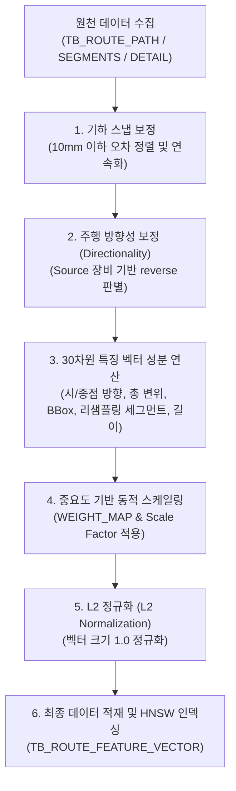

# [설계 개발 문서] Top-K 유사 설계 검색을 위한 30D 특징 벡터(Feature Vector) 및 하이브리드 재정렬 상세 규격서

본 문서는 자동 라우팅 엔진(TopKGen)에서 유사설계 검색을 수행하기 위해 사용되는 **30차원 특징 벡터(30D Feature Vector)의 인코딩 상세 매핑**, **데이터 전처리 파이프라인**, 그리고 **하이브리드 재정렬(Hybrid Reranking) 알고리즘**을 상세히 정리한 설계 규격서입니다.

---

## 1. 벡터 데이터 흐름 및 생성 프로세스 개요

Top-K 유사설계 검색은 기존의 수많은 설계 배관 경로 데이터 중 현재 라우터가 설계하고자 하는 환경(시작점/끝점 조건 및 위상 패턴)과 가장 근접한 상위 K개의 최적 경로를 찾아내는 기술입니다. 이를 위해 원천 테이블로부터 데이터를 읽어 보정, 인코딩, 정규화를 거쳐 pgvector 기반의 유사도 검색 테이블에 적재합니다.



---

## 2. 특징 벡터 추출 데이터 흐름 (Source to Target)

### ① 추출(원천) 데이터 및 테이블

* **원천 테이블**:
  * `TB_ROUTE_PATH` (배관 메타 정보 및 속성: 공정명, 장비명, 유틸리티 그룹, 유틸리티, 사이즈 등)
  * `TB_ROUTE_SEGMENTS` / `TB_ROUTE_SEGMENT_DETAIL` (경로상 모든 단위 세그먼트의 시작/종점 3D 좌표 정보)
* **추출 필드**:
  * `ROUTE_PATH_GUID`: 배관 경로 고유 식별 키
  * `FROM_POSX/Y/Z`, `TO_POSX/Y/Z`: 세그먼트의 3D 정점 좌표
  * `SOURCE_POSX/Y/Z`, `TARGET_POSX/Y/Z`: 배관 시작/종료 장비(또는 단말) 접속점 위치

### ② 전처리 및 보정 알고리즘 (Preprocessing & Alignment)

1. **좌표 스냅 보정**: CAD/BIM 프로그램에서 데이터를 추출할 때 발생하는 소수점 이하의 미세 불연속 구간(10mm 이하)을 직전 세그먼트의 끝점에 스냅(Snap)시켜 완벽한 연속 폴리라인으로 재구성합니다.
2. **배관 방향성(Directionality) 보정**: 라우팅 데이터 추출 시 시점과 종점이 뒤바뀌어 역방향으로 추출되는 오류를 바로잡습니다. 배관 시점($p_0$)과 종점($p_n$) 중 Source 장비 시작 위치에 물리적으로 더 먼 지점이 시점으로 매핑되어 있을 경우, 세그먼트 배열 전체를 자동으로 뒤집어(`pts.reverse()`) 정방향 주행으로 일관되게 학습시킵니다.
3. **RDP(Ramer-Douglas-Peucker) 단순화**: 기하학적으로 일직선 상에 놓인 다중 점들을 대표 꺾임점(Waypoints)만 남기고 단순화하여 노이즈를 제거합니다.

---

## 3. 30D 특징 벡터 차원 세부 구성 (Dimension Mapping)

30차원 특징 벡터는 경로의 시작/종점 진입 방향, 공간 상의 기하학적 형태(총 변위, Bounding Box), 3분할 주행 형태, 총 주행 길이 등의 정보를 코사인 유사도 벡터 공간에 매핑할 수 있도록 설계되었습니다.

| Index 범위        | 피처 이름                 | 세부 연산 공식 및 계산 방법                                                                      | 의미 및 인코딩 목표                                                   |
| :---------------- | :------------------------ | :----------------------------------------------------------------------------------------------- | :-------------------------------------------------------------------- |
| **0 ~ 2**   | **Start Direction** | $\vec{v}_{start} = \frac{p_1 - p_0}{\|p_1 - p_0\|}$                                            | 배관 시작 부분(첫 번째 세그먼트)의 3D 단위 방향 벡터                  |
| **3 ~ 5**   | **End Direction**   | $\vec{v}_{end} = \frac{p_{n-1} - p_n}{\|p_{n-1} - p_n\|}$                                      | 배관 종료 부분(마지막 세그먼트)의 3D 단위 방향 벡터                   |
| **6 ~ 8**   | **Displacement**    | $\vec{d} = \text{Clamp}\left(\frac{p_n - p_0}{\text{DISPLACEMENT\_MAX}}, -1.0, 1.0\right)$     | 시작점에서 종료점까지의 X, Y, Z 총 변위 (스케일 정규화)               |
| **9 ~ 11**  | **Bounding Box**    | $\vec{b} = \text{Clamp}\left(\frac{\text{abs}(p_n - p_0)}{\text{BBOX\_MAX}}, -1.0, 1.0\right)$ | 전체 경로가 차지하는 Bounding Box 크기 비율 (부호 없음)               |
| **12 ~ 14** | **Segment 1**       | $\vec{s}_1 = \frac{r_1 - r_0}{\|r_1 - r_0\|}$                                                  | 경로를 3구간 리샘플링 시**첫 번째 구간**의 단위 방향 벡터       |
| **15 ~ 17** | **Segment 2**       | $\vec{s}_2 = \frac{r_2 - r_1}{\|r_2 - r_1\|}$                                                  | 경로를 3구간 리샘플링 시**두 번째(중앙) 구간**의 단위 방향 벡터 |
| **18 ~ 20** | **Segment 3**       | $\vec{s}_3 = \frac{r_3 - r_2}{\|r_3 - r_2\|}$                                                  | 경로를 3구간 리샘플링 시**세 번째 구간**의 단위 방향 벡터       |
| **21**      | **Total Length**    | $l = \text{Clamp}\left(\frac{L_{total}}{\text{TOTAL\_LENGTH\_MAX}}, -1.0, 1.0\right)$          | 배관 전체 주행 경로의 총 정규화 길이                                  |
| **22 ~ 24** | **Env Cost**        | (0.0으로 패딩)                                                                                   | 장애물 회피 비용 등 환경 특성 요약 피처 영역                          |
| **25 ~ 29** | **Arrow Pattern**   | (0.0으로 패딩)                                                                                   | 방향성 RLE 부호화 통계 특징 영역                                      |

> [!NOTE]
> **리샘플링 함수(`resample_polyline_points`)**: 배관 경로를 선형 보간하여 정밀하게 등간격의 4개 정점($r_0, r_1, r_2, r_3$)으로 재배치한 후, 3개의 대표 주행 방향 벡터를 균등 산출하는 데 활용됩니다.
>
> **동적 한계값(Max) 스캔**: `DISPLACEMENT_MAX`, `BBOX_MAX`, `TOTAL_LENGTH_MAX` 정규화 상한값은 정적 상수가 아니라 학습 대상이 되는 프로젝트 내 전체 배관 데이터 중 최댓값을 실시간 동적으로 스캔하여 산정함으로써 스케일링의 해상도와 정밀도를 극대화합니다.

---

## 4. 가중치 스케일링 및 L2 정규화 알고리즘

유사도 검색 시 각 특징(시점 방향, 종점 방향, 상대 변위 등)이 코사인 유사도 벡터 공간에서 발휘하는 중요도가 다릅니다. 따라서 각 피처 영역에 고유 가중치를 부여하고 이에 따른 **Scale Factor**를 곱해준 뒤 **L2 정규화**를 완료합니다.

### ① 피처 가중치 맵 (WEIGHT_MAP)

* `start_topology` (차원 0~2) : **0.20**
* `end_topology` (차원 3~5) : **0.20**
* `displacement` (차원 6~8) : **0.15**
* `bounding_box` (차원 9~11) : **0.15**
* `segment_1 / 2 / 3` (차원 12~20, 각 0.06) : **0.18**
* `env_cost` (차원 22~24) : **0.12**
* `arrow_pattern` (차원 25~29) : **0.15**
* **가중치 총합** = 1.00 (100%)

### ② 스케일 팩터 (Scale Factor) 산출 공식

각 피처 영역의 차원 수(Dimension, $D_{sub}$)와 해당 가중치($W_{sub}$)에 대해 다음과 같이 스케일 팩터 $S_{sub}$를 산출하여 해당 차원 영역의 모든 값에 곱합니다.

$$
S_{sub} = \sqrt{\frac{W_{sub} \times 30.0}{D_{sub}}}
$$

### ③ L2 정규화 (L2 Normalization)

스케일링이 완료된 30D 벡터 $\vec{V}$에 대해 유클리디안 노름(Norm) 크기를 1.0으로 보정하여 최종 특징 벡터를 확정합니다.

$$
\vec{V}_{final} = \frac{\vec{V}}{\|\vec{V}\|}
$$

이로 인해 pgvector 상에서 코사인 거리 연산자(`<=>`)를 활용해 초고속 인덱스 스캔을 수행할 수 있게 됩니다.

---

## 5. 저장(적재) 대상 테이블 스키마 사양

* **저장 테이블**: `TB_ROUTE_FEATURE_VECTOR`
* **인덱스 사양**: 고속 근사 최근접 이웃(ANN) 검색을 위한 **HNSW 코사인 거리 인덱스** 적용

```sql
CREATE TABLE IF NOT EXISTS "TB_ROUTE_FEATURE_VECTOR" (
    "ROUTE_PATH_GUID" text PRIMARY KEY,
    "PROCESS_NAME" text,
    "EQUIPMENT_NAME" text,
    "UTILITY_GROUP" text,
    "UTILITY" text,
    "SIZE" text,
    "DIRECTION_PATTERN" text,
    "TOTAL_LENGTH_MM" double precision,
    "STEP_COUNT" integer,
    "START_POSX" double precision,
    "START_POSY" double precision,
    "START_POSZ" double precision,
    "END_POSX" double precision,
    "END_POSY" double precision,
    "END_POSZ" double precision,
    "FEATURE_VECTOR" vector(30),
    "FEATURE_VECTOR_JSON" jsonb,
    "CREATED_AT" timestamp without time zone DEFAULT now()
);

-- HNSW 인덱스 생성 DDL
CREATE INDEX IF NOT EXISTS "IX_TRFV_FEATURE_VECTOR_HNSW"
ON "TB_ROUTE_FEATURE_VECTOR" USING hnsw ("FEATURE_VECTOR" vector_cosine_ops);
```

---

## 6. 실시간 쿼리 벡터 구축 (Query Vector Construction)

사용자가 자동 라우터 에디터(C# 클라이언트) 상에서 새로운 배관을 라우팅하기 위해 시작점 $p_{start}$와 종료점 $p_{end}$를 마우스로 클릭하면, 백엔드 엔진은 즉시 이에 매칭되는 30차원 쿼리 벡터를 실시간 구성합니다.

1. **단위 주 주행 방향 추출**: $p_{start}$와 $p_{end}$ 간의 방향 차이 벡터 $(dx, dy, dz)$를 구하고 이를 단위 벡터화하여 `[0:3]` (Start Direction) 및 `[3:6]` (End Direction - 시점 유추 역방향) 영역에 채웁니다.
2. **정규화 공간 변위 및 BBOX 적재**: 프로젝트 학습 파라미터 내의 최대 상한값(`DISPLACEMENT_MAX` 및 `BBOX_MAX`)을 기반으로 비율을 산출하여 `[6:9]` 및 `[9:12]`에 적재합니다.
3. **중간 영역 패딩**: 아직 상세 경로가 그려지기 전이므로 중간 주행 세그먼트 방향(`[12:21]`) 및 통계 영역(`[22:29]`)은 모두 `0.0`으로 패딩합니다.
4. **동일 스케일 팩터 곱셈 및 L2 정규화**: 학습용 벡터 생성 시와 완벽히 동일한 $ScaleFactors$를 성분별로 곱해준 뒤 L2 정규화를 거쳐 30D 쿼리 벡터를 확정합니다.

---

## 7. 하이브리드 재정렬 (Hybrid Reranking) 알고리즘

pgvector HNSW 인덱스 검색을 통해 1차로 필터링된 상위 $N$개의 후보 경로에 대해, 단순 벡터 거리에만 의존하지 않고 실제 물리적 설계 패턴의 정밀도를 극대화하기 위해 **3대 유사도 가중합 점수(Combined Score)**로 재정렬을 수행합니다.

$$
\text{Score}_{final} = 0.5 \times \text{Score}_{pos} + 0.3 \times \text{Score}_{pattern} + 0.2 \times \text{Score}_{vector}
$$

### ① 상대위치 유사도 (Position Score - 50%)

* 쿼리의 시작/끝 변위 벡터와 후보 배관의 시작/끝 변위 벡터 사이의 유클리디안 거리 편차를 측정하고 정규화합니다.
* 3D 공간 상에서 시작점과 종점이 후보 경로와 얼마나 유사한 공간적 위치(Space Zone)에 놓여 있는지를 검증하여 기하학적 매칭성을 확보합니다.

### ② 패턴 유사도 (Pattern Score - 30%)

* 후보의 실제 주행 꺾임 정보를 부호화한 방향 RLE 패턴 문자열(예: `H-R-H-D`)과 쿼리 경로 간의 **Levenshtein 편집거리(Edit Distance)**를 계산합니다.
* 배관이 꺾이는 순서 및 위상 기하 형태가 유사한 설계를 가중 선별합니다.

### ③ 벡터 유사도 (Vector Score - 20%)

* pgvector 코사인 거리 결과를 코사인 유사도로 변환하여 반영합니다.
  $$
  \text{Score}_{vector} = 1.0 - \text{CosineDistance}
  $$
