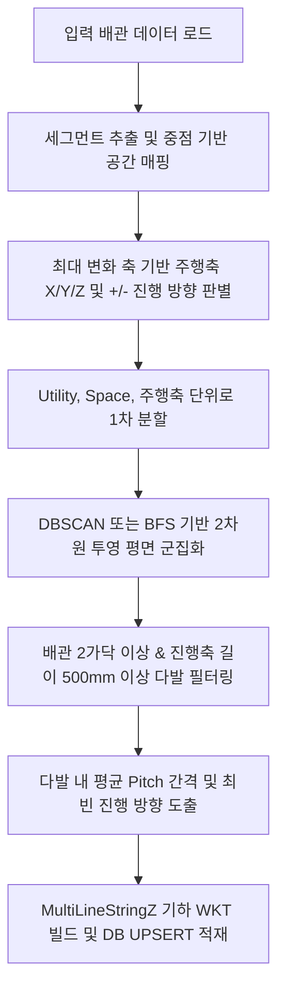

# [개발 명세서] 3차원 다발배관(수평/수직) 특징점 추출 및 적재 프로세스 규격

본 문서는 기설계 배관 경로 데이터로부터 자동으로 다발배관(수평/수직 Pipe Bundle Group)을 탐지하고, 공간 영역(CSF, A/F, CR, FSF 등) 및 장비/유틸리티별 기하 모델 및 통계 특징을 영속 저장하는 알고리즘의 동작 절차와 상세 규격을 기술합니다.

---

## 1. 개요 및 분석 목적

자동 3차원 라우팅 엔진(C#)이 장비 및 건물의 주요 영역을 지날 때, 단독 배관이 아닌 다발 형태로 정렬된 주행 특징을 그대로 모사할 수 있도록 유도합니다. 특히 공조실(FSF), 서브팹(CSF), 클린룸(CR), 억세스 플로어(A/F) 등 공간 영역 전체에서 동일한 간격으로 평행 주행하는 수직 배관 및 수평 배관의 묶음(다발)을 탐지하여, 대표 진행 방향, 다발 영역의 길이, 배관 간 평균 Pitch(간격) 및 3차원 기하 영역(AABB, MultiLineStringZ)을 학습하고 데이터베이스에 영속 적재하는 데 목적이 있습니다.

---

## 2. 수집 및 입력 데이터 스펙 (Input Data)

### ① 공간 기하 한계 영역 데이터

* **출처 테이블**: `TB_SPACE_INFO`
* **대상 공간 분류**: `CSF` (Clean Sub Fab), `CR` (Clean Room), `A/F` (Access Floor), `FSF` (Fan Filter Unit Space), `AREA` 등
* **수집 필드 및 쿼리**:

  ```sql
  SELECT "SPACE_NAME", "AABB_MINX", "AABB_MINY", "AABB_MINZ", "AABB_MAXX", "AABB_MAXY", "AABB_MAXZ"
  FROM "TB_SPACE_INFO"
  WHERE "SPACE_NAME" IN ('CSF', 'CR', 'A/F', 'FSF', 'AREA')
    AND "AABB_MINZ" IS NOT NULL;
  ```

* **데이터 역할**: 배관 세그먼트가 물리적으로 속한 공간 구간(Space Name)을 식별하는 데 사용됩니다. CSF의 경우 CSF의 상단(즉 A/F의 하단 고도)부터 시작하여 CSF 공간 전역 내부를 탐색 영역으로 정의합니다.

### ② 배관 3D 정점 데이터 (Routes)

* **출처 객체**: `learn_design_features.py` 내의 파이프라인에서 수집 및 로드된 프로젝트 배관 목록 (`routes`)
* **데이터 포맷**:

  ```json
  [
    {
      "guid": "ROUTE_PATH_GUID_001",
      "points": [[x1, y1, z1], [x2, y2, z2], ...],
      "meta": { "eq_tag": "CHILLER 002", "utility_group": "Water" }
    },
    ...
  ]
  ```

---

## 3. 핵심 탐지 및 분석 알고리즘 (Core Algorithms)

다발배관의 탐지는 **세그먼트 추출 및 공간 매핑 -> 주행축 및 방향 분류 -> 2차원 투영 군집화 -> 다발 조건 필터링 -> 기하 구성 및 DB 적재**의 5단계 프로세스로 진행됩니다.



### ① 세그먼트 추출 및 공간 매핑 (Segmenting & Space Mapping)

* 배관 경로의 선분(Segment)의 시점 $p_1(x_1, y_1, z_1)$과 종점 $p_2(x_2, y_2, z_2)$에 대해 물리적 노이즈를 배제하기 위해 3차원 세그먼트 길이 $L_{3d} \ge 100\text{mm}$인 경우만 대상으로 삼습니다.
* 세그먼트의 중점(Midpoint) $p_m(x_m, y_m, z_m)$이 각 공간 영역 $S$의 바운딩 박스(마진 100mm 적용) 내부에 완전히 포함되는지 확인하여 `SPACE_NAME`을 확정합니다.
  $$x_{min} - 100 \le x_m \le x_{max} + 100$$
  $$y_{min} - 100 \le y_m \le y_{max} + 100$$
  $$z_{min} - 100 \le z_m \le z_{max} + 100$$

### ② 주행축 및 진행 방향 판별

* 세그먼트의 차이 벡터 $v(dx, dy, dz) = p_2 - p_1$에 대해 절댓값이 가장 큰 축을 주행축(Axis)으로 선정합니다:
  * $|dz|$가 가장 크면 `Z` 축 (수직 다발배관 대상)
  * $|dx|$가 가장 크면 `X` 축 (수평 X 다발배관 대상)
  * $|dy|$가 가장 크면 `Y` 축 (수평 Y 다발배관 대상)
* 해당 축의 벡터 성분 부호에 따라 세부 진행 방향(`+X`, `-X`, `+Y`, `-Y`, `+Z`, `-Z`)을 결정합니다.

### ③ 유틸리티 그룹 결합 및 1차 분할

* 개별 유틸리티명(예: `Coolant_S`, `Coolant_R`) 대신 공급/환수 배관을 하나의 다발으로 함께 묶어 클러스터링하기 위해 `utility_group`(예: `Coolant`) 단위로 묶어 처리합니다.
* 전체 세그먼트 데이터를 `(EQUIPMENT_NAME, UTILITY, SPACE_NAME, AXIS)`를 조합한 키별로 1차 분할합니다.

### ④ 2차원 투영 평면 군집화 (DBSCAN Clustering)

* 주행 축을 제외한 2D 평면상으로 세그먼트 중점들을 투영하여 군집화를 수행합니다:
  * **Z축 주행**: XY 평면 투영 $(x_m, y_m)$
  * **X축 주행**: YZ 평면 투영 $(y_m, z_m)$
  * **Y축 주행**: XZ 평면 투영 $(x_m, z_m)$
* 군집화 알고리즘:
  * **DBSCAN**: 반경 파라미터(Epsilon, $\epsilon$) = $1000.0\text{mm}$ (평면 거리 1.0m 이내), 최소 샘플 수 = 1.
  * scikit-learn DBSCAN 모듈 미설치 시 동일한 기능의 BFS 기반 순수 파이썬 2D 군집화 알고리즘(`simple_2d_clustering`)을 실행합니다.

### ⑤ 다발 조건 필터링 및 특징점 산출

각 군집화된 세그먼트 묶음에 대해 다음 제약 조건을 평가하여 다발배관 여부를 결정합니다.
1. **최소 배관 가닥 수**: 다발에 속한 서로 다른 배관 경로(Route)의 개수가 **2개 이상**이어야 합니다.
2. **최소 다발 주행 길이**: 진행 방향 축 좌표의 최대값과 최소값 차이(다발 영역의 주행 길이)가 **$500\text{mm}$ 이상**인 경우만 통과시킵니다.
   $$L_{bundle} = \text{Coord}_{max} - \text{Coord}_{min} \ge 500.0$$
3. **평균 간격 (Pitch)**: 다발 내 배관들의 투영 좌표 간 평균 유클리드 거리를 산출하여 평균 간격(`AVG_PITCH_MM`)을 도출합니다.
4. **대표 진행 방향 (Direction)**: 군집 내 세그먼트들의 방향 중 가장 비율이 높은 최빈값 방향(`+Z`, `-Z` 등)을 다발 진행 방향으로 확정합니다.

---

## 4. 저장 테이블 구조 및 데이터 스펙

분석 및 추출이 완료되면 데이터베이스 내 **`TB_ROUTE_VERTICAL_GROUP_FEATURE`** 테이블에 UPSERT 방식으로 영속 저장합니다.

### ① 테이블 명세 및 데이터 형식

| 물리 필드명 | SQL 데이터 타입 | 제약 조건 | 설명 |
| :--- | :--- | :--- | :--- |
| **`ID`** | `bigserial` | `PRIMARY KEY` | 대리 키 (Sequence) |
| **`PROJECT_ID`** | `text` | `NOT NULL` | 프로젝트 식별자 (예: CHILLER 002) |
| **`EQUIPMENT_NAME`** | `text` | `NOT NULL` | 매핑된 장비호기명 (예: CHILLER 002) |
| **`UTILITY`** | `text` | `NOT NULL` | 매핑된 유틸리티 그룹명 (예: Coolant, Water 등) |
| **`SPACE_NAME`** | `text` | `NOT NULL` | 배관 다발이 속한 공간 영역명 (예: CSF, A/F, CR 등) |
| **`VERTICAL_GROUP_ID`** | `text` | `NOT NULL` | 프로젝트명, 장비명, 유틸리티, 공간, 다발 순번 등을 조합한 고유 해시 ID (SHA-1) |
| **`DIRECTION`** | `text` | `NOT NULL` | 다발의 진행 방향 (`+Z`, `-Z`, `+X`, `-X`, `+Y`, `-Y`) |
| **`BUNDLE_LENGTH`** | `double precision` | `NOT NULL` | 다발 배관 영역의 총 주행 길이 (mm) |
| **`AVG_PITCH_MM`** | `double precision` | `NOT NULL` | 다발 내부의 평균 배관 간격 (mm) |
| **`AABB_MINX`** | `double precision` | `NOT NULL` | 다발 영역 AABB 최소 X (mm) |
| **`AABB_MINY`** | `double precision` | `NOT NULL` | 다발 영역 AABB 최소 Y (mm) |
| **`AABB_MINZ`** | `double precision` | `NOT NULL` | 다발 영역 AABB 최소 Z (mm) |
| **`AABB_MAXX`** | `double precision` | `NOT NULL` | 다발 영역 AABB 최대 X (mm) |
| **`AABB_MAXY`** | `double precision` | `NOT NULL` | 다발 영역 AABB 최대 Y (mm) |
| **`AABB_MAXZ`** | `double precision` | `NOT NULL` | 다발 영역 AABB 최대 Z (mm) |
| **`ROUTE_COUNT`** | `integer` | `NOT NULL` | 다발에 포함된 총 배관 경로 개수 (가닥 수) |
| **`MEMBER_ROUTE_GUIDS_JSON`**| `jsonb` | `NOT NULL` | 다발 소속 배관의 GUID 목록 `["GUID_A", "GUID_B"]` |
| **`GEOM_3D`** | `geometry(MultiLineStringZ, 0)`| `NULL` | 다발배관들의 3D 실선 궤적 공간 기하 데이터 (PostGIS) |
| **`CREATED_AT`** | `timestamptz` | `DEFAULT now()`| 생성 및 업데이트 타임스탬프 |

* **고유 제약 조건 (Unique)**: `UNIQUE("PROJECT_ID", "EQUIPMENT_NAME", "UTILITY", "SPACE_NAME", "VERTICAL_GROUP_ID")`

### ② `GEOM_3D` 기하 데이터 구조 예시 (WKT 3D MultiLineStringZ)

다발에 속한 배관 선분들의 3D 궤적 데이터를 WKT 포맷으로 묶어 저장합니다.

```text
MULTILINESTRING Z (
  (27505.99 9108.93 13036.67, 27505.99 9108.94 14613.35),
  (27565.65 9108.93 13854.84, 27565.64 9108.93 14643.55)
)
```

이 기하 데이터와 AABB 바운딩 박스를 활용하면 CAD 및 Web 3D 뷰어 프론트엔드에서 수직/수평 다발 배관 영역을 손쉽게 렌더링하고 간섭을 검증할 수 있습니다.
